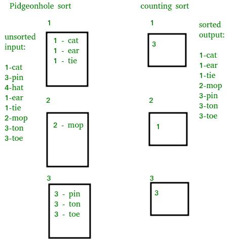

# 鸽子洞排序

> 原文:[https://www.geeksforgeeks.org/pigeonhole-sort/](https://www.geeksforgeeks.org/pigeonhole-sort/)

[鸽子洞排序](https://en.wikipedia.org/wiki/Pigeonhole_sort)是一种排序算法，适用于元素数量和可能键值数量大致相同的元素列表排序。
需要 O( *n* + *Range* )时间，其中 n 为输入数组中的元素个数，【Range】为数组中可能的值个数。
**算法工作:**

1.  在数组中查找最小值和最大值。让最小值和最大值分别为“最小值”和“最大值”。还可以找到“最大-最小+1”的范围。

2.  建立一个与范围大小相同的初始空“文件箱”数组。
3.  访问数组中的每个元素，然后将每个元素放入它的文件夹中。元素 arr[i]被放入索引 arr[I]–min 处的孔中。
4.  按顺序在鸽子洞数组上开始循环，并将非空洞的元素放回原始数组中。

**与计数排序的比较:**
与[计数排序](https://www.geeksforgeeks.org/counting-sort/)相似，不同的是“移动物品两次:一次到桶阵，一次到最终目的地”。



## C++

```
/* C program to implement Pigeonhole Sort */
#include <bits/stdc++.h>
using namespace std;

/* Sorts the array using pigeonhole algorithm */
void pigeonholeSort(int arr[], int n)
{
    // Find minimum and maximum values in arr[]
    int min = arr[0], max = arr[0];
    for (int i = 1; i < n; i++)
    {
        if (arr[i] < min)
            min = arr[i];
        if (arr[i] > max)
            max = arr[i];
    }
    int range = max - min + 1; // Find range

    // Create an array of vectors. Size of array
    // range. Each vector represents a hole that
    // is going to contain matching elements.
    vector<int> holes[range];

    // Traverse through input array and put every
    // element in its respective hole
    for (int i = 0; i < n; i++)
        holes[arr[i]-min].push_back(arr[i]);

    // Traverse through all holes one by one. For
    // every hole, take its elements and put in
    // array.
    int index = 0;  // index in sorted array
    for (int i = 0; i < range; i++)
    {
       vector<int>::iterator it;
       for (it = holes[i].begin(); it != holes[i].end(); ++it)
            arr[index++]  = *it;
    }
}

// Driver program to test the above function
int main()
{
    int arr[] = {8, 3, 2, 7, 4, 6, 8};
    int n = sizeof(arr)/sizeof(arr[0]);

    pigeonholeSort(arr, n);

    printf("Sorted order is : ");
    for (int i = 0; i < n; i++)
        printf("%d ", arr[i]);

    return 0;
}
```

## Java 语言(一种计算机语言，尤用于创建网站)

```
/* Java program to implement Pigeonhole Sort */

import java.lang.*;
import java.util.*;

public class GFG
{
    public static void pigeonhole_sort(int arr[],
                                           int n)
    {
        int min = arr[0];
        int max = arr[0];
        int range, i, j, index;

        for(int a=0; a<n; a++)
        {
            if(arr[a] > max)
                max = arr[a];
            if(arr[a] < min)
                min = arr[a];
        }

        range = max - min + 1;
        int[] phole = new int[range];
        Arrays.fill(phole, 0);

        for(i = 0; i<n; i++)
            phole[arr[i] - min]++;

        index = 0;

        for(j = 0; j<range; j++)
            while(phole[j]-->0)
                arr[index++]=j+min;

    }

    public static void main(String[] args)
    {
        GFG sort = new GFG();
        int[] arr = {8, 3, 2, 7, 4, 6, 8};

        System.out.print("Sorted order is : ");

        sort.pigeonhole_sort(arr,arr.length);

        for(int i=0 ; i<arr.length ; i++)
            System.out.print(arr[i] + " ");
    }

}

// Code contributed by Mohit Gupta_OMG <(0_o)>
```

## 蟒蛇 3

```
# Python program to implement Pigeonhole Sort */

# source code : "https://en.wikibooks.org/wiki/
#   Algorithm_Implementation/Sorting/Pigeonhole_sort"
def pigeonhole_sort(a):
    # size of range of values in the list
    # (ie, number of pigeonholes we need)
    my_min = min(a)
    my_max = max(a)
    size = my_max - my_min + 1

    # our list of pigeonholes
    holes = [0] * size

    # Populate the pigeonholes.
    for x in a:
        assert type(x) is int, "integers only please"
        holes[x - my_min] += 1

    # Put the elements back into the array in order.
    i = 0
    for count in range(size):
        while holes[count] > 0:
            holes[count] -= 1
            a[i] = count + my_min
            i += 1

a = [8, 3, 2, 7, 4, 6, 8]
print("Sorted order is : ", end = ' ')

pigeonhole_sort(a)

for i in range(0, len(a)):
    print(a[i], end = ' ')

```

## C#

```
// C# program to implement
// Pigeonhole Sort
using System;

class GFG
{
public static void pigeonhole_sort(int []arr,
                                   int n)
{
    int min = arr[0];
    int max = arr[0];
    int range, i, j, index;

    for(int a = 0; a < n; a++)
    {
        if(arr[a] > max)
            max = arr[a];
        if(arr[a] < min)
            min = arr[a];
    }

    range = max - min + 1;
    int[] phole = new int[range];

    for(i = 0; i < n; i++)
    phole[i] = 0;

    for(i = 0; i < n; i++)
        phole[arr[i] - min]++;

    index = 0;

    for(j = 0; j < range; j++)
        while(phole[j] --> 0)
            arr[index++] = j + min;

}

// Driver Code
static void Main()
{
    int[] arr = {8, 3, 2, 7,
                 4, 6, 8};

    Console.Write("Sorted order is : ");

    pigeonhole_sort(arr,arr.Length);

    for(int i = 0 ; i < arr.Length ; i++)
        Console.Write(arr[i] + " ");
}
}

// This code is contributed
// by Sam007
```

## java 描述语言

```
<script>

// JavaScript program to implement
// Pigeonhole Sort

function pigeonhole_sort(arr, n)
{
    let min = arr[0];
    let max = arr[0];
    let range, i, j, index;

    for(let a = 0; a < n; a++)
    {
        if(arr[a] > max)
            max = arr[a];
        if(arr[a] < min)
            min = arr[a];
    }

    range = max - min + 1;
    let phole = [];

    for(i = 0; i < n; i++)
    phole[i] = 0;

    for(i = 0; i < n; i++)
        phole[arr[i] - min]++;

    index = 0;

    for(j = 0; j < range; j++)
        while(phole[j] --> 0)
            arr[index++] = j + min;

}

// Driver Code

    let arr = [8, 3, 2, 7,
                 4, 6, 8];

    document.write("Sorted order is : ");

    pigeonhole_sort(arr,arr.length);

    for(let i = 0 ; i < arr.length ; i++)
        document.write(arr[i] + " ");

    // This code is contributed by target_2.
</script>
```

**输出:**

```
Sorted order is : 2 3 4 6 7 8 8 
```

由于需求很少得到满足，鸽子洞排序的用途有限。对于范围比 *n* 大得多的数组，桶排序是一种在空间和时间上更有效的推广。

**参考文献:**
https://en.wikipedia.org/wiki/Pigeonhole_sort
本文由**阿育什·戈维尔**供稿。如果您发现任何不正确的地方，或者您想分享更多关于上面讨论的主题的信息，请写评论

**geeks forgesquiz 上的其他排序算法**
[选择排序](http://geeksquiz.com/selection-sort/)[冒泡排序](http://geeksquiz.com/bubble-sort/)[插入排序](http://geeksquiz.com/insertion-sort/)[合并排序](http://geeksquiz.com/merge-sort/)[堆排序](http://geeksquiz.com/heap-sort/)[快速排序](http://geeksquiz.com/quick-sort/)[基数排序](https://www.geeksforgeeks.org/radix-sort/)[计数排序](https://www.geeksforgeeks.org/counting-sort/)[桶排序](https://www.geeksforgeeks.org/bucket-sort-2/)[壳排序](http://geeksquiz.com/shellsort/)【T27】