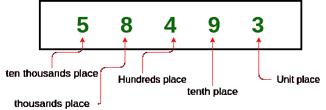
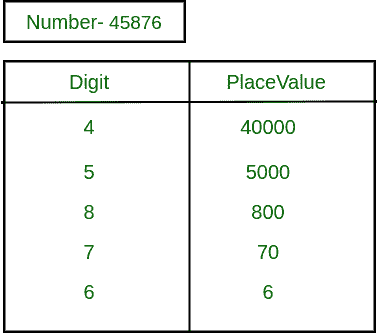

# 将给定数字的值放入数字中

> 原文:[https://www . geesforgeks . org/place-value-给定数字中的数字/](https://www.geeksforgeeks.org/place-value-of-a-given-digit-in-a-number/)

**位置值**可以定义为数字中的一个数字根据其在数字中的位置所代表的值。以下是地点价值的示例说明:



我们再举一个例子来说明**N = 45876**T2 的位置值



**问题:**
给定一个正整数 **N** 和一个数字 **D** 。任务是找出一个数字 **D** 在给定数字 **N** 中的位置值。如果数字出现多次，则找到最小位置值。
**例:**

> **输入:** N = 3928，D = 3
> **输出:** 3000
> **说明:**
> 此数中 3 的位置值为 3*1000 = 3000
> **输入:** N = 67849，D = 6
> **输出:** 60000

**解决方法:**

1.  从输入数字的右侧找到数字的位置。为了找到这个位置，把这个数的模除以 10，检查这个数，然后把这个数除以 10。
2.  找到数字的位置后，将数字乘以 10 **<sup>位置</sup>** 。

下面是上述方法的实现:

## C++

```
// C++ implementation to find
// place value of a number
#include<bits/stdc++.h>
using namespace std;

// Function to find place value
int placeValue(int N, int num)
{
    int total = 1, value = 0, rem = 0;
    while (true)
    {
        rem = N % 10;
        N = N / 10;

        if (rem == num)
        {
            value = total * rem;
            break;
        }
        total = total * 10;
    }
    return value;
}

// Driver Code
int main()
{

    // Digit, which we want
    // to find place value.
    int D = 5;

    // Number from where we
    // want to find place value.
    int N = 85932;

    cout << (placeValue(N, D));
}

// This code is contributed by Ritik Bansal
```

## Java 语言(一种计算机语言，尤用于创建网站)

```
// Java implementation to find
// place value of a number

import java.util.*;
import java.io.*;
import java.lang.*;

class GFG {

    // function to find place value
    static int placeValue(int N, int num)
    {
        int total = 1, value = 0, rem = 0;
        while (true) {
            rem = N % 10;
            N = N / 10;

            if (rem == num) {
                value = total * rem;
                break;
            }

            total = total * 10;
        }
        return value;
    }

    // Driver Code
    public static void main(String[] args)
    {

        // Digit, which we want
        // to find place value.
        int D = 5;

        // Number from where we
        // want to find place value.
        int N = 85932;

        System.out.println(placeValue(N, D));
    }
}
```

## 蟒蛇 3

```
# Python3 implementation to find
# place value of a number

# Function to find place value
def placeValue(N, num):

    total = 1
    value = 0
    rem = 0

    while (True):
        rem = N % 10
        N = N // 10

        if (rem == num):
            value = total * rem
            break
        total = total * 10

    return value

# Driver Code

# Digit, which we want
# to find place value.
D = 5

# Number from where we
# want to find place value.
N = 85932

print(placeValue(N, D))

# This code is contributed by divyamohan123
```

## C#

```
// C# implementation to find
// place value of a number
using System;
class GFG{

// function to find place value
static int placeValue(int N, int num)
{
    int total = 1, value = 0, rem = 0;
    while (true)
    {
        rem = N % 10;
        N = N / 10;

        if (rem == num)
        {
            value = total * rem;
            break;
        }

        total = total * 10;
    }
    return value;
}

// Driver Code
public static void Main()
{

    // Digit, which we want
    // to find place value.
    int D = 5;

    // Number from where we
    // want to find place value.
    int N = 85932;

    Console.Write(placeValue(N, D));
}
}

// This code is contributed by Code_Mech
```

## java 描述语言

```
<script>

      // JavaScript implementation to find
      // place value of a number

      // Function to find place value
      function placeValue(N, num) {
        var total = 1,
          value = 0,
          rem = 0;
        while (true) {
          rem = N % 10;
          N = parseInt(N / 10);

          if (rem == num) {
            value = total * rem;
            break;
          }
          total = total * 10;
        }
        return value;
      }

      // Driver Code

      // Digit, which we want
      // to find place value.
      var D = 5;

      // Number from where we
      // want to find place value.
      var N = 85932;
      document.write(placeValue(N, D));

</script>
```

**Output:** 

```
5000
```

***时间复杂度:** O(log N)*
***辅助空间:** O(1)*