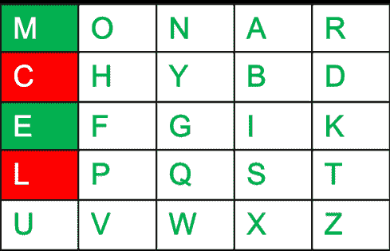
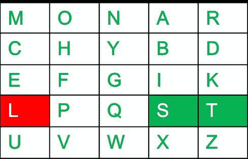
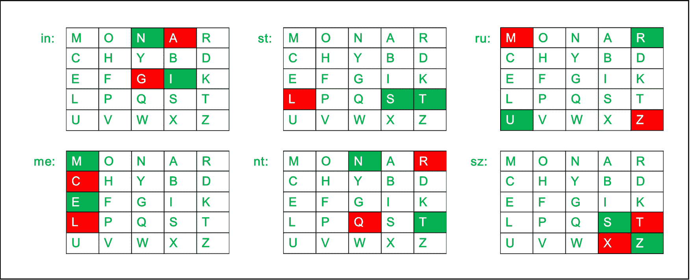
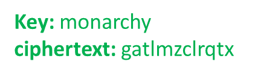

# Playfair 密码示例

> 原文:[https://www . geeksforgeeks . org/Playfair-带示例的密码/](https://www.geeksforgeeks.org/playfair-cipher-with-examples/)

**Playfair 密码**是第一个实用的有向图替换密码。这个方案是由**查尔斯·惠斯通**在 **1854** 发明的，但它是以推广密码使用的 Playfair 勋爵命名的。在 playfair 密码中，与传统密码[不同的是](https://www.geeksforgeeks.org/caesar-cipher/)我们加密一对字母(有向图)而不是一个字母。
在第二次布尔战争和第一次世界大战中，英国军队将它用于战术目的，在第二次世界大战中，澳大利亚人也将它用于同样的目的。这是因为 Playfair 使用起来相当快，不需要特殊设备。

<u>Encryption Technique</u>

对于加密过程，让我们考虑以下示例:


**Playfair 密码加密算法:**
该算法由 2 个步骤组成:

1.  **生成关键方块(5×5):**
    *   密钥方块是一个 5×5 的字母网格，用作加密明文的密钥。25 个字母中的每一个都必须是唯一的，并且表中省略了一个字母(通常是 J)(因为表只能容纳 25 个字母)。如果明文中含有 J，则用 I.
        代替
    *   键方块中的初始字母是键的唯一字母，以它们出现的顺序排列，后面是字母表中剩余的字母。

2.  **加密纯文本的算法:**将明文拆分成两个字母对(有向图)。如果有奇数个字母，最后一个字母加上一个 Z。
    **例如:**

```
PlainText: "instruments" 
After Split: 'in' 'st' 'ru' 'me' 'nt' 'sz'
```

**1。**不能用同一个字母配对。把这封信一分为二，在前一封信的基础上再加一封假信。

**纯文字:**“你好”

**分割后:**“他”“LX”“lo”

这里**‘x’**是伪信。

**2。**如果在配对过程中，字母是单独存在的，那么在单独的字母上再加一个假字母

**纯文本:**“helloe”

**后期:t1】he ' ' LX ' ' lo ' ' ez '**

这里**‘z’**是伪信。

**加密规则:**

*   **如果两个字母在同一个列**:取每个字母下面的字母(如果在底部，则返回顶部)。
    **例如:**

```
Diagraph: "me"
Encrypted Text: cl
Encryption: 
  m -> c
  e -> l
```



*   **如果两个字母在同一行**:取每个字母右边的字母(如果在最右边，则回到最左边)。
    **例如:**

```
Diagraph: "st"
Encrypted Text: tl
Encryption: 
  s -> t
  t -> l
```



*   **如果以上规则都不成立**:用两个字母组成一个矩形，取矩形水平对角的字母。
    **例如:**

```
Diagraph: "nt"
Encrypted Text: rq
Encryption: 
  n -> r
  t -> q
```


**例如:**

```
Plain Text: "instrumentsz"
Encrypted Text: gatlmzclrqtx
Encryption: 
  i -> g
  n -> a
  s -> t
  t -> l
  r -> m
  u -> z
  m -> c
  e -> l
  n -> r
  t -> q
  s -> t
  z -> x
```



下面是 C 语言中 Playfair 密码的一个实现:

## C

```
// C program to implement Playfair Cipher

#include <stdio.h>
#include <stdlib.h>
#include <string.h>

#define SIZE 30

// Function to convert the string to lowercase
void toLowerCase(char plain[], int ps)
{
    int i;
    for (i = 0; i < ps; i++) {
        if (plain[i] > 64 && plain[i] < 91)
            plain[i] += 32;
    }
}

// Function to remove all spaces in a string
int removeSpaces(char* plain, int ps)
{
    int i, count = 0;
    for (i = 0; i < ps; i++)
        if (plain[i] != ' ')
            plain[count++] = plain[i];
    plain[count] = '\0';
    return count;
}

// Function to generate the 5x5 key square
void generateKeyTable(char key[], int ks, char keyT[5][5])
{
    int i, j, k, flag = 0, *dicty;

    // a 26 character hashmap
    // to store count of the alphabet
    dicty = (int*)calloc(26, sizeof(int));
    for (i = 0; i < ks; i++) {
        if (key[i] != 'j')
            dicty[key[i] - 97] = 2;
    }

    dicty['j' - 97] = 1;

    i = 0;
    j = 0;

    for (k = 0; k < ks; k++) {
        if (dicty[key[k] - 97] == 2) {
            dicty[key[k] - 97] -= 1;
            keyT[i][j] = key[k];
            j++;
            if (j == 5) {
                i++;
                j = 0;
            }
        }
    }

    for (k = 0; k < 26; k++) {
        if (dicty[k] == 0) {
            keyT[i][j] = (char)(k + 97);
            j++;
            if (j == 5) {
                i++;
                j = 0;
            }
        }
    }
}

// Function to search for the characters of a digraph
// in the key square and return their position
void search(char keyT[5][5], char a, char b, int arr[])
{
    int i, j;

    if (a == 'j')
        a = 'i';
    else if (b == 'j')
        b = 'i';

    for (i = 0; i < 5; i++) {

        for (j = 0; j < 5; j++) {

            if (keyT[i][j] == a) {
                arr[0] = i;
                arr[1] = j;
            }
            else if (keyT[i][j] == b) {
                arr[2] = i;
                arr[3] = j;
            }
        }
    }
}

// Function to find the modulus with 5
int mod5(int a) { return (a % 5); }

// Function to make the plain text length to be even
int prepare(char str[], int ptrs)
{
    if (ptrs % 2 != 0) {
        str[ptrs++] = 'z';
        str[ptrs] = '\0';
    }
    return ptrs;
}

// Function for performing the encryption
void encrypt(char str[], char keyT[5][5], int ps)
{
    int i, a[4];

    for (i = 0; i < ps; i += 2) {

        search(keyT, str[i], str[i + 1], a);

        if (a[0] == a[2]) {
            str[i] = keyT[a[0]][mod5(a[1] + 1)];
            str[i + 1] = keyT[a[0]][mod5(a[3] + 1)];
        }
        else if (a[1] == a[3]) {
            str[i] = keyT[mod5(a[0] + 1)][a[1]];
            str[i + 1] = keyT[mod5(a[2] + 1)][a[1]];
        }
        else {
            str[i] = keyT[a[0]][a[3]];
            str[i + 1] = keyT[a[2]][a[1]];
        }
    }
}

// Function to encrypt using Playfair Cipher
void encryptByPlayfairCipher(char str[], char key[])
{
    char ps, ks, keyT[5][5];

    // Key
    ks = strlen(key);
    ks = removeSpaces(key, ks);
    toLowerCase(key, ks);

    // Plaintext
    ps = strlen(str);
    toLowerCase(str, ps);
    ps = removeSpaces(str, ps);

    ps = prepare(str, ps);

    generateKeyTable(key, ks, keyT);

    encrypt(str, keyT, ps);
}

// Driver code
int main()
{
    char str[SIZE], key[SIZE];

    // Key to be encrypted
    strcpy(key, "Monarchy");
    printf("Key text: %s\n", key);

    // Plaintext to be encrypted
    strcpy(str, "instruments");
    printf("Plain text: %s\n", str);

    // encrypt using Playfair Cipher
    encryptByPlayfairCipher(str, key);

    printf("Cipher text: %s\n", str);

    return 0;
}

// This code is contributed by AbhayBhat
```

**Output**

```
Key text: Monarchy
Plain text: instruments
Cipher text: gatlmzclrqtx
```

<u>Decryption Technique</u>

解密 Playfair 密码就像反过来做同样的过程一样简单。接收方拥有相同的密钥，可以创建相同的密钥表，然后解密使用该密钥生成的任何消息。



**Playfair 密码解密算法:**
该算法由 2 个步骤组成:

1.  **在接收端生成密钥方块(5×5):**
    *   密钥方块是一个 5×5 的字母网格，用作加密明文的密钥。25 个字母中的每一个都必须是唯一的，并且表中省略了一个字母(通常是 J)(因为表只能容纳 25 个字母)。如果明文中含有 J，则用 I.
        代替
    *   键方块中的初始字母是键的唯一字母，以它们出现的顺序排列，后面是字母表中剩余的字母。

2.  **解密密文的算法:**将密文拆分成两个字母对(有向图)。

> **注**:**密文**始终有**连**个字符数。

1.  **例如:**

```
CipherText: "gatlmzclrqtx" 
After Split: 'ga' 'tl' 'mz' 'cl' 'rq' 'tx'
```

1.  **解密规则:**
    *   **如果两个字母在同一个列**:取每个字母上面的字母(如果在顶部，则回到底部)。
        **例如:**

```
Diagraph: "cl" 
Decrypted Text: me
Decryption: 
  c -> m
  l -> e
```


*   **如果两个字母在同一行**:取每个字母左边的字母(如果在最左边的位置，则回到最右边)。
    **例如:**

```
Diagraph: "tl" 
Decrypted Text: st 
Decryption: 
  t -> s
  l -> t
```


*   **如果以上规则都不成立**:用两个字母组成一个矩形，取矩形水平对角的字母。
    **例如:**

```
Diagraph: "rq" 
Decrypted Text: nt 
Decryption: 
  r -> n
  q -> t
```


**例如:**

```
Plain Text: "gatlmzclrqtx"
Decrypted Text: instrumentsz
Decryption: 
(red)-> (green)
  ga -> in
  tl -> st
  mz -> ru
  cl -> me
  rq -> nt
  tx -> sz
```


下面是 C 语言中 Playfair 密码解密的一个实现:

## C

```
#include <stdio.h>
#include <stdlib.h>
#include <string.h>
#define SIZE 30

// Convert all the characters
// of a string to lowercase
void toLowerCase(char plain[], int ps)
{
    int i;
    for (i = 0; i < ps; i++) {
        if (plain[i] > 64 && plain[i] < 91)
            plain[i] += 32;
    }
}

// Remove all spaces in a string
// can be extended to remove punctuation
int removeSpaces(char* plain, int ps)
{
    int i, count = 0;
    for (i = 0; i < ps; i++)
        if (plain[i] != ' ')
            plain[count++] = plain[i];
    plain[count] = '\0';
    return count;
}

// generates the 5x5 key square
void generateKeyTable(char key[], int ks, char keyT[5][5])
{
    int i, j, k, flag = 0, *dicty;

    // a 26 character hashmap
    // to store count of the alphabet
    dicty = (int*)calloc(26, sizeof(int));

    for (i = 0; i < ks; i++) {
        if (key[i] != 'j')
            dicty[key[i] - 97] = 2;
    }
    dicty['j' - 97] = 1;

    i = 0;
    j = 0;
    for (k = 0; k < ks; k++) {
        if (dicty[key[k] - 97] == 2) {
            dicty[key[k] - 97] -= 1;
            keyT[i][j] = key[k];
            j++;
            if (j == 5) {
                i++;
                j = 0;
            }
        }
    }
    for (k = 0; k < 26; k++) {
        if (dicty[k] == 0) {
            keyT[i][j] = (char)(k + 97);
            j++;
            if (j == 5) {
                i++;
                j = 0;
            }
        }
    }
}

// Search for the characters of a digraph
// in the key square and return their position
void search(char keyT[5][5], char a, char b, int arr[])
{
    int i, j;

    if (a == 'j')
        a = 'i';
    else if (b == 'j')
        b = 'i';

    for (i = 0; i < 5; i++) {
        for (j = 0; j < 5; j++) {
            if (keyT[i][j] == a) {
                arr[0] = i;
                arr[1] = j;
            }
            else if (keyT[i][j] == b) {
                arr[2] = i;
                arr[3] = j;
            }
        }
    }
}

// Function to find the modulus with 5
int mod5(int a)
{
    if (a < 0)
        a += 5;
    return (a % 5);
}

// Function to decrypt
void decrypt(char str[], char keyT[5][5], int ps)
{
    int i, a[4];
    for (i = 0; i < ps; i += 2) {
        search(keyT, str[i], str[i + 1], a);
        if (a[0] == a[2]) {
            str[i] = keyT[a[0]][mod5(a[1] - 1)];
            str[i + 1] = keyT[a[0]][mod5(a[3] - 1)];
        }
        else if (a[1] == a[3]) {
            str[i] = keyT[mod5(a[0] - 1)][a[1]];
            str[i + 1] = keyT[mod5(a[2] - 1)][a[1]];
        }
        else {
            str[i] = keyT[a[0]][a[3]];
            str[i + 1] = keyT[a[2]][a[1]];
        }
    }
}

// Function to call decrypt
void decryptByPlayfairCipher(char str[], char key[])
{
    char ps, ks, keyT[5][5];

    // Key
    ks = strlen(key);
    ks = removeSpaces(key, ks);
    toLowerCase(key, ks);

    // ciphertext
    ps = strlen(str);
    toLowerCase(str, ps);
    ps = removeSpaces(str, ps);

    generateKeyTable(key, ks, keyT);

    decrypt(str, keyT, ps);
}

// Driver code
int main()
{
    char str[SIZE], key[SIZE];

    // Key to be encrypted
    strcpy(key, "Monarchy");
    printf("Key text: %s\n", key);

    // Ciphertext to be decrypted
    strcpy(str, "gatlmzclrqtx");
    printf("Plain text: %s\n", str);

    // encrypt using Playfair Cipher
    decryptByPlayfairCipher(str, key);

    printf("Deciphered text: %s\n", str);

    return 0;
}

// This code is contributed by AbhayBhat
```

**Output**

```
Key text: Monarchy
Plain text: gatlmzclrqtx
Deciphered text: instrumentsz
```

**<u>Advantages and Disadvantages</u>**

*   **优势:**
    1.  由于用于破解简单替换密码的频率分析技术很困难，但仍然可以在(25*25) = 625 个有向图上使用，而不是在 25 个专论上使用，这是很困难的。

    2.  因此，频率分析需要更多的密文来破解加密。

*   **缺点:**
    1.  一个有趣的弱点是，密文(AB)及其反向(BA)中的有向图将具有相应的明文，如 UR 和 RU(密文 UR 和 RU 也将对应于明文 AB 和 BA，即替换是自逆的)。如果知道明文的语言，借助频率分析可以很容易地利用这一点。

    2.  另一个缺点是 playfair 密码是[对称密码](https://www.geeksforgeeks.org/traditional-symmetric-ciphers/)，因此加密和解密使用相同的密钥。