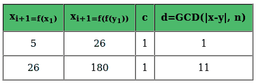
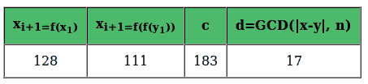
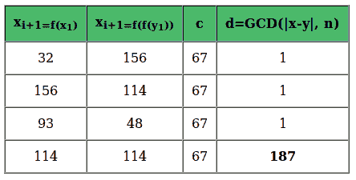

# 波拉德素数分解的ρ算法

> 原文:[https://www . geeksforgeeks . org/pollards-rho-algorithm-prime-factoring/](https://www.geeksforgeeks.org/pollards-rho-algorithm-prime-factorization/)

给定一个正整数 **n** ，并且它是复合的，求它的除数。
例:

```
Input: n = 12;
Output: 2 [OR 3 OR 4]

Input: n = 187;
Output: 11 [OR 17]
```

**蛮法:**测试所有小于 n 的整数，直到找到除数。
**即兴发挥:**测试所有小于√n 的整数
一个足够大的数字仍然意味着大量的工作。**波拉德的 Rho** 是一种素因子分解算法，对于具有小素因子的大的复合数特别快。Rho 算法最显著的成功是第八个费马数的因式分解:1238926361552897 * 9346163971535797776916358199606896584051237541638580280321。
Rho 算法是个不错的选择，因为第一个质因数比另一个小很多。
**波拉德的 Rho 算法中使用的概念:**

1.  两个数字 x 和 y 被称为全等模 n (x = y 模 n)，如果
    1.  它们的绝对差是 n 的整数倍，或，
    2.  当除以 n 时，它们都留下相同的余数。
2.  [最大公约数](https://www.geeksforgeeks.org/basic-and-extended-euclidean-algorithms/)是平均分成每个原始数的最大数。
3.  [生日悖论:](https://www.geeksforgeeks.org/birthday-paradox/)即使是一小群人，两个人生日相同的概率也出乎意料的高。
4.  [弗洛伊德的寻周期算法:](https://en.wikipedia.org/wiki/Cycle_detection#Tortoise_and_hare)如果龟兔在同一点出发，以一个周期运动，使得野兔的速度是乌龟的两倍，那么它们一定会在某个点相遇。

**算法** :

1.  从随机的 x 和 c 开始，取 y 等于 x 和 f(x) = x <sup>2</sup> + c。
2.  虽然没有得到除数
    1.  将 x 更新为 f(x)(模 n)[乌龟移动]
    2.  将 y 更新为 f(f(y))(模 n)[野兔移动]
    3.  计算|x-y|和 n 的 GCD
    4.  如果 GCD 不是统一的
        1.  如果 GCD 为 n，用另一组 x、y 和 c 重复步骤 2
        2.  否则 GCD 就是我们的答案

**图解:**
我们假设 **n = 187** ，针对不同的随机值考虑不同的情况。

1.  一个随机值的例子，这样算法**找到结果** :
    y = x = 2，c = 1，因此，我们的 f(x) = x <sup>2</sup> + 1。



1.  一个随机值的例子，使得算法**更快地找到结果** :
    y = x = 110 和‘c’= 183。因此，我们的 f(x) = x <sup>2</sup> + 183。



2.  算法**找不到结果**的随机值示例:
    x = y = 147，c = 67。因此，我们的 f(x) = x <sup>2</sup> + 67。



下面是上述算法的 C/C++实现:

## C++

```
/* C++ program to find a prime factor of composite using
   Pollard's Rho algorithm */
#include<bits/stdc++.h>
using namespace std;

/* Function to calculate (base^exponent)%modulus */
long long int modular_pow(long long int base, int exponent,
                          long long int modulus)
{
    /* initialize result */
    long long int result = 1;

    while (exponent > 0)
    {
        /* if y is odd, multiply base with result */
        if (exponent & 1)
            result = (result * base) % modulus;

        /* exponent = exponent/2 */
        exponent = exponent >> 1;

        /* base = base * base */
        base = (base * base) % modulus;
    }
    return result;
}

/* method to return prime divisor for n */
long long int PollardRho(long long int n)
{
    /* initialize random seed */
    srand (time(NULL));

    /* no prime divisor for 1 */
    if (n==1) return n;

    /* even number means one of the divisors is 2 */
    if (n % 2 == 0) return 2;

    /* we will pick from the range [2, N) */
    long long int x = (rand()%(n-2))+2;
    long long int y = x;

    /* the constant in f(x).
     * Algorithm can be re-run with a different c
     * if it throws failure for a composite. */
    long long int c = (rand()%(n-1))+1;

    /* Initialize candidate divisor (or result) */
    long long int d = 1; 

    /* until the prime factor isn't obtained.
       If n is prime, return n */
    while (d==1)
    {
        /* Tortoise Move: x(i+1) = f(x(i)) */
        x = (modular_pow(x, 2, n) + c + n)%n;

        /* Hare Move: y(i+1) = f(f(y(i))) */
        y = (modular_pow(y, 2, n) + c + n)%n;
        y = (modular_pow(y, 2, n) + c + n)%n;

        /* check gcd of |x-y| and n */
        d = __gcd(abs(x-y), n);

        /* retry if the algorithm fails to find prime factor
         * with chosen x and c */
        if (d==n) return PollardRho(n);
    }

    return d;
}

/* driver function */
int main()
{
    long long int n = 10967535067;
    printf("One of the divisors for %lld is %lld.",
          n, PollardRho(n));
    return 0;
}
```

## Java 语言(一种计算机语言，尤用于创建网站)

```
/* Java program to find a prime factor of composite using
   Pollard's Rho algorithm */
import java.util.*;

class GFG{

/* Function to calculate (base^exponent)%modulus */
static long  modular_pow(long  base, int exponent,
                          long  modulus)
{
    /* initialize result */
    long  result = 1;

    while (exponent > 0)
    {
        /* if y is odd, multiply base with result */
        if (exponent % 2 == 1)
            result = (result * base) % modulus;

        /* exponent = exponent/2 */
        exponent = exponent >> 1;

        /* base = base * base */
        base = (base * base) % modulus;
    }
    return result;
}

/* method to return prime divisor for n */
static long  PollardRho(long  n)
{
    /* initialize random seed */
    Random rand = new Random();

    /* no prime divisor for 1 */
    if (n == 1) return n;

    /* even number means one of the divisors is 2 */
    if (n % 2 == 0) return 2;

    /* we will pick from the range [2, N) */
    long  x = (long)(rand.nextLong() % (n - 2)) + 2;
    long  y = x;

    /* the constant in f(x).
     * Algorithm can be re-run with a different c
     * if it throws failure for a composite. */
    long  c = (long)(rand.nextLong()) % (n - 1) + 1;

    /* Initialize candidate divisor (or result) */
    long  d = 1L; 

    /* until the prime factor isn't obtained.
       If n is prime, return n */
    while (d == 1)
    {
        /* Tortoise Move: x(i+1) = f(x(i)) */
        x = (modular_pow(x, 2, n) + c + n) % n;

        /* Hare Move: y(i+1) = f(f(y(i))) */
        y = (modular_pow(y, 2, n) + c + n) % n;
        y = (modular_pow(y, 2, n) + c + n) % n;

        /* check gcd of |x-y| and n */
        d = __gcd(Math.abs(x - y), n);

        /* retry if the algorithm fails to find prime factor
         * with chosen x and c */
        if (d == n) return PollardRho(n);
    }

    return d;
}

// Recursive function to return gcd of a and b 
static long __gcd(long a, long b) 
{ 
 return b == 0? a:__gcd(b, a % b);    
}

/* driver function */
public static void main(String[] args)
{
    long n = 10967535067L;
    System.out.printf("One of the divisors for " + n + " is " +
          PollardRho(n));
}
}

// This code contributed by aashish1995
```

## 蟒蛇 3

```
# Python 3 program to find a prime factor of composite using
# Pollard's Rho algorithm
import random
import math

# Function to calculate (base^exponent)%modulus
def modular_pow(base, exponent,modulus):

    # initialize result
    result = 1

    while (exponent > 0):

        # if y is odd, multiply base with result
        if (exponent & 1):
            result = (result * base) % modulus

        # exponent = exponent/2
        exponent = exponent >> 1

        # base = base * base
        base = (base * base) % modulus

    return result

# method to return prime divisor for n
def PollardRho( n):

    # no prime divisor for 1
    if (n == 1):
        return n

    # even number means one of the divisors is 2
    if (n % 2 == 0):
        return 2

    # we will pick from the range [2, N)
    x = (random.randint(0, 2) % (n - 2))
    y = x

    # the constant in f(x).
    # Algorithm can be re-run with a different c
    # if it throws failure for a composite.
    c = (random.randint(0, 1) % (n - 1))

    # Initialize candidate divisor (or result)
    d = 1

    # until the prime factor isn't obtained.
    # If n is prime, return n
    while (d == 1):

        # Tortoise Move: x(i+1) = f(x(i))
        x = (modular_pow(x, 2, n) + c + n)%n

        # Hare Move: y(i+1) = f(f(y(i)))
        y = (modular_pow(y, 2, n) + c + n)%n
        y = (modular_pow(y, 2, n) + c + n)%n

        # check gcd of |x-y| and n
        d = math.gcd(abs(x - y), n)

        # retry if the algorithm fails to find prime factor
        # with chosen x and c
        if (d == n):
            return PollardRho(n)

    return d

# Driver function
if __name__ == "__main__":

    n = 10967535067
    print("One of the divisors for", n , "is ",PollardRho(n))

# This code is contributed by chitranayal   
```

## C#

```
/* C# program to find a prime factor of composite using
   Pollard's Rho algorithm */
using System;
class GFG
{

/* Function to calculate (base^exponent)%modulus */
static long  modular_pow(long  _base, int exponent,
                          long  modulus)
{

    /* initialize result */
    long  result = 1;

    while (exponent > 0)
    {

        /* if y is odd, multiply base with result */
        if (exponent % 2 == 1)
            result = (result * _base) % modulus;

        /* exponent = exponent/2 */
        exponent = exponent >> 1;

        /* base = base * base */
       _base = (_base * _base) % modulus;
    }
    return result;
}

/* method to return prime divisor for n */
static long  PollardRho(long  n)
{

    /* initialize random seed */
    Random rand = new Random();

    /* no prime divisor for 1 */
    if (n == 1) return n;

    /* even number means one of the divisors is 2 */
    if (n % 2 == 0) return 2;

    /* we will pick from the range [2, N) */
    long  x = (long)(rand.Next(0, -(int)n + 1));
    long  y = x;

    /* the constant in f(x).
     * Algorithm can be re-run with a different c
     * if it throws failure for a composite. */
    long  c = (long)(rand.Next(1, -(int)n));

    /* Initialize candidate divisor (or result) */
    long  d = 1L; 

    /* until the prime factor isn't obtained.
       If n is prime, return n */
    while (d == 1)
    {

        /* Tortoise Move: x(i+1) = f(x(i)) */
        x = (modular_pow(x, 2, n) + c + n) % n;

        /* Hare Move: y(i+1) = f(f(y(i))) */
        y = (modular_pow(y, 2, n) + c + n) % n;
        y = (modular_pow(y, 2, n) + c + n) % n;

        /* check gcd of |x-y| and n */
        d = __gcd(Math.Abs(x - y), n);

        /* retry if the algorithm fails to find prime factor
         * with chosen x and c */
        if (d == n) return PollardRho(n);
    }

    return d;
}

// Recursive function to return gcd of a and b 
static long __gcd(long a, long b) 
{ 
  return b == 0 ? a:__gcd(b, a % b);    
}

/* Driver code */
public static void Main(String[] args)
{
    long n = 10967535067L;
    Console.Write("One of the divisors for " + n + " is " +
          PollardRho(n));
}
}

// This code is contributed by aashish1995
```

## java 描述语言

```
<script>

/* Javascript program to find a prime factor of composite using
   Pollard's Rho algorithm */

    /* Function to calculate (base^exponent)%modulus */
    function modular_pow(base,exponent,modulus)
    {
        /* initialize result */
        let  result = 1;

        while (exponent > 0)
        {
            /* if y is odd, multiply base with result */
            if (exponent % 2 == 1)
                result = (result * base) % modulus;

            /* exponent = exponent/2 */
            exponent = exponent >> 1;

            /* base = base * base */
            base = (base * base) % modulus;
        }
        return result;
    }

    /* method to return prime divisor for n */
    function PollardRho(n)
    {
        /* no prime divisor for 1 */
        if (n == 1)
            return n;

        /* even number means one of the divisors is 2 */
        if (n % 2 == 0)
            return 2;

        /* we will pick from the range [2, N) */
        let x=(Math.floor(Math.random() * (-n + 1) ));
        let y = x;

        /* the constant in f(x).
        * Algorithm can be re-run with a different c
        * if it throws failure for a composite. */
        let c= (Math.floor(Math.random() * (-n + 1)));

        /* Initialize candidate divisor (or result) */
        let d=1;
        /* until the prime factor isn't obtained.
        If n is prime, return n */
        while (d == 1)
        {
            /* Tortoise Move: x(i+1) = f(x(i)) */
            x = (modular_pow(x, 2, n) + c + n) % n;

            /* Hare Move: y(i+1) = f(f(y(i))) */
            y = (modular_pow(y, 2, n) + c + n) % n;
            y = (modular_pow(y, 2, n) + c + n) % n;

            /* check gcd of |x-y| and n */
            d = __gcd(Math.abs(x - y), n);

            /* retry if the algorithm fails to find prime factor
             * with chosen x and c */
            if (d == n) return PollardRho(n);
        }

        return d;
    }

    // Recursive function to return gcd of a and b
    function __gcd(a,b)
    {
        return b == 0? a:__gcd(b, a % b);
    }

    /* driver function */
    let n = 10967535067;
    document.write("One of the divisors for " + n + " is " +
          PollardRho(n));

    //  This code is contributed by avanitrachhadiya2155

</script>
```

**输出:**

```
One of the divisors for 10967535067 is 104729
```

**这是如何工作的？**
让 **n 成为复合(非质数)**。既然 n 是复合的，那就有一个不小的因子 **f** < n，其实至少有一个 **f < = √n** 。
现在假设我们必须从范围[0，n-1]中选择两个数字 x 和 y。我们得到 x = y 模 n 的唯一时间是 x 和 y 相同的时候。然而，由于 f < √n，即使 x 和 y 不相同，也很有可能 x = y 模 f([生日悖论](https://www.geeksforgeeks.org/birthday-paradox/))。
我们首先从集合{0，1，…，n-1}中随机选择具有替换的 x，形成序列 s <sub>1</sub> 、s <sub>2</sub> 、s<sub>3</sub>……定义 **&序列；<sub>I</sub>= s<sub>I</sub>mod f**，我们的序列现在有每个&序列； <sub>i</sub> 属于{0，1，…，f-1}。因为这两个集合都是有限的，最终两个集合中都会有一个重复的整数。我们希望在&中更早实现重复； <sub>i</sub> ，自 f<n .
T30】现在，说&s coute；<sub>I</sub>=&sa cute； <sub>j</sub> 代表 i ≠ j，那么，s <sub>i</sub> = s <sub>j</sub> 模 d，因此，| s<sub>I</sub>–s<sub>j</sub>|将是 f 的倍数，如上假设，n 也是 f 的倍数，这意味着| s<sub>I</sub>–s<sub>j</sub>|和 n 的 GCD 将是 f 的正整数倍这里的问题是，我们只知道必须有一些 n 的除数，而我们甚至不关心它的值。一旦我们遇到 s <sub>i</sub> 和 s <sub>j</sub> (我们最终的 x 和 y)，那么从 s <sub>i</sub> 开始的序列中的每个元素将与从 s <sub>j</sub> 开始的序列中的相应元素全等模 f，因此是一个循环。如果我们把序列 s <sub>i</sub> 作图，我们会观察到希腊字母 Rho (ρ)的形状。
Rho 算法的核心是拾取随机值并评估 GCDs。为了减少昂贵的 GCD 计算，我们可以用弗洛伊德的周期检测来实现波拉德ρ(这可以用龟兔类比来理解，即乌龟一次一个地依次穿过每个元素，兔子从同一点开始，但移动速度是乌龟的两倍)。同样的我们要有一些多项式 f(x)，从随机的 x <sub>0</sub> ，y <sub>0</sub> = x <sub>0</sub> 开始，计算 x <sub>i+1</sub> = f(x <sub>i</sub> )和 y<sub>I+1</sub>= f(y<sub>I</sub>)。由于我们对 d 了解不多，多项式的一个典型选择是 f(x) = x <sup>2</sup> + c(模 n)(是的，c' **也是随机选择的**)。
**注:**

1.  对于素数，算法将无限期运行。
2.  算法可能找不到因子，并返回复合 n 的失败。在这种情况下，我们使用 x、y 和 c 的不同集合，然后重试。
3.  上面的算法只找到一个除数。为了找到一个质因数，我们可以**递归分解**除数 d，运行 d 和 n/d 的算法。周期长度通常为√d 的量级。

**时间复杂度分析:**
该算法在运行时间和找到因子的概率之间进行权衡。在 O(√d) < = O(n <sup>1/4</sup> )次迭代中，素除数可以达到 0.5 左右的概率。这是一个启发性的说法，对算法的严格分析仍然是开放的。
本文由**雅什·瓦利亚尼**供稿。如果发现有不正确的地方，请写评论，或者想分享更多关于以上讨论话题的信息