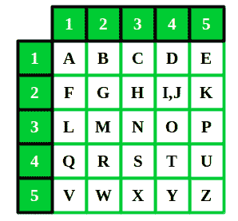

# 波利比乌斯广场密码

> 原文:[https://www.geeksforgeeks.org/polybius-square-cipher/](https://www.geeksforgeeks.org/polybius-square-cipher/)

波利比乌斯广场是一张允许某人将字母转换成数字的桌子。为了使加密稍微困难一点，这个表可以被随机化并与接收者共享。为了将字母表中的 26 个字母放入表格创建的 25 个单元格中，字母“I”和“j”通常组合成一个单元格。最初没有这样的问题，因为古希腊字母表有 24 个字母。



如果一种语言包含大量字母，可以使用更大的表格。

**示例:**

```
Input :  bus
Output : 124543

Input :  geeksforgeeks 
Output : 22151525432134422215152543 

```

## C++

```
// CPP Program to implement polybius cipher
#include <cmath>
#include <iostream>
using namespace std;

// function to display polybius cipher text
void polybiusCipher(string s) {
  int row, col;

  // convert each character to its encrypted code
  for (int i = 0; s[i]; i++) {

    // finding row of the table
    row = ceil((s[i] - 'a') / 5) + 1;

    // finding column of the table
    col = ((s[i] - 'a') % 5) + 1;

    // if character is 'k'
    if (s[i] == 'k') {
      row = row - 1;
      col = 5 - col + 1;
    }

    // if character is greater than 'j'
    else if (s[i] >= 'j') {
      if (col == 1) {
        col = 6;
        row = row - 1;
      }
      col = col - 1;
    }
    cout << row << col;
  }

  cout << endl;
}

// Driver's Code
int main() {
  string s = "geeksforgeeks";
  polybiusCipher(s);
  return 0;
}
```

## Java 语言(一种计算机语言，尤用于创建网站)

```
// Java Program to implement polybius cipher

class GFG
{
    // Function to display polybius
    // cipher text
    static void polybiusCipher(String s) 
    {
        int row, col;

        // convert each character 
        // to its encrypted code
        for (int i = 0;i < s.length(); i++) 
        {

            // finding row of the table
            row = (int)Math.ceil((s.charAt(i) - 'a') / 5) + 1;

            // finding column of the table
            col = ((s.charAt(i) - 'a') % 5) + 1;

            // if character is 'k'
            if (s.charAt(i) == 'k') 
            {
                row = row - 1;
                col = 5 - col + 1;
            }

            // if character is greater than 'j'
            else if (s.charAt(i) >= 'j')
            {
                if (col == 1) 
                {
                    col = 6;
                    row = row - 1;
                }
                col = col - 1;
            }
            System.out.print(row +""+ col);
        }

        System.out.println();
    }

    // Driver code
    public static void main (String[] args)
    {
        String s = "geeksforgeeks";
        polybiusCipher(s);
    }
}

// This code is contributed by Anant Agarwal.
```

## 计算机编程语言

```
# Python Program to implement polybius cipher

# function to display polybius cipher text
def polybiusCipher(s):

        # convert each character to its encrypted code
        for char in s:

                # finding row of the table
                row = int((ord(char) - ord('a')) / 5) + 1

                # finding column of the table 
                col = ((ord(char) - ord('a')) % 5) + 1

                # if character is 'k'
                if char == 'k':
                        row = row - 1
                        col = 5 - col + 1

                # if character is greater than 'j'
                elif ord(char) >= ord('j'):
                        if col == 1 :
                            col = 6
                            row = row - 1

                        col = col - 1

                print(row, col, end ='', sep ='')

# Driver's Code
if __name__ == "__main__":

        s = "geeksforgeeks"

        # print the cipher of "geeksforgeeks"
        polybiusCipher(s)
```

## C#

```
// C# Program to implement
// polybius cipher
using System;

class GFG
{
    // Function to display 
    // polybius cipher text
    static void polybiusCipher(string s) 
    {
        int row, col;

        // convert each character 
        // to its encrypted code
        for (int i = 0;
                 i < s.Length; i++) 
        {
            // finding row of the table
            row = (int)Math.Floor((s[i] - 
                         'a') / 5.0) + 1;

            // finding column
            // of the table
            col = ((s[i] - 'a') % 5) + 1;

            // if character is 'k'
            if (s[i] == 'k') 
            {
                row = row - 1;
                col = 5 - col + 1;
            }

            // if character is 
            // greater than 'j'
            else if (s[i] >= 'j')
            {
                if (col == 1) 
                {
                    col = 6;
                    row = row - 1;
                }
                col = col - 1;
            }
            Console.Write(row + 
                          "" + col);
        }
        Console.WriteLine();
    }

    // Driver code
    static void Main ()
    {
        string s = "geeksforgeeks";
        polybiusCipher(s);
    }
} 

// This code is contributed by 
// Manish Shaw(manishshaw1)
```

## 服务器端编程语言（Professional Hypertext Preprocessor 的缩写）

```
<?php
// PHP Program to implement 
// polybius cipher

// function to display 
// polybius cipher text
function polybiusCipher($s)
{
$row = 0;
$col = 0;

// convert each character 
// to its encrypted code
for ($i = 0; 
     $i < strlen($s); $i++) 
{

    // finding row 
    // of the table
    $row = floor((ord($s[$i]) - 
                  ord('a')) / 5) + 1;

    // finding column
    // of the table
    $col = ((ord($s[$i]) -
             ord('a')) % 5) + 1;

    // if character is 'k'
    if ($s[$i] == 'k') 
    {
        $row = $row - 1;
        $col = 5 - $col + 1;
    }

    // if character is
    // greater than 'j'
    else if ($s[$i] >= 'j')
    {
        if ($col == 1) 
        {
            $col = 6;
            $row = $row - 1;
        }
        $col = $col - 1;
    }
    echo ($row.$col);
} 
echo ("\n");
}

// Driver Code
$s = "geeksforgeeks";
polybiusCipher($s);

// This code is contributed by 
// Manish Shaw(manishshaw1)
?>
```

**输出:**

```
22151525432134422215152543

```