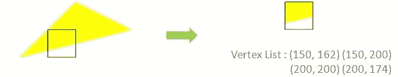
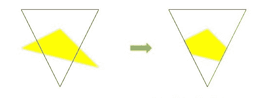
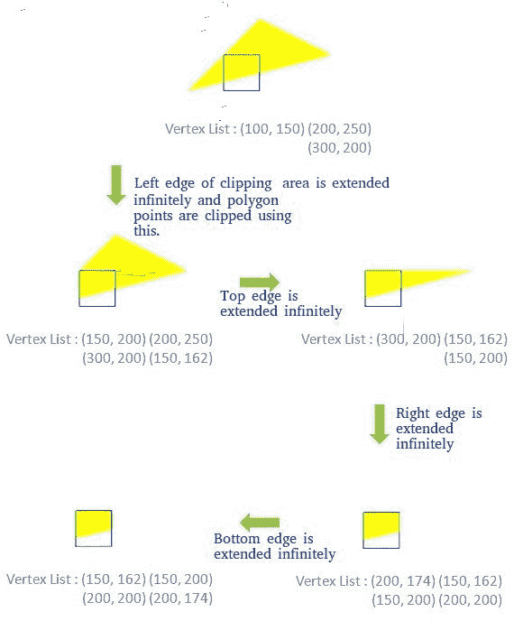
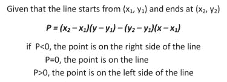
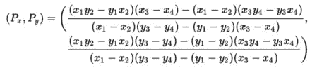

# 多边形裁剪|萨瑟兰-霍奇曼算法

> 原文:[https://www . geesforgeks . org/多边形-裁剪-萨瑟兰-霍奇曼-算法-请-更改-bmp-images-jpeg-png/](https://www.geeksforgeeks.org/polygon-clipping-sutherland-hodgman-algorithm-please-change-bmp-images-jpeg-png/)

给出了凸多边形和凸裁剪区域。任务是使用萨瑟兰-霍奇曼算法裁剪多边形边缘。输入是以**顺时针顺序**的多边形顶点的形式。

**示例:**

```
Input : Polygon : (100,150), (200,250), (300,200)
        Clipping Area : (150,150), (150,200), (200,200), 
                            (200,150) i.e. a Square    
Output : (150, 162) (150, 200) (200, 200) (200, 174) 


Example 2
Input : Polygon : (100,150), (200,250), (300,200)
        Clipping Area : (100,300), (300,300), (200,100) 
Output : (242, 185) (166, 166) (150, 200) (200, 250) (260, 220) 


```

**算法概述:**

```
Consider each edge e of clipping Area  and do following:
   a) Clip given polygon against e.

```

**如何靠着裁剪区域的边缘进行裁剪？**
(裁剪区域的)边被无限延伸以创建一个边界，所有的顶点都使用这个边界进行裁剪。生成的新顶点列表以顺时针方式传递到裁剪多边形的下一条边，直到所有边都被使用。

对于给定多边形的任何给定边与当前裁剪边 e，有四种可能的情况。

1.  **两个顶点都在里面:**只有第二个顶点被添加到输出列表中
2.  **第一个顶点在外面，而第二个顶点在里面:**边与剪辑边界的交点和第二个顶点都被添加到输出列表中
3.  **第一个顶点在内部，而第二个顶点在外部:**只有边缘与剪辑边界的交点被添加到输出列表中
4.  **两个顶点都在外面:**没有顶点被添加到输出列表

[](https://media.geeksforgeeks.org/wp-content/cdn-uploads/Sutherland-Hodgman-Example-1-1.jpg)

在实现算法之前，有两个子问题需要讨论

**决定一个点是在裁剪多边形的内部还是外部**
如果裁剪多边形的顶点是以顺时针顺序给出的，那么位于裁剪边的**右侧**的所有点都在该多边形的内部。这可以使用:
[](https://media.geeksforgeeks.org/wp-content/uploads/Formula-for-position-of-point.jpg) 来计算

**寻找边与裁剪边界的交点**
如果每条线(1，2 & 3，4)的两个点是已知的，那么它们的交点可以用公式计算:-
[](https://media.geeksforgeeks.org/wp-content/uploads/Formula-for-point-of-intersection.jpg)

```
// C++ program for implementing Sutherland–Hodgman
// algorithm for polygon clipping
#include<iostream>
using namespace std;

const int MAX_POINTS = 20;

// Returns x-value of point of intersection of two
// lines
int x_intersect(int x1, int y1, int x2, int y2,
                int x3, int y3, int x4, int y4)
{
    int num = (x1*y2 - y1*x2) * (x3-x4) -
              (x1-x2) * (x3*y4 - y3*x4);
    int den = (x1-x2) * (y3-y4) - (y1-y2) * (x3-x4);
    return num/den;
}

// Returns y-value of point of intersection of
// two lines
int y_intersect(int x1, int y1, int x2, int y2,
                int x3, int y3, int x4, int y4)
{
    int num = (x1*y2 - y1*x2) * (y3-y4) -
              (y1-y2) * (x3*y4 - y3*x4);
    int den = (x1-x2) * (y3-y4) - (y1-y2) * (x3-x4);
    return num/den;
}

// This functions clips all the edges w.r.t one clip
// edge of clipping area
void clip(int poly_points[][2], int &poly_size,
          int x1, int y1, int x2, int y2)
{
    int new_points[MAX_POINTS][2], new_poly_size = 0;

    // (ix,iy),(kx,ky) are the co-ordinate values of
    // the points
    for (int i = 0; i < poly_size; i++)
    {
        // i and k form a line in polygon
        int k = (i+1) % poly_size;
        int ix = poly_points[i][0], iy = poly_points[i][1];
        int kx = poly_points[k][0], ky = poly_points[k][1];

        // Calculating position of first point
        // w.r.t. clipper line
        int i_pos = (x2-x1) * (iy-y1) - (y2-y1) * (ix-x1);

        // Calculating position of second point
        // w.r.t. clipper line
        int k_pos = (x2-x1) * (ky-y1) - (y2-y1) * (kx-x1);

        // Case 1 : When both points are inside
        if (i_pos < 0  && k_pos < 0)
        {
            //Only second point is added
            new_points[new_poly_size][0] = kx;
            new_points[new_poly_size][1] = ky;
            new_poly_size++;
        }

        // Case 2: When only first point is outside
        else if (i_pos >= 0  && k_pos < 0)
        {
            // Point of intersection with edge
            // and the second point is added
            new_points[new_poly_size][0] = x_intersect(x1,
                              y1, x2, y2, ix, iy, kx, ky);
            new_points[new_poly_size][1] = y_intersect(x1,
                              y1, x2, y2, ix, iy, kx, ky);
            new_poly_size++;

            new_points[new_poly_size][0] = kx;
            new_points[new_poly_size][1] = ky;
            new_poly_size++;
        }

        // Case 3: When only second point is outside
        else if (i_pos < 0  && k_pos >= 0)
        {
            //Only point of intersection with edge is added
            new_points[new_poly_size][0] = x_intersect(x1,
                              y1, x2, y2, ix, iy, kx, ky);
            new_points[new_poly_size][1] = y_intersect(x1,
                              y1, x2, y2, ix, iy, kx, ky);
            new_poly_size++;
        }

        // Case 4: When both points are outside
        else
        {
            //No points are added
        }
    }

    // Copying new points into original array
    // and changing the no. of vertices
    poly_size = new_poly_size;
    for (int i = 0; i < poly_size; i++)
    {
        poly_points[i][0] = new_points[i][0];
        poly_points[i][1] = new_points[i][1];
    }
}

// Implements Sutherland–Hodgman algorithm
void suthHodgClip(int poly_points[][2], int poly_size,
                  int clipper_points[][2], int clipper_size)
{
    //i and k are two consecutive indexes
    for (int i=0; i<clipper_size; i++)
    {
        int k = (i+1) % clipper_size;

        // We pass the current array of vertices, it's size
        // and the end points of the selected clipper line
        clip(poly_points, poly_size, clipper_points[i][0],
             clipper_points[i][1], clipper_points[k][0],
             clipper_points[k][1]);
    }

    // Printing vertices of clipped polygon
    for (int i=0; i < poly_size; i++)
        cout << '(' << poly_points[i][0] <<
                ", " << poly_points[i][1] << ") ";
}

//Driver code
int main()
{
    // Defining polygon vertices in clockwise order
    int poly_size = 3;
    int poly_points[20][2] = {{100,150}, {200,250},
                              {300,200}};

    // Defining clipper polygon vertices in clockwise order
    // 1st Example with square clipper
    int clipper_size = 4;
    int clipper_points[][2] = {{150,150}, {150,200},
                              {200,200}, {200,150} };

    // 2nd Example with triangle clipper
    /*int clipper_size = 3;
    int clipper_points[][2] = {{100,300}, {300,300},
                                {200,100}};*/

    //Calling the clipping function
    suthHodgClip(poly_points, poly_size, clipper_points,
                 clipper_size);

    return 0;
}
```

输出:

```
(150, 162) (150, 200) (200, 200) (200, 174)

```

**相关文章:**
[线裁剪|集 1(科恩-萨瑟兰算法)](https://www.geeksforgeeks.org/line-clipping-set-1-cohen-sutherland-algorithm/)
[计算机图形学中的点裁剪算法](https://www.geeksforgeeks.org/point-clipping-algorithm-computer-graphics/)

本文由**纳巴尼特罗伊**供稿。如果你喜欢 GeeksforGeeks 并想投稿，你也可以使用[write.geeksforgeeks.org](http://www.write.geeksforgeeks.org)写一篇文章或者把你的文章邮寄到 review-team@geeksforgeeks.org。看到你的文章出现在极客博客主页上，帮助其他极客。

如果你发现任何不正确的地方，或者你想分享更多关于上面讨论的话题的信息，请写评论。