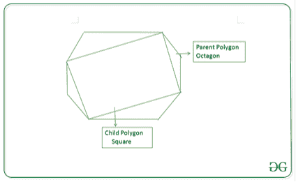

# N 边正多边形内接边数最多的多边形

> 原文:[https://www . geeksforgeeks . org/边数最多的正多边形/](https://www.geeksforgeeks.org/polygon-with-maximum-sides-that-can-be-inscribed-in-an-n-sided-regular-polygon/)

给定一个由 **N** 条边组成的[正多边形](https://en.wikipedia.org/wiki/Regular_polygon)，任务是通过连接不相邻的顶点来找到给定多边形内可内接的最大边多边形。如果不存在这样的多边形，打印 **-1** 。

**示例:**

> ***输入:** N = 8*
> ***输出:** 4*
> ***解释:***
> *给定的 8 边多边形内最多可以内接一个 4 边多边形，如下图所示:*
> 
> [](https://media.geeksforgeeks.org/wp-content/uploads/20201027161538/polygon.png)
> 
> ***输入:** N = 3*
> ***输出:** -1*

**方法:**思路是观察如果 **N** 为偶数，一个正多边形可以内接另一个 **N** 边的正多边形。按照以下步骤解决问题:

1.  如果 **N** 为偶数，那么通过连接不相邻的顶点可以形成边数最大的内接多边形。因此，打印 **N/2** 作为所需答案。
2.  否则，打印 **-1** ，因为奇数边的多边形内不能有正多边形。

下面是上述方法的实现:

## C++

```
// C++ program for the above approach

#include <bits/stdc++.h>
using namespace std;

// Function to find the maximum
// sided polygon that can be inscribed
int MaximumSides(int n)
{
    // Base Case
    if (n < 4)
        return -1;

    // Return n/2 if n is even
    // Otherwise, return -1
    return n % 2 == 0 ? n / 2 : -1;
}

// Driver Code
int main()
{
    // Given N
    int N = 8;

    // Function Call
    cout << MaximumSides(N);

    return 0;
}
```

## Java 语言(一种计算机语言，尤用于创建网站)

```
// Java program for the
// above approach
import java.util.*;
class GFG{

// Function to find the
// maximum sided polygon
// that can be inscribed
static int MaximumSides(int n)
{
  // Base Case
  if (n < 4)
    return -1;

  // Return n/2 if n is
  // even Otherwise, return -1
  return n % 2 == 0 ?
         n / 2 : -1;
}

// Driver Code
public static void main(String[] args)
{
  // Given N
  int N = 8;

  // Function Call
  System.out.print(MaximumSides(N));
}
}

// This code is contributed by shikhasingrajput
```

## 蟒蛇 3

```
# Python3 program for the above approach

# Function to find the maximum sided
# polygon that can be inscribed
def MaximumSides(n):

    # Base Case
    if (n < 4):
        return -1

    # Return n/2 if n is even
    # Otherwise, return -1
    if n % 2 == 0:
        return n // 2

    return  -1

# Driver Code
if __name__ == '__main__':

    # Given N
    N = 8

    # Function Call
    print(MaximumSides(N))

# This code is contributed by mohit kumar 29
```

## C#

```
// C# program for the
// above approach
using System;
class GFG{

// Function to find the
// maximum sided polygon
// that can be inscribed
static int MaximumSides(int n)
{
  // Base Case
  if (n < 4)
    return -1;

  // Return n/2 if n is
  // even Otherwise, return -1
  return n % 2 == 0 ?
         n / 2 : -1;
}

// Driver Code
public static void Main(String[] args)
{
  // Given N
  int N = 8;

  // Function Call
  Console.Write(MaximumSides(N));
}
}

// This code is contributed by shikhasingrajput
```

## java 描述语言

```
<script>
// Javascript program for the
// above approach

    // Function to find the
    // maximum sided polygon
    // that can be inscribed
    function MaximumSides( n)
    {

        // Base Case
        if (n < 4)
            return -1;

        // Return n/2 if n is
        // even Otherwise, return -1
        return n % 2 == 0 ? n / 2 : -1;
    }

    // Driver Code
     // Given N
    let N = 8;

    // Function Call
    document.write(MaximumSides(N));

// This code is contributed by shikhasingrajput
</script>
```

**输出:**

```
4
```

***时间复杂度:**O(1)*
T5**辅助空间:** O(1)