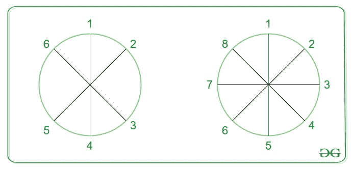

# 一个人在一个圆上完全相反的位置

> 原文:[https://www . geeksforgeeks . org/一个人的位置-在一个圆上完全相反/](https://www.geeksforgeeks.org/position-of-a-person-diametrically-opposite-on-a-circle/)

有 **n** 个人站在一个圆的圆周上。给定一个人 **m** 的位置，任务是在圆上找到与 **m** 截然相反的人的位置。



**示例:**

> **输入:** n = 6，m = 2
> **输出:** 5
> 共有 6 个位置时，位置 5 与位置 2 相对
> 
> **输入:** n = 8，m = 5
> T3】输出: 1

**进场:**有两种情况:

*   如果 **m > n / 2** 那么答案永远是**m–(n/2)**。
*   如果 **m ≤ n / 2** ，那么答案永远是 **m + (n / 2)** 。

下面是上述方法的实现:

## C++

```
// C++ implementation of the approach
#include <bits/stdc++.h>
using namespace std;

// Function to return the required position
int getPosition(int n, int m)
{
    if (m > (n / 2))
        return (m - (n / 2));

    return (m + (n / 2));
}

// Driver code
int main()
{
    int n = 8, m = 5;
    cout << getPosition(n, m);

    return 0;
}
```

## Java 语言(一种计算机语言，尤用于创建网站)

```
// Java implementation of the approach
class Sol
{

// Function to return the required position
static int getPosition(int n, int m)
{
    if (m > (n / 2))
        return (m - (n / 2));

    return (m + (n / 2));
}

// Driver code
public static void main(String args[])
{
    int n = 8, m = 5;
    System.out.println(getPosition(n, m));

}
}
// This code is contributed by Arnab Kundu
```

## 蟒蛇 3

```
# Python3 implementation of the approach

# Function to return the
# required position
def getPosition(n, m):

    if (m > (n // 2)) :
        return (m - (n // 2))

    return (m + (n // 2))

# Driver code
n = 8
m = 5
print(getPosition(n, m))

# This code is contributed
# by ihritik
```

## C#

```
// C# implementation of the approach
using System;

class GFG
{

// Function to return the required position
static int getPosition(int n, int m)
{
    if (m > (n / 2))
        return (m - (n / 2));

    return (m + (n / 2));
}

    // Driver code
    static public void Main ()
    {

    int n = 8, m = 5;
    Console.WriteLine(getPosition(n, m));
    }
}

// This code is contributed by ajit.
```

## 服务器端编程语言（Professional Hypertext Preprocessor 的缩写）

```
<?php
// PHP implementation of the approach

// Function to return the
// required position
function getPosition($n, $m)
{

    if ($m > ($n / 2))
        return ($m - ($n / 2));

    return ($m + ($n / 2));
}

// Driver code
$n = 8;
$m = 5;
echo getPosition($n, $m);

// This code is contributed
// by ihritik
?>
```

## java 描述语言

```
<script>

// Javascript implementation of the approach

// Function to return the required position
function getPosition( n, m)
{
    if (m > (n / 2))
        return (m - parseInt(n / 2));

    return (m + parseInt(n / 2));
}

// Driver code
var n = 8, m = 5;
document.write(getPosition(n, m));

</script>
```

**Output:** 

```
1
```

**时间复杂度:** O(1)