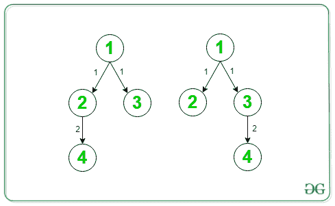

# 具有 N 个顶点的树的可能数量

> 原文:[https://www . geesforgeks . org/可能的树数-有-n 个顶点/](https://www.geeksforgeeks.org/possible-number-of-trees-having-n-vertex/)

给定一个 **N** 正整数的[数组](https://www.geeksforgeeks.org/introduction-to-arrays/) **arr[]** 。任务是找到可能具有 **N** 个顶点的[棵树](https://www.geeksforgeeks.org/binary-tree-data-structure/)的数量，使得顶点 1 和顶点 I 之间的距离为**arr【I】**。这样的树的总数可能非常大，所以以 **10 <sup>9</sup> + 7** 为模返回答案。

**示例:**

> **输入:** arr[] = {0，1，1，2}
> **输出:** 2
> **解释:**
> 下面是树:
> 
> [](https://media.geeksforgeeks.org/wp-content/cdn-uploads/20200822092409/tree7.png)
> 
> **输入:** arr[] = { 0，3，2，1，2，2，1 }
> T3】输出: 24

**天真方法:**以下是步骤:

1.  如果 A <sub>1</sub> ！=0，如果元素来自 <sub>2</sub> 。。。A <sub>N</sub> 为 **0** 那么树就不能造了，所以在这种情况下，树的计数为 **0** 。
2.  如果我们将第一个节点作为根节点，那么级别 1 上的所有节点必须是根节点的子节点，级别 2 上的所有节点必须是级别 1 节点的子节点，因此只有一种可能将它们按级别放置。
3.  现在假设 x 是第 **i <sup>级</sup>级**上的节点数，y 是第 **(i + 1) <sup>级</sup>级**上的节点数，那么在第 I 级和(i + 1)级上排列节点的可能性数是 **x <sup>y</sup>** 。
4.  因此，树的计数将是**X<sub>I</sub>T3】XT5<sup>(I+1)</sup>**，其中**X<sub>I</sub>T13】是 **i <sup>第</sup>级**中的节点数。**

下面是上述方法的实现:

## C++

```
// C++ program for the above approach
#include <bits/stdc++.h>
using namespace std;
const int mod = 1e9 + 7;

// Function to count the total number
// of trees possible
int NumberOfTrees(int arr[], int N)
{
    // Find the max element in the
    // given array
    int maxElement = *max_element(arr, arr + N);

    // Level array store the number of
    // nodes on level i initially all
    // values are zero
    int level[maxElement + 1] = { 0 };
    for (int i = 0; i < N; i++) {

        level[arr[i]]++;
    }

    // In this case tree can not be created
    if (arr[0] != 0 || level[0] != 1) {

        return 0;
    }

    // To store the count of trees
    int ans = 1;

    // Iterate until maxElement
    for (int i = 0; i < maxElement; i++) {

        // Calculate level[i]^level[i+1]
        for (int j = 0; j < level[i + 1]; j++) {

            // Update the count of tree
            ans = (ans * level[i]) % mod;
        }
    }

    // Return the final count of trees
    return ans;
}

// Driver Code
int main()
{
    int N = 7;

    // Given array arr[]
    int arr[] = { 0, 3, 2, 1, 2, 2, 1 };

    // Function Call
    cout << NumberOfTrees(arr, N);
    return 0;
}
```

## Java 语言(一种计算机语言，尤用于创建网站)

```
// Java program for the above approach
import java.util.*;

class GFG{

static int mod = (int)(1e9 + 7);

// Function to count the total number
// of trees possible
static int NumberOfTrees(int arr[], int N)
{

    // Find the max element in the
    // given array
    int maxElement = Arrays.stream(arr).max().getAsInt();

    // Level array store the number of
    // nodes on level i initially all
    // values are zero
    int level[] = new int[maxElement + 1];
    for(int i = 0; i < N; i++)
    {
        level[arr[i]]++;
    }

    // In this case tree can not be created
    if (arr[0] != 0 || level[0] != 1)
    {
        return 0;
    }

    // To store the count of trees
    int ans = 1;

    // Iterate until maxElement
    for(int i = 0; i < maxElement; i++)
    {

        // Calculate level[i]^level[i+1]
        for (int j = 0; j < level[i + 1]; j++)
        {

            // Update the count of tree
            ans = (ans * level[i]) % mod;
        }
    }

    // Return the final count of trees
    return ans;
}

// Driver Code
public static void main(String[] args)
{
    int N = 7;

    // Given array arr[]
    int arr[] = { 0, 3, 2, 1, 2, 2, 1 };

    // Function call
    System.out.print(NumberOfTrees(arr, N));
}
}

// This code is contributed by Amit Katiyar
```

## 蟒蛇 3

```
# Python3 program for the above approach
mod = int(1e9 + 7)

# Function to count the total number
# of trees possible
def NumberOfTrees(arr, N):

    # Find the max element in the
    # given array
    maxElement = max(arr);

    # Level array store the number of
    # Nodes on level i initially all
    # values are zero
    level = [0] * (maxElement + 1);
    for i in range(N):
        level[arr[i]] += 1;

    # In this case tree can not be created
    if (arr[0] != 0 or level[0] != 1):
        return 0;

    # To store the count of trees
    ans = 1;

    # Iterate until maxElement
    for i in range(maxElement):

        # Calculate level[i]^level[i+1]
        for j in range(level[i + 1]):

            # Update the count of tree
            ans = (ans * level[i]) % mod;

    # Return the final count of trees
    return ans;

# Driver Code
if __name__ == '__main__':

    N = 7;

    # Given array arr
    arr = [ 0, 3, 2, 1, 2, 2, 1 ];

    # Function call
    print(NumberOfTrees(arr, N));

# This code is contributed by shikhasingrajput
```

## C#

```
// C# program for the above approach
using System;
using System.Linq;
class GFG{

static int mod = (int)(1e9 + 7);

// Function to count the total number
// of trees possible
static int NumberOfTrees(int []arr, int N)
{

    // Find the max element in the
    // given array
    int maxElement = arr.Max();

    // Level array store the number of
    // nodes on level i initially all
    // values are zero
    int []level = new int[maxElement + 1];
    for(int i = 0; i < N; i++)
    {
        level[arr[i]]++;
    }

    // In this case tree can not be created
    if (arr[0] != 0 || level[0] != 1)
    {
        return 0;
    }

    // To store the count of trees
    int ans = 1;

    // Iterate until maxElement
    for(int i = 0; i < maxElement; i++)
    {

        // Calculate level[i]^level[i+1]
        for (int j = 0; j < level[i + 1]; j++)
        {

            // Update the count of tree
            ans = (ans * level[i]) % mod;
        }
    }

    // Return the readonly count of trees
    return ans;
}

// Driver Code
public static void Main(String[] args)
{
    int N = 7;

    // Given array []arr
    int []arr = { 0, 3, 2, 1, 2, 2, 1 };

    // Function call
    Console.Write(NumberOfTrees(arr, N));
}
}

// This code is contributed by gauravrajput1
```

## java 描述语言

```
<script>
// JavaScript program for the
// above approach

let mod = (1e9 + 7);

// Function to count the total number
// of trees possible
function NumberOfTrees(arr, N)
{

    // Find the max element in the
    // given array
    let maxElement = Math.max(...arr);

    // Level array store the number of
    // nodes on level i initially all
    // values are zero
    let level = Array.from({length: maxElement + 1}, (_, i) => 0);
    for(let i = 0; i < N; i++)
    {
        level[arr[i]]++;
    }

    // In this case tree can not be created
    if (arr[0] != 0 || level[0] != 1)
    {
        return 0;
    }

    // To store the count of trees
    let ans = 1;

    // Iterate until maxElement
    for(let i = 0; i < maxElement; i++)
    {

        // Calculate level[i]^level[i+1]
        for (let j = 0; j < level[i + 1]; j++)
        {

            // Update the count of tree
            ans = (ans * level[i]) % mod;
        }
    }

    // Return the final count of trees
    return ans;
}
// Driver Code

    let N = 7;

    // Given array arr[]
    let arr = [ 0, 3, 2, 1, 2, 2, 1 ];

    // Function call
    document.write(NumberOfTrees(arr, N));

</script>
```

**Output:** 

```
24
```

***时间复杂度:** O(N*K)其中 K 是一个级别的顶点数。*
***辅助空间:** O(N)*

**高效方法:**上述方法可以通过使用[模幂](https://www.geeksforgeeks.org/modular-exponentiation-power-in-modular-arithmetic/)优化 **(ans*level[i])** 的值来优化。以下是步骤:

1.  如果指数是奇数，通过减去 1 使它变成偶数，然后用答案乘以基数。
2.  如果指数是偶数，将指数除以 2，然后将基数平方。
3.  当指数变为 0 时返回 1。

下面是上述方法的实现:

## C++

```
// C++ program for the above approach
#include <bits/stdc++.h>
using namespace std;
const int mod = 1e9 + 7;

// Function that finds the value of x^y
// using Modular Exponentiation
int power(int x, int y)
{
    // Base Case
    if (y == 0)
        return 1;

    int p = power(x, y / 2) % mod;

    p = (p * p) % mod;

    // If y is odd, multiply
    // x with result
    if (y & 1)
        p = (x * p) % mod;

    // Return the value
    return p;
}

// Function that counts the total
// number of trees possible
int NumberOfTrees(int arr[], int N)
{

    // Find the max element in array
    int maxElement
        = *max_element(arr, arr + N);

    // Level array store the number nodes
    // on level i initially all values are 0
    int level[maxElement + 1] = { 0 };

    for (int i = 0; i < N; i++) {
        level[arr[i]]++;
    }

    // In this case tree can not be created
    if (arr[0] != 0 || level[0] != 1) {

        return 0;
    }

    int ans = 1;

    for (int i = 0; i < maxElement; i++) {

        // Calculate level[i]^level[i+1]
        ans = (ans * power(level[i],
                           level[i + 1]))
              % mod;
    }

    // Return the final count
    return ans;
}

// Driver Code
int main()
{
    int N = 7;

    // Given array arr[]
    int arr[] = { 0, 3, 2, 1, 2, 2, 1 };

    // Function Call
    cout << NumberOfTrees(arr, N);
    return 0;
}
```

## Java 语言(一种计算机语言，尤用于创建网站)

```
// Java program for the above approach
import java.util.*;

class GFG{

static int mod = (int)1e9 + 7;

// Function that finds the value of x^y
// using Modular Exponentiation
static int power(int x, int y)
{

    // Base Case
    if (y == 0)
        return 1;

    int p = power(x, y / 2) % mod;

    p = (p * p) % mod;

    // If y is odd, multiply
    // x with result
    if ((y & 1) != 0)
        p = (x * p) % mod;

    // Return the value
    return p;
}

// Function that counts the total
// number of trees possible
static int NumberOfTrees(int arr[], int N)
{

    // Find the max element in array
    int maxElement = Arrays.stream(arr).max().getAsInt();

    // Level array store the number nodes
    // on level i initially all values are 0
    int []level = new int[maxElement + 1];

    for(int i = 0; i < N; i++)
    {
        level[arr[i]]++;
    }

    // In this case tree can not be created
    if (arr[0] != 0 || level[0] != 1)
    {
        return 0;
    }

    int ans = 1;

    for(int i = 0; i < maxElement; i++)
    {
        // Calculate level[i]^level[i+1]
        ans = (ans * power(level[i],
                           level[i + 1])) % mod;
    }

    // Return the final count
    return ans;
}

// Driver Code
public static void main(String[] args)
{
    int N = 7;

    // Given array arr[]
    int arr[] = { 0, 3, 2, 1, 2, 2, 1 };

    // Function call
    System.out.print(NumberOfTrees(arr, N));
}
}

// This code is contributed by 29AjayKumar
```

## 蟒蛇 3

```
# Python3 program for the above approach
mod = int(1e9 + 7)

# Function that finds the value of x^y
# using Modular Exponentiation
def power(x, y):

    # Base Case
    if(y == 0):
        return 1

    p = power(x, y // 2) % mod

    p = (p * p) % mod

    # If y is odd, multiply
    # x with result
    if(y & 1):
        p = (x * p) % mod

    # Return the value
    return p

# Function that counts the total
# number of trees possible
def NumberOfTrees(arr, N):

    # Find the max element in array
    maxElement = max(arr)

    # Level array store the number nodes
    # on level i initially all values are 0
    level = [0] * (maxElement + 1)

    for i in range(N):
        level[arr[i]] += 1

    # In this case tree can not be created
    if(arr[0] != 0 or level[0] != 1):
        return 0

    ans = 1

    for i in range(maxElement):

        # Calculate level[i]^level[i+1]
        ans = (ans * power(level[i],
                           level[i + 1])) % mod

    # Return the final count
    return ans

# Driver Code
N = 7

# Given Queries
arr = [ 0, 3, 2, 1, 2, 2, 1 ]

# Function call
print(NumberOfTrees(arr, N))

# This code is contributed by Shivam Singh
```

## C#

```
// C# program for the above approach
using System;
using System.Linq;

class GFG{

static int mod = (int)1e9 + 7;

// Function that finds the value of x^y
// using Modular Exponentiation
static int power(int x, int y)
{

    // Base Case
    if (y == 0)
        return 1;

    int p = power(x, y / 2) % mod;

    p = (p * p) % mod;

    // If y is odd, multiply
    // x with result
    if ((y & 1) != 0)
        p = (x * p) % mod;

    // Return the value
    return p;
}

// Function that counts the total
// number of trees possible
static int NumberOfTrees(int []arr, int N)
{

    // Find the max element in array
    int maxElement = arr.Max();

    // Level array store the number nodes
    // on level i initially all values are 0
    int []level = new int[maxElement + 1];

    for(int i = 0; i < N; i++)
    {
        level[arr[i]]++;
    }

    // In this case tree can not be created
    if (arr[0] != 0 || level[0] != 1)
    {
        return 0;
    }

    int ans = 1;

    for(int i = 0; i < maxElement; i++)
    {

        // Calculate level[i]^level[i+1]
        ans = (ans * power(level[i],
                           level[i + 1])) % mod;
    }

    // Return the readonly count
    return ans;
}

// Driver Code
public static void Main(String[] args)
{
    int N = 7;

    // Given array []arr
    int []arr = { 0, 3, 2, 1, 2, 2, 1 };

    // Function call
    Console.Write(NumberOfTrees(arr, N));
}
}

// This code is contributed by 29AjayKumar
```

## java 描述语言

```
<script>
// javascript program for the
// above approach

let mod = 1e9 + 7;

// Function that finds the value of x^y
// using Modular Exponentiation
function power(x, y)
{

    // Base Case
    if (y == 0)
        return 1;

    let p = power(x, y / 2) % mod;

    p = (p * p) % mod;

    // If y is odd, multiply
    // x with result
    if ((y & 1) != 0)
        p = (x * p) % mod;

    // Return the value
    return p;
}

// Function that counts the total
// number of trees possible
function NumberOfTrees(arr, N)
{

    // Find the max element in array
    let maxElement = Math.max(...arr);

    // Level array store the number nodes
    // on level i initially all values are 0
    let level = Array(maxElement + 1).fill(0);

    for(let i = 0; i < N; i++)
    {
        level[arr[i]]++;
    }

    // In this case tree can not be created
    if (arr[0] != 0 || level[0] != 1)
    {
        return 0;
    }

    let ans = 1;

    for(let i = 0; i < maxElement; i++)
    {
        // Calculate level[i]^level[i+1]
        ans = (ans * power(level[i],
                           level[i + 1])) % mod;
    }

    // Return the final count
    return ans;
}

// Driver Code

    let N = 7;

    // Given array arr[]
    let arr = [ 0, 3, 2, 1, 2, 2, 1 ];

    // Function call
    document.write(NumberOfTrees(arr, N));

   // This code is contributed by decode2207.
</script>
```

**Output:** 

```
24
```

***时间复杂度:** O(N*log K)其中 K 是一个级别的顶点数。*
***辅助空间:** O(N)*