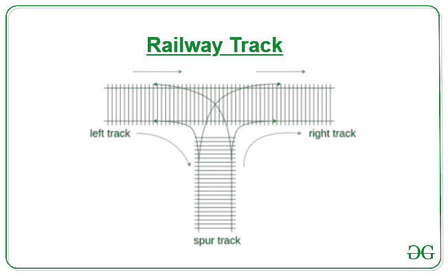

# 铁路轨道上的可能排列

> 原文:[https://www . geesforgeks . org/铁路轨道上可能的排列/](https://www.geeksforgeeks.org/possible-permutations-at-a-railway-track/)

给定如下图所示的左、右和正轨。从数值 1 到 **N** 有 **N** 辆卡车排列在左侧轨道。我们可以直接将 N 辆卡车移动到正确的轨道上，但是使用支线轨道将卡车移动到正确的轨道上的可能性更大。我们可以把任何卡车移到支线轨道，然后把它移到正确的轨道。任务是打印所有可能的排列顺序，其中所有的 **N** 卡车可以从左轨道移动到右轨道。
**注意:**一旦卡车从左卡车移动到右/支线轨道，则不能再移动到左轨道。
[](https://media.geeksforgeeks.org/wp-content/uploads/20200514182143/Railway.jpg)

**示例:**

> **输入:** N = 2
> **输出:**
> 1 2
> 2 1
> **解释:**
> 对于第一个排列:
> left[] = {1，2} right[] = {}，spur[] = {}
> 
> 值为 2 的卡车移至右履带，然后
> 左[] = {1}右[] = {2}，支线[] = {}
> 
> 现在将值 1 移动到右轨道，然后
> 向左[] = {} **向右[] = {1，2}** ，然后支线[] = {}
> 
> 对于第二个排列:
> 左[] = {1，2}右[] = {}，而支线[] = {}
> 
> 值为 2 的卡车移动到支线轨道，然后
> 向左[] = {1}向右[] = {}，支线[] = {2}
> 
> 值为 1 的卡车移动到右履带，然后
> 向左[] = {}向右[] = {1}，然后支线[] = {2}
> 
> 支线轨道中值为 2 的卡车移至右轨道，然后
> 左[] = {} **右[] = {2，1}** ，支线[] = {}
> 
> **输入:** N = 3
> **输出:**
> 1 2 3
> 2 1 3
> 3 2 1
> 3 1 2
> 2 3 1

**方法:**这个问题是[汉诺塔](https://www.geeksforgeeks.org/c-program-for-tower-of-hanoi/)的变种，可以用[递归](https://www.geeksforgeeks.org/recursion/)解决。以下是以下情况:

*   **情况 1:** 我们可以将卡车从左履带移动到支线履带，并递归检查左侧和支线履带上的剩余卡车。
*   **情况 2:** 我们可以把货车从支线移到右线，检查左、支线的剩余货车。

以下是步骤:

1.  在每一步中，我们可以将卡车从左履带移动到正履带，或者从正履带移动到右履带。
2.  将一辆卡车从左侧车道移到支线车道，并递归调用左侧和支线车道上的剩余卡车。
3.  At any recursive call, if the input track is empty then, move every truck on the spur track to right track and print the current permutation on the right track

    下面是上述方法的实现:

    ```
    // C++ program for the above approach
    #include "bits/stdc++.h"
    using namespace std;

    // Helper function to print all the
    // possible permutation
    void printPermute(vector<int>&input,
                      vector<int>&spur,
                      vector<int>&output)
    {

        // If at any recursive call input
        // array is empty, then we got our
        // one of the permutation
        if(input.empty())
        {

            // Print the right track trucks
            for(auto &it : output) {
                cout << it << ' ';
            }

            // Print the spur track trucks
            for(auto &it : spur) {
                cout << it << ' ';
            }

            cout << endl;
        }
        else
        {
            int temp;

            // Pop the element from input
            // track and move it to spur
            temp=input.back();
            input.pop_back();

            // Case 1
            // Push the popped truck from
            // input to spur track
            spur.push_back(temp);

            // Recursive call for remaining
            // trucks on input, spur and
            // output track
            printPermute(input,spur,output);

            // remove the top truck from spur
            // track and push it in input for
            // Case 2 iteration
            spur.pop_back();
            input.push_back(temp);

            // Case 2
            if(!spur.empty()) {

                // Remove the truck from the spur
                // track and move it to the 
                // output track
                temp=spur.back();
                spur.pop_back();
                output.push_back(temp);

                // Recursive call for remaining
                // truck on input, spur and
                // output track
                printPermute(input,spur,output);

                // Remove the top truck from the
                // output track and move it to
                // the spur track for the next
                // iteration
                output.pop_back();
                spur.push_back(temp);
            }
        }
    }

    // Function to print all the possible
    // permutation of trucks
    void possiblePermute(int n)
    {
        // Array for left, spur and right track
        vector<int>spur;
        vector<int>output;
        vector<int>input;

        // Insert all truck value 1 to N
        for(int i = 1; i <= n; i++) {
            input.push_back(i);
        }

        // Helper function to find
        // possible arrangement
        printPermute(input, spur, output);
    }

    // Driver Code
    int main()
    {
        // Input number of truck
        int N = 4;

        // Function Call
        possiblePermute(N);
    }
    ```

    **Output:**

    ```
    1 2 3 4 
    2 1 3 4 
    3 2 1 4 
    4 3 2 1 
    3 1 2 4 
    2 3 1 4 
    4 2 3 1 
    4 3 1 2 
    2 4 3 1 
    4 1 2 3 
    2 4 1 3 
    3 2 4 1 
    3 4 1 2 
    2 3 4 1 

    ```