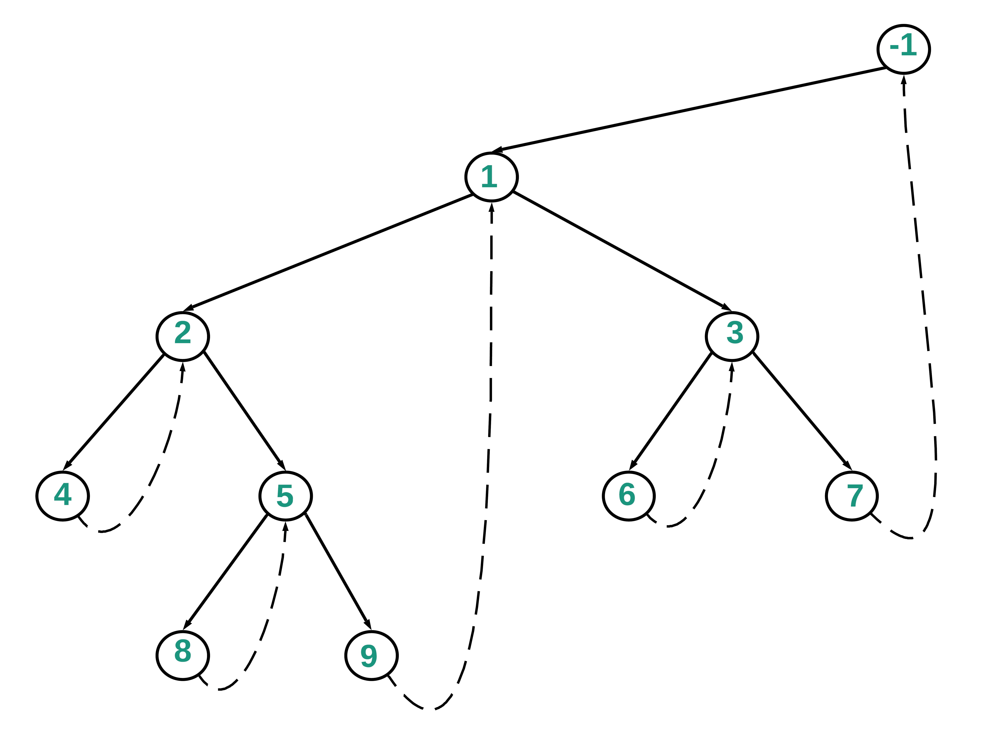
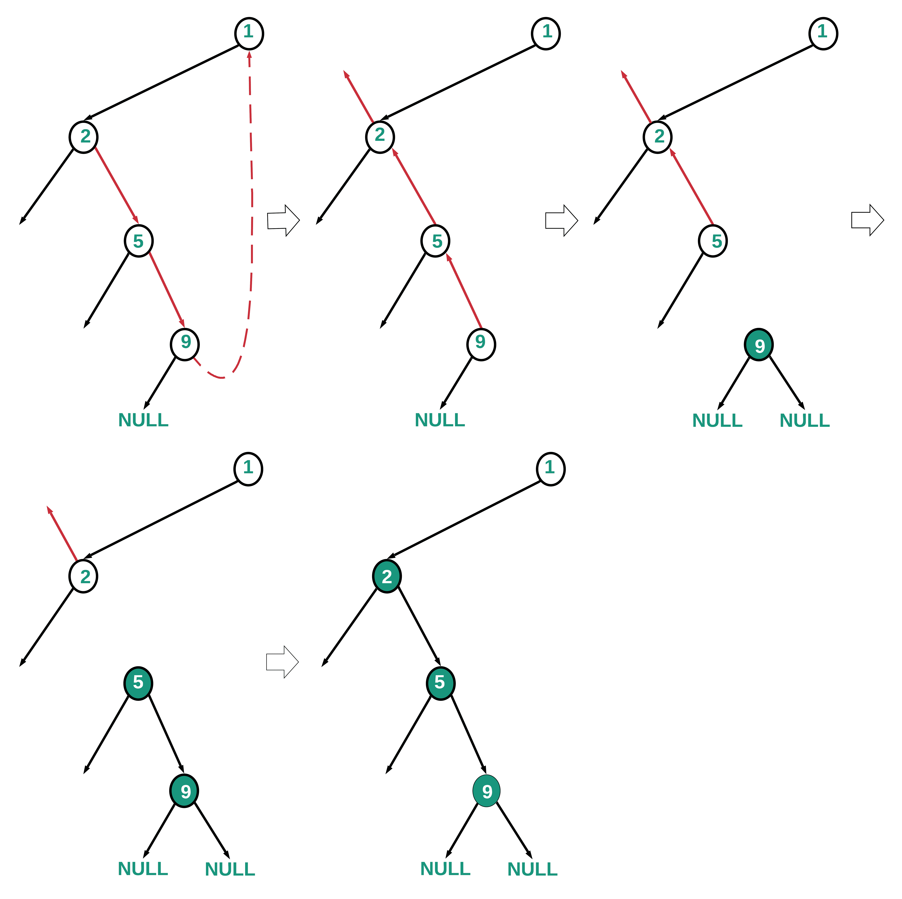
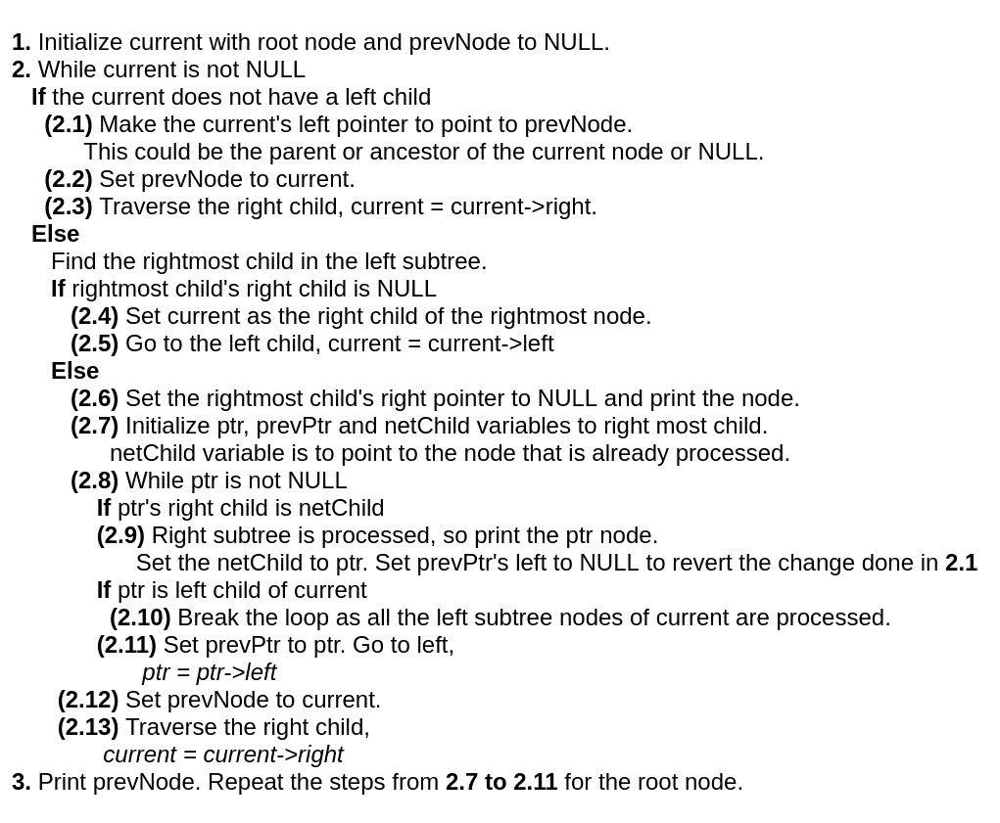
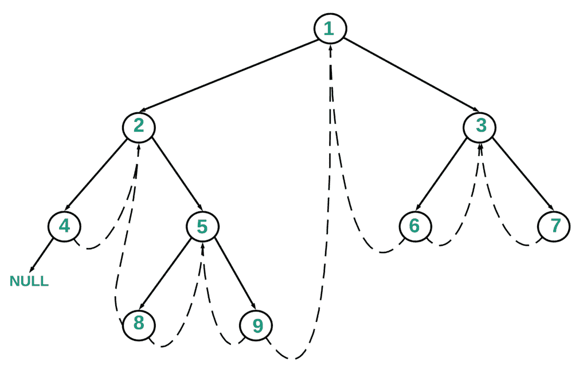
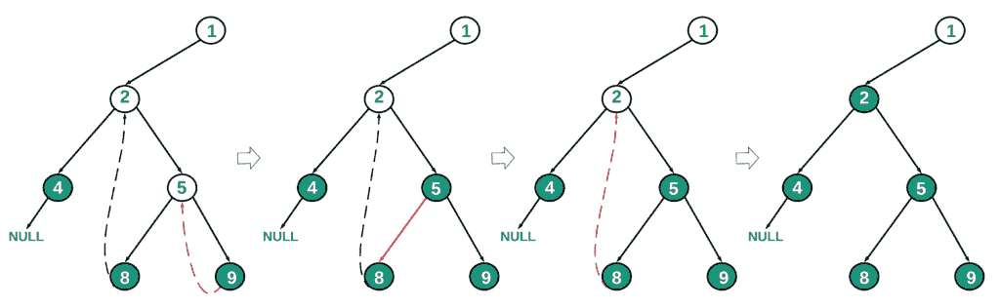

# 利用 O(1)空间进行 O(N)中二叉树的后序遍历

> 原文:[https://www . geeksforgeeks . org/使用-o1-space 遍历二叉树后排序/](https://www.geeksforgeeks.org/post-order-traversal-of-binary-tree-in-on-using-o1-space/)

**先决条件** :- [莫里斯有序遍历](https://www.geeksforgeeks.org/inorder-tree-traversal-without-recursion-and-without-stack/)、[树遍历(有序、前序和后序)](https://www.geeksforgeeks.org/tree-traversals-inorder-preorder-and-postorder/)
给定一个[二叉树](https://www.geeksforgeeks.org/binary-tree-data-structure/)，任务是使用 O(N)时间复杂度和恒定空间打印[后序](https://www.geeksforgeeks.org/tree-traversals-inorder-preorder-and-postorder/)中的元素。

```
Input:   1 
       /   \
     2       3
    / \     / \
   4   5   6   7
  / \
 8   9
Output: 8 9 4 5 2 6 7 3 1

Input:   5 
       /   \
     7       3
    / \     / \
   4   11  13  9
  / \
 8   4
Output: 8 4 4 11 7 13 9 3 5
```

**方法 1:** 使用[莫里斯有序遍历](https://www.geeksforgeeks.org/inorder-tree-traversal-without-recursion-and-without-stack/)

1.  创建一个虚拟节点，并使根成为它的左子节点。
2.  用虚拟节点初始化电流。
3.  当电流不为空时
    *   如果当前没有左子遍历右子，当前=当前->右
    *   否则，
        1.  在左子树中找到最右边的子树。
        2.  如果最右边孩子的右边孩子为空
            *   使当前成为最右边节点的右子节点。
            *   遍历左侧子级，当前=当前->左侧
        3.  否则，
            *   将最右边孩子的右指针设置为空。
            *   从当前的左子级开始，与右子级一起遍历，直到最右边的子级，并反转指针。
            *   通过反转指针并打印元素，从最右边的子节点遍历回当前的左边子节点。
            *   遍历右边的子级，当前=当前->右边

**下图显示了左子树中最右边的子树，指向它的下一个子树。**

[](https://media.geeksforgeeks.org/wp-content/uploads/20200329183937/Binary_Tree_Morris_Traversal2.png)

**下图突出显示了路径 1- > 2- > 5- > 9 以及按照上述算法处理和打印节点的方式。**

[](https://media.geeksforgeeks.org/wp-content/uploads/20200329201824/Binary_Tree_Post_Order_Traversal1.png)

下面是上述方法的实现:

## C++

```
// C++ program to implement
// Post Order traversal
// of Binary Tree in O(N)
// time and O(1) space
#include <bits/stdc++.h>
using namespace std;

class node
{
    public:
    int data;
    node *left, *right;
};

// Helper function that allocates a
// new node with the given data and
// NULL left and right pointers.
node* newNode(int data)
{
    node* temp = new node();
    temp->data = data;
    temp->left = temp->right = NULL;
    return temp;
}

// Postorder traversal without recursion
// and without stack
void postOrderConstSpace(node* root)
{
    if (root == NULL)
            return;

        node* current = newNode(-1);
        node* pre = NULL;
        node* prev = NULL;
        node* succ = NULL;
        node* temp = NULL;

        current->left = root;

    while (current)
    {

        // If left child is null.
        // Move to right child.
        if (current->left == NULL)
        {
            current = current->right;
        }
        else
        {
            pre = current->left;

            // Inorder predecessor
            while (pre->right &&
                pre->right != current)
                pre = pre->right;

            // The connection between current and
            // predecessor is made
            if (pre->right == NULL)
            {

                // Make current as the right
                // child of the right most node
                pre->right = current;

                // Traverse the left child
                current = current->left;
            }
            else
            {
                pre->right = NULL;
                succ = current;
                current = current->left;
                prev = NULL;

                // Traverse along the right
                // subtree to the
                // right-most child
                while (current != NULL)
                {
                    temp = current->right;
                    current->right = prev;
                    prev = current;
                    current = temp;
                }

                // Traverse back
                // to current's left child
                // node
                while (prev != NULL)
                {
                    cout << prev->data << " ";
                    temp = prev->right;
                    prev->right = current;
                    current = prev;
                    prev = temp;
                }

                current = succ;
                current = current->right;
            }
        }
    }
}

// Driver code
int main()
{
   /* Constructed tree is as follows:-
                      1
                   /     \
                  2       3
                 / \     / \
                4   5   6   7
                   / \
                  8   9
      */
    node* root = NULL;

    root = newNode(1);
    root->left = newNode(2);
    root->right = newNode(3);

    root->left->left = newNode(4);
    root->left->right = newNode(5);

    root->right->left = newNode(6);
    root->right->right = newNode(7);

    root->left->right->left = newNode(8);
    root->left->right->right = newNode(9);

    postOrderConstSpace(root);
    return 0;
}

// This code is contributed by Saurav Chaudhary
```

## Java 语言(一种计算机语言，尤用于创建网站)

```
// Java program to implement
// Post Order traversal
// of Binary Tree in O(N)
// time and O(1) space

// Definition of the
// binary tree
class TreeNode {
    public int data;
    public TreeNode left;
    public TreeNode right;
    public TreeNode(int data)
    {
        this.data = data;
    }

    public String toString()
    {
        return data + " ";
    }
}

public class PostOrder {

    TreeNode root;

    // Function to find Post Order
    // Traversal Using Constant space
    void postOrderConstantspace(TreeNode
                                    root)
    {
        if (root == null)
            return;

        TreeNode current
            = new TreeNode(-1),
            pre = null;
        TreeNode prev = null,
                succ = null,
                temp = null;
        current.left = root;

        while (current != null) {

            // Go to the right child
            // if current does not
            // have a left child

            if (current.left == null) {
                current = current.right;
            }

            else {

                // Traverse left child
                pre = current.left;

                // Find the right most child
                // in the left subtree
                while (pre.right != null
                    && pre.right != current)
                    pre = pre.right;

                if (pre.right == null) {

                    // Make current as the right
                    // child of the right most node
                    pre.right = current;

                    // Traverse the left child
                    current = current.left;
                }

                else {
                    pre.right = null;
                    succ = current;
                    current = current.left;
                    prev = null;

                    // Traverse along the right
                    // subtree to the
                    // right-most child

                    while (current != null) {
                        temp = current.right;
                        current.right = prev;
                        prev = current;
                        current = temp;
                    }

                    // Traverse back from
                    // right most child to
                    // current's left child node

                    while (prev != null) {

                        System.out.print(prev);
                        temp = prev.right;
                        prev.right = current;
                        current = prev;
                        prev = temp;
                    }

                    current = succ;
                    current = current.right;
                }
            }
        }
    }

    // Driver Code
    public static void main(String[] args)
    {
        /* Constructed tree is as follows:-
                      1
                    /   \
                   2     3
                  / \    / \
                 4   5   6  7
                    / \
                    8  9
        */
        PostOrder tree = new PostOrder();
        tree.root = new TreeNode(1);
        tree.root.left = new TreeNode(2);
        tree.root.right = new TreeNode(3);
        tree.root.left.left = new TreeNode(4);
        tree.root.left.right
            = new TreeNode(5);
        tree.root.right.left
            = new TreeNode(6);
        tree.root.right.right
            = new TreeNode(7);
        tree.root.left.right.left
            = new TreeNode(8);
        tree.root.left.right.right
            = new TreeNode(9);

        tree.postOrderConstantspace(
            tree.root);
    }
}
```

## 蟒蛇 3

```
# Python3 program to implement
# Post Order traversal
# of Binary Tree in O(N)
# time and O(1) space
class node:

    def __init__(self, data):

        self.data = data
        self.left = None
        self.right = None

# Helper function that allocates a
# new node with the given data and
# None left and right pointers.
def newNode(data):

    temp = node(data)
    return temp

# Postorder traversal without recursion
# and without stack
def postOrderConstSpace(root):

    if (root == None):
        return

    current = newNode(-1)
    pre = None
    prev = None
    succ = None
    temp = None

    current.left = root

    while (current):

        # If left child is None.
        # Move to right child.
        if (current.left == None):
            current = current.right
        else:
            pre = current.left

            # Inorder predecessor
            while (pre.right and
                   pre.right != current):
                pre = pre.right

            # The connection between current
            # and predecessor is made
            if (pre.right == None):

                # Make current as the right
                # child of the right most node
                pre.right = current

                # Traverse the left child
                current = current.left

            else:

                pre.right = None
                succ = current
                current = current.left
                prev = None

                # Traverse along the right
                # subtree to the
                # right-most child
                while (current != None):
                    temp = current.right
                    current.right = prev
                    prev = current
                    current = temp

                # Traverse back
                # to current's left child
                # node
                while (prev != None):
                    print(prev.data, end = ' ')
                    temp = prev.right
                    prev.right = current
                    current = prev
                    prev = temp

                current = succ
                current = current.right

# Driver code
if __name__=='__main__':

    ''' Constructed tree is as follows:-
                       1
                    /     \
                   2      3
                  / \     / \
                 4   5  6   7
                    / \
                   8   9
        '''
    root = None

    root = newNode(1)
    root.left = newNode(2)
    root.right = newNode(3)

    root.left.left = newNode(4)
    root.left.right = newNode(5)

    root.right.left = newNode(6)
    root.right.right = newNode(7)

    root.left.right.left = newNode(8)
    root.left.right.right = newNode(9)

    postOrderConstSpace(root)

# This code is contributed by pratham76
```

## C#

```
// C# program to implement
// Post Order traversal
// of Binary Tree in O(N)
// time and O(1) space
using System;

// Definition of the
// binary tree
public class  TreeNode
{
    public int data;
    public TreeNode left, right;

    public TreeNode(int item)
    {
        data = item;
        left = right = null;
    }
}

class PostOrder{

public TreeNode root;

// Function to find Post Order
// Traversal Using Constant space
void postOrderConstantspace(TreeNode root)
{
    if (root == null)
        return;

    TreeNode current = new TreeNode(-1), pre = null;
    TreeNode prev = null,
             succ = null,
             temp = null;

    current.left = root;

    while (current != null)
    {

        // Go to the right child
        // if current does not
        // have a left child
        if (current.left == null)
        {
            current = current.right;
        }

        else
        {

            // Traverse left child
            pre = current.left;

            // Find the right most child
            // in the left subtree
            while (pre.right != null &&
                   pre.right != current)
                pre = pre.right;

            if (pre.right == null)
            {

                // Make current as the right
                // child of the right most node
                pre.right = current;

                // Traverse the left child
                current = current.left;
            }
            else
            {
                pre.right = null;
                succ = current;
                current = current.left;
                prev = null;

                // Traverse along the right
                // subtree to the
                // right-most child
                while (current != null)
                {
                    temp = current.right;
                    current.right = prev;
                    prev = current;
                    current = temp;
                }

                // Traverse back from
                // right most child to
                // current's left child node
                while (prev != null)
                {
                   Console.Write(prev.data + " ");
                    temp = prev.right;
                    prev.right = current;
                    current = prev;
                    prev = temp;
                }
                current = succ;
                current = current.right;
            }
        }
    }
}

// Driver code
static public void Main ()
{

    /* Constructed tree is as follows:-
                      1
                   /     \
                  2       3
                 / \     / \
                4   5   6   7
                   / \
                  8   9
      */
    PostOrder tree = new PostOrder();
    tree.root = new TreeNode(1);
    tree.root.left = new TreeNode(2);
    tree.root.right = new TreeNode(3);
    tree.root.left.left = new TreeNode(4);
    tree.root.left.right = new TreeNode(5);
    tree.root.right.left = new TreeNode(6);
    tree.root.right.right = new TreeNode(7);
    tree.root.left.right.left = new TreeNode(8);
    tree.root.left.right.right = new TreeNode(9);

    tree.postOrderConstantspace(tree.root);
}
}

// This code is contributed by offbeat
```

## java 描述语言

```
<script>

// Javascript program to implement
// Post Order traversal
// of Binary Tree in O(N)
// time and O(1) space

// Definition of the
// binary tree
class TreeNode
{

    constructor(item)
    {
        this.data = item;
        this.left = null;
        this.right = null;
    }
}

var root;

// Function to find Post Order
// Traversal Using Constant space
function postOrderConstantspace(root)
{
    if (root == null)
        return;

    var current = new TreeNode(-1), pre = null;
    var prev = null,
             succ = null,
             temp = null;

    current.left = root;

    while (current != null)
    {

        // Go to the right child
        // if current does not
        // have a left child
        if (current.left == null)
        {
            current = current.right;
        }

        else
        {

            // Traverse left child
            pre = current.left;

            // Find the right most child
            // in the left subtree
            while (pre.right != null &&
                   pre.right != current)
                pre = pre.right;

            if (pre.right == null)
            {

                // Make current as the right
                // child of the right most node
                pre.right = current;

                // Traverse the left child
                current = current.left;
            }
            else
            {
                pre.right = null;
                succ = current;
                current = current.left;
                prev = null;

                // Traverse along the right
                // subtree to the
                // right-most child
                while (current != null)
                {
                    temp = current.right;
                    current.right = prev;
                    prev = current;
                    current = temp;
                }

                // Traverse back from
                // right most child to
                // current's left child node
                while (prev != null)
                {
                   document.write(prev.data + " ");
                    temp = prev.right;
                    prev.right = current;
                    current = prev;
                    prev = temp;
                }
                current = succ;
                current = current.right;
            }
        }
    }
}

// Driver code
/* Constructed tree is as follows:-
                  1
               /     \
              2       3
             / \     / \
            4   5   6   7
               / \
              8   9
  */
var tree = new TreeNode();
tree.root = new TreeNode(1);
tree.root.left = new TreeNode(2);
tree.root.right = new TreeNode(3);
tree.root.left.left = new TreeNode(4);
tree.root.left.right = new TreeNode(5);
tree.root.right.left = new TreeNode(6);
tree.root.right.right = new TreeNode(7);
tree.root.left.right.left = new TreeNode(8);
tree.root.left.right.right = new TreeNode(9);
postOrderConstantspace(tree.root);

</script>
```

**Output**

```
4 8 9 5 2 6 7 3 1
```

***时间复杂度:**O(N)*
T5**辅助空间:** O(1)

**方法 2:** 在方法 1 中，我们遍历一条路径，反向引用，在通过再次反向引用来恢复引用时打印节点。在方法 2 中，我们不是反转路径和恢复结构，而是使用当前节点的左子树从当前节点遍历父节点。这可能会更快，取决于树的结构，例如在一个向右倾斜的树。

下面的算法和图表提供了该方法的细节。



下面是概念图，显示了如何使用左右子引用来回遍历。



下图突出显示了路径 1->2->5->9 以及按照上述算法处理和打印节点的方式。



下面是上述方法的实现:

## C++

```
// C++ Program to implement the above approach
#include <bits/stdc++.h>
using namespace std;

struct TreeNode {
    TreeNode* left;
    TreeNode* right;
    int data;

    TreeNode(int data)
    {
        this->data = data;
        this->left = nullptr;
        this->right = nullptr;
    }
};

TreeNode* root;

// Function to Calculate Post
// Order Traversal Using
// Constant Space
static void postOrderConstantspace(TreeNode* root)
{
  if (root == nullptr)
    return;

  TreeNode* current = nullptr;
  TreeNode* prevNode = nullptr;
  TreeNode* pre = nullptr;
  TreeNode* ptr = nullptr;
  TreeNode* netChild = nullptr;
  TreeNode* prevPtr = nullptr;

  current = root;

  while (current != nullptr)
  {
    if (current->left == nullptr)
    {
      current->left = prevNode;

      // Set prevNode to current
      prevNode = current;
      current = current->right;
    }
    else
    {
      pre = current->left;

      // Find the right most child
      // in the left subtree
      while (pre->right != nullptr &&
             pre->right != current)
        pre = pre->right;

      if (pre->right == nullptr)
      {
        pre->right = current;
        current = current->left;
      }
      else
      {
        // Set the right most
        // child's right pointer
        // to NULL
        pre->right = nullptr;
        cout << pre->data << " ";
        ptr = pre;
        netChild = pre;
        prevPtr = pre;

        while (ptr != nullptr)
        {
          if (ptr->right == netChild)
          {
            cout << ptr->data << " ";
            netChild = ptr;
            prevPtr->left = nullptr;
          }

          if (ptr == current->left)
            break;

          // Break the loop
          // all the left subtree
          // nodes of current
          // processed
          prevPtr = ptr;
          ptr = ptr->left;
        }

        prevNode = current;
        current = current->right;
      }
    }
  }

  cout << prevNode->data << " ";

  // Last path traversal
  // that includes the root.
  ptr = prevNode;
  netChild = prevNode;
  prevPtr = prevNode;

  while (ptr != nullptr)
  {
    if (ptr->right == netChild)
    {
      cout << ptr->data << " ";
      netChild = ptr;
      prevPtr->left = nullptr;
    }
    if (ptr == root)
      break;

    prevPtr = ptr;
    ptr = ptr->left;
  }
}

int main()
{
    /* Constructed tree is as follows:-
                      1
                   /     \
                  2       3
                 / \     / \
                4   5   6   7
                   / \
                  8   9
      */
  root = new TreeNode(1);
  root->left = new TreeNode(2);
  root->right = new TreeNode(3);
  root->left->left = new TreeNode(4);
  root->left->right = new TreeNode(5);
  root->right->left = new TreeNode(6);
  root->right->right = new TreeNode(7);
  root->left->right->left = new TreeNode(8);
  root->left->right->right = new TreeNode(9);
  postOrderConstantspace(root);

    return 0;
}

// This code is contributed by mukesh07.
```

## Java 语言(一种计算机语言，尤用于创建网站)

```
// Java Program to implement
// the above approach
class TreeNode {
    public int data;
    public TreeNode left;
    public TreeNode right;

    public TreeNode(int data)
    {
        this.data = data;
    }

    public String toString()
    {
        return data + " ";
    }
}

public class PostOrder {
    TreeNode root;

    // Function to Calculate Post
    // Order Traversal
    // Using Constant Space
    void postOrderConstantspace(TreeNode root)
    {
        if (root == null)
            return;

        TreeNode current = null;
        TreeNode prevNode = null;
        TreeNode pre = null;
        TreeNode ptr = null;
        TreeNode netChild = null;
        TreeNode prevPtr = null;

        current = root;
        while (current != null) {
            if (current.left == null) {
                current.left = prevNode;
                // Set prevNode to current
                prevNode = current;
                current = current.right;
            }
            else {
                pre = current.left;
                // Find the right most child
                // in the left subtree
                while (pre.right != null
                    && pre.right != current)
                    pre = pre.right;

                if (pre.right == null) {
                    pre.right = current;
                    current = current.left;
                }
                else {
                    // Set the right most
                    // child's right pointer
                    // to NULL
                    pre.right = null;
                    System.out.print(pre);

                    ptr = pre;
                    netChild = pre;
                    prevPtr = pre;
                    while (ptr != null) {
                        if (ptr.right == netChild) {
                            System.out.print(ptr);
                            netChild = ptr;
                            prevPtr.left = null;
                        }

                        if (ptr == current.left)
                            break;
                        // Break the loop
                        // all the left subtree
                        // nodes of current
                        // processed

                        prevPtr = ptr;
                        ptr = ptr.left;
                    }

                    prevNode = current;
                    current = current.right;
                }
            }
        }

        System.out.print(prevNode);

        // Last path traversal
        // that includes the root.
        ptr = prevNode;
        netChild = prevNode;
        prevPtr = prevNode;
        while (ptr != null) {
            if (ptr.right == netChild) {
                System.out.print(ptr);
                netChild = ptr;
                prevPtr.left = null;
            }
            if (ptr == root)
                break;

            prevPtr = ptr;
            ptr = ptr.left;
        }
    }

    // Main Function
    public static void main(String[] args)
    {
        /* Constructed tree is as follows:-
                      1
                   /     \
                  2       3
                 / \     / \
                4   5   6   7
                   / \
                  8   9
      */
        PostOrder tree = new PostOrder();
        tree.root = new TreeNode(1);
        tree.root.left = new TreeNode(2);
        tree.root.right = new TreeNode(3);
        tree.root.left.left
            = new TreeNode(4);
        tree.root.left.right
            = new TreeNode(5);
        tree.root.right.left
            = new TreeNode(6);
        tree.root.right.right
            = new TreeNode(7);
        tree.root.left.right.left
            = new TreeNode(8);
        tree.root.left.right.right
            = new TreeNode(9);

        tree.postOrderConstantspace(
            tree.root);
    }
}
```

## 蟒蛇 3

```
# Python3 Program to implement the above approach
class TreeNode:
    def __init__(self, data):
        self.data = data
        self.left = None
        self.right = None

# Function to Calculate Post
# Order Traversal Using
# Constant Space
def postOrderConstantspace(root):
  if root == None:
    return

  current = None
  prevNode = None
  pre = None
  ptr = None
  netChild = None
  prevPtr = None

  current = root

  while current != None:
    if current.left == None:
      current.left = prevNode

      # Set prevNode to current
      prevNode = current
      current = current.right
    else:
      pre = current.left

      # Find the right most child
      # in the left subtree
      while pre.right != None and pre.right != current:
        pre = pre.right

      if pre.right == None:
        pre.right = current
        current = current.left
      else:
        # Set the right most
        # child's right pointer
        # to NULL
        pre.right = None
        print(pre.data, end = " ")
        ptr = pre
        netChild = pre
        prevPtr = pre

        while ptr != None:
          if ptr.right == netChild:
            print(ptr.data, end = " ")
            netChild = ptr
            prevPtr.left = None

          if ptr == current.left:
            break

          # Break the loop
          # all the left subtree
          # nodes of current
          # processed
          prevPtr = ptr
          ptr = ptr.left

        prevNode = current
        current = current.right

  print(prevNode.data, end = " ")

  # Last path traversal
  # that includes the root.
  ptr = prevNode
  netChild = prevNode
  prevPtr = prevNode

  while ptr != None:
    if ptr.right == netChild:
      print(ptr.data, end = " ")
      netChild = ptr
      prevPtr.left = None

    if (ptr == root):
      break

    prevPtr = ptr
    ptr = ptr.left

""" Constructed tree is as follows:-
                  1
               /     \
              2       3
             / \     / \
            4   5   6   7
               / \
              8   9
"""
root = TreeNode(1)
root.left = TreeNode(2)
root.right = TreeNode(3)
root.left.left = TreeNode(4)
root.left.right = TreeNode(5)
root.right.left = TreeNode(6)
root.right.right = TreeNode(7)
root.left.right.left = TreeNode(8)
root.left.right.right = TreeNode(9)
postOrderConstantspace(root)

# This code is contributed by divyeshrabadiya07.
```

## C#

```
// C# Program to implement
// the above approach
using System;
class TreeNode{

public int data;
public TreeNode left;
public TreeNode right;

public TreeNode(int data)
{
  this.data = data;
}

public string toString()
{
  return data + " ";
}
}

class PostOrder{

TreeNode root;

// Function to Calculate Post
// Order Traversal Using
// Constant Space
void postOrderConstantspace(TreeNode root)
{
  if (root == null)
    return;

  TreeNode current = null;
  TreeNode prevNode = null;
  TreeNode pre = null;
  TreeNode ptr = null;
  TreeNode netChild = null;
  TreeNode prevPtr = null;

  current = root;

  while (current != null)
  {
    if (current.left == null)
    {
      current.left = prevNode;

      // Set prevNode to current
      prevNode = current;
      current = current.right;
    }
    else
    {
      pre = current.left;

      // Find the right most child
      // in the left subtree
      while (pre.right != null &&
             pre.right != current)
        pre = pre.right;

      if (pre.right == null)
      {
        pre.right = current;
        current = current.left;
      }
      else
      {
        // Set the right most
        // child's right pointer
        // to NULL
        pre.right = null;
        Console.Write(pre.data + " ");
        ptr = pre;
        netChild = pre;
        prevPtr = pre;

        while (ptr != null)
        {
          if (ptr.right == netChild)
          {
            Console.Write(ptr.data + " ");
            netChild = ptr;
            prevPtr.left = null;
          }

          if (ptr == current.left)
            break;

          // Break the loop
          // all the left subtree
          // nodes of current
          // processed
          prevPtr = ptr;
          ptr = ptr.left;
        }

        prevNode = current;
        current = current.right;
      }
    }
  }

  Console.Write(prevNode.data + " ");

  // Last path traversal
  // that includes the root.
  ptr = prevNode;
  netChild = prevNode;
  prevPtr = prevNode;

  while (ptr != null)
  {
    if (ptr.right == netChild)
    {
      Console.Write(ptr.data + " ");
      netChild = ptr;
      prevPtr.left = null;
    }
    if (ptr == root)
      break;

    prevPtr = ptr;
    ptr = ptr.left;
  }
}

// Driver code
public static void Main(string[] args)
{
  /* Constructed tree is as follows:-
                      1
                   /     \
                  2       3
                 / \     / \
                4   5   6   7
                   / \
                  8   9
      */
  PostOrder tree = new PostOrder();
  tree.root = new TreeNode(1);
  tree.root.left = new TreeNode(2);
  tree.root.right = new TreeNode(3);
  tree.root.left.left = new TreeNode(4);
  tree.root.left.right = new TreeNode(5);
  tree.root.right.left = new TreeNode(6);
  tree.root.right.right = new TreeNode(7);
  tree.root.left.right.left = new TreeNode(8);
  tree.root.left.right.right = new TreeNode(9);
  tree.postOrderConstantspace(tree.root);
}
}

// This code is contributed by Rutvik_56
```

## java 描述语言

```
<script>
    // Javascript Program to implement the above approach

    class TreeNode
    {
        constructor(data) {
           this.left = null;
           this.right = null;
           this.data = data;
        }
    }

    let root;

    // Function to Calculate Post
    // Order Traversal Using
    // Constant Space
    function postOrderConstantspace(root)
    {
      if (root == null)
        return;

      let current = null;
      let prevNode = null;
      let pre = null;
      let ptr = null;
      let netChild = null;
      let prevPtr = null;

      current = root;

      while (current != null)
      {
        if (current.left == null)
        {
          current.left = prevNode;

          // Set prevNode to current
          prevNode = current;
          current = current.right;
        }
        else
        {
          pre = current.left;

          // Find the right most child
          // in the left subtree
          while (pre.right != null &&
                 pre.right != current)
            pre = pre.right;

          if (pre.right == null)
          {
            pre.right = current;
            current = current.left;
          }
          else
          {
            // Set the right most
            // child's right pointer
            // to NULL
            pre.right = null;
            document.write(pre.data + " ");
            ptr = pre;
            netChild = pre;
            prevPtr = pre;

            while (ptr != null)
            {
              if (ptr.right == netChild)
              {
                document.write(ptr.data + " ");
                netChild = ptr;
                prevPtr.left = null;
              }

              if (ptr == current.left)
                break;

              // Break the loop
              // all the left subtree
              // nodes of current
              // processed
              prevPtr = ptr;
              ptr = ptr.left;
            }

            prevNode = current;
            current = current.right;
          }
        }
      }

      document.write(prevNode.data + " ");

      // Last path traversal
      // that includes the root.
      ptr = prevNode;
      netChild = prevNode;
      prevPtr = prevNode;

      while (ptr != null)
      {
        if (ptr.right == netChild)
        {
          document.write(ptr.data + " ");
          netChild = ptr;
          prevPtr.left = null;
        }
        if (ptr == root)
          break;

        prevPtr = ptr;
        ptr = ptr.left;
      }
    }

    /* Constructed tree is as follows:-
                      1
                   /     \
                  2       3
                 / \     / \
                4   5   6   7
                   / \
                  8   9
    */
    root = new TreeNode(1);
    root.left = new TreeNode(2);
    root.right = new TreeNode(3);
    root.left.left = new TreeNode(4);
    root.left.right = new TreeNode(5);
    root.right.left = new TreeNode(6);
    root.right.right = new TreeNode(7);
    root.left.right.left = new TreeNode(8);
    root.left.right.right = new TreeNode(9);
    postOrderConstantspace(root);

    // This code is contributed by divyesh072019.
</script>
```

**Output**

```
4 8 9 5 2 6 7 3 1 
```

***时间复杂度:** O(N)*
***辅助空间:** O(1)*