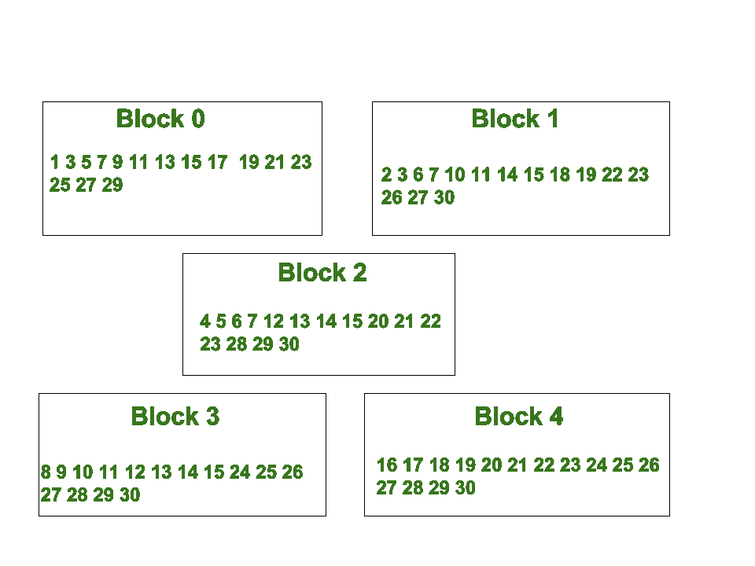

# 2 的幂与所需的和

> 原文:[https://www.geeksforgeeks.org/powers-2-required-sum/](https://www.geeksforgeeks.org/powers-2-required-sum/)

给定一个整数 N，任务是找到数，当这些数被提升到 2 的幂，最后相加，得到整数 N

示例:

```
Input : 71307
Output : 0, 1, 3, 7, 9, 10, 12, 16
Explanation :
71307 = 2^0 + 2^1 + 2^3 + 2^7 +
        2^9 + 2^10 + 2^12 + 2^16

Input : 1213
Output : 0, 2, 3, 4, 5, 7, 10
Explanation : 
1213 = 2^0 + 2^2 + 2^3 + 2^4 + 
       2^5 + 2^7 + 2^10
```

**逼近:**
每个数都可以用 2 的幂来描述。
例:29 = 2^0 + 2^2 + 2^3 + 2^4.
2^0(2 的指数是' 0 ')0
2^2(2 的指数是' 2 ')1
2^3(2 的指数是' 3 ')3
2^4(2 的指数是' 4') 4
通过将给定数的余数除以 2 直到大于 0 时推到向量，将每个数转换为其二进制等价数。现在，迭代它的二进制等价物，只要有设置位，就打印第 I 个值(迭代号)。

**应用:**
汉明码:汉明码是一种能够检测并纠正一位错误的纠错码。这种模式也用于[汉明码错误检测](https://en.wikipedia.org/wiki/Hamming_code)中，奇偶校验位在 LSB(最低有效位)的基础上存储数字的异或，其中数字以块的形式分配，您需要找到给定数字的 2 的幂和存在的块。

下图显示了带有给定数字的块。



**以下是上述方法的实施:**

## C++

```
// CPP program to find the
// blocks for given number.
#include <bits/stdc++.h>
using namespace std;

void block(long int x)
{
    vector<long int> v;

    // Converting the decimal number
    // into its binary equivalent.
    cout << "Blocks for " << x << " : ";
    while (x > 0)
    {
        v.push_back(x % 2);
        x = x / 2;
    }

    // Displaying the output when
    // the bit is '1' in binary
    // equivalent of number.
    for (int i = 0; i < v.size(); i++)
    {
        if (v[i] == 1)
        {
            cout << i;
            if (i != v.size() - 1)
                cout << ", ";
        }
    }
    cout << endl;
}

// Driver Function
int main()
{
    block(71307);
    block(1213);
    block(29);
    block(100);
    return 0;
}
```

## Java 语言(一种计算机语言，尤用于创建网站)

```
// Java program to find the
// blocks for given number.
import java.util.*;

class GFG {

static void block(long x)
{
    ArrayList<Integer> v = new ArrayList<Integer>();

    // Convert decimal number to
    // its binary equivalent
    System.out.print("Blocks for "+x+" : ");
    while (x > 0)
    {
        v.add((int)x % 2);
        x = x / 2;
    }

    // Displaying the output when
    // the bit is '1' in binary
    // equivalent of number.
    for (int i = 0; i < v.size(); i++)
    {
        if (v.get(i) == 1)
        {
        System.out.print(i);
            if (i != v.size() - 1)
            System.out.print( ", ");
        }
    }
System.out.println();
}

// Driver Code
public static void main(String args[])
{
    block(71307);
    block(1213);
    block(29);
    block(100);
}
}

// This code is contributed by Arnab Kundu.
```

## 蟒蛇 3

```
# Python3 program to find the
# blocks for given number.
def block(x):

    v = []

    # Converting the decimal number
    # into its binary equivalent.
    print ("Blocks for %d : " %x, end="")
    while (x > 0):
        v.append(int(x % 2))
        x = int(x / 2)

    # Displaying the output when
    # the bit is '1' in binary
    # equivalent of number.
    for i in range(0, len(v)):
        if (v[i] == 1):
            print (i, end = "")
            if (i != len(v) - 1):
                print (", ", end = "")
    print ("\n")

block(71307)
block(1213)
block(29)
block(100)

# This code is contributed by Manish
# Shaw (manishshaw1)
```

## C#

```
// C# program to find the
// blocks for given number.
using System;
using System.Collections.Generic;

class GFG {

    static void block(long x)
    {
        List<int> v = new List<int>();

        // Convert decimal number to
        // its binary equivalent
        Console.Write("Blocks for " + x + " : ");

        while (x > 0)
        {
            v.Add((int)x % 2);
            x = x / 2;
        }

        // Displaying the output when
        // the bit is '1' in binary
        // equivalent of number.
        for (int i = 0; i < v.Count; i++)
        {
            if (v[i] == 1)
            {
                Console.Write(i);

                if (i != v.Count - 1)
                    Console.Write(", ");
            }
        }

        Console.WriteLine();
    }

    // Driver Code here
    public static void Main()
    {
        block(71307);
        block(1213);
        block(29);
        block(100);
    }
}

// This code is contributed by Ajit.
```

## 服务器端编程语言（Professional Hypertext Preprocessor 的缩写）

```
<?php
// PHP program to find the
// blocks for given number.

function block($x)
{
    $v = array();

    // Convert decimal number to
    // its binary equivalent
    echo 'Blocks for ' .$x.' : ';

    while ($x > 0)
    {
        array_push($v,intval($x % 2));
        $x = intval($x / 2);
    }

    // Displaying the output when
    // the bit is '1' in binary
    // equivalent of number.
    for ($i = 0; $i < sizeof($v); $i++)
    {
        if ($v[$i] == 1)
        {
            print $i;

            if ($i != sizeof($v) - 1)
                echo ', ';
        }
    }

    echo "\n";
}

// Driver Code
block(71307);
block(1213);
block(29);
block(100);

// This code is contributed
// by Manish Shaw (manishshaw1)
?>
```

## java 描述语言

```
<script>

// Javascript program to find the
// blocks for given number.
function block(x)
{
    let v = [];

    // Convert decimal number to
    // its binary equivalent
    document.write("Blocks for " + x + " : ");

    while (x > 0)
    {
        v.push(x % 2);
        x = parseInt(x / 2, 10);
    }

    // Displaying the output when
    // the bit is '1' in binary
    // equivalent of number.
    for(let i = 0; i < v.length; i++)
    {
        if (v[i] == 1)
        {
            document.write(i);

            if (i != v.length - 1)
                document.write(", ");
        }
    }
    document.write("</br>");
}

// Driver code
block(71307);
block(1213);
block(29);
block(100);

// This code is contributed by mukesh07

</script>
```

**Output:** 

```
Blocks for 71307 : 0, 1, 3, 7, 9, 10, 12, 16
Blocks for 1213 : 0, 2, 3, 4, 5, 7, 10
Blocks for 29 : 0, 2, 3, 4
Blocks for 100 : 2, 5, 6
```