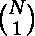
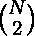
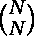
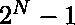

# 两个子序列的幂

> 原文:[https://www.geeksforgeeks.org/powers-two-subsequences/](https://www.geeksforgeeks.org/powers-two-subsequences/)

给定一个大小为 N 的数组，求子序列的个数，当相乘时得到一个 2 的幂。

示例:

```
Input : A[] = {1, 2, 3}
Output : 3
Explanation: There are 3 such subsequences {1}, 
{2} and {1, 2}.

Input : A[] = {3, 5, 9}
Output : 0
Explanation: There is no such subsequence.

```

从 2 的幂的性质可以看出，它只能表示为本身是 2 的幂的数的乘积。首先，我们遍历数组，计算数组中 2 的幂的总数。假设数组中有 N 个这样的数字。我们可以选择 1 或 2 或 3 或…或 N 个这样的数来得到一个子序列，当相乘时得到一个 2 的幂的数。
因此，要求的答案是:

**答案=++…+T4】**

答案= 

以下是上述想法的实现。

## C++

```
// CPP program to count number of subsequences
// which when multiplied result in a power of 2.
#include <bits/stdc++.h>
using namespace std;

// Function to check if num is power of 
// two or not.
bool isPowerOf2(int num)
{
    if (num == 0)
        return false;

    if (num == 1)
        return true;

    if (num & (num - 1))
        return false;

    return true;
}

// counting all subsequences whose product
// is power of 2.
int countSubsequence(int a[], int size)
{
    int count = 0;
    for (int i = 0; i < size; i++) 
        if (isPowerOf2(a[i]))
            count++;
    return (int)(pow(2, count)) - 1;
}

// Driver code
int main()
{
    int a[] = { 1, 2, 3 };
    cout << countSubsequence(a, 3) << endl;
    int b[] = { 3, 5, 9 };
    cout << countSubsequence(b, 3) << endl;
    return 0;
}
```

## Java 语言(一种计算机语言，尤用于创建网站)

```
// JAVA program to count number of 
// subsequences which when multiplied 
// result in a power of 2.
import java.io.*;
import java.math.*;

class GFG {

    // Function to check if num is 
    // power of two or not.
    static boolean isPowerOf2(int num)
    {
        if (num == 0)
            return false;

        if (num == 1)
            return true;

        if (num / 2 == (num - 1) / 2)
            return false;

        return true;
    }

    // counting all subsequences whose
    // product is power of 2.
    static int countSubsequence(int a[], 
                                int size)
    {
        int count = 0;
        for (int i = 0; i < size; i++) 
            if (isPowerOf2(a[i]))
                count++;
        return (int)(Math.pow(2, count)) - 1;
    }

    // Driver 
    public static void main(String args[])
    {
        int a[] = { 1, 2, 3 };
        System.out.println(countSubsequence(a, 3));
        int b[] = { 3, 5, 9 };
        System.out.println(countSubsequence(b, 3)) ;
    }
}

/*This code is contributed by Nikita Tiwari.*/
```

## 计算机编程语言

```
# Python program to count number of 
# subsequences which when multiplied
# result in a power of 2.

# Function to check if num is power
# of two or not.
def isPowerOf2(num) :
    if (num == 0) :
        return False

    if (num == 1) :
        return True

    if (num & (num - 1)) :
        return False

    return True

# counting all subsequences whose
# product is power of 2.
def countSubsequence(a, size) :
    count = 0
    for i in range(0,size) :
        if (isPowerOf2(a[i])) :
            count = count + 1
    return (int)(pow(2, count)) - 1

# Driver code
a = [ 1, 2, 3 ];
print countSubsequence(a, 3)
b = [ 3, 5, 9 ]
print countSubsequence(b, 3)

# This code is contributed by Nikita Tiwari
```

## C#

```
// C# program to count number of 
// subsequences which when multiplied 
// result in a power of 2.
using System;

class GFG {

    // Function to check if num is 
    // power of two or not.
    static bool isPowerOf2(int num)
    {
        if (num == 0)
            return false;

        if (num == 1)
            return true;

        if (num / 2 == (num - 1) / 2)
            return false;

        return true;
    }

    // counting all subsequences whose
    // product is power of 2.
    static int countSubsequence(int []a, 
                                int size)
    {
        int count = 0;
        for (int i = 0; i < size; i++) 
            if (isPowerOf2(a[i]))
                count++;
        return (int)(Math.Pow(2, count)) - 1;
    }

    // Driver  code
    public static void Main()
    {
        int []a = { 1, 2, 3 };
        Console.WriteLine(countSubsequence(a, 3));
        int []b = { 3, 5, 9 };
        Console.WriteLine(countSubsequence(b, 3)) ;
    }
}

/*This code is contributed by vt_m.*/
```

## 服务器端编程语言（Professional Hypertext Preprocessor 的缩写）

```
<?php
// PHP program to count number
// of subsequences which when 
// multiplied result in a power
// of 2.

// Function to check if num 
// is power of  two or not.
function isPowerOf2( $num)
{
    if ($num == 0)
        return false;

    if ($num == 1)
        return true;

    if ($num & ($num - 1))
        return false;

    return true;
}

// counting all subsequences whose 
// product is power of 2.
function countSubsequence( $a, $size)
{
    $count = 0;
    for($i = 0; $i < $size; $i++) 
        if (isPowerOf2($a[$i]))
            $count++;
    return pow(2, $count) - 1;
}

    // Driver Code
    $a = array(1, 2, 3);
    echo countSubsequence($a, 3) ,"\n";
    $b = array(3, 5, 9);
    echo countSubsequence($b, 3) ;

// This code is contributed by anuj_67.
?>
```

## java 描述语言

```
<script>
    // Javascript program to count number of 
    // subsequences which when multiplied 
    // result in a power of 2.

    // Function to check if num is 
    // power of two or not.
    function isPowerOf2(num)
    {
        if (num == 0)
            return false;

        if (num == 1)
            return true;

        if (parseInt(num / 2, 10) == parseInt((num - 1) / 2, 10))
            return false;

        return true;
    }

    // counting all subsequences whose
    // product is power of 2.
    function countSubsequence(a, size)
    {
        let count = 0;
        for (let i = 0; i < size; i++) 
            if (isPowerOf2(a[i]))
                count++;
        return (Math.pow(2, count)) - 1;
    }

    let a = [ 1, 2, 3 ];
    document.write(countSubsequence(a, 3) + "</br>");
    let b = [ 3, 5, 9 ];
    document.write(countSubsequence(b, 3)) ;

</script>
```

Output:

```
3
0

```

本文由 [**ShivamKD**](https://www.linkedin.com/in/shivam-kumar-dubey-711564126/) 供稿。如果你喜欢 GeeksforGeeks 并想投稿，你也可以使用[contribute.geeksforgeeks.org](http://www.contribute.geeksforgeeks.org)写一篇文章或者把你的文章邮寄到 contribute@geeksforgeeks.org。看到你的文章出现在极客博客主页上，帮助其他极客。

如果你发现任何不正确的地方，或者你想分享更多关于上面讨论的话题的信息，请写评论。