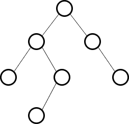
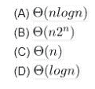
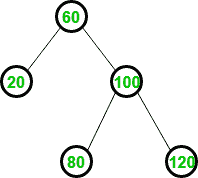
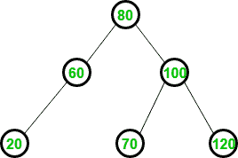
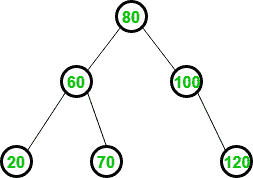
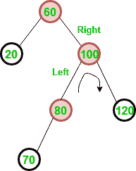
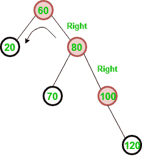

# 身高平衡/AVL 树练习题

> 原文:[https://www . geesforgeks . org/practice-questions-height-balancedvl-tree/](https://www.geeksforgeeks.org/practice-questions-height-balancedavl-tree/)

AVL 树是二叉查找树树，它有一个附加的性质，即任意节点的左子树和右子树的高度差不能大于 1。以下是关于 [AVL 树](https://www.geeksforgeeks.org/tag/avl-tree/)的一些要点:

*   如果 AVL 树中有 n 个节点，则 AVL 树的最小高度为地板(log <sub>2</sub> n)。
*   如果 AVL 树中有 n 个节点，最大高度不能超过 1.44*log <sub>2</sub> n。
*   如果 AVL 树的高度为 h，最大节点数可以是 2<sup>h+1</sup>–1。
*   高度为 h 的树的最小节点数可以表示为:
    N(h) = N(h-1) + N(h-2) + 1 对于 n > 2，其中 N(0) = 1，N(1) = 2。
*   AVL 树中搜索、插入和删除的复杂度为 O(log n)。

我们已经讨论了基于 AVL 树的问题类型。

**类型 1:节点数与 AVL 树高的关系–**
给定节点数，可以提问求 AVL 树的最小和最大高度。此外，给定高度，可以询问节点的最大或最小数量。

**Que–1。**任何 7 节点的 AVL 树的最大高度是多少？假设具有单个节点的树的高度为 0。
(甲)2
(乙)3
(丙)4
(丁)5

**解:**求最大高度，每一层节点都要最小。假设
高度为 2，所需的最小节点数:
N(h)= N(h-1)+N(h-2)+1
N(2)= N(1)+N(0)+1 = 2+1+1 = 4。
表示使用最少 4 个节点实现高度 2。

假设高度为 3，所需的最小节点数:
N(h)= N(h-1)+N(h-2)+1
N(3)= N(2)+N(1)+1 = 4+2+1 = 7。
这意味着，高度 3 是使用最少 7 个节点实现的。

因此，使用 7 个节点，我们可以实现最大高度为 3。下面是 7 节点高 3 的 AVL 树。


**Que–2。**AVL 树的最坏情况可能高度是多少？
(甲)2*logn
(乙)1.44*log n
(丙)取决于实施情况
(丁)θ(n)

**解:**n 个节点的 AVL 树的最坏情况可能高度为 1.44*logn。这可以使用具有 7 个节点和最大高度的 AVL 树来验证。



检查选项(A)，2*log7 = 5.6，然而树的高度是 3。
检查选项(B)，1.44*log7 = 4，接近 3。
检查选项(D)，n = 7，然而树的高度是 3。
在这些选项中，选项(B)是最好的可能答案。

**类型 2:基于 AVL 树中插入、删除和搜索的复杂度–**

**Que–3。**以下哪一项是正确的？
(A)搜索 AVL 树的成本是θ(log n)，但二叉查找树的成本是 O(n)
(B)搜索 AVL 树的成本是θ(log n)，但完整二叉树的成本是θ(n log n)
(C)搜索二叉查找树的成本是 O(log n)，但 AVL 树的成本是θ(n)
(D)搜索 AVL 树的成本是θ(n log n)，但二叉查找树的成本是 O(n)

**求解:** AVL 树搜索、插入、删除的时间复杂度= O(logn)。但是一个二叉查找树，可能是一棵偏斜的树，所以在最坏的情况下 BST 搜索，插入和删除的复杂度= O(n)。

**Que–4。**在具有 n*2^n 元素的二叉查找树平衡中搜索元素的最坏情况运行时间是



**求解:**搜索一个元素所花费的时间为θ(logn)，其中 n 为 AVL 树中的元素个数。
由于给定的元素数量是 n*2^n，搜索复杂度是θ(log(n*2^n)，可以写成:

```
= Θ(log(n*2^n))
= Θ(log(n)) + Θ(log(2^n))
= Θ(log(n)) + Θ(nlog(2))
= Θ(log(n)) + Θ(n)

```

由于 logn 渐近小于 n，θ(log(n))+θ(n)可以写成θ(n)，与选项 c 匹配。

**类型 3:在 AVL 树中插入和删除–**
当从 AVL 树中插入或删除键时，可以在结果树上询问该问题。如果平衡系数受到干扰，需要进行适当的旋转。

**Que–5。**考虑下面的 AVL 树。

以下哪个是插入 70 后更新的 AVL 树？

(一)


(乙)


(C)



无

**解决方法:**首先以与 BST 相同的方式插入元素。因此，插入 70 后，BST 可以显示为:



然而，平衡因子受到干扰，需要 RL 旋转。要移除 RL 旋转，首先将其转换为 RR 旋转为:

移除 RR 旋转后，生成的 AVL 树与选项(C)相同。