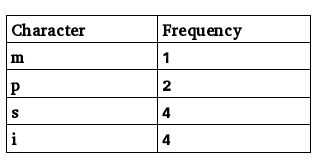
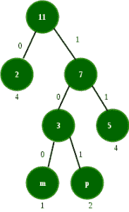
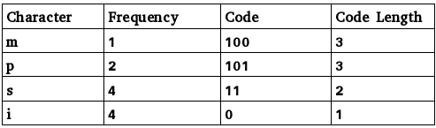
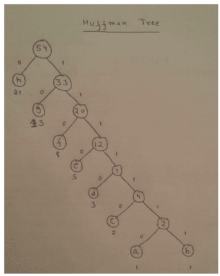
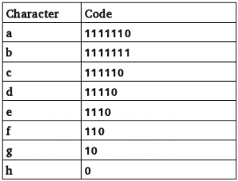
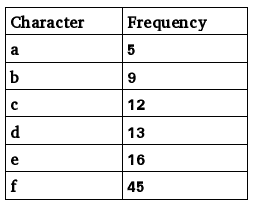

# 霍夫曼编码练习题

> 原文:[https://www . geesforgeks . org/practice-questions-on-Huffman-encoding/](https://www.geeksforgeeks.org/practice-questions-on-huffman-encoding/)

从 GATE 的角度来看，霍夫曼编码是一个重要的话题，这个话题提出了不同类型的问题。在理解这篇文章之前，你应该对[霍夫曼编码](https://www.geeksforgeeks.org/greedy-algorithms-set-3-huffman-coding/)有一个基本的了解。

这些是在基于霍夫曼编码的 GATE 中提出的问题类型。

**1 型。基于霍夫曼编码的概念性问题–**
以下是基于霍夫曼编码的几个要点:

*   这是一种无损数据压缩技术，为不同的符号生成可变长度的代码。
*   它基于贪婪的方法，考虑了字母生成代码的频率/概率。
*   它具有 nlogn 的复杂性，其中 n 是唯一字符的数量。
*   字符的代码长度与其出现频率成反比。
*   没有代码是另一个代码的前缀，因此代码序列可以明确地解码为字符。

**Que–1。**关于霍夫曼编码，以下哪一项是正确的？
(A)霍夫曼编码在某些情况下可能变得有损
(B)霍夫曼码在某些情况下可能不是最佳无损码
(C)在霍夫曼编码中，没有任何代码是任何其他代码的前缀。
(四)以上全部

**解决方案:**如上所述，霍夫曼编码是一种无损压缩技术。因此，选项(A)和(B)为假。选项(C)是正确的，因为这是从给定代码解码消息的基础。

**2 型。要找到编码给定消息的位数–**
要解决这类问题:

*   如果没有给出，首先计算字符的频率
*   生成霍夫曼树
*   使用字符频率和表示这些字符所需的位数来计算位数。

**Que–2。**对消息“密西西比州”进行编码可能需要多少位？

**解决方案:**以下是【密西西比州】中字符的频率表，按照频率的非递减顺序:

生成的霍夫曼树为:


以下是代码:

总位数
= freq(m) *码长(m) + freq(p) *码长(p) + freq(s) *码长(s) + freq(i) *码长(i)
= 1*3 + 2*3 + 4*2 + 4*1 = 21

此外，每个字符的平均位数可以表示为:
所需的总位数/字符总数= 21/11 = 1.909

**3 型。从代码到消息的解码–**
要解决这类问题:

*   使用霍夫曼树为每个字符生成代码(如果没有给出)
*   使用前缀匹配，用字符替换代码。

**Que–3。**字符 a 到 h 具有基于前 8 个斐波那契数的频率集，如下所示:

```
a : 1, b : 1, c : 2, d : 3, e : 5, f : 8, g : 13, h : 21

```

霍夫曼码用于表示字符。下列代码对应的字符序列是什么？

```
110111100111010

```

(a)fdheg
(b)ecgdf
(c)dchfg
(d)fedg

**解决方案:**使用问题中给出的频率，霍夫曼树可以生成为:



以下是代码:


使用前缀匹配，给定的字符串可以分解为

```
110 11110 0 1110 10
f   d     h  e   g

```

**4 型。使用霍夫曼编码保存的位数–**

**Que–4。**一家网络公司在通过网络传输消息之前，使用压缩技术对消息进行编码。假设消息包含以下字符及其频率:


请注意，输入消息中的每个字符都需要 1 个字节。

如果使用的压缩技术是霍夫曼编码，消息中会保存多少位？
(甲)224
(乙)800
(丙)576
(丁)324

**解决方案:**不使用霍夫曼查找位数，
字符总数=频率之和= 100
1 个字符的大小= 1 字节= 8 位
比特总数= 8*100 = 800

使用霍夫曼编码，所需的总位数可以计算如下:

5*4 + 9*4 + 12*3 + 13*3 + 16*3 + 45* 1 = 224

保存的位数= 800-224 = 576。
