# 求解微分方程的预测校正法或修正欧拉法

> 原文:[https://www . geesforgeks . org/预测-校正-或-修正-欧拉-微分方程求解方法/](https://www.geeksforgeeks.org/predictor-corrector-or-modified-euler-method-for-solving-differential-equation/)

对于给定的带有初始条件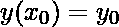
的微分方程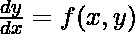，用预测-校正法求近似解。
**预估-校正法:**
预估-校正法又称**修正-欧拉法**。
在[欧拉方法](https://en.wikipedia.org/wiki/Euler_method)中，在一个点绘制切线，并计算给定步长的斜率。因此，这种方法对于线性函数效果最好，但是对于其他情况，仍然存在截断误差。为了解决这个问题，引入了修正欧拉法。在这种方法中，不使用一个点，而是使用一个区间内的斜率的算术平均值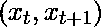。
因此，在每一步的预测-校正方法中，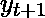的预测值首先使用欧拉方法计算，然后计算点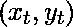和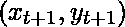处的斜率，并将这些斜率的算术平均值加到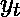上以计算的校正值。
所以，

*   step–1:首先，该值是一个步长的**预测**(这里是 t+1) : 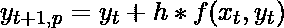，
    这里 h 是每个增量的步长

*   第二步:预测值为**修正后的** : 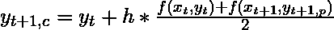

*   第三步:增量完成: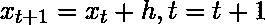

*   步骤–4:检查是否继续，如果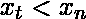则进入步骤–1。

*   步骤 5:终止流程。

因为在这种方法中，使用了平均斜率，所以误差显著减小。此外，我们可以重复校正收敛的过程。因此，在每一步中，我们都在通过提高 y 的值来减少误差。
**示例:**

> **输入:** eq = 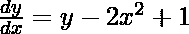，y(0) = 0.5，步长(h) = 0.2
> **查找:** y(1)
> **输出:** y(1) = 2.18147
> **解释:**
> 
> x = 1 时 y 的最终值为 y=2.18147

**实现:**这里我们考虑微分方程:

## C++

```
// C++ code for solving the differential equation
// using Predictor-Corrector or Modified-Euler method
// with the given conditions, y(0) = 0.5, step size(h) = 0.2
// to find y(1)

#include <bits/stdc++.h>
using namespace std;

// consider the differential equation
// for a given x and y, return v
double f(double x, double y)
{
    double v = y - 2 * x * x + 1;
    return v;
}

// predicts the next value for a given (x, y)
// and step size h using Euler method
double predict(double x, double y, double h)
{
    // value of next y(predicted) is returned
    double y1p = y + h * f(x, y);
    return y1p;
}

// corrects the predicted value
// using Modified Euler method
double correct(double x, double y,
               double x1, double y1,
               double h)
{
    // (x, y) are of previous step
    // and x1 is the increased x for next step
    // and y1 is predicted y for next step
    double e = 0.00001;
    double y1c = y1;

    do {
        y1 = y1c;
        y1c = y + 0.5 * h * (f(x, y) + f(x1, y1));
    } while (fabs(y1c - y1) > e);

    // every iteration is correcting the value
    // of y using average slope
    return y1c;
}

void printFinalValues(double x, double xn,
                      double y, double h)
{

    while (x < xn) {
        double x1 = x + h;
        double y1p = predict(x, y, h);
        double y1c = correct(x, y, x1, y1p, h);
        x = x1;
        y = y1c;
    }

    // at every iteration first the value
    // of for next step is first predicted
    // and then corrected.
    cout << "The final value of y at x = "
         << x << " is : " << y << endl;
}

int main()
{
    // here x and y are the initial
    // given condition, so x=0 and y=0.5
    double x = 0, y = 0.5;

    // final value of x for which y is needed
    double xn = 1;

    // step size
    double h = 0.2;

    printFinalValues(x, xn, y, h);

    return 0;
}
```

## Java 语言(一种计算机语言，尤用于创建网站)

```
// Java code for solving the differential
// equation using Predictor-Corrector
// or Modified-Euler method with the
// given conditions, y(0) = 0.5, step
// size(h) = 0.2 to find y(1)
import java.text.*;

class GFG
{

// consider the differential equation
// for a given x and y, return v
static double f(double x, double y)
{
    double v = y - 2 * x * x + 1;
    return v;
}

// predicts the next value for a given (x, y)
// and step size h using Euler method
static double predict(double x, double y, double h)
{
    // value of next y(predicted) is returned
    double y1p = y + h * f(x, y);
    return y1p;
}

// corrects the predicted value
// using Modified Euler method
static double correct(double x, double y,
                    double x1, double y1,
                    double h)
{
    // (x, y) are of previous step
    // and x1 is the increased x for next step
    // and y1 is predicted y for next step
    double e = 0.00001;
    double y1c = y1;

    do
    {
        y1 = y1c;
        y1c = y + 0.5 * h * (f(x, y) + f(x1, y1));
    }
    while (Math.abs(y1c - y1) > e);

    // every iteration is correcting the value
    // of y using average slope
    return y1c;
}

static void printFinalValues(double x, double xn,
                    double y, double h)
{

    while (x < xn)
    {
        double x1 = x + h;
        double y1p = predict(x, y, h);
        double y1c = correct(x, y, x1, y1p, h);
        x = x1;
        y = y1c;
    }

    // at every iteration first the value
    // of for next step is first predicted
    // and then corrected.
    DecimalFormat df = new DecimalFormat("#.#####");
    System.out.println("The final value of y at x = "+
                        x + " is : "+df.format(y));
}

// Driver code
public static void main (String[] args)
{
    // here x and y are the initial
    // given condition, so x=0 and y=0.5
    double x = 0, y = 0.5;

    // final value of x for which y is needed
    double xn = 1;

    // step size
    double h = 0.2;

    printFinalValues(x, xn, y, h);
}
}

// This code is contributed by mits
```

## 蟒蛇 3

```
# Python3 code for solving the differential equation
# using Predictor-Corrector or Modified-Euler method
# with the given conditions, y(0) = 0.5, step size(h) = 0.2
# to find y(1)

# consider the differential equation
# for a given x and y, return v
def f(x, y):
    v = y - 2 * x * x + 1;
    return v;

# predicts the next value for a given (x, y)
# and step size h using Euler method
def predict(x, y, h):

    # value of next y(predicted) is returned
    y1p = y + h * f(x, y);
    return y1p;

# corrects the predicted value
# using Modified Euler method
def correct(x, y, x1, y1, h):

    # (x, y) are of previous step
    # and x1 is the increased x for next step
    # and y1 is predicted y for next step
    e = 0.00001;
    y1c = y1;

    while (abs(y1c - y1) > e + 1):
        y1 = y1c;
        y1c = y + 0.5 * h * (f(x, y) + f(x1, y1));

    # every iteration is correcting the value
    # of y using average slope
    return y1c;

def printFinalValues(x, xn, y, h):
    while (x < xn):
        x1 = x + h;
        y1p = predict(x, y, h);
        y1c = correct(x, y, x1, y1p, h);
        x = x1;
        y = y1c;

    # at every iteration first the value
    # of for next step is first predicted
    # and then corrected.
    print("The final value of y at x =",
                     int(x), "is :", y);

# Driver Code
if __name__ == '__main__':

    # here x and y are the initial
    # given condition, so x=0 and y=0.5
    x = 0; y = 0.5;

    # final value of x for which y is needed
    xn = 1;

    # step size
    h = 0.2;

    printFinalValues(x, xn, y, h);

# This code is contributed by Rajput-Ji
```

## C#

```
// C# code for solving the differential
// equation using Predictor-Corrector
// or Modified-Euler method with the
// given conditions, y(0) = 0.5, step
// size(h) = 0.2 to find y(1)
using System;

class GFG
{

// consider the differential equation
// for a given x and y, return v
static double f(double x, double y)
{
    double v = y - 2 * x * x + 1;
    return v;
}

// predicts the next value for a given (x, y)
// and step size h using Euler method
static double predict(double x, double y, double h)
{
    // value of next y(predicted) is returned
    double y1p = y + h * f(x, y);
    return y1p;
}

// corrects the predicted value
// using Modified Euler method
static double correct(double x, double y,
            double x1, double y1,
            double h)
{
    // (x, y) are of previous step
    // and x1 is the increased x for next step
    // and y1 is predicted y for next step
    double e = 0.00001;
    double y1c = y1;

    do
    {
        y1 = y1c;
        y1c = y + 0.5 * h * (f(x, y) + f(x1, y1));
    }
    while (Math.Abs(y1c - y1) > e);

    // every iteration is correcting the value
    // of y using average slope
    return y1c;
}

static void printFinalValues(double x, double xn,
                    double y, double h)
{

    while (x < xn)
    {
        double x1 = x + h;
        double y1p = predict(x, y, h);
        double y1c = correct(x, y, x1, y1p, h);
        x = x1;
        y = y1c;
    }

    // at every iteration first the value
    // of for next step is first predicted
    // and then corrected.
    Console.WriteLine("The final value of y at x = "+
                        x + " is : " + Math.Round(y, 5));
}

// Driver code
static void Main()
{
    // here x and y are the initial
    // given condition, so x=0 and y=0.5
    double x = 0, y = 0.5;

    // final value of x for which y is needed
    double xn = 1;

    // step size
    double h = 0.2;

    printFinalValues(x, xn, y, h);
}
}

// This code is contributed by mits
```

## 服务器端编程语言（Professional Hypertext Preprocessor 的缩写）

```
<?php
// PHP code for solving the differential equation
// using Predictor-Corrector or Modified-Euler
// method with the given conditions, y(0) = 0.5,
// step size(h) = 0.2 to find y(1)

// consider the differential equation
// for a given x and y, return v
function f($x, $y)
{
    $v = $y - 2 * $x * $x + 1;
    return $v;
}

// predicts the next value for a given (x, y)
// and step size h using Euler method
function predict($x, $y, $h)
{
    // value of next y(predicted) is returned
    $y1p = $y + $h * f($x, $y);
    return $y1p;
}

// corrects the predicted value
// using Modified Euler method
function correct($x, $y, $x1, $y1, $h)
{

    // (x, y) are of previous step and
    // x1 is the increased x for next step
    // and y1 is predicted y for next step
    $e = 0.00001;
    $y1c = $y1;

    do
    {
        $y1 = $y1c;
        $y1c = $y + 0.5 * $h * (f($x, $y) +
                                f($x1, $y1));
    } while (abs($y1c - $y1) > $e);

    // every iteration is correcting the
    // value of y using average slope
    return $y1c;
}

function printFinalValues($x, $xn, $y, $h)
{
    while ($x < $xn)
    {
        $x1 = $x + $h;
        $y1p = predict($x, $y, $h);
        $y1c = correct($x, $y, $x1, $y1p, $h);
        $x = $x1;
        $y = $y1c;
    }

    // at every iteration first the value
    // of for next step is first predicted
    // and then corrected.
    echo "The final value of y at x = " . $x .
               " is : " . round($y, 5) . "\n";
}

    // here x and y are the initial
    // given condition, so x=0 and y=0.5
    $x = 0;
    $y = 0.5;

    // final value of x for which y is needed
    $xn = 1;

    // step size
    $h = 0.2;

    printFinalValues($x, $xn, $y, $h);

// This code is contributed by mits
?>
```

## java 描述语言

```
<script>
// javascript code for solving the differential
// equation using Predictor-Corrector
// or Modified-Euler method with the
// given conditions, y(0) = 0.5, step
// size(h) = 0.2 to find y(1)

    // consider the differential equation
    // for a given x and y, return v
    function f(x , y) {
        var v = y - 2 * x * x + 1;
        return v;
    }

    // predicts the next value for a given (x, y)
    // and step size h using Euler method
    function predict(x , y , h) {
        // value of next y(predicted) is returned
        var y1p = y + h * f(x, y);
        return y1p;
    }

    // corrects the predicted value
    // using Modified Euler method
    function correct(x , y , x1 , y1 , h) {
        // (x, y) are of previous step
        // and x1 is the increased x for next step
        // and y1 is predicted y for next step
        var e = 0.00001;
        var y1c = y1;

        do {
            y1 = y1c;
            y1c = y + 0.5 * h * (f(x, y) + f(x1, y1));
        } while (Math.abs(y1c - y1) > e);

        // every iteration is correcting the value
        // of y using average slope
        return y1c;
    }

    function printFinalValues(x , xn , y , h) {

        while (x < xn) {
            var x1 = x + h;
            var y1p = predict(x, y, h);
            var y1c = correct(x, y, x1, y1p, h);
            x = x1;
            y = y1c;
        }

        // at every iteration first the value
        // of for next step is first predicted
        // and then corrected.

        document.write("The final value of y at x = " + x + " is : " + y.toFixed(5));
    }

    // Driver code

        // here x and y are the initial
        // given condition, so x=0 and y=0.5
        var x = 0, y = 0.5;

        // final value of x for which y is needed
        var xn = 1;

        // step size
        var h = 0.2;
        printFinalValues(x, xn, y, h);

// This code is contributed by Rajput-Ji
</script>
```

**Output:** 

```
The final value of y at x = 1 is : 2.18147
```