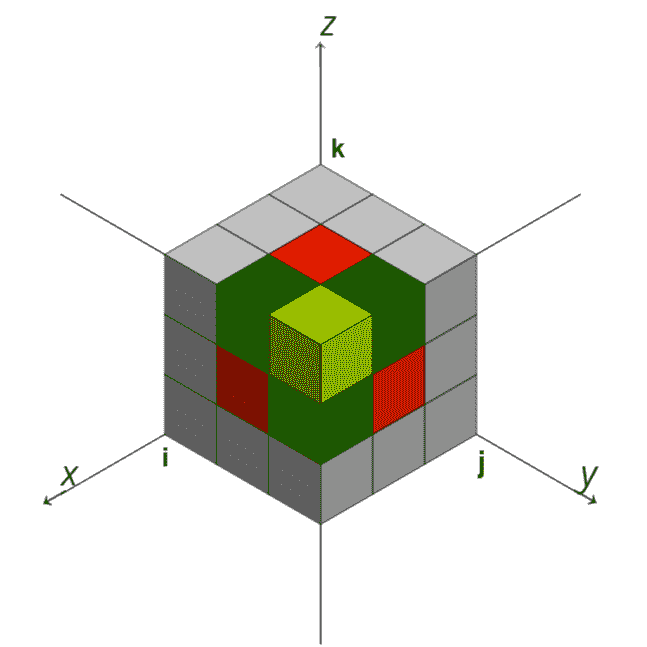

# 3D 数组的前缀和

> 原文:[https://www.geeksforgeeks.org/prefix-sum-of-3d-array/](https://www.geeksforgeeks.org/prefix-sum-of-3d-array/)

**先决条件:** [<u>前缀总和-1D</u>](https://www.geeksforgeeks.org/prefix-sum-array-implementation-applications-competitive-programming/)、 [<u>前缀总和-2D</u>](https://www.geeksforgeeks.org/prefix-sum-2d-array/)

给定整数的 [3 维数组](https://www.geeksforgeeks.org/multidimensional-arrays-c-cpp/)**A[L][R][C]**，其中 **L、R** 和 **C** 是[数组](https://www.geeksforgeeks.org/array-data-structure/)的尺寸(层、行、列)。为其找到[前缀和](https://www.geeksforgeeks.org/prefix-sum-array-implementation-applications-competitive-programming/) [3d 数组](https://www.geeksforgeeks.org/multidimensional-arrays-in-java/)。让前缀和 [3d 数组](https://www.geeksforgeeks.org/multidimensional-arrays-c-cpp/)为 **pre[L][R][C]。**这里 **pre[k][i][j]** 给出了 **pre[0][0][0]** 和 **pre[k][i][j]** 之间的所有整数之和(包括两者)。

**示例:**

> **输入:**A[L][R][C]= { 0
> 
> {{1，1，1，1}，//第 1 层
> 
>          {1, 1, 1, 1},
> 
>          {1, 1, 1, 1},
> 
>          {1, 1, 1, 1}},
> 
> {{1，1，1，1}，//第 2 层
> 
>          {1, 1, 1, 1},
> 
>          {1, 1, 1, 1},
> 
>          {1, 1, 1, 1}},
> 
> {{1，1，1，1}，//第 3 层
> 
>          {1, 1, 1, 1},
> 
>          {1, 1, 1, 1},
> 
>          {1, 1, 1, 1}},
> 
> {{1，1，1，1}，//第 4 层
> 
>          {1, 1, 1, 1},
> 
>          {1, 1, 1, 1},
> 
>          {1, 1, 1, 1}}
> 
> }
> 
> **输出:**预【L】【R】【C】
> 
> 第一层:
> 
> 1 2 3 4 
> 
> 2 4 6 8 
> 
> 3 6 9 12 
> 
> 4 8 12 16 
> 
> 第二层:
> 
> 2 4 6 8 
> 
> 4 8 12 16 
> 
> 6 12 18 24 
> 
> 8 16 24 32 
> 
> 第三层:
> 
> 3 6 9 12 
> 
> 6 12 18 24 
> 
> 9 18 27 36 
> 
> 12 24 36 48 
> 
> 第 4 层:
> 
> 4 8 12 16 
> 
> 8 16 24 32 
> 
> 12 24 36 48 
> 
> 16 32 48 64 
> 
> [](https://media.geeksforgeeks.org/wp-content/uploads/20210615185355/3dcube21.png)

**方法:**考虑上图，了解细胞 **pre[0][0][0]** 位于 x、y、z 轴原点。要填充**前置[][][]** [数组](https://www.geeksforgeeks.org/array-data-structure/)，请执行以下步骤计算[前缀和。](https://www.geeksforgeeks.org/tag/prefix-sum/)

*   直接填充(0，0，0)处的元素。 **pre[0][0][0] = A[0][0][0]**
*   使用[一维数组](https://www.geeksforgeeks.org/difference-between-one-dimensional-and-two-dimensional-array/)上的[前缀和](https://www.geeksforgeeks.org/tag/prefix-sum/)填充三条边的单元格(平行于 x，y，z 轴，由单元格组成)。这些边具有共同的元素 **pre[0][0][0]**
*   [循环迭代](https://www.geeksforgeeks.org/c-c-for-loop-with-examples/)**【1，L】**计算其中一个轴的[前缀和](https://www.geeksforgeeks.org/prefix-sum-array-implementation-applications-competitive-programming/)。**pre[I][0][0]= pre[I–1][0][0]+A[I][0][0]；**
*   类似地，[在范围](https://www.geeksforgeeks.org/range-based-loop-c/)**【1】中迭代。R]** 和**【1，C】**计算另外两个坐标轴的[前缀和](https://www.geeksforgeeks.org/prefix-sum-array-implementation-applications-competitive-programming/)。
*   使用[二维数组](https://www.geeksforgeeks.org/multidimensional-arrays-c-cpp/)上的[前缀和](https://www.geeksforgeeks.org/tag/prefix-sum/)填充三边的单元格(平行于 xy、yz、zx 平面，由单元格组成)。这些边具有共同的元素 **pre[0][0][0]** 。
*   [在 for 循环](https://www.geeksforgeeks.org/c-c-for-loop-with-examples/)**【1，L】**中迭代，计算[二维数组](https://www.geeksforgeeks.org/multidimensional-arrays-c-cpp/)的[前缀和](https://www.geeksforgeeks.org/tag/prefix-sum/)。
    *   [在 for 循环](https://www.geeksforgeeks.org/c-c-for-loop-with-examples/)**【1，R】**中迭代，计算[二维数组](https://www.geeksforgeeks.org/multidimensional-arrays-c-cpp/)的[前缀和](https://www.geeksforgeeks.org/tag/prefix-sum/)。
        *   执行以下操作。**pre[k][I][0]= A[k][I][0]+pre[k–1][I][0]+pre[k][I–1][0]–pre[k–1][I–1][0]**
*   同样，计算其他 2 个边或其他[二维数组](https://www.geeksforgeeks.org/multidimensional-arrays-c-cpp/)的[前缀和](https://www.geeksforgeeks.org/tag/prefix-sum/)。
*   [循环迭代](https://www.geeksforgeeks.org/c-c-for-loop-with-examples/)**【1，L】**计算[三维数组](https://www.geeksforgeeks.org/multidimensional-arrays-c-cpp/) **的[前缀和](https://www.geeksforgeeks.org/tag/prefix-sum/)预[][][]。**
    *   [循环迭代](https://www.geeksforgeeks.org/c-c-for-loop-with-examples/)**【1，R】**计算[三维数组](https://www.geeksforgeeks.org/multidimensional-arrays-c-cpp/) **的[前缀和](https://www.geeksforgeeks.org/tag/prefix-sum/)预[][][]。**
        *   [循环迭代](https://www.geeksforgeeks.org/c-c-for-loop-with-examples/)**【1，C】**计算[三维数组](https://www.geeksforgeeks.org/multidimensional-arrays-c-cpp/) **的[前缀和](https://www.geeksforgeeks.org/tag/prefix-sum/)预[][][]。**
            *   执行以下操作。**pre[k][I][j]= A[k][I][j]+pre[k–1][I][j]+pre[k][I–1][j]+pre[k][I][j–1]–pre[k–1][I–1][j]–pre[k][I–1][j–1]–pre[k–1][I][j–1]+pre[k–1][I–1][j–1]**
*   最后，打印[三维数组](https://www.geeksforgeeks.org/multidimensional-arrays-c-cpp/)**pre[][][][]。**

下面是上述方法的实现。

## C++

```
// C++ program for the above approach.
#include <bits/stdc++.h>
using namespace std;

// Declaring size of the array
#define L 4 // Layer
#define R 4 // Row
#define C 4 // Column

// Calculating prefix sum array
void prefixSum3d(int A[L][R][C])
{
    int pre[L][R][C];

    // Step 0:
    pre[0][0][0] = A[0][0][0];

    // Step 1: Filling the first row,
    // column, and pile of ceils.
    // Using prefix sum of 1d array
    for (int i = 1; i < L; i++)
        pre[i][0][0] = pre[i - 1][0][0] + A[i][0][0];

    for (int i = 1; i < R; i++)
        pre[0][i][0] = pre[0][i - 1][0] + A[0][i][0];

    for (int i = 1; i < C; i++)
        pre[0][0][i] = pre[0][0][i - 1] + A[0][0][i];

    // Step 2: Filling the cells
    // of sides(made up using cells)
    // which have common element A[0][0][0].
    // using prefix sum on 2d array
    for (int k = 1; k < L; k++) {
        for (int i = 1; i < R; i++) {
            pre[k][i][0] = A[k][i][0]
                           + pre[k - 1][i][0]
                           + pre[k][i - 1][0]
                           - pre[k - 1][i - 1][0];
        }
    }
    for (int i = 1; i < R; i++) {
        for (int j = 1; j < C; j++) {
            pre[0][i][j] = A[0][i][j]
                           + pre[0][i - 1][j]
                           + pre[0][i][j - 1]
                           - pre[0][i - 1][j - 1];
        }
    }
    for (int j = 1; j < C; j++) {
        for (int k = 1; k < L; k++) {
            pre[k][0][j] = A[k][0][j]
                           + pre[k - 1][0][j]
                           + pre[k][0][j - 1]
                           - pre[k - 1][0][j - 1];
        }
    }

    // Step 3: Filling value
    // in remaining cells using formula
    for (int k = 1; k < L; k++) {
        for (int i = 1; i < R; i++) {
            for (int j = 1; j < C; j++) {
                pre[k][i][j] = A[k][i][j]

                               + pre[k - 1][i][j]
                               + pre[k][i - 1][j]
                               + pre[k][i][j - 1]

                               - pre[k - 1][i - 1][j]
                               - pre[k][i - 1][j - 1]
                               - pre[k - 1][i][j - 1]

                               + pre[k - 1][i - 1][j - 1];
            }
        }
    }

    // Displaying final prefix sum of array
    for (int k = 0; k < L; k++) {
        cout << "Layer " << k + 1 << ':' << endl;
        for (int i = 0; i < R; i++) {
            for (int j = 0; j < C; j++) {
                cout << pre[k][i][j] << " ";
            }
            cout << endl;
        }
        cout << endl;
    }
}

// Driver Code
int main()
{
    int A[L][R][C] = {
        { { 1, 1, 1, 1 }, // Layer 1
          { 1, 1, 1, 1 },
          { 1, 1, 1, 1 },
          { 1, 1, 1, 1 } },

        { { 1, 1, 1, 1 }, // Layer 2
          { 1, 1, 1, 1 },
          { 1, 1, 1, 1 },
          { 1, 1, 1, 1 } },

        { { 1, 1, 1, 1 }, // Layer 3
          { 1, 1, 1, 1 },
          { 1, 1, 1, 1 },
          { 1, 1, 1, 1 } },

        { { 1, 1, 1, 1 }, // Layer 4
          { 1, 1, 1, 1 },
          { 1, 1, 1, 1 },
          { 1, 1, 1, 1 } }
    };

    prefixSum3d(A);
    return 0;
}
```

## Java 语言(一种计算机语言，尤用于创建网站)

```
// java program to calculate prefix sum of 3d array
import java.util.*;

class GFG
{

    // Declaring size of the array
    public static int L = 4;// Layer
    public static int R = 4;// Row
    public static int C = 4;// Column

    // Calculating prefix
    public static void prefixSum3d(int A[][][]) {
        int pre[][][] = new int[L][R][C];

          // Step 0:
        pre[0][0][0] = A[0][0][0];

        // Step 1: Filling the first row,column, and pile of ceils.
        // Using prefix sum of 1d array
        for (int i = 1; i < L; i++)
            pre[i][0][0] = pre[i - 1][0][0] + A[i][0][0];

        for (int i = 1; i < R; i++)
            pre[0][i][0] = pre[0][i - 1][0] + A[0][i][0];

        for (int i = 1; i < C; i++)
            pre[0][0][i] = pre[0][0][i - 1] + A[0][0][i];

        // Step 2: Filling the cells of sides(made up using cells)
        // which have common element A[0][0][0].
        // using prefix sum on 2d array
        for (int k = 1; k < L; k++) {
            for (int i = 1; i < R; i++) {
                pre[k][i][0] = A[k][i][0] + pre[k - 1][i][0] + pre[k][i - 1][0]
                                  - pre[k - 1][i - 1][0];
            }
        }
        for (int i = 1; i < R; i++) {
            for (int j = 1; j < C; j++) {
                pre[0][i][j] = A[0][i][j] + pre[0][i - 1][j] + pre[0][i][j - 1]
                                  - pre[0][i - 1][j - 1];
            }
        }
        for (int j = 1; j < C; j++) {
            for (int k = 1; k < L; k++) {
                pre[k][0][j] = A[k][0][j] + pre[k - 1][0][j] + pre[k][0][j - 1]
                                  - pre[k - 1][0][j - 1];
            }
        }

        // Step 3: Filling value in remaining cells using formula
        for (int k = 1; k < L; k++) {
            for (int i = 1; i < R; i++) {
                for (int j = 1; j < C; j++) {
                    pre[k][i][j] = A[k][i][j]
                            + pre[k - 1][i][j] + pre[k][i - 1][j] + pre[k][i][j - 1]
                            - pre[k - 1][i - 1][j] - pre[k][i - 1][j - 1] - pre[k - 1][i][j - 1]
                            + pre[k - 1][i - 1][j - 1];
                }
            }
        }

        // Displaying final prefix sum of array
        for (int k = 0; k < L; k++) {
            System.out.println("Layer " + (k + 1) + ":");
            for (int i = 0; i < R; i++) {
                for (int j = 0; j < C; j++) {
                    System.out.print(pre[k][i][j] + " ");
                }
                System.out.println();
            }
            System.out.println();
        }
    }

    // Driver program to test above function
    public static void main(String[] args) {
        int A[][][] = {
            {{1, 1, 1, 1}, // Layer 1
            {1, 1, 1, 1 },
            {1, 1, 1, 1 },
            {1, 1, 1, 1 }},

            {{1, 1, 1, 1}, // Layer 2
            {1, 1, 1, 1 },
            {1, 1, 1, 1 },
            {1, 1, 1, 1 }},

            {{1, 1, 1, 1}, // Layer 3
            {1, 1, 1, 1 },
            {1, 1, 1, 1 },
            {1, 1, 1, 1 }},

            {{1, 1, 1, 1}, // Layer 4
            {1, 1, 1, 1 },
            {1, 1, 1, 1 },
            {1, 1, 1, 1 }}
        };

        prefixSum3d(A);
    }
}

// This code is contributed by gajjardeep50.
```

## 蟒蛇 3

```
# python program to calculate prefix sum of 3d array
# Declaring size of the array
L = 4  # Layer
R = 4  # Row
C = 4  # Column

# Calculating prefix
def prefixSum3d(A):

    pre = [[[0 for a in range(C)]
            for b in range(R)]
           for d in range(L)]

    # Step 0:
    pre[0][0][0] = A[0][0][0]

    # Step 1: Filling the first row,column, and pile of ceils.
    # Using prefix sum of 1d array
    for i in range(1, L):
        pre[i][0][0] = pre[i - 1][0][0] + A[i][0][0]

    for i in range(1, R):
        pre[0][i][0] = pre[0][i - 1][0] + A[0][i][0]

    for i in range(1, C):
        pre[0][0][i] = pre[0][0][i - 1] + A[0][0][i]

    # Step 2: Filling the cells of sides(made up using cells)
    # which have common element A[0][0][0].
    # using prefix sum on 2d array
    for k in range(1, L):
        for i in range(1, R):
            pre[k][i][0] = (A[k][i][0] + pre[k - 1][i][0] + pre[k][i - 1][0]
                            - pre[k - 1][i - 1][0])
    for i in range(1, R):
        for j in range(1, C):
            pre[0][i][j] = (A[0][i][j] + pre[0][i - 1][j] + pre[0][i][j - 1]
                            - pre[0][i - 1][j - 1])
    for j in range(1, C):
        for k in range(1, L):
            pre[k][0][j] = (A[k][0][j] + pre[k - 1][0][j] + pre[k][0][j - 1]
                            - pre[k - 1][0][j - 1])

    # Step 3: Filling value in remaining cells using formula
    for k in range(1, L):
        for i in range(1, R):
            for j in range(1, C):
                pre[k][i][j] = (A[k][i][j]

                                + pre[k - 1][i][j]
                                + pre[k][i - 1][j]
                                + pre[k][i][j - 1]

                                - pre[k - 1][i - 1][j]
                                - pre[k][i - 1][j - 1]
                                - pre[k - 1][i][j - 1]

                                + pre[k - 1][i - 1][j - 1])

    # Displaying final prefix sum of array
    for k in range(L):
        print("Layer", k+1, ":")
        for i in range(R):
            for j in range(C):
                print(pre[k][i][j], end=' ')
            print()
        print()

# Driver program to test above function
A = [
    [[1, 1, 1, 1],  # Layer 1
     [1, 1, 1, 1],
     [1, 1, 1, 1],
     [1, 1, 1, 1]],

    [[1, 1, 1, 1],  # Layer 2
     [1, 1, 1, 1],
     [1, 1, 1, 1],
     [1, 1, 1, 1]],

    [[1, 1, 1, 1],  # Layer 3
     [1, 1, 1, 1],
     [1, 1, 1, 1],
     [1, 1, 1, 1]],

    [[1, 1, 1, 1],  # Layer 4
     [1, 1, 1, 1],
     [1, 1, 1, 1],
     [1, 1, 1, 1]]
]

prefixSum3d(A)

# This code is contributed by gajjardeep50.
```

## C#

```
// C# program for the above approach.
using System;
using System.Collections.Generic;

class GFG{

// Declaring size of the array
static int L = 4; // Layer
static int R = 4; // Row
static int C = 4; // Column

// Calculating prefix sum array
static void prefixSum3d(int [,,]A)
{
    int [,,]pre = new int[L, R, C];

    // Step 0:
    pre[0, 0, 0] = A[0, 0, 0];

    // Step 1: Filling the first row,
    // column, and pile of ceils.
    // Using prefix sum of 1d array
    for(int i = 1; i < L; i++)
        pre[i, 0, 0] = pre[i - 1, 0, 0] + A[i, 0, 0];

    for(int i = 1; i < R; i++)
        pre[0, i, 0] = pre[0, i - 1, 0] + A[0, i, 0];

    for(int i = 1; i < C; i++)
        pre[0, 0, i] = pre[0, 0, i - 1] + A[0, 0, i];

    // Step 2: Filling the cells
    // of sides(made up using cells)
    // which have common element A[0][0][0].
    // using prefix sum on 2d array
    for(int k = 1; k < L; k++)
    {
        for(int i = 1; i < R; i++)
        {
            pre[k, i, 0] = A[k, i, 0] + pre[k - 1, i, 0] +
                                        pre[k, i - 1, 0] -
                                        pre[k - 1, i - 1, 0];
        }
    }
    for(int i = 1; i < R; i++)
    {
        for(int j = 1; j < C; j++)
        {
            pre[0, i, j] = A[0, i, j] + pre[0, i - 1, j] +
                                        pre[0, i, j - 1] -
                                        pre[0, i - 1, j - 1];
        }
    }
    for(int j = 1; j < C; j++)
    {
        for(int k = 1; k < L; k++)
        {
            pre[k, 0, j] = A[k, 0, j] + pre[k - 1, 0, j] +
                                        pre[k, 0, j - 1] -
                                        pre[k - 1, 0, j - 1];
        }
    }

    // Step 3: Filling value
    // in remaining cells using formula
    for(int k = 1; k < L; k++)
    {
        for(int i = 1; i < R; i++)
        {
            for(int j = 1; j < C; j++)
            {
                pre[k, i, j] = A[k, i, j] + pre[k - 1, i, j] +
                                            pre[k, i - 1, j] +
                                            pre[k, i, j - 1] -
                                            pre[k - 1, i - 1, j] -
                                            pre[k, i - 1, j - 1] -
                                            pre[k - 1, i, j - 1] +
                                            pre[k - 1, i - 1, j - 1];
            }
        }
    }

    // Displaying final prefix sum of array
    for(int k = 0; k < L; k++)
    {
        Console.WriteLine("Layer " + k + 1 + ":");
        for(int i = 0; i < R; i++)
        {
            for(int j = 0; j < C; j++)
            {
                Console.Write(pre[k, i, j] +" ");
            }
            Console.WriteLine();
        }
        Console.WriteLine();
    }
}

// Driver Code
public static void Main()
{
    int [,,]A = {
        { { 1, 1, 1, 1 }, // Layer 1
          { 1, 1, 1, 1 },
          { 1, 1, 1, 1 },
          { 1, 1, 1, 1 } },

        { { 1, 1, 1, 1 }, // Layer 2
          { 1, 1, 1, 1 },
          { 1, 1, 1, 1 },
          { 1, 1, 1, 1 } },

        { { 1, 1, 1, 1 }, // Layer 3
          { 1, 1, 1, 1 },
          { 1, 1, 1, 1 },
          { 1, 1, 1, 1 } },

        { { 1, 1, 1, 1 }, // Layer 4
          { 1, 1, 1, 1 },
          { 1, 1, 1, 1 },
          { 1, 1, 1, 1 } }
    };

    prefixSum3d(A);
}
}

// This code is contributed by SURENDRA_GANGWAR
```

## java 描述语言

```
<script>

// Javascript program for the above approach.

// Declaring size of the array
let L = 4; // Layer
let R = 4; // Row
let C = 4; // Column

// Calculating prefix sum array
function prefixSum3d(A)
{

    let pre = new Array(L).fill(0).map(
        () => new Array(R).fill(0).map(
        () => new Array(C)));

    // Step 0:
    pre[0][0][0] = A[0][0][0];

    // Step 1: Filling the first row,
    // column, and pile of ceils.
    // Using prefix sum of 1d array
    for(let i = 1; i < L; i++)
        pre[i][0][0] = pre[i - 1][0][0] + A[i][0][0];

    for(let i = 1; i < R; i++)
        pre[0][i][0] = pre[0][i - 1][0] + A[0][i][0];

    for(let i = 1; i < C; i++)
        pre[0][0][i] = pre[0][0][i - 1] + A[0][0][i];

    // Step 2: Filling the cells
    // of sides(made up using cells)
    // which have common element A[0][0][0].
    // using prefix sum on 2d array
    for(let k = 1; k < L; k++)
    {
        for(let i = 1; i < R; i++)
        {
            pre[k][i][0] = A[k][i][0] + pre[k - 1][i][0] +
              pre[k][i - 1][0] - pre[k - 1][i - 1][0];
        }
    }
    for(let i = 1; i < R; i++)
    {
        for(let j = 1; j < C; j++)
        {
            pre[0][i][j] = A[0][i][j] + pre[0][i - 1][j] +
              pre[0][i][j - 1] - pre[0][i - 1][j - 1];
        }
    }
    for(let j = 1; j < C; j++)
    {
        for(let k = 1; k < L; k++)
        {
            pre[k][0][j] = A[k][0][j] + pre[k - 1][0][j] +
                     pre[k][0][j - 1] - pre[k - 1][0][j - 1];
        }
    }

    // Step 3: Filling value
    // in remaining cells using formula
    for(let k = 1; k < L; k++)
    {
        for(let i = 1; i < R; i++)
        {
            for(let j = 1; j < C; j++)
            {
                pre[k][i][j] = A[k][i][j] + pre[k - 1][i][j] +
                                            pre[k][i - 1][j] +
                                            pre[k][i][j - 1] -
                                            pre[k - 1][i - 1][j] -
                                            pre[k][i - 1][j - 1] -
                                            pre[k - 1][i][j - 1] +
                                            pre[k - 1][i - 1][j - 1];
            }
        }
    }

    // Displaying final prefix sum of array
    for(let k = 0; k < L; k++)
    {
        document.write("Layer " + (k + 1) +
                       ":" + "<br>");

        for(let i = 0; i < R; i++)
        {
            for(let j = 0; j < C; j++)
            {
                document.write(pre[k][i][j] + " ");
            }
            document.write("<br>");
        }
        document.write("<br>");
    }
}

// Driver Code

let A = [ [ [ 1, 1, 1, 1 ], // Layer 1
            [ 1, 1, 1, 1 ],
            [ 1, 1, 1, 1 ],
            [ 1, 1, 1, 1 ], ],

          [ [ 1, 1, 1, 1 ], // Layer 2
            [ 1, 1, 1, 1 ],
            [ 1, 1, 1, 1 ],
            [ 1, 1, 1, 1 ], ],

          [ [ 1, 1, 1, 1 ], // Layer 3
            [ 1, 1, 1, 1 ],
            [ 1, 1, 1, 1 ],
            [ 1, 1, 1, 1 ], ],

          [ [ 1, 1, 1, 1 ], // Layer 4
            [ 1, 1, 1, 1 ],
            [ 1, 1, 1, 1 ],
            [ 1, 1, 1, 1 ], ],
        ];

prefixSum3d(A);

// This code is contributed by gfgking

</script>
```

**Output**

```
Layer 1:
1 2 3 4 
2 4 6 8 
3 6 9 12 
4 8 12 16 

Layer 2:
2 4 6 8 
4 8 12 16 
6 12 18 24 
8 16 24 32 

Layer 3:
3 6 9 12 
6 12 18 24 
9 18 27 36 
12 24 36 48 

Layer 4:
4 8 12 16 
8 16 24 32 
12 24 36 48 
16 32 48 64 
```

***时间复杂度** : O(L*R*C)*
***辅助空间** : O(L*R*C)*