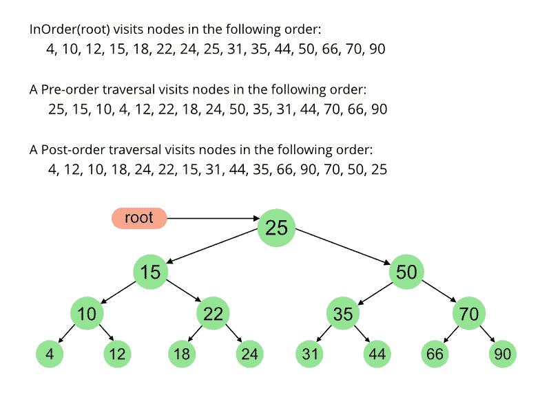

# 有序和无序遍历的前序

> 原文:[https://www . geeksforgeeks . org/preorder-from-in order-and-post-traversals/](https://www.geeksforgeeks.org/preorder-from-inorder-and-postorder-traversals/)

给定二叉树的顺序遍历和顺序遍历，打印顺序遍历。
**例:**

```
Input: Postorder traversal post[] = {4, 5, 2, 6, 3, 1}
       Inorder traversal in[] = {4, 2, 5, 1, 3, 6}
Output: Preorder traversal 1, 2, 4, 5, 3, 6

Trversals in the above example represents following tree 
         1
      /    \       
     2       3
   /   \      \  
  4     5      6
```

一种**天真的方法**是首先[根据给定的后序和序](https://www.geeksforgeeks.org/construct-a-binary-tree-from-postorder-and-inorder/)构造树，然后使用简单的递归方法打印构造树的前序遍历。



**我们不需要构造树**就可以打印前序遍历。其思想是，根总是前序遍历中的第一项，它必须是后序遍历中的最后一项。我们首先将右子树推送到堆栈，然后是左子树，最后是根。最后，我们打印堆栈的内容。为了找到 post[]和 in[]中左右子树的边界，我们在 in[]中搜索 root in，in[]中 root in 之前的所有元素都是左子树的元素，root 之后的所有元素都是右子树的元素。在 post[]中，[]中根的索引之后的所有元素都是右子树的元素。索引之前的元素(包括索引处的元素，不包括第一个元素)是左子树的元素。

## C++

```
// C++ program to print Postorder traversal from given
// Inorder and Preorder traversals.
#include<bits/stdc++.h>
using namespace std;

int postIndex = 0;

// A utility function to search data in in[]
int search(int in[], int data,int n)
{
    int i = 0;
    for (i = 0; i < n; i++)
        if (in[i] == data)
            return i;
    return i;
}

// Fills preorder traversal of tree with given
// inorder and postorder traversals in a stack
void fillPre(int in[], int post[], int inStrt,
            int inEnd, stack<int> &s,int n)
{
    if (inStrt > inEnd)
        return;

    // Find index of next item in postorder traversal in
    // inorder.
    int val = post[postIndex];
    int inIndex = search(in, val, n);
    postIndex--;

    // traverse right tree
    fillPre(in, post, inIndex + 1, inEnd, s, n);

    // traverse left tree
    fillPre(in, post, inStrt, inIndex - 1, s, n);

    s.push(val);
}

// This function basically initializes postIndex
// as last element index, then fills stack with
// reverse preorder traversal using printPre
void printPreMain(int in[], int post[],int n)
{
    int len = n;
    postIndex = len - 1;
    stack<int> s ;
    fillPre(in, post, 0, len - 1, s, n);
    while (s.size() > 0)
    {
        cout << s.top() << " ";
        s.pop();
    }
}

// Driver code
int main()
{
    int in[] = { 4, 10, 12, 15, 18, 22, 24, 25,
                31, 35, 44, 50, 66, 70, 90 };
    int post[] = { 4, 12, 10, 18, 24, 22, 15, 31,
                44, 35, 66, 90, 70, 50, 25 };
    int n=sizeof(in)/sizeof(int);
    printPreMain(in, post,n);
}

// This code is contributed by Arnab Kundu
```

## Java 语言(一种计算机语言，尤用于创建网站)

```
// Java program to print Postorder traversal from given
// Inorder and Preorder traversals.
import java.util.Stack;

public class PrintPre {

    static int postIndex;

    // Fills preorder traversal of tree with given
    // inorder and postorder traversals in a stack
    void fillPre(int[] in, int[] post, int inStrt,
                 int inEnd, Stack<Integer> s)
    {
        if (inStrt > inEnd)
            return;

        // Find index of next item in postorder traversal in
        // inorder.
        int val = post[postIndex];
        int inIndex = search(in, val);
        postIndex--;

        // traverse right tree
        fillPre(in, post, inIndex + 1, inEnd, s);

        // traverse left tree
        fillPre(in, post, inStrt, inIndex - 1, s);

        s.push(val);
    }

    // This function basically initializes postIndex
    // as last element index, then fills stack with
    // reverse preorder traversal using printPre
    void printPreMain(int[] in, int[] post)
    {
        int len = in.length;
        postIndex = len - 1;
        Stack<Integer> s = new Stack<Integer>();
        fillPre(in, post, 0, len - 1, s);
        while (s.empty() == false)
            System.out.print(s.pop() + " ");
    }

    // A utility function to search data in in[]
    int search(int[] in, int data)
    {
        int i = 0;
        for (i = 0; i < in.length; i++)
            if (in[i] == data)
                return i;
        return i;
    }

    // Driver code
    public static void main(String ars[])
    {
        int in[] = { 4, 10, 12, 15, 18, 22, 24, 25,
                     31, 35, 44, 50, 66, 70, 90 };
        int post[] = { 4, 12, 10, 18, 24, 22, 15, 31,
                       44, 35, 66, 90, 70, 50, 25 };
        PrintPre tree = new PrintPre();
        tree.printPreMain(in, post);
    }
}
```

## 蟒蛇 3

```
# Python3 program to prPostorder traversal from given
# Inorder and Preorder traversals.

# A utility function to search data in in[]
def search(inn, data,n):
    i = 0
    while i < n :
        if (inn[i] == data):
            return i
        i += 1   
    return i

# Fills preorder traversal of tree with given
# inorder and postorder traversals in a stack
def fillPre(inn, post, inStrt, inEnd, n):
    global s, postIndex

    if (inStrt > inEnd):
        return

    # Find index of next item in postorder traversal in
    # inorder.
    val = post[postIndex]
    inIndex = search(inn, val, n)
    postIndex -= 1

    # traverse right tree
    fillPre(inn, post, inIndex + 1, inEnd, n)

    # traverse left tree
    fillPre(inn, post, inStrt, inIndex - 1, n)

    s.append(val)

# This function basically initializes postIndex
# as last element index, then fills stack with
# reverse preorder traversal using printPre
def printPreMain(inn, post, n):
    global s

    lenn = n
    postIndex = lenn - 1

    fillPre(inn, post, 0, lenn - 1, n)

    while ( len(s) > 0):
        print(s[-1], end=" ")
        del s[-1]

# Driver code
if __name__ == '__main__':
    s,postIndex = [], 0

    inn =[4, 10, 12, 15, 18, 22, 24, 25,31, 35, 44, 50, 66, 70, 90]
    post =[4, 12, 10, 18, 24, 22, 15, 31,44, 35, 66, 90, 70, 50, 25]

    n=len(inn)
    printPreMain(inn, post,n)

# This code is contributed by divyeshrabadiya07
```

## C#

```
// C# program to print Postorder traversal from given
// Inorder and Preorder traversals.
using System;
using System.Collections.Generic;

public class PrintPre
{

    static int postIndex;

    // Fills preorder traversal of tree with given
    // inorder and postorder traversals in a stack
    void fillPre(int[] a, int[] post, int inStrt,
                int inEnd, Stack<int> s)
    {
        if (inStrt > inEnd)
            return;

        // Find index of next item in postorder traversal in
        // inorder.
        int val = post[postIndex];
        int inIndex = search(a, val);
        postIndex--;

        // traverse right tree
        fillPre(a, post, inIndex + 1, inEnd, s);

        // traverse left tree
        fillPre(a, post, inStrt, inIndex - 1, s);

        s.Push(val);
    }

    // This function basically initializes postIndex
    // as last element index, then fills stack with
    // reverse preorder traversal using printPre
    void printPreMain(int[] a, int[] post)
    {
        int len = a.Length;
        postIndex = len - 1;
        Stack<int> s = new Stack<int>();
        fillPre(a, post, 0, len - 1, s);
        while (s.Count!=0)
            Console.Write(s.Pop() + " ");
    }

    // A utility function to search data in in[]
    int search(int[] a, int data)
    {
        int i = 0;
        for (i = 0; i < a.Length; i++)
            if (a[i] == data)
                return i;
        return i;
    }

    // Driver code
    public static void Main(String []args)
    {
        int []a = { 4, 10, 12, 15, 18, 22, 24, 25,
                    31, 35, 44, 50, 66, 70, 90 };
        int []post = { 4, 12, 10, 18, 24, 22, 15, 31,
                    44, 35, 66, 90, 70, 50, 25 };
        PrintPre tree = new PrintPre();
        tree.printPreMain(a, post);
    }
}

// This code has been contributed by 29AjayKumar
```

## java 描述语言

```
<script>

// JavaScript program to print
// Postorder traversal from given
// Inorder and Preorder traversals.

let  postIndex;

// A utility function to search data in in[]
function search(In,data)
{
    let i = 0;
        for (i = 0; i < In.length; i++)
            if (In[i] == data)
                return i;
        return i;
}

// Fills preorder traversal of tree with given
    // inorder and postorder traversals in a stack
function fillPre(In,post,inStrt,inEnd,s)
{
    if (inStrt > inEnd)
            return;

        // Find index of next item
        // in postorder traversal in
        // inorder.
        let val = post[postIndex];
        let inIndex = search(In, val);
        postIndex--;

        // traverse right tree
        fillPre(In, post, inIndex + 1, inEnd, s);

        // traverse left tree
        fillPre(In, post, inStrt, inIndex - 1, s);

        s.push(val);
}

 // This function basically initializes postIndex
    // as last element index, then fills stack with
    // reverse preorder traversal using printPre
function printPreMain(In,post)
{
    let len = In.length;
        postIndex = len - 1;
        let s = [];
        fillPre(In, post, 0, len - 1, s);
        while (s.length!=0)
            document.write(s.pop() + " ");
}

// Driver code
let In=[4, 10, 12, 15, 18, 22, 24, 25,
                     31, 35, 44, 50, 66, 70, 90 ];

let post=[4, 12, 10, 18, 24, 22, 15, 31,
                       44, 35, 66, 90, 70, 50, 25 ];

printPreMain(In, post);

// This code is contributed by unknown2108

</script>
```

**Output:** 

```
25 15 10 4 12 22 18 24 50 35 31 44 70 66 90
```

**时间复杂度:**上述函数访问数组中的每个节点。对于每次访问，它都调用搜索，这需要 O(n)个时间。因此，该功能的整体时间复杂度为 O(n <sup>2</sup> )

**O(n)溶液**

我们可以进一步优化上述解决方案，首先对有序遍历的所有项目进行散列，这样我们就不必线性搜索项目。有了哈希表，我们可以在 O(1)时间内搜索一个项目。

## C++

```
// C++ program to print Postorder traversal from
// given Inorder and Preorder traversals.
#include <bits/stdc++.h>
using namespace std;

int postIndex;

// Fills preorder traversal of tree with given
// inorder and postorder traversals in a stack
void fillPre(int iN[], int post[], int inStrt,
             int inEnd, stack<int> &s,
             map<int, int> hm)
{
    if (inStrt > inEnd)
        return;

    // Find index of next item in
    // postorder traversal in inorder.
    int val = post[postIndex];
    int inIndex = hm[val];
    postIndex--;

    // traverse right tree
    fillPre(iN, post, inIndex + 1, inEnd, s, hm);

    // traverse left tree
    fillPre(iN, post, inStrt, inIndex - 1, s, hm);

    s.push(val);
}

// This function basically initializes postIndex
// as last element index, then fills stack with
// reverse preorder traversal using printPre
void printPreMain(int iN[], int post[], int N)
{
    int len = N;
    postIndex = len - 1;
    stack<int> s;

    // Insert values in a hash map
    // and their indexes.
    map<int, int> hm;
    for (int i = 0; i < N; i++)
        hm[iN[i]] = i;

    // Fill preorder traversal in a stack
    fillPre(iN, post, 0, len - 1, s, hm);

    // Print contents of stack
    while (s.size() != 0)
    {
        cout << s.top() << " ";
        s.pop();
    }
}

int main()
{
    int iN[] = { 4, 10, 12, 15, 18, 22, 24, 25,
                31, 35, 44, 50, 66, 70, 90 };
    int N = sizeof(iN) / sizeof(iN[0]);
    int post[] = { 4, 12, 10, 18, 24, 22, 15, 31,
                  44, 35, 66, 90, 70, 50, 25 };
    printPreMain(iN, post, N);

    return 0;
}

// This code is contributed by decode2207.
```

## Java 语言(一种计算机语言，尤用于创建网站)

```
// Java program to print Postorder traversal from given
// Inorder and Preorder traversals.
import java.util.Stack;
import java.util.HashMap;

public class PrintPre {

    static int postIndex;

    // Fills preorder traversal of tree with given
    // inorder and postorder traversals in a stack
    void fillPre(int[] in, int[] post, int inStrt, int inEnd,
                 Stack<Integer> s, HashMap<Integer, Integer> hm)
    {
        if (inStrt > inEnd)
            return;

        // Find index of next item in postorder traversal in
        // inorder.
        int val = post[postIndex];
        int inIndex = hm.get(val);
        postIndex--;

        // traverse right tree
        fillPre(in, post, inIndex + 1, inEnd, s, hm);

        // traverse left tree
        fillPre(in, post, inStrt, inIndex - 1, s, hm);

        s.push(val);
    }

    // This function basically initializes postIndex
    // as last element index, then fills stack with
    // reverse preorder traversal using printPre
    void printPreMain(int[] in, int[] post)
    {
        int len = in.length;
        postIndex = len - 1;
        Stack<Integer> s = new Stack<Integer>();

        // Insert values in a hash map and their indexes.
        HashMap<Integer, Integer> hm =
                     new HashMap<Integer, Integer>();
        for (int i = 0; i < in.length; i++)
            hm.put(in[i], i);

        // Fill preorder traversal in a stack
        fillPre(in, post, 0, len - 1, s, hm);

        // Print contents of stack
        while (s.empty() == false)
            System.out.print(s.pop() + " ");
    }

    // Driver code
    public static void main(String ars[])
    {
        int in[] = { 4, 10, 12, 15, 18, 22, 24, 25,
                     31, 35, 44, 50, 66, 70, 90 };
        int post[] = { 4, 12, 10, 18, 24, 22, 15, 31,
                       44, 35, 66, 90, 70, 50, 25 };
        PrintPre tree = new PrintPre();
        tree.printPreMain(in, post);
    }
}
```

## 蟒蛇 3

```
# Python3 program to print Postorder traversal from given
# Inorder and Preorder traversals.
postIndex = 0

# Fills preorder traversal of tree with given
# inorder and postorder traversals in a stack
def fillPre(In, post, inStrt, inEnd, s, hm):
    global postIndex
    if(inStrt > inEnd):
        return

    # Find index of next item in postorder traversal in
    # inorder.
    val = post[postIndex]
    inIndex = hm[val]
    postIndex -= 1

    # traverse right tree
    fillPre(In, post, inIndex + 1, inEnd, s, hm)

    # traverse left tree
    fillPre(In, post, inStrt, inIndex - 1, s, hm)  
    s.append(val)

# This function basically initializes postIndex
# as last element index, then fills stack with
# reverse preorder traversal using printPre
def printPreMain(In, post):
    global postIndex
    Len = len(In)
    postIndex = Len - 1
    s = []

    # Insert values in a hash map and their indexes.
    hm = {}
    for i in range(len(In)):
        hm[In[i]] = i

    # Fill preorder traversal in a stack
    fillPre(In, post, 0, Len - 1, s, hm)

    # Print contents of stack
    while(len(s) > 0):
        print(s.pop(), end = " ")

# Driver code
In = [4, 10, 12, 15, 18, 22, 24, 25,31, 35, 44, 50, 66, 70, 90 ]
post = [4, 12, 10, 18, 24, 22, 15, 31,44, 35, 66, 90, 70, 50, 25 ]
printPreMain(In, post)

# This code is contributed by avanitrachhadiya2155
```

## C#

```
// C# program to print Postorder traversal from
// given Inorder and Preorder traversals.
using System;
using System.Collections.Generic;

class PrintPre
{
    static int postIndex;

    // Fills preorder traversal of tree with given
    // inorder and postorder traversals in a stack
    void fillPre(int[] iN, int[] post, int inStrt,
                 int inEnd, Stack<int> s,
                 Dictionary<int, int> hm)
    {
        if (inStrt > inEnd)
            return;

        // Find index of next item in
        // postorder traversal in inorder.
        int val = post[postIndex];
        int inIndex = hm[val];
        postIndex--;

        // traverse right tree
        fillPre(iN, post, inIndex + 1,
                        inEnd, s, hm);

        // traverse left tree
        fillPre(iN, post, inStrt,
                inIndex - 1, s, hm);

        s.Push(val);
    }

    // This function basically initializes postIndex
    // as last element index, then fills stack with
    // reverse preorder traversal using printPre
    void printPreMain(int[] iN, int[] post)
    {
        int len = iN.Length;
        postIndex = len - 1;
        Stack<int> s = new Stack<int>();

        // Insert values in a hash map
        // and their indexes.
        Dictionary<int, int> hm =
                        new Dictionary<int, int>();
        for (int i = 0; i < iN.Length; i++)
            hm.Add(iN[i], i);

        // Fill preorder traversal in a stack
        fillPre(iN, post, 0, len - 1, s, hm);

        // Print contents of stack
        while (s.Count != 0)
            Console.Write(s.Pop() + " ");
    }

    // Driver code
    public static void Main(String []ars)
    {
        int []iN = { 4, 10, 12, 15, 18, 22, 24, 25,
                    31, 35, 44, 50, 66, 70, 90 };
        int []post = { 4, 12, 10, 18, 24, 22, 15, 31,
                      44, 35, 66, 90, 70, 50, 25 };
        PrintPre tree = new PrintPre();
        tree.printPreMain(iN, post);
    }
}

// This code is contributed by Rajput-Ji
```

## java 描述语言

```
<script>
// Javascript program to print Postorder traversal from given
// Inorder and Preorder traversals.

    let postIndex;

    // Fills preorder traversal of tree with given
    // inorder and postorder traversals in a stack
    function fillPre(In,post,inStrt,inEnd,s,hm)
    {
        if (inStrt > inEnd)
            return;

        // Find index of next item in postorder traversal in
        // inorder.
        let val = post[postIndex];
        let inIndex = hm.get(val);
        postIndex--;

        // traverse right tree
        fillPre(In, post, inIndex + 1, inEnd, s, hm);

        // traverse left tree
        fillPre(In, post, inStrt, inIndex - 1, s, hm);

        s.push(val);
    }

     // This function basically initializes postIndex
    // as last element index, then fills stack with
    // reverse preorder traversal using printPre
    function printPreMain(In,post)
    {
        let len = In.length;
        postIndex = len - 1;
        let s = [];

        // Insert values in a hash map and their indexes.
        let hm = new Map();
        for (let i = 0; i < In.length; i++)
            hm.set(In[i], i);

        // Fill preorder traversal in a stack
        fillPre(In, post, 0, len - 1, s, hm);

        // Print contents of stack
        while (s.length != 0)
            document.write(s.pop() + " ");
    }

    // Driver code
    let In=[4, 10, 12, 15, 18, 22, 24, 25,
                     31, 35, 44, 50, 66, 70, 90];

    let post=[4, 12, 10, 18, 24, 22, 15, 31,
                       44, 35, 66, 90, 70, 50, 25];

    printPreMain(In, post);

// This code is contributed by patel2127
</script>
```

**Output:** 

```
25 15 10 4 12 22 18 24 50 35 31 44 70 66 90
```

**时间复杂度:** O(n)