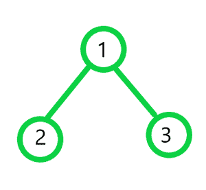
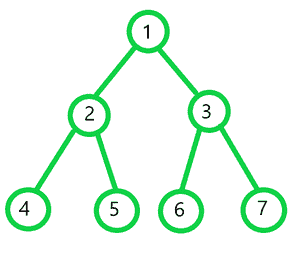

# 使用单个堆栈对二叉树进行前序、后序和有序遍历

> 原文:[https://www . geesforgeks . org/preorder-post-order-and-inoder-遍历二叉树-使用单栈/](https://www.geeksforgeeks.org/preorder-postorder-and-inorder-traversal-of-a-binary-tree-using-a-single-stack/)

给定一个[二叉树](https://www.geeksforgeeks.org/binary-tree-data-structure/)，任务是仅使用一个[栈](https://www.geeksforgeeks.org/stack-data-structure-introduction-program/)遍历迭代打印[前序](https://www.geeksforgeeks.org/tree-traversals-inorder-preorder-and-postorder/)、[后序](https://www.geeksforgeeks.org/tree-traversals-inorder-preorder-and-postorder/)和[中二叉树的所有节点。](https://www.geeksforgeeks.org/tree-traversals-inorder-preorder-and-postorder/)

**示例:**

> **输入:**
> 
> [](https://media.geeksforgeeks.org/wp-content/uploads/20201228211302/1-300x277.png)
> 
> **输出:**
> 前序遍历:1 2 3
> 中序遍历:2 1 3
> 后序遍历:2 3 1
> 
> **输入:**
> 
> [](https://media.geeksforgeeks.org/wp-content/uploads/20201228211559/2-300x253.png)
> 
> **输出:**
> 前序遍历:1 2 3 4 5 3 6 7
> 中序遍历:4 2 5 1 6 3 7
> 后序遍历:4 5 2 6 7 3 1

**方法:**只用一个栈就可以解决问题。其思想是通过为每个节点分配一个称为状态码的值来标记二叉树的每个节点，使得值 **1** 表示该节点当前正在进行有序遍历，值 **2** 表示该节点当前正在进行有序遍历，值 **3** 表示该节点正在进行有序遍历。

*   初始化一个[栈<对<节点*，int > >](https://www.geeksforgeeks.org/stack-of-pair-in-c-stl-with-examples/) 说 **S** 。
*   推栈中状态为 **1** 的**根节点**，即**{根，1}。**
*   初始化三个整数[向量](https://www.geeksforgeeks.org/initialize-a-vector-in-cpp-different-ways/)表示**前序**、**中序**和**后序**。
*   [遍历堆栈](https://www.geeksforgeeks.org/stack-in-cpp-stl/)直到[堆栈为空](https://www.geeksforgeeks.org/stack-empty-method-in-java/)并检查以下情况:
    *   如果栈的 [**顶节点**的状态为 **1** ，则将栈](https://www.geeksforgeeks.org/stack-top-c-stl/)的 [**顶节点**的状态更新为 **2** ，将向量**中的**顶节点推至前序，如果不是**空【T21**](https://www.geeksforgeeks.org/stack-top-c-stl/)
    *   如果栈的**顶节点**的状态为 **2** ，则将栈的**顶节点**的状态更新为 **3** ，将向量**中的**顶节点**推至**，如果栈中的**顶节点**不是**空**则插入**右子**。
    *   如果堆栈的**顶部节点**的状态为 **3** ，则按矢量**后置**中的**顶部节点**，然后[弹出顶部元素。](https://www.geeksforgeeks.org/stack-top-c-stl/)
*   最后，打印矢量**的前序**、**的中序**和**的后序**。

下面是上述方法的实现:

## C++

```
// C++ program for the above approach

#include <bits/stdc++.h>
using namespace std;

// Structure of the
// node of a binary tree
struct Node {
    int data;
    struct Node *left, *right;

    Node(int data)
    {
        this->data = data;
        left = right = NULL;
    }
};

// Function to print all nodes of a
// binary tree in Preorder, Postorder
// and Inorder using only one stack
void allTraversal(Node* root)
{
    // Stores preorder traversal
    vector<int> pre;

    // Stores inorder traversal
    vector<int> post;

    // Stores postorder traversal
    vector<int> in;

    // Stores the nodes and the order
    // in which they are currently visited
    stack<pair<Node*, int> > s;

    // Push root node of the tree
    // into the stack
    s.push(make_pair(root, 1));

    // Traverse the stack while
    // the stack is not empty
    while (!s.empty()) {

        // Stores the top
        // element of the stack
        pair<Node*, int> p = s.top();

        // If the status of top node
        // of the stack is 1
        if (p.second == 1) {

            // Update the status
            // of top node
            s.top().second++;

            // Insert the current node
            // into preorder, pre[]
            pre.push_back(p.first->data);

            // If left child is not NULL
            if (p.first->left) {

                // Insert the left subtree
                // with status code 1
                s.push(make_pair(
                    p.first->left, 1));
            }
        }

        // If the status of top node
        // of the stack is 2
        else if (p.second == 2) {

            // Update the status
            // of top node
            s.top().second++;

            // Insert the current node
            // in inorder, in[]
            in.push_back(p.first->data);

            // If right child is not NULL
            if (p.first->right) {

                // Insert the right subtree into
                // the stack with status code 1
                s.push(make_pair(
                    p.first->right, 1));
            }
        }

        // If the status of top node
        // of the stack is 3
        else {

            // Push the current node
            // in post[]
            post.push_back(p.first->data);

            // Pop the top node
            s.pop();
        }
    }

    cout << "Preorder Traversal: ";
    for (int i = 0; i < pre.size(); i++) {
        cout << pre[i] << " ";
    }
    cout << "\n";

    // Printing Inorder
    cout << "Inorder Traversal: ";

    for (int i = 0; i < in.size(); i++) {
        cout << in[i] << " ";
    }
    cout << "\n";

    // Printing Postorder
    cout << "Postorder Traversal: ";

    for (int i = 0; i < post.size(); i++) {
        cout << post[i] << " ";
    }
    cout << "\n";
}

// Driver Code
int main()
{

    // Creating the root
    struct Node* root = new Node(1);
    root->left = new Node(2);
    root->right = new Node(3);
    root->left->left = new Node(4);
    root->left->right = new Node(5);
    root->right->left = new Node(6);
    root->right->right = new Node(7);

    // Function call
    allTraversal(root);

    return 0;
}
```

## Java 语言(一种计算机语言，尤用于创建网站)

```
// Java program for the above approach
import java.util.ArrayList;
import java.util.Stack;

class GFG
{

    static class Pair
    {
        Node first;
        int second;

        public Pair(Node first, int second)
        {
            this.first = first;
            this.second = second;
        }
    }

    // Structure of the
    // node of a binary tree
    static class Node
    {
        int data;
        Node left, right;

        Node(int data)
        {
            this.data = data;
            left = right = null;
        }
    };

    // Function to print all nodes of a
    // binary tree in Preorder, Postorder
    // and Inorder using only one stack
    static void allTraversal(Node root)
    {

        // Stores preorder traversal
        ArrayList<Integer> pre = new ArrayList<>();

        // Stores inorder traversal
        ArrayList<Integer> in = new ArrayList<>();

        // Stores postorder traversal
        ArrayList<Integer> post = new ArrayList<>();

        // Stores the nodes and the order
        // in which they are currently visited
        Stack<Pair> s = new Stack<>();

        // Push root node of the tree
        // into the stack
        s.push(new Pair(root, 1));

        // Traverse the stack while
        // the stack is not empty
        while (!s.empty())
        {

            // Stores the top
            // element of the stack
            Pair p = s.peek();

            // If the status of top node
            // of the stack is 1
            if (p.second == 1)
            {

                // Update the status
                // of top node
                s.peek().second++;

                // Insert the current node
                // into preorder, pre[]
                pre.add(p.first.data);

                // If left child is not null
                if (p.first.left != null)
                {

                    // Insert the left subtree
                    // with status code 1
                    s.push(new Pair(p.first.left, 1));
                }
            }

            // If the status of top node
            // of the stack is 2
            else if (p.second == 2) {

                // Update the status
                // of top node
                s.peek().second++;

                // Insert the current node
                // in inorder, in[]
                in.add(p.first.data);

                // If right child is not null
                if (p.first.right != null) {

                    // Insert the right subtree into
                    // the stack with status code 1
                    s.push(new Pair(p.first.right, 1));
                }
            }

            // If the status of top node
            // of the stack is 3
            else {

                // Push the current node
                // in post[]
                post.add(p.first.data);

                // Pop the top node
                s.pop();
            }
        }

        System.out.print("Preorder Traversal: ");
        for (int i : pre) {
            System.out.print(i + " ");
        }
        System.out.println();

        // Printing Inorder
        System.out.print("Inorder Traversal: ");
        for (int i : in) {
            System.out.print(i + " ");
        }
        System.out.println();

        // Printing Postorder
        System.out.print("Postorder Traversal: ");
        for (int i : post) {
            System.out.print(i + " ");
        }
        System.out.println();
    }

    // Driver Code
    public static void main(String[] args) {

        // Creating the root
        Node root = new Node(1);
        root.left = new Node(2);
        root.right = new Node(3);
        root.left.left = new Node(4);
        root.left.right = new Node(5);
        root.right.left = new Node(6);
        root.right.right = new Node(7);

        // Function call
        allTraversal(root);

    }
}

    // This code is contributed by sanjeev255
```

## 蟒蛇 3

```
# Python3 program for the above approach

# Structure of the
# node of a binary tree
class Node:
    def __init__(self, x):
        self.data = x
        self.left = None
        self.right = None

# Function to print all nodes of a
# binary tree in Preorder, Postorder
# and Inorder using only one stack
def allTraversal(root):

    # Stores preorder traversal
    pre = []

    # Stores inorder traversal
    post = []

    # Stores postorder traversal
    inn = []

    # Stores the nodes and the order
    # in which they are currently visited
    s = []

    # Push root node of the tree
    # into the stack
    s.append([root, 1])

    # Traverse the stack while
    # the stack is not empty
    while (len(s) > 0):

        # Stores the top
        # element of the stack
        p = s[-1]
        #del s[-1]

        # If the status of top node
        # of the stack is 1
        if (p[1] == 1):

            # Update the status
            # of top node
            s[-1][1] += 1

            # Insert the current node
            # into preorder, pre[]
            pre.append(p[0].data)

            # If left child is not NULL
            if (p[0].left):

                # Insert the left subtree
                # with status code 1
                s.append([p[0].left, 1])

        # If the status of top node
        # of the stack is 2
        elif (p[1] == 2):

            # Update the status
            # of top node
            s[-1][1] += 1

            # Insert the current node
            # in inorder, in[]
            inn.append(p[0].data);

            # If right child is not NULL
            if (p[0].right):

                # Insert the right subtree into
                # the stack with status code 1
                s.append([p[0].right, 1])

        # If the status of top node
        # of the stack is 3
        else:

            # Push the current node
            # in post[]
            post.append(p[0].data);

            # Pop the top node
            del s[-1]

    print("Preorder Traversal: ",end=" ")
    for i in pre:
        print(i,end=" ")
    print()

    # Printing Inorder
    print("Inorder Traversal: ",end=" ")

    for i in inn:
        print(i,end=" ")
    print()

    # Printing Postorder
    print("Postorder Traversal: ",end=" ")

    for i in post:
        print(i,end=" ")
    print()

# Driver Code
if __name__ == '__main__':

    # Creating the root
    root = Node(1)
    root.left = Node(2)
    root.right = Node(3)
    root.left.left = Node(4)
    root.left.right = Node(5)
    root.right.left = Node(6)
    root.right.right = Node(7)

    # Function call
    allTraversal(root)

    # This code is contributed by mohit kumar 29.
```

## C#

```
// C# program for the above approach
using System;
using System.Collections.Generic;
class GFG {

    // Class containing left and
    // right child of current
    // node and key value
    class Node {

        public int data;
        public Node left, right;

        public Node(int x)
        {
            data = x;
            left = right = null;
        }
    }

    // Function to print all nodes of a
    // binary tree in Preorder, Postorder
    // and Inorder using only one stack
    static void allTraversal(Node root)
    {

        // Stores preorder traversal
        List<int> pre = new List<int>();

        // Stores inorder traversal
        List<int> In = new List<int>();

        // Stores postorder traversal
        List<int> post = new List<int>();

        // Stores the nodes and the order
        // in which they are currently visited
        Stack<Tuple<Node, int>> s = new Stack<Tuple<Node, int>>();

        // Push root node of the tree
        // into the stack
        s.Push(new Tuple<Node, int>(root, 1));

        // Traverse the stack while
        // the stack is not empty
        while (s.Count > 0)
        {

            // Stores the top
            // element of the stack
            Tuple<Node, int> p = s.Peek();

            // If the status of top node
            // of the stack is 1
            if (p.Item2 == 1)
            {

                // Update the status
                // of top node
                Tuple<Node, int> temp = s.Peek();
                temp = new Tuple<Node, int>(temp.Item1, temp.Item2 + 1);
                s.Pop();
                s.Push(temp);

                // Insert the current node
                // into preorder, pre[]
                pre.Add(p.Item1.data);

                // If left child is not null
                if (p.Item1.left != null)
                {

                    // Insert the left subtree
                    // with status code 1
                    s.Push(new Tuple<Node, int>(p.Item1.left, 1));
                }
            }

            // If the status of top node
            // of the stack is 2
            else if (p.Item2 == 2) {

                // Update the status
                // of top node
                Tuple<Node, int> temp = s.Peek();
                temp = new Tuple<Node, int>(temp.Item1, temp.Item2 + 1);
                s.Pop();
                s.Push(temp);

                // Insert the current node
                // in inorder, in[]
                In.Add(p.Item1.data);

                // If right child is not null
                if (p.Item1.right != null) {

                    // Insert the right subtree into
                    // the stack with status code 1
                    s.Push(new Tuple<Node, int>(p.Item1.right, 1));
                }
            }

            // If the status of top node
            // of the stack is 3
            else {

                // Push the current node
                // in post[]
                post.Add(p.Item1.data);

                // Pop the top node
                s.Pop();
            }
        }

        Console.Write("Preorder Traversal: ");
        foreach(int i in pre) {
            Console.Write(i + " ");
        }
        Console.WriteLine();

        // Printing Inorder
        Console.Write("Inorder Traversal: ");
        foreach(int i in In) {
            Console.Write(i + " ");
        }
        Console.WriteLine();

        // Printing Postorder
        Console.Write("Postorder Traversal: ");
        foreach(int i in post) {
            Console.Write(i + " ");
        }
        Console.WriteLine();
    }

  static void Main() {
    // Creating the root
    Node root = new Node(1);
    root.left = new Node(2);
    root.right = new Node(3);
    root.left.left = new Node(4);
    root.left.right = new Node(5);
    root.right.left = new Node(6);
    root.right.right = new Node(7);

    // Function call
    allTraversal(root);
  }
}

// This code is contributed by suresh07.
```

## java 描述语言

```
<script>

// Javascript program for the above approach
class Pair
{
    constructor(first, second)
    {
        this.first = first;
        this.second = second;
    }
}

// Structure of the
// node of a binary tree
class Node
{
    constructor(data)
    {
        this.data = data;
        this.left = this.right = null;
    }
}

// Function to print all nodes of a
// binary tree in Preorder, Postorder
// and Inorder using only one stack
function allTraversal(root)
{

    // Stores preorder traversal
    let pre = [];

    // Stores inorder traversal
    let In = [];

    // Stores postorder traversal
    let post = [];

    // Stores the nodes and the order
    // in which they are currently visited
    let s = [];

    // Push root node of the tree
    // into the stack
    s.push(new Pair(root, 1));

    // Traverse the stack while
    // the stack is not empty
    while (s.length != 0)
    {

        // Stores the top
        // element of the stack
        let p = s[s.length - 1];

        // If the status of top node
        // of the stack is 1
        if (p.second == 1)
        {

            // Update the status
            // of top node
            s[s.length - 1].second++;

            // Insert the current node
            // into preorder, pre[]
            pre.push(p.first.data);

            // If left child is not null
            if (p.first.left != null)
            {

                // Insert the left subtree
                // with status code 1
                s.push(new Pair(p.first.left, 1));
            }
        }

        // If the status of top node
        // of the stack is 2
        else if (p.second == 2)
        {

            // Update the status
            // of top node
            s[s.length - 1].second++;

            // Insert the current node
            // in inorder, in[]
            In.push(p.first.data);

            // If right child is not null
            if (p.first.right != null)
            {

                // Insert the right subtree into
                // the stack with status code 1
                s.push(new Pair(p.first.right, 1));
            }
        }

        // If the status of top node
        // of the stack is 3
        else
        {

            // Push the current node
            // in post[]
            post.push(p.first.data);

            // Pop the top node
            s.pop();
        }
    }

    document.write("Preorder Traversal: ");
    for(let i = 0; i < pre.length; i++)
    {
        document.write(pre[i] + " ");
    }
    document.write("<br>");

    // Printing Inorder
    document.write("Inorder Traversal: ");
    for(let i = 0; i < In.length; i++)
    {
        document.write(In[i] + " ");
    }
    document.write("<br>");

    // Printing Postorder
    document.write("Postorder Traversal: ");
    for(let i = 0; i < post.length; i++)
    {
        document.write(post[i] + " ");
    }
    document.write("<br>");
}

// Driver Code

// Creating the root
let root = new Node(1);
root.left = new Node(2);
root.right = new Node(3);
root.left.left = new Node(4);
root.left.right = new Node(5);
root.right.left = new Node(6);
root.right.right = new Node(7);

// Function call
allTraversal(root);

// This code is contributed by unknown2108

</script>
```

**Output:** 

```
Preorder Traversal: 1 2 4 5 3 6 7 
Inorder Traversal: 4 2 5 1 6 3 7 
Postorder Traversal: 4 5 2 6 7 3 1
```

***时间复杂度:**O(N)*
T5**辅助空间:** O(N)