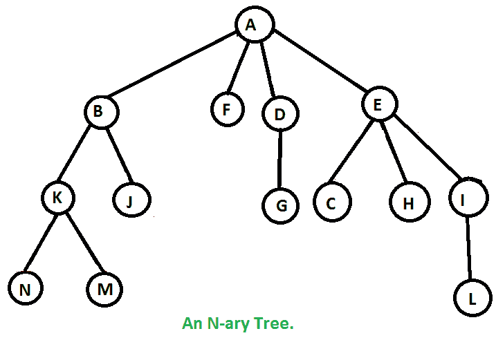

# 无递归 N 元树的前序遍历

> 原文:[https://www . geesforgeks . org/preorder-遍历 n 元树而不递归/](https://www.geeksforgeeks.org/preorder-traversal-of-n-ary-tree-without-recursion/)

给定一个 n 元树，打印它的前序遍历。

**示例:**

> 下树的前序遍历是**A B K N M J F D G E C H I L**T2】
> 
> 

其思想是使用类似[的栈迭代二叉树的前序遍历](https://www.geeksforgeeks.org/iterative-preorder-traversal/)。
1)创建一个空堆栈来存储节点。
2)将根节点推送到堆栈。
3)当堆栈不为空时运行一个循环
…。a)从堆栈中弹出顶部节点。
…。b)打印弹出的节点。
…。c)将弹出节点的所有子节点存储到堆栈中。我们必须从右向左存储子节点，以便最左边的节点首先弹出。
4)如果堆栈为空，那么我们就完成了。

## C++

```
// C++ program to traverse an N-ary tree
// without recursion
#include <bits/stdc++.h>
using namespace std;

// Structure of a node of an n-ary tree
struct Node {
    char key;
    vector<Node*> child;
};

// Utility function to create a new tree node
Node* newNode(int key)
{
    Node* temp = new Node;
    temp->key = key;
    return temp;
}

// Function to traverse tree without recursion
void traverse_tree(struct Node* root)
{
    // Stack to store the nodes
    stack<Node*> nodes;

    // push the current node onto the stack
    nodes.push(root);

    // loop while the stack is not empty
    while (!nodes.empty()) {

        // store the current node and pop it from the stack
        Node* curr = nodes.top();
        nodes.pop();

        // current node has been travarsed
     if(curr != NULL)
      {
         cout << curr->key << " ";

        // store all the childrent of current node from
        // right to left.
        vector<Node*>::iterator it = curr->child.end();

        while (it != curr->child.begin()) {
            it--;
            nodes.push(*it);
        }
      }
    }
}
// Driver program
int main()
{
    /*   Let us create below tree
   *            A
   *        /  / \  \
   *       B  F   D  E
   *      / \     |  /|\
   *     K  J     G C H I
   *    / \         |   |
   *   N   M        O   L
   */

    Node* root = newNode('A');
    (root->child).push_back(newNode('B'));
    (root->child).push_back(newNode('F'));
    (root->child).push_back(newNode('D'));
    (root->child).push_back(newNode('E'));
    (root->child[0]->child).push_back(newNode('K'));
    (root->child[0]->child).push_back(newNode('J'));
    (root->child[2]->child).push_back(newNode('G'));
    (root->child[3]->child).push_back(newNode('C'));
    (root->child[3]->child).push_back(newNode('H'));
    (root->child[3]->child).push_back(newNode('I'));
    (root->child[0]->child[0]->child).push_back(newNode('N'));
    (root->child[0]->child[0]->child).push_back(newNode('M'));
    (root->child[3]->child[0]->child).push_back(newNode('O'));
    (root->child[3]->child[2]->child).push_back(newNode('L'));

    traverse_tree(root);

    return 0;
}
```

## Java 语言(一种计算机语言，尤用于创建网站)

```
// Java program to traverse an N-ary tree
// without recursion
import java.util.ArrayList;
import java.util.Stack;

class GFG{

// Structure of a node of
// an n-ary tree
static class Node
{
    char key;
    ArrayList<Node> child;

    public Node(char key)
    {
        this.key = key;
        child = new ArrayList<>();
    }
};

// Function to traverse tree without recursion
static void traverse_tree(Node root)
{

    // Stack to store the nodes
    Stack<Node> nodes = new Stack<>();

    // push the current node onto the stack
    nodes.push(root);

    // Loop while the stack is not empty
    while (!nodes.isEmpty())
    {

        // Store the current node and pop
        // it from the stack
        Node curr = nodes.pop();

        // Current node has been travarsed
        if (curr != null)
        {
            System.out.print(curr.key + " ");

            // Store all the childrent of
            // current node from right to left.
            for(int i = curr.child.size() - 1; i >= 0; i--)
            {
                nodes.add(curr.child.get(i));
            }
        }
    }
}

// Driver code
public static void main(String[] args)
{

    /*   Let us create below tree
    *            A
    *        /  / \  \
    *       B  F   D  E
    *      / \     |  /|\
    *     K  J     G C H I
    *    / \         |   |
    *   N   M        O   L
    */

    Node root = new Node('A');
    (root.child).add(new Node('B'));
    (root.child).add(new Node('F'));
    (root.child).add(new Node('D'));
    (root.child).add(new Node('E'));
    (root.child.get(0).child).add(new Node('K'));
    (root.child.get(0).child).add(new Node('J'));
    (root.child.get(2).child).add(new Node('G'));
    (root.child.get(3).child).add(new Node('C'));
    (root.child.get(3).child).add(new Node('H'));
    (root.child.get(3).child).add(new Node('I'));
    (root.child.get(0).child.get(0).child).add(new Node('N'));
    (root.child.get(0).child.get(0).child).add(new Node('M'));
    (root.child.get(3).child.get(0).child).add(new Node('O'));
    (root.child.get(3).child.get(2).child).add(new Node('L'));

    traverse_tree(root);
}
}

// This code is contributed by sanjeev2552
```

## 蟒蛇 3

```
# Python3 program to find height of
# full binary tree
# using preorder

class newNode():

    def __init__(self, key):
        self.key = key
        # all children are stored in a list
        self.child =[]

# Function to traverse tree without recursion
def traverse_tree(root):

    # Stack to store the nodes
    nodes=[]

    # push the current node onto the stack
    nodes.append(root)

    # loop while the stack is not empty
    while (len(nodes)): 

        # store the current node and pop it from the stack
        curr = nodes[0]
        nodes.pop(0)

        # current node has been travarsed
        print(curr.key,end=" ")
        # store all the childrent of current node from
        # right to left.
        for it in range(len(curr.child)-1,-1,-1): 
            nodes.insert(0,curr.child[it])

# Driver program to test above functions
if __name__ == '__main__':
    """   Let us create below tree 
   *            A 
   *        /  / \  \ 
   *       B  F   D  E 
   *      / \     |  /|\ 
   *     K  J     G C H I 
   *    / \         |   | 
   *   N   M        O   L 
   """
    root = newNode('A')
    (root.child).append(newNode('B'))
    (root.child).append(newNode('F'))
    (root.child).append(newNode('D'))
    (root.child).append(newNode('E'))
    (root.child[0].child).append(newNode('K'))
    (root.child[0].child).append(newNode('J'))
    (root.child[2].child).append(newNode('G'))
    (root.child[3].child).append(newNode('C'))
    (root.child[3].child).append(newNode('H'))
    (root.child[3].child).append(newNode('I'))
    (root.child[0].child[0].child).append(newNode('N'))
    (root.child[0].child[0].child).append(newNode('M'))
    (root.child[3].child[0].child).append(newNode('O'))
    (root.child[3].child[2].child).append(newNode('L'))

    traverse_tree(root)

# This code is contributed by SHUBHAMSINGH10
```

## C#

```
// C# program to traverse an N-ary tree
// without recursion
using System;
using System.Collections.Generic;

public class GFG{

// Structure of a node of
// an n-ary tree
public class Node
{
    public char key;
    public List<Node> child;

    public Node(char key)
    {
        this.key = key;
        child = new List<Node>();
    }
};

// Function to traverse tree without recursion
static void traverse_tree(Node root)
{

    // Stack to store the nodes
    Stack<Node> nodes = new Stack<Node>();

    // push the current node onto the stack
    nodes.Push(root);

    // Loop while the stack is not empty
    while (nodes.Count!=0)
    {

        // Store the current node and pop
        // it from the stack
        Node curr = nodes.Pop();

        // Current node has been travarsed
        if (curr != null)
        {
            Console.Write(curr.key + " ");

            // Store all the childrent of
            // current node from right to left.
            for(int i = curr.child.Count - 1; i >= 0; i--)
            {
                nodes.Push(curr.child[i]);
            }
        }
    }
}

// Driver code
public static void Main(String[] args)
{

    /*   Let us create below tree
    *            A
    *        /  / \  \
    *       B  F   D  E
    *      / \     |  /|\
    *     K  J     G C H I
    *    / \         |   |
    *   N   M        O   L
    */

    Node root = new Node('A');
    (root.child).Add(new Node('B'));
    (root.child).Add(new Node('F'));
    (root.child).Add(new Node('D'));
    (root.child).Add(new Node('E'));
    (root.child[0].child).Add(new Node('K'));
    (root.child[0].child).Add(new Node('J'));
    (root.child[2].child).Add(new Node('G'));
    (root.child[3].child).Add(new Node('C'));
    (root.child[3].child).Add(new Node('H'));
    (root.child[3].child).Add(new Node('I'));
    (root.child[0].child[0].child).Add(new Node('N'));
    (root.child[0].child[0].child).Add(new Node('M'));
    (root.child[3].child[0].child).Add(new Node('O'));
    (root.child[3].child[2].child).Add(new Node('L'));

    traverse_tree(root);
}
}

// This code contributed by shikhasingrajput
```

## java 描述语言

```
<script>

// Javascript program to traverse an N-ary tree
// without recursion

// Structure of a node of
// an n-ary tree
class Node
{
    constructor(key)
    {
        this.key = key;
        this.child = [];
    }
};

// Function to traverse tree without recursion
function traverse_tree(root)
{

    // Stack to store the nodes
    var nodes = [];

    // Push the current node onto the stack
    nodes.push(root);

    // Loop while the stack is not empty
    while (nodes.length != 0)
    {

        // Store the current node and pop
        // it from the stack
        var curr = nodes.pop();

        // Current node has been travarsed
        if (curr != null)
        {
            document.write(curr.key + " ");

            // Store all the childrent of
            // current node from right to left.
            for(var i = curr.child.length - 1;
                    i >= 0; i--)
            {
                nodes.push(curr.child[i]);
            }
        }
    }
}

// Driver code
/*   Let us create below tree
*            A
*        /  / \  \
*       B  F   D  E
*      / \     |  /|\
*     K  J     G C H I
*    / \         |   |
*   N   M        O   L
*/
var root = new Node('A');
(root.child).push(new Node('B'));
(root.child).push(new Node('F'));
(root.child).push(new Node('D'));
(root.child).push(new Node('E'));
(root.child[0].child).push(new Node('K'));
(root.child[0].child).push(new Node('J'));
(root.child[2].child).push(new Node('G'));
(root.child[3].child).push(new Node('C'));
(root.child[3].child).push(new Node('H'));
(root.child[3].child).push(new Node('I'));
(root.child[0].child[0].child).push(new Node('N'));
(root.child[0].child[0].child).push(new Node('M'));
(root.child[3].child[0].child).push(new Node('O'));
(root.child[3].child[2].child).push(new Node('L'));

traverse_tree(root);

// This code is contributed by rutvik_56

</script>
```

**Output:** 

```
A B K N M J F D G E C O H I L
```