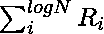

# 制算法

> 原文:[https://www.geeksforgeeks.org/preparata-algorithm/](https://www.geeksforgeeks.org/preparata-algorithm/)

**法瑞尔算法**是一种[递归](https://www.geeksforgeeks.org/recursion/) [分治算法](https://www.geeksforgeeks.org/divide-and-conquer-introduction/)，计算每个输入键的等级，并根据它们的等级输出键。

## C++

```
m[i, j] := M[i, j]
for 1 <= i, j <= n in parallel;

for
    r : = 1 to logn do
    {
    Step 1\. In parallel set q[i, j, k] := m[i, j] + m[j, k] for
    1 <= i, j, k <= n.

    Step 2\. In parallel set m[i, j] := min
    {
        q[i, l, j], q[i, 2, j], ..., q[i, n, j]
    }
     for
         1 <= i, j <= n.
    }
Put M(i)(i):=0 for all i and M(i)(j):=m[i, j] for i≠j
```

在上述程序中 **O(N <sup>3</sup> )** 全局内存是使用变量**m【I，j】**为 **1 ≤ i，j ≤ N** 和**q【I，j，k】**为 **1 ≤ i，j，k ≤ N** 。

*   初始化 m[ ]需要 O(N <sup>2</sup> )时间。
*   上述算法的步骤 1 在使用 3 个处理器时需要 O(1)个时间。
*   在步骤 2 中，计算 N <sup>2</sup> 个不同的**m【I，j】**的数量。

单个**m【z，j】**的计算涉及到计算最少的 **N** 个数字，因此可以在 ***O(1)时间*** 使用 **N <sup>2</sup> CRCW PRAM 处理器**完成。事实上，这个最小值也可以在 ***O(1)时间*** 中使用 **n <sup>(1 + e)</sup>** 处理器针对任何固定的 **e > 0** 进行计算。

**使用 **n <sup>(3 + e)</sup>** 通用 **CRCW PRAM 处理器**可以在 **O(1)时间**完成步骤 2** 。因此，for 循环在 ***O(log N)*** 时间运行。使用 **N <sup>2</sup>** 处理器也可以在 O(1)时间内完成 **M** 的最终计算。

通过对 **R** 的归纳，可以证明上述算法的正确性。可以看出，for 循环的 **r <sup>次</sup>迭代**结束时的**m【I，j】**的值为 min，最小值取 **{1，2，…，N}** 的所有元素序列，使得 **k < 2R** 。上述算法可以专门解决传递闭包、连通分量、最小生成树等问题。

设 k1，k2，…，kn 为输入序列。法里德的算法将输入分成 **log N 个部分** K1，K2，…，如果 log N；其中在每个部分中有 N/log N 个键。
如果 k 是输入中的任意键，其在输入中的排名计算如下。首先，为每个 **i** 、 **1 < i < log N** 计算 **k** 的等级 **Ri** 。然后，k 的总秩计算为。利用上述算法的结果之一。

法里德算法的细节如下。

考虑 **T(N)** 为使用 **N*log N** 处理器的法里德算法的运行时间。显然，第一步需要*T5(N/log N)时间* ，第二步和第三步一起需要 ***O(log(log N))时间*** 。因此，有

> T(N)= T(N/对数 N) + O(对数(对数 N))

可通过反复代入求解得到 T(N) = O(对数 N)。此外，每个步骤中使用的处理器数量是 N*log N

**<u>法瑞尔的排序算法</u>**

以下是法瑞排序算法的步骤:

*   如果 **N** 是一个小常数，使用任何算法排序键并退出。
*   将给定的 **N** 键划分为 **log N** 部分，每个部分都有 **N/(log N)** 键。
*   并行递归单独排序每个部分，为每个部分分配 **N 个**处理器。让**S<sub>1</sub>T5、 **S <sub>2</sub>** 、…、 **S <sub>log N</sub>** 为排序后的序列。**
*   将**S<sub>I</sub>T3】与**S<sub>j</sub>T7】合并为 **1 < i，j < log N** 并列。这可以通过为每对(I，j)分配 **N** / **(log N)** 处理器来实现。即使用 **N*log N** 处理器，这一步可以在 ***O(log(log N))时间*** 用算法完成。作为该合并步骤的副产品，计算每个 S<sub>I</sub>S(1<I<T22】log N**中每个键的等级。**
*   分配 **log N** 处理器计算原始输入中每个键的排名。通过在步骤 2 中添加计算的**对数 N** 等级(对于每个键)，对所有键并行执行此操作。这可以在 ***O(log(log N))时间*** 使用前缀计算算法完成。
*   最后，键按照它们的排列顺序书写。

下面是上述方法的实现:

## 蟒蛇 3

```
# Python program to implement Preparata's
# a time-optimal parallel algorithm

class func:
    def __init__(self, x, y):
        self.x = x
        self.y = y

# Function to find the left index of
# the given set of points
def Left_index(points):

    # Finding the point on plane
    minn = 0

    # Traverse the given points
    for i in range(1, len(points)):

          # Update the value of minn
        if points[i].x < points[minn].x:
            minn = i
        elif points[i].x == points[minn].x:
            if points[i].y > points[minn].y:
                minn = i

    # Return the value of min
    return minn

# Function to perform the parallel
# process in the preparata's algorithm
# according to the value of p, q, r
def parallel(p, q, r):

    # For the three-dimensional
    val = (q.y - p.y) * (r.x - q.x) - \
        (q.x - p.x) * (r.y - q.y)

    if val == 0:
        return 0
    elif val > 0:
        return 1
    else:
        return 2

# Function to perform the parallel
# process in the preparata's algorithm
def preparata(points, n):

    # There must be at least 3 points
    if n < 3:
        return

    # Find the leftmost point
    l = Left_index(points)

    pre = []

    p = l
    q = 0
    while(True):

        # Add current point to result
        pre.append(p)

        q = (p + 1) % n

        for i in range(n):

            # If i is more counterclockwise
            # than current q, then update q
            if(parallel(points[p],
                        points[i], points[q]) == 2):
                q = i

        p = q

        # While it doesn't come to first point
        if(p == l):
            break

    # Print Result
    for each in pre:
        print(points[each].x, points[each].y)

# Driver Code

algo = []
algo.append(func(0, 3))
algo.append(func(2, 2))
algo.append(func(1, 1))
algo.append(func(2, 1))
algo.append(func(3, 0))
algo.append(func(0, 0))
algo.append(func(3, 3))

# Function Call
preparata(algo, len(algo))
```

**Output**

```
0 3
0 0
3 0
3 3
```