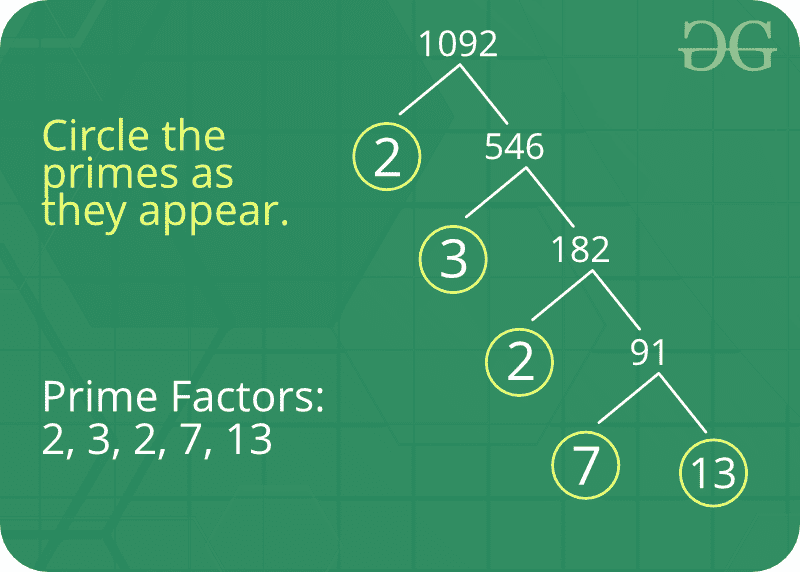

# 质因数

> 原文:[https://www.geeksforgeeks.org/prime-factor/](https://www.geeksforgeeks.org/prime-factor/)

质因数是给定数的因数，它是一个[质数](https://www.geeksforgeeks.org/prime-numbers/)。因子是你乘在一起得到另一个数的数。简而言之，质因数就是找出哪些质数相乘就成了原始数。

**例:**15 的质因数是 3 和 5(因为 3×5=15，3 和 5 是质数)。



**关于质因数的一些有趣的事实:**

1.  只有一个(独一无二！)任意数的质因数集。
2.  为了保持唯一素因子分解的这一性质，有必要将数字 1 归类为既不是素的也不是复合的。
3.  质因数分解可以帮助我们进行可除性，简化分数，并找到分数的公共分母。
4.  [波拉德的 Rho](https://www.geeksforgeeks.org/pollards-rho-algorithm-prime-factorization/) 是一种素因子分解算法，对于具有小素因子的大[合成数](https://www.geeksforgeeks.org/composite-number/)特别快。
5.  密码学是对密码的研究。质因数分解对于那些试图根据数字制作(或破解)密码的人来说非常重要。

**如何打印一个数的质因数？**
**天真解:**
给定一个数字 n，写一个函数打印 n 的所有质因数，例如，如果输入数字是 12，那么输出应该是“2 2 3”，如果输入数字是 315，那么输出应该是“3 3 5 7”。

以下是寻找所有主要因素的步骤:

1.  当 *n* 可被 2 整除时，打印 2 并除以 2。
2.  第 1 步后， *n* 一定是奇数。现在开始一个从 i = 3 到 *n* 平方根的循环。当 *i* 除 *n* 时，打印 *i* 并将 *n* 除以 *i* ，将 *i* 增加 2 并继续。
3.  如果 *n* 是素数并且大于 2，那么 *n* 不会通过以上两步变成 1。如果大于 2，则打印 *n* 。

## C++

```
// Program to print all prime factors 
# include <stdio.h> 
# include <math.h> 

// A function to print all prime factors of a given number n 
void primeFactors(int n) 
{ 
    // Print the number of 2s that divide n 
    while (n%2 == 0) 
    { 
        printf("%d ", 2); 
        n = n/2; 
    } 

    // n must be odd at this point.  So we can skip  
    // one element (Note i = i +2) 
    for (int i = 3; i <= sqrt(n); i = i+2) 
    { 
        // While i divides n, print i and divide n 
        while (n%i == 0) 
        { 
            printf("%d ", i); 
            n = n/i; 
        } 
    } 

    // This condition is to handle the case when n  
    // is a prime number greater than 2 
    if (n > 2) 
        printf ("%d ", n); 
} 

/* Driver program to test above function */
int main() 
{ 
    int n = 315; 
    primeFactors(n); 
    return 0; 
}
```

## Java 语言(一种计算机语言，尤用于创建网站)

```
// Program to print all prime factors
import java.io.*;
import java.lang.Math;

class GFG {
    // A function to print all prime factors
    // of a given number n
    public static void primeFactors(int n)
    {
        // Print the number of 2s that divide n
        while (n % 2 == 0) {
            System.out.print(2 + " ");
            n /= 2;
        }

        // n must be odd at this point.  So we can
        // skip one element (Note i = i +2)
        for (int i = 3; i <= Math.sqrt(n); i += 2) {
            // While i divides n, print i and divide n
            while (n % i == 0) {
                System.out.print(i + " ");
                n /= i;
            }
        }

        // This condition is to handle the case when
        // n is a prime number greater than 2
        if (n > 2)
            System.out.print(n);
    }

    public static void main(String[] args)
    {
        int n = 315;
        primeFactors(n);
    }
}
```

## 计算机编程语言

```
# Python program to print prime factors

import math

# A function to print all prime factors of
# a given number n
def primeFactors(n):

    # Print the number of two's that divide n
    while n % 2 == 0:
        print 2,
        n = n / 2

    # n must be odd at this point
    # so a skip of 2 ( i = i + 2) can be used
    for i in range(3, int(math.sqrt(n))+1, 2):

        # while i divides n, print i ad divide n
        while n % i == 0:
            print i,
            n = n / i

    # Condition if n is a prime
    # number greater than 2
    if n > 2:
        print n

# Driver Program to test above function

n = 315
primeFactors(n)

# This code is contributed by Harshit Agrawal
```

## C#

```
// C# Program to print all prime factors
using System;

namespace prime {
public class GFG {

    // A function to print all prime
    // factors of a given number n
    public static void primeFactors(int n)
    {
        // Print the number of 2s that divide n
        while (n % 2 == 0) {
            Console.Write(2 + " ");
            n /= 2;
        }

        // n must be odd at this point. So we can
        // skip one element (Note i = i +2)
        for (int i = 3; i <= Math.Sqrt(n); i += 2) {
            // While i divides n, print i and divide n
            while (n % i == 0) {
                Console.Write(i + " ");
                n /= i;
            }
        }

        // This condition is to handle the case when
        // n is a prime number greater than 2
        if (n > 2)
            Console.Write(n);
    }

    // Driver Code
    public static void Main()
    {
        int n = 315;
        primeFactors(n);
    }
}
}

// This code is contributed by Sam007
```

## 服务器端编程语言（Professional Hypertext Preprocessor 的缩写）

```
<?php
// PHP Efficient program to print all
// prime factors of a given number

// function to print all prime
// factors of a given number n
function primeFactors($n)
{

    // Print the number of
    // 2s that divide n
    while($n % 2 == 0)
    {
        echo 2, " ";
        $n = $n / 2;
    }

    // n must be odd at this
    // point. So we can skip
    // one element (Note i = i +2)
    for ($i = 3; $i <= sqrt($n);
                   $i = $i + 2)
    {

        // While i divides n,
        // print i and divide n
        while ($n % $i == 0)
        {
            echo $i, " ";
            $n = $n / $i;
        }
    }

    // This condition is to
    // handle the case when n
    // is a prime number greater
    // than 2
    if ($n > 2)
        echo $n, " ";
}

    // Driver Code
    $n = 315;
    primeFactors($n);

// This code is contributed by aj_36
?>
```

## java 描述语言

```
<script>

// Javascript program to print all prime factors
// A function to print all prime
// factors of a given number n
function primeFactors(n)
{
    // Print the number of 2s that divide n
    while (n % 2 == 0)
    {
        document.write(2 + " ");
        n = Math.floor(n/2);
    }

    // n must be odd at this point. So we can skip
    // one element (Note i = i +2)
    for (let i = 3; i <= Math.sqrt(n); i = i + 2)
    {
        // While i divides n, print i and divide n
        while (n % i == 0)
        {
            document.write(i + " ");
            n = Math.floor(n/i);
        }
    }

    // This condition is to handle the case when n
    // is a prime number greater than 2
    if (n > 2)
        document.write(n + " ");
}

/* Driver code */

    let n = 315;
    primeFactors(n);

// This is code is contributed by Mayank Tyagi

</script>
```

**输出:**

```
3 3 5 7
```

**这是如何工作的？**

*   步骤 1 和 2 处理[复合数](https://www.geeksforgeeks.org/composite-number/)，步骤-3 处理素数。为了证明完整的算法是有效的，我们需要证明步骤 1 和 2 实际上处理了复合数。
    很明显，第一步处理偶数。在步骤 1 之后，所有剩余的质因数必须是奇数(两个质因数之差必须至少为 2)，这解释了为什么 I 增加 2。
*   现在主要部分是，循环一直到 *n* 的平方根。为了证明这种优化是有效的，让我们考虑复合数的以下性质。

> 每个复合数至少有一个小于或等于其平方根的质因数。

*   这个性质可以用 counter 语句来证明。设 a 和 b 是 n 的两个因子，a*b = n，如果两者都大于√n，那么 a.b > √n，* √n，这与表达式“a * b = n”相矛盾。
*   在上述算法的步骤 2 中，我们运行一个循环并执行以下操作-
    *   求最小质因数 I(必须小于√n，)
    *   通过重复用 I 除 n，从 n 中去掉所有出现的 I。
    *   对分割的 n 和 i = i + 2 重复步骤 a 和 b。重复步骤 a 和 b，直到 n 变成 1 或质数。

**高效解决方案:**

*   [对多个查询使用 0(对数 n)筛的素因子分解](https://www.geeksforgeeks.org/prime-factorization-using-sieve-olog-n-multiple-queries/)

**计算一个数的质因数的程序**

*   [数组乘积的不同素因子](https://www.geeksforgeeks.org/distinct-prime-factors-of-array-product/)
*   [给定数的第 N 个质因数](https://www.geeksforgeeks.org/n-th-prime-factor-of-a-given-number/)
*   [成对打印一个数的因子的程序](https://www.geeksforgeeks.org/program-to-print-factors-of-a-number-in-pairs/)
*   [前 n 个自然数的不同质因数的数量](https://www.geeksforgeeks.org/number-of-distinct-prime-factors-of-first-n-natural-numbers/)
*   [一个数的唯一质因数的乘积](https://www.geeksforgeeks.org/product-unique-prime-factors-number/)

**更多与质因数相关的问题**

*   [从质因数只有 2 和 3 的范围内计数](https://www.geeksforgeeks.org/count-numbers-from-range-whose-prime-factors-are-only-2-and-3/)
*   [两个数的公共质因数](https://www.geeksforgeeks.org/common-prime-factors-of-two-numbers/)
*   [直到 n 的最小素数因子](https://www.geeksforgeeks.org/least-prime-factor-of-numbers-till-n/)
*   [一个数的最小质数](https://www.geeksforgeeks.org/smallest-prime-divisor-of-a-number/)
*   [使用质因数分解的一个数的因子的和](https://www.geeksforgeeks.org/sum-of-factors-of-a-number-using-prime-factorization/)
*   [位数总和等于其所有质因数位数总和的数字](https://www.geeksforgeeks.org/numbers-with-sum-of-digits-equal-to-the-sum-of-digits-of-its-all-prime-factor/)
*   [在 M 到 N 范围内具有最大数量不同质因数的数](https://www.geeksforgeeks.org/number-which-has-the-maximum-number-of-distinct-prime-factors-in-range-m-to-n/)

[**最近关于质因数的文章！**](https://www.geeksforgeeks.org/tag/prime-factor/)