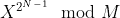
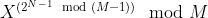

# 素子集乘积问题

> 原文:[https://www.geeksforgeeks.org/prime-subset-product-problem/](https://www.geeksforgeeks.org/prime-subset-product-problem/)

给定一个由 **N** 个整数组成的数组 **arr[]** 。数组子集 **A** 的值被定义为该子集内所有素数的乘积。如果子集中没有素数，则该子集的值为 **1** 。任务是计算给定数组模 **100000007** 的所有可能的非空子集的值的乘积。
**举例:**

> **输入:**arr[]=【3，7】
> **输出:**441
> val({ 3 })= 3
> val({ 7 })= 7
> val({ 3，7}) = 3 * 7 = 21
> 3 * 7 * 21

**方法:**因为已知一个数在给定大小的数组 **N** 的所有子集中出现**2<sup>N–1</sup>T5】次。所以如果一个数 **X** 是质数，那么 **X** 的贡献将是 **X * X * X * …..* 2<sup>N–1</sup>**次，即** 



由于**2<sup>N–1</sup>**也将是一个很大的数字，不能直接计算。[费马定理](https://www.geeksforgeeks.org/find-abm-where-b-is-very-large/)将用于计算此处的功率。



之后，每个元素的值都可以很容易地计算出来。
以下是上述方法的实现:

## C++

```
// C++ implementation of the approach
#include<bits/stdc++.h>
using namespace std;

int power(int a, int b, int mod)
{
    int aa = 1;
    while(b)
    {
        if(b & 1)
        {
            aa = aa * a;
            aa %= mod;
        }
        a = a * a;
        a %= mod;
        b /= 2;
    }
    return aa;
}

// Function to return the prime subset
// product of the given array
int product(int A[], int n)
{

    // Create Sieve to check whether a
    // number is prime or not
    int N = 100010;
    int mod = 1000000007;
    vector<int> prime(N, 1);
    prime[0] = prime[1] = 0;
    int i = 2;
    while (i * i < N)
    {
        if (prime[i])
            for (int j = 2 * i;
                     j <= N;j += i)
                prime[j] = 0;

        i += 1;
    }

    // Length of the array
    // Calculating 2^(n-1) % mod
    int t = power(2, n - 1, mod - 1);

    int ans = 1;

    for (int j = 0; j < n; j++)
    {
        int i = A[j];

        // If element is prime then add
        // its contribution in the result
        if( prime[i])
        {
            ans *= power(i, t, mod);
            ans %= mod;
        }
    }
    return ans;
}

// Driver code
int main()
{
    int A[] = {3, 7};

    int n = sizeof(A) / sizeof(A[0]);

    printf("%d", product(A, n));
}

// This code is contributed by Mohit Kumar
```

## Java 语言(一种计算机语言，尤用于创建网站)

```
// Java implementation of the approach
class GFG
{
static int power(int a, int b, int mod)
{
    int aa = 1;
    while(b > 0)
    {
        if(b % 2 == 1)
        {
            aa = aa * a;
            aa %= mod;
        }
        a = a * a;
        a %= mod;
        b /= 2;
    }
    return aa;
}

// Function to return the prime subset
// product of the given array
static int product(int A[], int n)
{

    // Create Sieve to check whether a
    // number is prime or not
    int N = 100010;
    int mod = 1000000007;
    int []prime = new int[N];
    for (int j = 0; j < N; j++)
    {
        prime[j] = 1;
    }

    prime[0] = prime[1] = 0;
    int i = 2;
    while (i * i < N)
    {
        if (prime[i] == 1)
            for (int j = 2 * i;
                    j < N;j += i)
                prime[j] = 0;

        i += 1;
    }

    // Length of the array
    // Calculating 2^(n-1) % mod
    int t = power(2, n - 1, mod - 1);

    int ans = 1;

    for (int j = 0; j < n; j++)
    {
        i = A[j];

        // If element is prime then add
        // its contribution in the result
        if( prime[i] == 1)
        {
            ans *= power(i, t, mod);
            ans %= mod;
        }
    }
    return ans;
}

// Driver code
public static void main (String[] args)
{
    int A[] = {3, 7};

    int n = A.length;

    System.out.printf("%d", product(A, n));
}
}

// This code is contributed by Rajput-Ji
```

## 蟒蛇 3

```
# Python3 implementation of the approach

# Function to return the prime subset
# product of the given array
def product(A):

    # Create Sieve to check whether a
    # number is prime or not
    N = 100010
    mod = 1000000007
    prime = [1] * N
    prime[0] = prime[1] = 0
    i = 2
    while i * i < N:
        if prime[i]:
            for j in range(i * i, N, i):
                prime[j] = 0

        i += 1

    # Length of the array
    n = len(A)

    # Calculating 2^(n-1) % mod
    t = pow(2, n-1, mod-1)

    ans = 1

    for i in A:

        # If element is prime then add
        # its contribution in the result
        if prime[i]:
            ans *= pow(i, t, mod)
            ans %= mod

    return ans

# Driver code
A = [3, 7]
print(product(A))
```

## C#

```
// C# implementation of the approach
using System;

class GFG
{
static int power(int a, int b, int mod)
{
    int aa = 1;
    while(b > 0)
    {
        if(b % 2 == 1)
        {
            aa = aa * a;
            aa %= mod;
        }
        a = a * a;
        a %= mod;
        b /= 2;
    }
    return aa;
}

// Function to return the prime subset
// product of the given array
static int product(int []A, int n)
{

    // Create Sieve to check whether a
    // number is prime or not
    int N = 100010;
    int mod = 1000000007;
    int []prime = new int[N];
    for (int j = 0; j < N; j++)
    {
        prime[j] = 1;
    }

    prime[0] = prime[1] = 0;
    int i = 2;
    while (i * i < N)
    {
        if (prime[i] == 1)
            for (int j = 2 * i;
                     j < N; j += i)
                prime[j] = 0;

        i += 1;
    }

    // Length of the array
    // Calculating 2^(n-1) % mod
    int t = power(2, n - 1, mod - 1);

    int ans = 1;

    for (int j = 0; j < n; j++)
    {
        i = A[j];

        // If element is prime then add
        // its contribution in the result
        if( prime[i] == 1)
        {
            ans *= power(i, t, mod);
            ans %= mod;
        }
    }
    return ans;
}

// Driver code
public static void Main(String[] args)
{
    int []A = {3, 7};

    int n = A.Length;

    Console.Write("{0}", product(A, n));
}
}

// This code is contributed by Rajput-Ji
```

## java 描述语言

```
<script>

// JavaScript implementation of the approach

function power(a, b, mod) {
    let aa = 1;
    while (b) {
        if (b & 1) {
            aa = aa * a;
            aa %= mod;
        }
        a = a * a;
        a %= mod;
        b = Math.floor(b / 2);
    }
    return aa;
}

// Function to return the prime subset
// product of the given array
function product(A, n) {

    // Create Sieve to check whether a
    // number is prime or not
    let N = 100010;
    let mod = 1000000007;
    let prime = new Array(N).fill(1);
    prime[0] = prime[1] = 0;
    let i = 2;
    while (i * i < N) {
        if (prime[i])
            for (let j = 2 * i;
                j <= N; j += i)
                prime[j] = 0;

        i += 1;
    }

    // Length of the array
    // Calculating 2^(n-1) % mod
    let t = power(2, n - 1, mod - 1);

    let ans = 1;

    for (let j = 0; j < n; j++) {
        let i = A[j];

        // If element is prime then add
        // its contribution in the result
        if (prime[i]) {
            ans *= power(i, t, mod);
            ans %= mod;
        }
    }
    return ans;
}

// Driver code

let A = [3, 7];

let n = A.length;

document.write(product(A, n));

// This code is contributed by Saurabh Jaiswal

</script>
```

**Output:** 

```
441
```