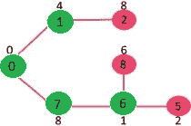
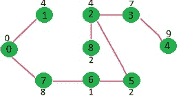

# 用于邻接表表示的 Prim 的 MST 贪婪算法-6

> 原文:[https://www . geesforgeks . org/prims-MST-for-邻接表-表示-greedy-algo-6/](https://www.geeksforgeeks.org/prims-mst-for-adjacency-list-representation-greedy-algo-6/)

我们建议阅读以下两篇文章作为这篇文章的先决条件。
**1。** [贪婪算法|集合 5 (Prim 的最小生成树(MST))](https://www.geeksforgeeks.org/prims-minimum-spanning-tree-mst-greedy-algo-5/)
**2。** [图及其表示](https://www.geeksforgeeks.org/graph-and-its-representations/)
我们讨论了 [Prim 算法及其在图的邻接矩阵表示](https://www.geeksforgeeks.org/prims-minimum-spanning-tree-mst-greedy-algo-5/)中的实现。矩阵表示的时间复杂度是 O(V^2).本文讨论了邻接表表示的 O(ELogV)算法。
如前一篇文章所述，在 Prim 的算法中，维护了两个集合，一个集合包含已经包含在 MST 中的顶点列表，另一个集合包含尚未包含的顶点。使用邻接表表示，可以使用 [BFS](https://www.geeksforgeeks.org/breadth-first-search-or-bfs-for-a-graph/) 在 0(V+E)时间内遍历图的所有顶点。想法是使用 [BFS](https://www.geeksforgeeks.org/breadth-first-search-or-bfs-for-a-graph/) 遍历图的所有顶点，并使用最小堆来存储尚未包含在 MST 中的顶点。最小堆用作优先队列，以从[切割](http://en.wikipedia.org/wiki/Cut_%28graph_theory%29)获得最小权重边。最小堆被用作提取最小元素和减少键值等操作的时间复杂度。
详细步骤如下。
**1)** 创建一个大小为 V 的最小堆，其中 V 是给定图中的顶点数。最小堆的每个节点都包含顶点数和顶点的键值。
**2)** 以第一个顶点为根初始化最小堆(分配给第一个顶点的键值为 0)。分配给所有其他顶点的键值是 INF(无穷大)。
**3)** 当最小堆不为空时，执行以下
….. **a)** 从最小堆中提取最小值节点。让提取的顶点为 u.
….. **b)** 对于 u 的每个相邻顶点 v，检查 v 是否在 Min Heap 中(尚未包含在 MST 中)。如果 v 在 Min Heap 中，并且其键值大于 u-v 的权重，那么将 v 的键值更新为 u-v 的权重
让我们用下面的例子来理解上面的算法:


最初，第一个顶点的键值为 0，所有其他顶点的键值为 INF(无穷大)。因此，从最小堆中提取顶点 0，并更新与 0 (1 和 7)相邻的顶点的键值。最小堆包含除顶点 0 以外的所有顶点。
绿色的顶点是包含在 MST 中的顶点。


由于顶点 1 的键值在最小堆中的所有节点中是最小的，所以从最小堆中提取它，并且更新与 1 相邻的顶点的键值(如果 a 顶点在最小堆中并且先前的键值大于从 1 到相邻的边的权重，则更新键值)。最小堆包含除顶点 0 和 1 之外的所有顶点。


由于顶点 7 的键值在最小堆中的所有节点中是最小的，所以它是从最小堆中提取的，并且与 7 相邻的顶点的键值被更新(如果 a 顶点在最小堆中并且先前的键值大于从 7 到相邻的边的权重，则键被更新)。最小堆包含除顶点 0、1 和 7 之外的所有顶点。


由于顶点 6 的键值在最小堆中的所有节点中是最小的，所以从最小堆中提取它，并且更新与 6 相邻的顶点的键值(如果 a 顶点在最小堆中并且先前的键值大于从 6 到相邻的边的权重，则更新键值)。最小堆包含除顶点 0、1、7 和 6 之外的所有顶点。



对最小堆中的其余节点重复上述步骤，直到最小堆变空



## C++

```
// C / C++ program for Prim's MST for adjacency list representation of graph

#include <limits.h>
#include <stdio.h>
#include <stdlib.h>

// A structure to represent a node in adjacency list
struct AdjListNode {
    int dest;
    int weight;
    struct AdjListNode* next;
};

// A structure to represent an adjacency list
struct AdjList {
    struct AdjListNode* head; // pointer to head node of list
};

// A structure to represent a graph. A graph is an array of adjacency lists.
// Size of array will be V (number of vertices in graph)
struct Graph {
    int V;
    struct AdjList* array;
};

// A utility function to create a new adjacency list node
struct AdjListNode* newAdjListNode(int dest, int weight)
{
    struct AdjListNode* newNode = (struct AdjListNode*)malloc(sizeof(struct AdjListNode));
    newNode->dest = dest;
    newNode->weight = weight;
    newNode->next = NULL;
    return newNode;
}

// A utility function that creates a graph of V vertices
struct Graph* createGraph(int V)
{
    struct Graph* graph = (struct Graph*)malloc(sizeof(struct Graph));
    graph->V = V;

    // Create an array of adjacency lists.  Size of array will be V
    graph->array = (struct AdjList*)malloc(V * sizeof(struct AdjList));

    // Initialize each adjacency list as empty by making head as NULL
    for (int i = 0; i < V; ++i)
        graph->array[i].head = NULL;

    return graph;
}

// Adds an edge to an undirected graph
void addEdge(struct Graph* graph, int src, int dest, int weight)
{
    // Add an edge from src to dest.  A new node is added to the adjacency
    // list of src.  The node is added at the beginning
    struct AdjListNode* newNode = newAdjListNode(dest, weight);
    newNode->next = graph->array[src].head;
    graph->array[src].head = newNode;

    // Since graph is undirected, add an edge from dest to src also
    newNode = newAdjListNode(src, weight);
    newNode->next = graph->array[dest].head;
    graph->array[dest].head = newNode;
}

// Structure to represent a min heap node
struct MinHeapNode {
    int v;
    int key;
};

// Structure to represent a min heap
struct MinHeap {
    int size; // Number of heap nodes present currently
    int capacity; // Capacity of min heap
    int* pos; // This is needed for decreaseKey()
    struct MinHeapNode** array;
};

// A utility function to create a new Min Heap Node
struct MinHeapNode* newMinHeapNode(int v, int key)
{
    struct MinHeapNode* minHeapNode = (struct MinHeapNode*)malloc(sizeof(struct MinHeapNode));
    minHeapNode->v = v;
    minHeapNode->key = key;
    return minHeapNode;
}

// A utilit function to create a Min Heap
struct MinHeap* createMinHeap(int capacity)
{
    struct MinHeap* minHeap = (struct MinHeap*)malloc(sizeof(struct MinHeap));
    minHeap->pos = (int*)malloc(capacity * sizeof(int));
    minHeap->size = 0;
    minHeap->capacity = capacity;
    minHeap->array = (struct MinHeapNode**)malloc(capacity * sizeof(struct MinHeapNode*));
    return minHeap;
}

// A utility function to swap two nodes of min heap. Needed for min heapify
void swapMinHeapNode(struct MinHeapNode** a, struct MinHeapNode** b)
{
    struct MinHeapNode* t = *a;
    *a = *b;
    *b = t;
}

// A standard function to heapify at given idx
// This function also updates position of nodes when they are swapped.
// Position is needed for decreaseKey()
void minHeapify(struct MinHeap* minHeap, int idx)
{
    int smallest, left, right;
    smallest = idx;
    left = 2 * idx + 1;
    right = 2 * idx + 2;

    if (left < minHeap->size && minHeap->array[left]->key < minHeap->array[smallest]->key)
        smallest = left;

    if (right < minHeap->size && minHeap->array[right]->key < minHeap->array[smallest]->key)
        smallest = right;

    if (smallest != idx) {
        // The nodes to be swapped in min heap
        MinHeapNode* smallestNode = minHeap->array[smallest];
        MinHeapNode* idxNode = minHeap->array[idx];

        // Swap positions
        minHeap->pos[smallestNode->v] = idx;
        minHeap->pos[idxNode->v] = smallest;

        // Swap nodes
        swapMinHeapNode(&minHeap->array[smallest], &minHeap->array[idx]);

        minHeapify(minHeap, smallest);
    }
}

// A utility function to check if the given minHeap is ampty or not
int isEmpty(struct MinHeap* minHeap)
{
    return minHeap->size == 0;
}

// Standard function to extract minimum node from heap
struct MinHeapNode* extractMin(struct MinHeap* minHeap)
{
    if (isEmpty(minHeap))
        return NULL;

    // Store the root node
    struct MinHeapNode* root = minHeap->array[0];

    // Replace root node with last node
    struct MinHeapNode* lastNode = minHeap->array[minHeap->size - 1];
    minHeap->array[0] = lastNode;

    // Update position of last node
    minHeap->pos[root->v] = minHeap->size - 1;
    minHeap->pos[lastNode->v] = 0;

    // Reduce heap size and heapify root
    --minHeap->size;
    minHeapify(minHeap, 0);

    return root;
}

// Function to decrease key value of a given vertex v. This function
// uses pos[] of min heap to get the current index of node in min heap
void decreaseKey(struct MinHeap* minHeap, int v, int key)
{
    // Get the index of v in  heap array
    int i = minHeap->pos[v];

    // Get the node and update its key value
    minHeap->array[i]->key = key;

    // Travel up while the complete tree is not hepified.
    // This is a O(Logn) loop
    while (i && minHeap->array[i]->key < minHeap->array[(i - 1) / 2]->key) {
        // Swap this node with its parent
        minHeap->pos[minHeap->array[i]->v] = (i - 1) / 2;
        minHeap->pos[minHeap->array[(i - 1) / 2]->v] = i;
        swapMinHeapNode(&minHeap->array[i], &minHeap->array[(i - 1) / 2]);

        // move to parent index
        i = (i - 1) / 2;
    }
}

// A utility function to check if a given vertex
// 'v' is in min heap or not
bool isInMinHeap(struct MinHeap* minHeap, int v)
{
    if (minHeap->pos[v] < minHeap->size)
        return true;
    return false;
}

// A utility function used to print the constructed MST
void printArr(int arr[], int n)
{
    for (int i = 1; i < n; ++i)
        printf("%d - %d\n", arr[i], i);
}

// The main function that constructs Minimum Spanning Tree (MST)
// using Prim's algorithm
void PrimMST(struct Graph* graph)
{
    int V = graph->V; // Get the number of vertices in graph
    int parent[V]; // Array to store constructed MST
    int key[V]; // Key values used to pick minimum weight edge in cut

    // minHeap represents set E
    struct MinHeap* minHeap = createMinHeap(V);

    // Initialize min heap with all vertices. Key value of
    // all vertices (except 0th vertex) is initially infinite
    for (int v = 1; v < V; ++v) {
        parent[v] = -1;
        key[v] = INT_MAX;
        minHeap->array[v] = newMinHeapNode(v, key[v]);
        minHeap->pos[v] = v;
    }

    // Make key value of 0th vertex as 0 so that it
    // is extracted first
    key[0] = 0;
    minHeap->array[0] = newMinHeapNode(0, key[0]);
    minHeap->pos[0] = 0;

    // Initially size of min heap is equal to V
    minHeap->size = V;

    // In the following loop, min heap contains all nodes
    // not yet added to MST.
    while (!isEmpty(minHeap)) {
        // Extract the vertex with minimum key value
        struct MinHeapNode* minHeapNode = extractMin(minHeap);
        int u = minHeapNode->v; // Store the extracted vertex number

        // Traverse through all adjacent vertices of u (the extracted
        // vertex) and update their key values
        struct AdjListNode* pCrawl = graph->array[u].head;
        while (pCrawl != NULL) {
            int v = pCrawl->dest;

            // If v is not yet included in MST and weight of u-v is
            // less than key value of v, then update key value and
            // parent of v
            if (isInMinHeap(minHeap, v) && pCrawl->weight < key[v]) {
                key[v] = pCrawl->weight;
                parent[v] = u;
                decreaseKey(minHeap, v, key[v]);
            }
            pCrawl = pCrawl->next;
        }
    }

    // print edges of MST
    printArr(parent, V);
}

// Driver program to test above functions
int main()
{
    // Let us create the graph given in above fugure
    int V = 9;
    struct Graph* graph = createGraph(V);
    addEdge(graph, 0, 1, 4);
    addEdge(graph, 0, 7, 8);
    addEdge(graph, 1, 2, 8);
    addEdge(graph, 1, 7, 11);
    addEdge(graph, 2, 3, 7);
    addEdge(graph, 2, 8, 2);
    addEdge(graph, 2, 5, 4);
    addEdge(graph, 3, 4, 9);
    addEdge(graph, 3, 5, 14);
    addEdge(graph, 4, 5, 10);
    addEdge(graph, 5, 6, 2);
    addEdge(graph, 6, 7, 1);
    addEdge(graph, 6, 8, 6);
    addEdge(graph, 7, 8, 7);

    PrimMST(graph);

    return 0;
}
```

## Java 语言(一种计算机语言，尤用于创建网站)

```
// Java program for Prim's MST for
// adjacency list representation of graph
import java.util.LinkedList;
import java.util.TreeSet;
import java.util.Comparator;

public class prims {
    class node1 {

        // Stores destination vertex in adjacency list
        int dest;

        // Stores weight of a vertex in the adjacency list
        int weight;

        // Constructor
        node1(int a, int b)
        {
            dest = a;
            weight = b;
        }
    }
    static class Graph {

        // Number of vertices in the graph
        int V;

        // List of adjacent nodes of a given vertex
        LinkedList<node1>[] adj;

        // Constructor
        Graph(int e)
        {
            V = e;
            adj = new LinkedList[V];
            for (int o = 0; o < V; o++)
                adj[o] = new LinkedList<>();
        }
    }

    // class to represent a node in PriorityQueue
    // Stores a vertex and its corresponding
    // key value
    class node {
        int vertex;
        int key;
    }

    // Comparator class created for PriorityQueue
    // returns 1 if node0.key > node1.key
    // returns 0 if node0.key < node1.key and
    // returns -1 otherwise
    class comparator implements Comparator<node> {

        @Override
        public int compare(node node0, node node1)
        {
            return node0.key - node1.key;
        }
    }

    // method to add an edge
    // between two vertices
    void addEdge(Graph graph, int src, int dest, int weight)
    {

        node1 node0 = new node1(dest, weight);
        node1 node = new node1(src, weight);
        graph.adj[src].addLast(node0);
        graph.adj[dest].addLast(node);
    }

    // method used to find the mst
    void prims_mst(Graph graph)
    {

        // Whether a vertex is in PriorityQueue or not
        Boolean[] mstset = new Boolean[graph.V];
        node[] e = new node[graph.V];

        // Stores the parents of a vertex
        int[] parent = new int[graph.V];

        for (int o = 0; o < graph.V; o++)
            e[o] = new node();

        for (int o = 0; o < graph.V; o++) {

            // Initialize to false
            mstset[o] = false;

            // Initialize key values to infinity
            e[o].key = Integer.MAX_VALUE;
            e[o].vertex = o;
            parent[o] = -1;
        }

        // Include the source vertex in mstset
        mstset[0] = true;

        // Set key value to 0
        // so that it is extracted first
        // out of PriorityQueue
        e[0].key = 0;

        // Use TreeSet instead of PriorityQueue as the remove function of the PQ is O(n) in java.
        TreeSet<node> queue = new TreeSet<node>(new comparator());

        for (int o = 0; o < graph.V; o++)
            queue.add(e[o]);

        // Loops until the queue is not empty
        while (!queue.isEmpty()) {

            // Extracts a node with min key value
            node node0 = queue.pollFirst();

            // Include that node into mstset
            mstset[node0.vertex] = true;

            // For all adjacent vertex of the extracted vertex V
            for (node1 iterator : graph.adj[node0.vertex]) {

                // If V is in queue
                if (mstset[iterator.dest] == false) {
                    // If the key value of the adjacent vertex is
                    // more than the extracted key
                    // update the key value of adjacent vertex
                    // to update first remove and add the updated vertex
                    if (e[iterator.dest].key > iterator.weight) {
                        queue.remove(e[iterator.dest]);
                        e[iterator.dest].key = iterator.weight;
                        queue.add(e[iterator.dest]);
                        parent[iterator.dest] = node0.vertex;
                    }
                }
            }
        }

        // Prints the vertex pair of mst
        for (int o = 1; o < graph.V; o++)
            System.out.println(parent[o] + " "
                               + "-"
                               + " " + o);
    }

    public static void main(String[] args)
    {
        int V = 9;

        Graph graph = new Graph(V);

        prims e = new prims();

        e.addEdge(graph, 0, 1, 4);
        e.addEdge(graph, 0, 7, 8);
        e.addEdge(graph, 1, 2, 8);
        e.addEdge(graph, 1, 7, 11);
        e.addEdge(graph, 2, 3, 7);
        e.addEdge(graph, 2, 8, 2);
        e.addEdge(graph, 2, 5, 4);
        e.addEdge(graph, 3, 4, 9);
        e.addEdge(graph, 3, 5, 14);
        e.addEdge(graph, 4, 5, 10);
        e.addEdge(graph, 5, 6, 2);
        e.addEdge(graph, 6, 7, 1);
        e.addEdge(graph, 6, 8, 6);
        e.addEdge(graph, 7, 8, 7);

        // Method invoked
        e.prims_mst(graph);
    }
}
// This code is contributed by Vikash Kumar Dubey
```

## 计算机编程语言

```
# A Python program for Prims's MST for
# adjacency list representation of graph

from collections import defaultdict
import sys

class Heap():

    def __init__(self):
        self.array = []
        self.size = 0
        self.pos = []

    def newMinHeapNode(self, v, dist):
        minHeapNode = [v, dist]
        return minHeapNode

    # A utility function to swap two nodes of
    # min heap. Needed for min heapify
    def swapMinHeapNode(self, a, b):
        t = self.array[a]
        self.array[a] = self.array[b]
        self.array[b] = t

    # A standard function to heapify at given idx
    # This function also updates position of nodes
    # when they are swapped. Position is needed
    # for decreaseKey()
    def minHeapify(self, idx):
        smallest = idx
        left = 2 * idx + 1
        right = 2 * idx + 2

        if left < self.size and self.array[left][1] < \
                                self.array[smallest][1]:
            smallest = left

        if right < self.size and self.array[right][1] < \
                                self.array[smallest][1]:
            smallest = right

        # The nodes to be swapped in min heap
        # if idx is not smallest
        if smallest != idx:

            # Swap positions
            self.pos[ self.array[smallest][0] ] = idx
            self.pos[ self.array[idx][0] ] = smallest

            # Swap nodes
            self.swapMinHeapNode(smallest, idx)

            self.minHeapify(smallest)

    # Standard function to extract minimum node from heap
    def extractMin(self):

        # Return NULL wif heap is empty
        if self.isEmpty() == True:
            return

        # Store the root node
        root = self.array[0]

        # Replace root node with last node
        lastNode = self.array[self.size - 1]
        self.array[0] = lastNode

        # Update position of last node
        self.pos[lastNode[0]] = 0
        self.pos[root[0]] = self.size - 1

        # Reduce heap size and heapify root
        self.size -= 1
        self.minHeapify(0)

        return root

    def isEmpty(self):
        return True if self.size == 0 else False

    def decreaseKey(self, v, dist):

        # Get the index of v in  heap array

        i = self.pos[v]

        # Get the node and update its dist value
        self.array[i][1] = dist

        # Travel up while the complete tree is not
        # hepified. This is a O(Logn) loop
        while i > 0 and self.array[i][1] < \
                    self.array[(i - 1) / 2][1]:

            # Swap this node with its parent
            self.pos[ self.array[i][0] ] = (i-1)/2
            self.pos[ self.array[(i-1)/2][0] ] = i
            self.swapMinHeapNode(i, (i - 1)/2 )

            # move to parent index
            i = (i - 1) / 2;

    # A utility function to check if a given vertex
    # 'v' is in min heap or not
    def isInMinHeap(self, v):

        if self.pos[v] < self.size:
            return True
        return False

def printArr(parent, n):
    for i in range(1, n):
        print("% d - % d" % (parent[i], i))

class Graph():

    def __init__(self, V):
        self.V = V
        self.graph = defaultdict(list)

    # Adds an edge to an undirected graph
    def addEdge(self, src, dest, weight):

        # Add an edge from src to dest.  A new node is
        # added to the adjacency list of src. The node
        # is added at the beginning. The first element of
        # the node has the destination and the second
        # elements has the weight
        newNode = [dest, weight]
        self.graph[src].insert(0, newNode)

        # Since graph is undirected, add an edge from
        # dest to src also
        newNode = [src, weight]
        self.graph[dest].insert(0, newNode)

    # The main function that prints the Minimum
    # Spanning Tree(MST) using the Prim's Algorithm.
    # It is a O(ELogV) function
    def PrimMST(self):
        # Get the number of vertices in graph
        V = self.V 

        # key values used to pick minimum weight edge in cut
        key = []  

        # List to store contructed MST
        parent = []

        # minHeap represents set E
        minHeap = Heap()

        # Initialize min heap with all vertices. Key values of all
        # vertices (except the 0th vertex) is is initially infinite
        for v in range(V):
            parent.append(-1)
            key.append(sys.maxint)
            minHeap.array.append( minHeap.newMinHeapNode(v, key[v]) )
            minHeap.pos.append(v)

        # Make key value of 0th vertex as 0 so
        # that it is extracted first
        minHeap.pos[0] = 0
        key[0] = 0
        minHeap.decreaseKey(0, key[0])

        # Initially size of min heap is equal to V
        minHeap.size = V;

        # In the following loop, min heap contains all nodes
        # not yet added in the MST.
        while minHeap.isEmpty() == False:

            # Extract the vertex with minimum distance value
            newHeapNode = minHeap.extractMin()
            u = newHeapNode[0]

            # Traverse through all adjacent vertices of u
            # (the extracted vertex) and update their
            # distance values
            for pCrawl in self.graph[u]:

                v = pCrawl[0]

                # If shortest distance to v is not finalized
                # yet, and distance to v through u is less than
                # its previously calculated distance
                if minHeap.isInMinHeap(v) and pCrawl[1] < key[v]:
                    key[v] = pCrawl[1]
                    parent[v] = u

                    # update distance value in min heap also
                    minHeap.decreaseKey(v, key[v])

        printArr(parent, V)

# Driver program to test the above functions
graph = Graph(9)
graph.addEdge(0, 1, 4)
graph.addEdge(0, 7, 8)
graph.addEdge(1, 2, 8)
graph.addEdge(1, 7, 11)
graph.addEdge(2, 3, 7)
graph.addEdge(2, 8, 2)
graph.addEdge(2, 5, 4)
graph.addEdge(3, 4, 9)
graph.addEdge(3, 5, 14)
graph.addEdge(4, 5, 10)
graph.addEdge(5, 6, 2)
graph.addEdge(6, 7, 1)
graph.addEdge(6, 8, 6)
graph.addEdge(7, 8, 7)
graph.PrimMST()

# This code is contributed by Divyanshu Mehta
```

## java 描述语言

```
<script>
// Javascript program for Prim's MST for
// adjacency list representation of graph

class node1
{
    constructor(a,b)
    {
        this.dest = a;
        this.weight = b;
    }
}

class Graph
{
    constructor(e)
    {
        this.V=e;
        this.adj = new Array(V);
        for (let o = 0; o < V; o++)
            this.adj[o] = [];
    }
}

// class to represent a node in PriorityQueue
    // Stores a vertex and its corresponding
    // key value
class node
{
    constructor()
    {
        this.vertex=0;
        this.key=0;
    }
}

// method to add an edge
    // between two vertices
function addEdge(graph,src,dest,weight)
{
    let node0 = new node1(dest, weight);
        let node = new node1(src, weight);
        graph.adj[src].push(node0);
        graph.adj[dest].push(node);
}

// method used to find the mst
function prims_mst(graph)
{
    // Whether a vertex is in PriorityQueue or not
        let mstset = new Array(graph.V);
        let e = new Array(graph.V);

        // Stores the parents of a vertex
        let parent = new Array(graph.V);

        for (let o = 0; o < graph.V; o++)
        {

            e[o] = new node();
          }   
        for (let o = 0; o < graph.V; o++) {

            // Initialize to false
            mstset[o] = false;

            // Initialize key values to infinity
            e[o].key = Number.MAX_VALUE;
            e[o].vertex = o;
            parent[o] = -1;
        }

        // Include the source vertex in mstset
        mstset[0] = true;

        // Set key value to 0
        // so that it is extracted first
        // out of PriorityQueue
        e[0].key = 0;

        // Use TreeSet instead of PriorityQueue as the remove function of the PQ is O(n) in java.
        let queue = [];

        for (let o = 0; o < graph.V; o++)
            queue.push(e[o]);

        queue.sort(function(a,b){return a.key-b.key;});

        // Loops until the queue is not empty
        while (queue.length!=0) {

            // Extracts a node with min key value
            let node0 = queue.shift();

            // Include that node into mstset
            mstset[node0.vertex] = true;

            // For all adjacent vertex of the extracted vertex V
            for (let iterator of graph.adj[node0.vertex].values()) {

                // If V is in queue
                if (mstset[iterator.dest] == false) {
                    // If the key value of the adjacent vertex is
                    // more than the extracted key
                    // update the key value of adjacent vertex
                    // to update first remove and add the updated vertex
                    if (e[iterator.dest].key > iterator.weight) {
                        queue.splice(queue.indexOf(e[iterator.dest]),1);
                        e[iterator.dest].key = iterator.weight;
                        queue.push(e[iterator.dest]);
                        queue.sort(function(a,b){return a.key-b.key;});
                        parent[iterator.dest] = node0.vertex;
                    }
                }
            }
        }

        // Prints the vertex pair of mst
        for (let o = 1; o < graph.V; o++)
            document.write(parent[o] + " "
                               + "-"
                               + " " + o+"<br>");
}

let V = 9;
let graph = new Graph(V);
addEdge(graph, 0, 1, 4);
addEdge(graph, 0, 7, 8);
addEdge(graph, 1, 2, 8);
addEdge(graph, 1, 7, 11);
addEdge(graph, 2, 3, 7);
addEdge(graph, 2, 8, 2);
addEdge(graph, 2, 5, 4);
addEdge(graph, 3, 4, 9);
addEdge(graph, 3, 5, 14);
addEdge(graph, 4, 5, 10);
addEdge(graph, 5, 6, 2);
addEdge(graph, 6, 7, 1);
addEdge(graph, 6, 8, 6);
addEdge(graph, 7, 8, 7);

// Method invoked
prims_mst(graph);

// This code is contributed by avanitrachhadiya2155
</script>
```

输出:

```
0 - 1
5 - 2
2 - 3
3 - 4
6 - 5
7 - 6
0 - 7
2 - 8
```

**时间复杂度:**上面代码/算法的时间复杂度看起来像 O(V^2)，因为有两个嵌套的 while 循环。如果我们仔细看一下，我们可以观察到，内部循环中的语句被执行了 O(V+E)次(类似于 BFS)。内部循环有一个需要 0(LogV)时间的递减键()操作。所以总的时间复杂度是 O(E+V)*O(LogV)，也就是 O((E+V)*LogV) = O(ELogV)(对于连通图，V = O(E))

**参考文献:**
[Clifford Stein、Thomas H. Cormen、Charles E. Leiserson、Ronald l .](http://www.flipkart.com/introduction-algorithms-8120340078/p/itmczynzhyhxv2gs?pid=9788120340077&affid=sandeepgfg)
[【http://en.wikipedia.org/wiki/Prim's_algorithm】](http://en.wikipedia.org/wiki/Prim's_algorithm)
本文由 [Aashish Barnwal](https://www.facebook.com/barnwal.aashish) 编辑，GeeksforGeeks 团队审核。如果你发现任何不正确的地方，或者你想分享更多关于上面讨论的话题的信息，请写评论。