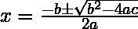
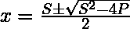

# 用给定的和与积打印一对数字

> 原文:[https://www . geesforgeks . org/print-一对带给定和积的数字/](https://www.geeksforgeeks.org/print-a-pair-of-numbers-with-the-given-sum-and-product/)

给定总和 **S** 和乘积 **P** ，任务是打印任意一对具有总和 **S** 和乘积 **P** 的整数。如果不存在这样的对，则打印-1。
**举例:**

> **输入** : S = 5，P = 6
> **输出** : 2，3
> **解释** :
> 和= 2 + 3 = 5，
> 积= 2 * 3 = 6
> **输入** : S = 5，P = 9
> **输出** : -1
> **解释** :
> 不存在这样的对

**进场:**让这对成为 **(x，y)** 。所以根据问题，给定的和( **S** )为 **(x + y)** ，给定的积( **P** )为 **(x * y)**

```
If the pair is (x, y)

Given that product
    P = x * y
    y = P / x;  (eq.. 1)

Given that sum 
    S = x + y
    S = x + (P / x)  from (eq..1)
    x2 - Sx + P = 0

which is a quadratic equation in x.
```

由于这是一个二次方程，我们只需要用下面的方程找到它的[根](https://www.geeksforgeeks.org/program-to-find-the-roots-of-quadratic-equation/)。


```
Here:
  a = 1
  b = -S
  c = P
```

因此上述等式将改为:

**以下是上述方法的实现:**

## 卡片打印处理机（Card Print Processor 的缩写）

```
// CPP program to find any pair
// which has sum S and product P.
#include <bits/stdc++.h>
using namespace std;

// Prints roots of quadratic equation
// ax*2 + bx + c = 0
void findRoots(int b, int c)
{

    int a = 1;
    int d = b * b - 4 * a * c;

    // calculating the sq root value
    // for b * b - 4 * a * c
    double sqrt_val = sqrt(abs(d));

    if (d > 0) {
        double x = -b + sqrt_val;
        double y = -b - sqrt_val;

        // Finding the roots
        int root1 = (x) / (2 * a);
        int root2 = (y) / (2 * a);

        // Check if the roots
        // are valid or not
        if (root1 + root2 == -1 * b
            && root1 * root2 == c)
            cout << root1 << ", " << root2;
        else
            cout << -1;
    }
    else if (d == 0) {

        // Finding the roots
        int root = -b / (2 * a);

        // Check if the roots
        // are valid or not
        if (root + root == -1 * b
            && root * root == c)
            cout << root << ", " << root;
        else
            cout << -1;
    }

    // when d < 0
    else {

        // No such pair exists in this case
        cout << -1;
    }

    cout << endl;
}

// Driver code
int main()
{
    int S = 5, P = 6;
    findRoots(-S, P);

    S = 5, P = 9;
    findRoots(-S, P);

    return 0;
}
```

## Java 语言(一种计算机语言，尤用于创建网站)

```
// Java program to find any pair
// which has sum S and product P.
import java.util.*;

class GFG
{

// Prints roots of quadratic equation
// ax*2 + bx + c = 0
static void findRoots(int b, int c)
{

    int a = 1;
    int d = b * b - 4 * a * c;

    // calculating the sq root value
    // for b * b - 4 * a * c
    double sqrt_val = Math.sqrt(Math.abs(d));

    if (d > 0) {
        double x = -b + sqrt_val;
        double y = -b - sqrt_val;

        // Finding the roots
        int root1 = (int)(x) / (2 * a);
        int root2 = (int) (y) / (2 * a);

        // Check if the roots
        // are valid or not
        if (root1 + root2 == -1 * b
            && root1 * root2 == c)
            System.out.print( root1 + ", " + root2);
        else
            System.out.print( -1);
    }
    else if (d == 0) {

        // Finding the roots
        int root = -b / (2 * a);

        // Check if the roots
        // are valid or not
        if (root + root == -1 * b
            && root * root == c)
            System.out.print(root+ ", "+root);
        else
            System.out.print(-1);
    }

    // when d < 0
    else {

        // No such pair exists in this case
        System.out.print( -1);
    }

    System.out.println();
}

// Driver code
public static void main (String []args)
{
    int S = 5, P = 6;
    findRoots(-S, P);

    S = 5;
    P = 9;
    findRoots(-S, P);
}
}

// This code is contributed by chitranayal
```

## 蟒蛇 3

```
# Python3 program to find any pair
# which has sum S and product P.
from math import sqrt

# Prints roots of quadratic equation
# ax*2 + bx + c = 0
def findRoots(b, c):

    a = 1
    d = b * b - 4 * a * c

    # calculating the sq root value
    # for b * b - 4 * a * c
    sqrt_val = sqrt(abs(d))

    if (d > 0):
        x = -b + sqrt_val
        y = -b - sqrt_val

        # Finding the roots
        root1 = (x) // (2 * a)
        root2 = (y) // (2 * a)

        # Check if the roots
        # are valid or not
        if (root1 + root2 == -1 * b
            and root1 * root2 == c):
            print(int(root1),",",int(root2))
        else:
            print(-1)
    elif (d == 0):

        # Finding the roots
        root = -b // (2 * a)

        # Check if the roots
        # are valid or not
        if (root + root == -1 * b
            and root * root == c):
            print(root,",",root)
        else:
            print(-1)

    # when d < 0
    else:

        # No such pair exists in this case
        print(-1)

# Driver code
if __name__ == '__main__':
    S = 5
    P = 6
    findRoots(-S, P)

    S = 5
    P = 9
    findRoots(-S, P)

# This code is contributed by mohit kumar 29
```

## C#

```
// C# program to find any pair
// which has sum S and product P.

using System;

public class GFG
{

    // Prints roots of quadratic equation
    // ax*2 + bx + c = 0
    static void findRoots(int b, int c)
    {

        int a = 1;
        int d = b * b - 4 * a * c;

        // calculating the sq root value
        // for b * b - 4 * a * c
        double sqrt_val = Math.Sqrt(Math.Abs(d));

        if (d > 0) {
            double x = -b + sqrt_val;
            double y = -b - sqrt_val;

            // Finding the roots
            int root1 = (int)(x) / (2 * a);
            int root2 = (int) (y) / (2 * a);

            // Check if the roots
            // are valid or not
            if (root1 + root2 == -1 * b
                && root1 * root2 == c)
                Console.Write( root1 + ", " + root2);
            else
                Console.Write( -1);
        }
        else if (d == 0) {

            // Finding the roots
            int root = -b / (2 * a);

            // Check if the roots
            // are valid or not
            if (root + root == -1 * b
                && root * root == c)
                Console.Write(root+ ", "+root);
            else
                Console.Write(-1);
        }

        // when d < 0
        else {

            // No such pair exists in this case
            Console.Write( -1);
        }

       Console.WriteLine();
    }

    // Driver code
    public static void Main (string []args)
    {
        int S = 5, P = 6;
        findRoots(-S, P);

        S = 5;
        P = 9;
        findRoots(-S, P);
    }
}

// This code is contributed by Yash_R
```

## java 描述语言

```
<script>
// Javascript program to find any pair
// which has sum S and product P.

// Prints roots of quadratic equation
// ax*2 + bx + c = 0
function findRoots(b, c)
{

    var a = 1;
    var d = b * b - 4 * a * c;

    // calculating the sq root value
    // for b * b - 4 * a * c
    var sqrt_val = Math.sqrt(Math.abs(d));

    if (d > 0)
    {
        var x = -b + sqrt_val;
        var y = -b - sqrt_val;

        // Finding the roots
        var root1 = (x) / (2 * a);
        var root2 = (y) / (2 * a);

        // Check if the roots
        // are valid or not
        if (root1 + root2 == -1 * b
            && root1 * root2 == c)
            document.write(root1 + ", " + root2);
        else
            document.write(-1);
    }
    else if (d == 0)
    {

        // Finding the roots
        var root = -b / (2 * a);

        // Check if the roots
        // are valid or not
        if (root + root == -1 * b
            && root * root == c)
            document.write(root + ", " + root);
        else
            document.write(-1);
    }

    // when d < 0
    else
    {

        // No such pair exists in this case
        document.write(-1);
    }

    document.write("<br>");
}

// Driver code
var S = 5, P = 6;
findRoots(-S, P);
S = 5, P = 9;
findRoots(-S, P);

// This code is contributed by rutvik_56.
</script>
```

**Output:** 

```
3, 2
-1
```