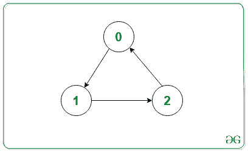
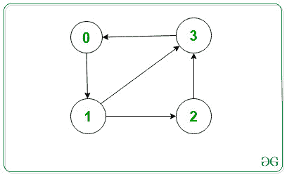

# 打印有向图的邻接表

> 原文:[https://www . geeksforgeeks . org/print-邻接表换有向图/](https://www.geeksforgeeks.org/print-adjacency-list-for-a-directed-graph/)

邻接表用于表示图形。这里，对于图中的每个顶点，我们有一个列表，列出了特定顶点有一条边的所有其他顶点。

**问题:**给定邻接表和图的顶点数和边数，任务是表示有向图的邻接表。

**示例:**

> **输入:** V = 3，边[][]= {{0，1}，{1，2} {2，0}}
> 
> 
> 
> **输出:**0->1
> 1->2
> 2->0
> T5】解释:
> 输出表示给定图形的邻接表。
> 
> **输入:** V = 4，边[][] = {{0，1}，{1，2}，{1，3}，{2，3}，{3，0}}
> 
> 
> 
> **输出:**0->1
> 1->2 3
> 2->3
> 3->0
> **解释:**
> 输出表示给定图形的邻接表。

**方法(使用**[](https://www.geeksforgeeks.org/cpp-stl-tutorial/)****):**主要思想是将图表示为向量阵列，使得每个向量表示单个顶点的邻接表。使用 STL，代码变得更简单，更容易理解。**

**下面是上述方法的实现:**

## **C++**

```
// C++ program for the above approach

#include <bits/stdc++.h>
using namespace std;

// Function to add edges
void addEdge(vector<int> adj[], int u, int v)
{
    adj[u].push_back(v);
}

// Function to print adjacency list
void adjacencylist(vector<int> adj[], int V)
{
    for (int i = 0; i < V; i++) {
        cout << i << "->";
        for (int& x : adj[i]) {
            cout << x << " ";
        }
        cout << endl;
    }
}

// Function to initialize the adjacency list
// of the given graph
void initGraph(int V, int edges[3][2], int noOfEdges)
{
    // To represent graph as adjacency list
    vector<int> adj[V];

    // Traverse edges array and make edges
    for (int i = 0; i < noOfEdges; i++) {

        // Function call to make an edge
        addEdge(adj, edges[i][0], edges[i][1]);
    }

    // Function Call to print adjacency list
    adjacencylist(adj, V);
}

// Driver Code
int main()
{
    // Given vertices
    int V = 3;

    // Given edges
    int edges[3][2] = { { 0, 1 }, { 1, 2 }, { 2, 0 } };

    int noOfEdges = 3;

    // Function Call
    initGraph(V, edges, noOfEdges);

    return 0;
}
```

## **Java 语言(一种计算机语言，尤用于创建网站)**

```
// Java program for the above approach
import java.util.*;

class GFG
{

  // Function to add edges
  static void addEdge(Vector<Integer> adj[], int u, int v)
  {
    adj[u].add(v);
  }

  // Function to print adjacency list
  static void adjacencylist(Vector<Integer> adj[], int V)
  {
    for (int i = 0; i < V; i++) {
      System.out.print(i+ "->");
      for (int x : adj[i]) {
        System.out.print(x+ " ");
      }
      System.out.println();
    }
  }

  // Function to initialize the adjacency list
  // of the given graph
  static void initGraph(int V, int edges[][], int noOfEdges)
  {

    // To represent graph as adjacency list
    @SuppressWarnings("unchecked")
    Vector<Integer> adj[] = new Vector[3];
    for(int i =0;i<adj.length;i++) {
      adj[i] = new Vector<>();
    }
    // Traverse edges array and make edges
    for (int i = 0; i < noOfEdges; i++) {

      // Function call to make an edge
      addEdge(adj, edges[i][0], edges[i][1]);
    }

    // Function Call to print adjacency list
    adjacencylist(adj, V);
  }

  // Driver Code
  public static void main(String[] args)
  {
    // Given vertices
    int V = 3;

    // Given edges
    int edges[][] = { { 0, 1 }, { 1, 2 }, { 2, 0 } };

    int noOfEdges = 3;

    // Function Call
    initGraph(V, edges, noOfEdges);

  }
}

// This code is contributed by gauravrajput1
```

## **蟒蛇 3**

```
# Python program for the above approach

# Function to add edges
def addEdge(adj, u, v):
    adj[u].append(v)

# Function to print adjacency list
def adjacencylist(adj, V):

    for i in range (0, V):
        print(i, "->", end="")

        for x in  adj[i]:
            print(x , " ", end="")

        print()

# Function to initialize the adjacency list
# of the given graph
def initGraph(V, edges, noOfEdges):

    adj = [0]* 3

    for i in range(0, len(adj)):
        adj[i] = []

    # Traverse edges array and make edges
    for i in range(0, noOfEdges) :

         # Function call to make an edge
        addEdge(adj, edges[i][0], edges[i][1])

    # Function Call to print adjacency list
    adjacencylist(adj, V)

# Driver Code

# Given vertices
V = 3

# Given edges
edges =  [[0, 1 ],  [1, 2 ],  [2, 0 ]]

noOfEdges = 3;

# Function Call
initGraph(V, edges, noOfEdges)

# This code is contributed by AR_Gaurav
```

## **C#**

```
// C# program for the above approach
using System;
using System.Collections.Generic;

public class GFG
{

  // Function to add edges
  static void addEdge(List<int> []adj, int u, int v)
  {
    adj[u].Add(v);
  }

  // Function to print adjacency list
  static void adjacencylist(List<int> []adj, int V)
  {
    for (int i = 0; i < V; i++) {
      Console.Write(i+ "->");
      foreach (int x in adj[i]) {
        Console.Write(x+ " ");
      }
      Console.WriteLine();
    }
  }

  // Function to initialize the adjacency list
  // of the given graph
  static void initGraph(int V, int [,]edges, int noOfEdges)
  {

    // To represent graph as adjacency list  
    List<int> []adj = new List<int>[3];
    for(int i = 0; i < adj.Length; i++) {
      adj[i] = new List<int>();
    }

    // Traverse edges array and make edges
    for (int i = 0; i < noOfEdges; i++) {

      // Function call to make an edge
      addEdge(adj, edges[i,0], edges[i,1]);
    }

    // Function Call to print adjacency list
    adjacencylist(adj, V);
  }

  // Driver Code
  public static void Main(String[] args)
  {
    // Given vertices
    int V = 3;

    // Given edges
    int [,]edges = { { 0, 1 }, { 1, 2 }, { 2, 0 } };

    int noOfEdges = 3;

    // Function Call
    initGraph(V, edges, noOfEdges);

  }
}

// This code is contributed by Amit Katiyar
```

****Output:** 

```
0->1 
1->2 
2->0
```**