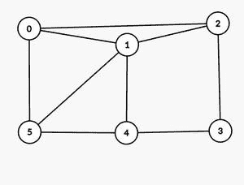
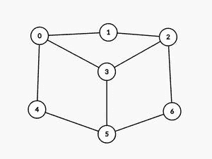

# 打印无向图中的所有哈密顿圈

> 原文:[https://www . geesforgeks . org/print-all-Hamiltonian-cycles in a-directed-graph/](https://www.geeksforgeeks.org/print-all-hamiltonian-cycles-in-an-undirected-graph/)

给定一个由大小为 **N*N** 的[邻接矩阵](https://www.geeksforgeeks.org/graph-and-its-representations/) **图【】【】**形式的 **N** 节点组成的[无向图](https://www.geeksforgeeks.org/graph-data-structure-and-algorithms/)，任务是打印给定无向图中所有可能的[哈密顿圈](https://www.geeksforgeeks.org/hamiltonian-cycle-backtracking-6/)(以起始顶点为‘0’)。

> 一个[哈密顿圈](https://www.geeksforgeeks.org/hamiltonian-cycle-backtracking-6/)(或哈密顿回路)是一个哈密顿路径，使得从哈密顿路径的最后一个顶点到第一个顶点有一条边(在图中)。

**示例:**

> **输入:**图形[][] = {{0，1，1，0，0，1}，{1，0，1，0，1，1}，{1，1，0，1，0，0}，{0，0，1，0，1，0}，{0，1，0，1，1，0，1}，{1，1，0，1 }，{0，1，0，1， 0}}
> **输出:**
> 0 1 2 3 4 5 0
> 0 1 5 4 3 2 0
> 0 2 3 4 1 5 0
> 0 2 3 4 5 1 0
> 0 5 1 4 3 2 0
> 0 5 4 3 2 1 0
> **解释:**
> 下图(起始顶点为 0)的所有可能哈密顿圈为
> 
> 
> 
> 1.  {0 → 1 → 2 → 3 → 4 → 5 → 0}
> 2.  {0 → 1 → 5 → 4 → 3 → 2 → 0}
> 3.  {0 → 2 → 3 → 4 → 1 → 5 → 0}
> 4.  {0 → 2 → 3 → 4 → 5 → 1 → 0}
> 5.  {0 → 5 → 1 → 4 → 3 → 2 → 0}
> 6.  {0 → 5 → 4 → 3 → 2 → 1 → 0}
> 
> **输入:**图形[][] = {{0，1，0，1，1，0，0}，{1，0，1，0，0，0}，{0，1，0，1，0，0，0，1}，{1，0，1，0，0，0，1，0}，{1，0，0，0，0，0，0，1，0}，{0，0，0，1，0，1，0，1}，{0，0，1，0，0，0，0，1，0 } }
> 
> ****

****方法:**给定的问题可以通过使用[回溯](https://www.geeksforgeeks.org/backtracking-introduction/)生成所有可能的哈密顿圈来解决。按照以下步骤解决问题:**

*   **创建一个辅助[数组](https://www.geeksforgeeks.org/array-data-structure/)，比如**路径[]** 来存储[遍历节点](https://www.geeksforgeeks.org/tree-traversals-inorder-preorder-and-postorder/)的顺序，创建一个布尔[数组](https://www.geeksforgeeks.org/array-data-structure/) **来跟踪当前路径中包含的顶点。****
*   **最初，将**源**顶点(在本例中为“0”)添加到**路径**中。**
*   **现在，递归添加顶点到**路径**一个接一个到[找到循环](https://www.geeksforgeeks.org/hamiltonian-cycle-backtracking-6/)。**
*   **在向**路径**添加顶点之前，检查正在考虑的顶点是否与先前添加的顶点相邻，并且是否已经不在**路径**中。如果找到了这样的顶点，那么将其添加到**路径**中，并在**访问的【】**数组中将其值标记为 **true** 。**
*   **如果**路径**的长度变为等于 **N** ，并且**路径**中的最后一个顶点到 **0** 有一条边，则[打印**路径**数组](https://www.geeksforgeeks.org/c-program-to-print-an-array-using-recursion/)。**
*   **完成上述步骤后，如果不存在这样的路径，则打印**无哈密顿循环可能**。**

**下面是上述方法的实现:**

## **C++**

```
// C++ program for the above approach
#include<bits/stdc++.h>
using namespace std;

// To check if there exists
// at least 1 hamiltonian cycle
bool hasCycle;

// Function to check if a vertex v
// can be added at index pos in
// the Hamiltonian Cycle
bool isSafe(int v, int graph[][6], vector<int> path, int pos)
{

    // If the vertex is adjacent to
    // the vertex of the previously
    // added vertex
    if (graph[path[pos - 1]][v] == 0)
        return false;

    // If the vertex has already
    // been included in the path
    for (int i = 0; i < pos; i++)
        if (path[i] == v)
            return false;

    // Both the above conditions are
    // not true, return true
    return true;
}

// Recursive function to find all
// hamiltonian cycles
void FindHamCycle(int graph[][6], int pos, vector<int> path, bool visited[], int N)
{
    // If all vertices are included
    // in Hamiltonian Cycle
    if (pos == N) {

        // If there is an edge
        // from the last vertex to
        // the source vertex
        if (graph[path[path.size() - 1]][path[0]] != 0) {

            // Include source vertex
            // into the path and
            // print the path
            path.push_back(0);
            for (int i = 0; i < path.size(); i++) {
                cout << path[i] << " ";
            }
            cout << endl;

            // Remove the source
            // vertex added
            path.pop_back();

            // Update the hasCycle
            // as true
            hasCycle = true;
        }
        return;
    }

    // Try different vertices
    // as the next vertex
    for (int v = 0; v < N; v++) {

        // Check if this vertex can
        // be added to Cycle
        if (isSafe(v, graph, path, pos) && !visited[v]) {

            path.push_back(v);
            visited[v] = true;

            // Recur to construct
            // rest of the path
            FindHamCycle(graph, pos + 1, path, visited, N);

            // Remove current vertex
            // from path and process
            // other vertices
            visited[v] = false;
            path.pop_back();
        }
    }
}

// Function to find all possible
// hamiltonian cycles
void hamCycle(int graph[][6], int N)
{
    // Initially value of boolean
    // flag is false
    hasCycle = false;

    // Store the resultant path
    vector<int> path;
    path.push_back(0);

    // Keeps the track of the
    // visited vertices
    bool visited[N];

    for (int i = 0; i < N; i++)
        visited[i] = false;

    visited[0] = true;

    // Function call to find all
    // hamiltonian cycles
    FindHamCycle(graph, 1, path, visited, N);

    if (!hasCycle) {

        // If no Hamiltonian Cycle
        // is possible for the
        // given graph
        cout << "No Hamiltonian Cycle" << "possible " << endl;
        return;
    }
}

int main()
{
    int graph[][6] = {
            { 0, 1, 1, 0, 0, 1 },
            { 1, 0, 1, 0, 1, 1 },
            { 1, 1, 0, 1, 0, 0 },
            { 0, 0, 1, 0, 1, 0 },
            { 0, 1, 0, 1, 0, 1 },
            { 1, 1, 0, 0, 1, 0 },
        };
    hamCycle(graph, 6);

    return 0;
}

// This code is contributed by rameshtravel07.
```

## **Java 语言(一种计算机语言，尤用于创建网站)**

```
// Java program for the above approach

import java.util.ArrayList;
class GFG {

    // Function to check if a vertex v
    // can be added at index pos in
    // the Hamiltonian Cycle
    boolean isSafe(int v, int graph[][],
                   ArrayList<Integer> path,
                   int pos)
    {
        // If the vertex is adjacent to
        // the vertex of the previously
        // added vertex
        if (graph[path.get(pos - 1)][v]
            == 0)
            return false;

        // If the vertex has already
        // been included in the path
        for (int i = 0; i < pos; i++)
            if (path.get(i) == v)
                return false;

        // Both the above conditions are
        // not true, return true
        return true;
    }

    // To check if there exists
    // at least 1 hamiltonian cycle
    boolean hasCycle;

    // Function to find all possible
    // hamiltonian cycles
    void hamCycle(int graph[][])
    {
        // Initially value of boolean
        // flag is false
        hasCycle = false;

        // Store the resultant path
        ArrayList<Integer> path
            = new ArrayList<>();
        path.add(0);

        // Keeps the track of the
        // visited vertices
        boolean[] visited
            = new boolean[graph.length];

        for (int i = 0;
             i < visited.length; i++)
            visited[i] = false;

        visited[0] = true;

        // Function call to find all
        // hamiltonian cycles
        FindHamCycle(graph, 1, path,
                     visited);

        if (!hasCycle) {

            // If no Hamiltonian Cycle
            // is possible for the
            // given graph
            System.out.println(
                "No Hamiltonian Cycle"
                + "possible ");
            return;
        }
    }

    // Recursive function to find all
    // hamiltonian cycles
    void FindHamCycle(int graph[][], int pos,
                      ArrayList<Integer> path,
                      boolean[] visited)
    {
        // If all vertices are included
        // in Hamiltonian Cycle
        if (pos == graph.length) {

            // If there is an edge
            // from the last vertex to
            // the source vertex
            if (graph[path.get(path.size() - 1)]
                     [path.get(0)]
                != 0) {

                // Include source vertex
                // into the path and
                // print the path
                path.add(0);
                for (int i = 0;
                     i < path.size(); i++) {
                    System.out.print(
                        path.get(i) + " ");
                }
                System.out.println();

                // Remove the source
                // vertex added
                path.remove(path.size() - 1);

                // Update the hasCycle
                // as true
                hasCycle = true;
            }
            return;
        }

        // Try different vertices
        // as the next vertex
        for (int v = 0;
             v < graph.length; v++) {

            // Check if this vertex can
            // be added to Cycle
            if (isSafe(v, graph, path, pos)
                && !visited[v]) {

                path.add(v);
                visited[v] = true;

                // Recur to construct
                // rest of the path
                FindHamCycle(
                    graph, pos + 1,
                    path, visited);

                // Remove current vertex
                // from path and process
                // other vertices
                visited[v] = false;
                path.remove(
                    path.size() - 1);
            }
        }
    }

    // Driver Code
    public static void main(String args[])
    {
        GFG hamiltonian = new GFG();

        /* Input Graph:
           (0) - - -- (2)
            |   \   /  |
            |    (1)   |
            |   /  |   |
            | /    |   |
           (5)----(4)--(3)*/

        int[][] graph = {
            { 0, 1, 1, 0, 0, 1 },
            { 1, 0, 1, 0, 1, 1 },
            { 1, 1, 0, 1, 0, 0 },
            { 0, 0, 1, 0, 1, 0 },
            { 0, 1, 0, 1, 0, 1 },
            { 1, 1, 0, 0, 1, 0 },
        };
        hamiltonian.hamCycle(graph);
    }
}
```

## **蟒蛇 3**

```
# Python3 program for the above approach

# Function to check if a vertex v
# can be added at index pos in
# the Hamiltonian Cycle
def isSafe(v, graph, path, pos):

    # If the vertex is adjacent to
    # the vertex of the previously
    # added vertex
    if graph[path[pos - 1]][v] == 0:
        return False

    # If the vertex has already
    # been included in the path
    for i in range(pos):
        if path[i] == v:
            return False

    # Both the above conditions are
    # not true, return true
    return True

# To check if there exists
# at least 1 hamiltonian cycle
hasCycle = False

# Function to find all possible
# hamiltonian cycles
def hamCycle(graph):
    global hasCycle

    # Initially value of boolean
    # flag is false
    hasCycle = False

    # Store the resultant path
    path = []
    path.append(0)

    # Keeps the track of the
    # visited vertices
    visited = [False]*(len(graph))

    for i in range(len(visited)):
        visited[i] = False

    visited[0] = True

    # Function call to find all
    # hamiltonian cycles
    FindHamCycle(graph, 1, path, visited)

    if hasCycle:
        # If no Hamiltonian Cycle
        # is possible for the
        # given graph
        print("No Hamiltonian Cycle" + "possible ")
        return

# Recursive function to find all
# hamiltonian cycles
def FindHamCycle(graph, pos, path, visited):

    # If all vertices are included
    # in Hamiltonian Cycle
    if pos == len(graph):

        # If there is an edge
        # from the last vertex to
        # the source vertex
        if graph[path[-1]][path[0]] != 0:

            # Include source vertex
            # into the path and
            # print the path
            path.append(0)
            for i in range(len(path)):
                print(path[i], end = " ")
            print()

            # Remove the source
            # vertex added
            path.pop()

            # Update the hasCycle
            # as true
            hasCycle = True
        return

    # Try different vertices
    # as the next vertex
    for v in range(len(graph)):

        # Check if this vertex can
        # be added to Cycle
        if isSafe(v, graph, path, pos) and not visited[v]:
            path.append(v)
            visited[v] = True

            # Recur to construct
            # rest of the path
            FindHamCycle(graph, pos + 1, path, visited)

            # Remove current vertex
            # from path and process
            # other vertices
            visited[v] = False
            path.pop()

""" Input Graph:
   (0) - - -- (2)
    |   \   /  |
    |    (1)   |
    |   /  |   |
    | /    |   |
   (5)----(4)--(3)"""

graph = [
    [ 0, 1, 1, 0, 0, 1 ],
    [ 1, 0, 1, 0, 1, 1 ],
    [ 1, 1, 0, 1, 0, 0 ],
    [ 0, 0, 1, 0, 1, 0 ],
    [ 0, 1, 0, 1, 0, 1 ],
    [ 1, 1, 0, 0, 1, 0 ],
]
hamCycle(graph)

# This code is contributed by divyesh072019.
```

## **C#**

```
// C# program for the above approach
using System;
using System.Collections.Generic;
class GFG {

    // Function to check if a vertex v
    // can be added at index pos in
    // the Hamiltonian Cycle
    static bool isSafe(int v, int[,] graph, List<int> path, int pos)
    {
        // If the vertex is adjacent to
        // the vertex of the previously
        // added vertex
        if (graph[path[pos - 1],v] == 0)
            return false;

        // If the vertex has already
        // been included in the path
        for (int i = 0; i < pos; i++)
            if (path[i] == v)
                return false;

        // Both the above conditions are
        // not true, return true
        return true;
    }

    // To check if there exists
    // at least 1 hamiltonian cycle
    static bool hasCycle;

    // Function to find all possible
    // hamiltonian cycles
    static void hamCycle(int[,] graph)
    {
        // Initially value of boolean
        // flag is false
        hasCycle = false;

        // Store the resultant path
        List<int> path = new List<int>();
        path.Add(0);

        // Keeps the track of the
        // visited vertices
        bool[] visited = new bool[graph.GetLength(0)];

        for (int i = 0; i < visited.Length; i++)
            visited[i] = false;

        visited[0] = true;

        // Function call to find all
        // hamiltonian cycles
        FindHamCycle(graph, 1, path, visited);

        if (!hasCycle) {

            // If no Hamiltonian Cycle
            // is possible for the
            // given graph
            Console.WriteLine("No Hamiltonian Cycle" + "possible ");
            return;
        }
    }

    // Recursive function to find all
    // hamiltonian cycles
    static void FindHamCycle(int[,] graph, int pos, List<int> path, bool[] visited)
    {
        // If all vertices are included
        // in Hamiltonian Cycle
        if (pos == graph.GetLength(0)) {

            // If there is an edge
            // from the last vertex to
            // the source vertex
            if (graph[path[path.Count - 1], path[0]] != 0) {

                // Include source vertex
                // into the path and
                // print the path
                path.Add(0);
                for (int i = 0; i < path.Count; i++) {
                    Console.Write(path[i] + " ");
                }
                Console.WriteLine();

                // Remove the source
                // vertex added
                path.RemoveAt(path.Count - 1);

                // Update the hasCycle
                // as true
                hasCycle = true;
            }
            return;
        }

        // Try different vertices
        // as the next vertex
        for (int v = 0; v < graph.GetLength(0); v++) {

            // Check if this vertex can
            // be added to Cycle
            if (isSafe(v, graph, path, pos) && !visited[v]) {

                path.Add(v);
                visited[v] = true;

                // Recur to construct
                // rest of the path
                FindHamCycle(graph, pos + 1, path, visited);

                // Remove current vertex
                // from path and process
                // other vertices
                visited[v] = false;
                path.RemoveAt(path.Count - 1);
            }
        }
    }

  static void Main() {
      /* Input Graph:
       (0) - - -- (2)
        |   \   /  |
        |    (1)   |
        |   /  |   |
        | /    |   |
       (5)----(4)--(3)*/

    int[,] graph = {
        { 0, 1, 1, 0, 0, 1 },
        { 1, 0, 1, 0, 1, 1 },
        { 1, 1, 0, 1, 0, 0 },
        { 0, 0, 1, 0, 1, 0 },
        { 0, 1, 0, 1, 0, 1 },
        { 1, 1, 0, 0, 1, 0 },
    };
    hamCycle(graph);
  }
}

// This code is contributed by suresh07.
```

## **java 描述语言**

```
<script>
    // Javascript program for the above approach

    // Function to check if a vertex v
    // can be added at index pos in
    // the Hamiltonian Cycle
    function isSafe(v, graph, path, pos)
    {

        // If the vertex is adjacent to
        // the vertex of the previously
        // added vertex
        if (graph[path[pos - 1]][v] == 0)
            return false;

        // If the vertex has already
        // been included in the path
        for (let i = 0; i < pos; i++)
            if (path[i] == v)
                return false;

        // Both the above conditions are
        // not true, return true
        return true;
    }

    // To check if there exists
    // at least 1 hamiltonian cycle
    let hasCycle;

    // Function to find all possible
    // hamiltonian cycles
    function hamCycle(graph)
    {
        // Initially value of boolean
        // flag is false
        hasCycle = false;

        // Store the resultant path
        let path = [];
        path.push(0);

        // Keeps the track of the
        // visited vertices
        let visited = new Array(graph.length);

        for (let i = 0; i < visited.length; i++)
            visited[i] = false;

        visited[0] = true;

        // Function call to find all
        // hamiltonian cycles
        FindHamCycle(graph, 1, path, visited);

        if (!hasCycle) {

            // If no Hamiltonian Cycle
            // is possible for the
            // given graph
            document.write("No Hamiltonian Cycle" + "possible ");
            return;
        }
    }

    // Recursive function to find all
    // hamiltonian cycles
    function FindHamCycle(graph, pos, path, visited)
    {
        // If all vertices are included
        // in Hamiltonian Cycle
        if (pos == graph.length) {

            // If there is an edge
            // from the last vertex to
            // the source vertex
            if (graph[path[path.length - 1]][path[0]] != 0) {

                // Include source vertex
                // into the path and
                // print the path
                path.push(0);
                for (let i = 0; i < path.length; i++) {
                    document.write(path[i] + " ");
                }
                document.write("</br>");

                // Remove the source
                // vertex added
                path.pop();

                // Update the hasCycle
                // as true
                hasCycle = true;
            }
            return;
        }

        // Try different vertices
        // as the next vertex
        for (let v = 0; v < graph.length; v++) {

            // Check if this vertex can
            // be added to Cycle
            if (isSafe(v, graph, path, pos) && !visited[v]) {

                path.push(v);
                visited[v] = true;

                // Recur to construct
                // rest of the path
                FindHamCycle(graph, pos + 1, path, visited);

                // Remove current vertex
                // from path and process
                // other vertices
                visited[v] = false;
                path.pop();
            }
        }
    }

    /* Input Graph:
       (0) - - -- (2)
        |   \   /  |
        |    (1)   |
        |   /  |   |
        | /    |   |
       (5)----(4)--(3)*/

    let graph = [
        [ 0, 1, 1, 0, 0, 1 ],
        [ 1, 0, 1, 0, 1, 1 ],
        [ 1, 1, 0, 1, 0, 0 ],
        [ 0, 0, 1, 0, 1, 0 ],
        [ 0, 1, 0, 1, 0, 1 ],
        [ 1, 1, 0, 0, 1, 0 ],
    ];
    hamCycle(graph);

 // This code is contributed by divyeshrabadiya07.
</script>
```

****Output:** 

```
0 1 2 3 4 5 0 
0 1 5 4 3 2 0 
0 2 3 4 1 5 0 
0 2 3 4 5 1 0 
0 5 1 4 3 2 0 
0 5 4 3 2 1 0
```** 

*****时间复杂度:** O(N！)*
***辅助空间:** O(N)***