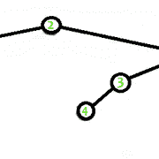

# 打印距离 K 内的所有邻居节点

> 原文:[https://www . geesforgeks . org/print-all-neigbour-nodes-in-distance-k/](https://www.geeksforgeeks.org/print-all-neigbour-nodes-within-distance-k/)

给定一个 **N** 节点、 **E** 边、一个节点 **X** 和一个距离 **K** 的图。任务是打印从 **X** 到 **K** 距离内的所有节点。

> **输入:**
> 
> 
> 
> **输出:** 4 5 2 7 3
> 节点 4 距离 2 内的相邻节点为:4 5 2 7 3

**方法:**
打印距离 **K** 或小于 **K** 的所有节点。我们可以通过应用 [dfs](https://www.geeksforgeeks.org/depth-first-traversal-for-a-graph/) 变量来做到这一点，该变量从我们必须打印距离的地方取 K 个节点，直到距离 K。

```
dfs(K, node, -1, tree)
```

这里-1 表示父节点。
这个递归函数基本上打印节点，然后调用 **dfs(K-1，节点的邻居，节点，树)**。
基础条件为 K > 0。

下面是上述方法的实现:

## C++

```
// C++ program to print
// the nearest K neighbour
// nodes (including itself)
#include <bits/stdc++.h>
using namespace std;

// Structure of an edge
struct arr {
    int from, to;
};

// Recursive function to print
// the neighbor nodes of a node
// until K distance
void dfs(int k, int node,
         int parent,
         const vector<vector<int> >& tree)
{

    // Base condition
    if (k < 0)
        return;

    // Print the node
    cout << node << ' ';

    // Traverse the connected
    // nodes/adjacency list
    for (int i : tree[node]) {

        if (i != parent) {

            // node i becomes the parent
            // of its child node
            dfs(k - 1, i, node, tree);
        }
    }
}

// Function to print nodes under
// distance k
void print_under_dis_K(struct arr graph[],
                       int node, int k,
                       int v, int e)
{

    // To make graph with
    // the given edges
    vector<vector<int> > tree(v + 1,
                              vector<int>());

    for (int i = 0; i < e; i++) {
        int from = graph[i].from;
        int to = graph[i].to;

        tree[from].push_back(to);
        tree[to].push_back(from);
    }

    dfs(k, node, -1, tree);
}

// Driver Code
int main()
{

    // Number of vertex and edges
    int v = 7, e = 6;

    // Given edges
    struct arr graph[v + 1] = {
        { 2, 1 },
        { 2, 5 },
        { 5, 4 },
        { 5, 7 },
        { 4, 3 },
        { 7, 6 }
    };

    // k is the required distance
    // upto which are neighbor
    // nodes should get printed
    int node = 4, k = 2;

    // function calling
    print_under_dis_K(graph, node, k, v, e);

    return 0;
}
```

## Java 语言(一种计算机语言，尤用于创建网站)

```
// Java program to print
// the nearest K neighbour
// nodes (including itself)
import java.util.*;

@SuppressWarnings("unchecked")
class GFG{

// Structure of an edge
public static class arr
{
    public int from, to;

    public arr(int from, int to)
    {
        this.from = from;
        this.to = to;
    }
};

// Recursive function to print
// the neighbor nodes of a node
// until K distance
static void dfs(int k, int node,
                int parent, ArrayList []tree)
{

    // Base condition
    if (k < 0)
        return;

    // Print the node
    System.out.print(node + " ");

    ArrayList tmp = (ArrayList)tree[node];

    // Traverse the connected
    // nodes/adjacency list
    for(int i : (ArrayList<Integer>)tmp)
    {
        if (i != parent)
        {

            // Node i becomes the parent
            // of its child node
            dfs(k - 1, i, node, tree);
        }
    }
}

// Function to print nodes under
// distance k
static void print_under_dis_K(arr []graph,
                              int node, int k,
                              int v, int e)
{

    // To make graph with
    // the given edges
    ArrayList []tree = new ArrayList[v + 1];

    for(int i = 0; i < v + 1; i++)
    {
        tree[i] = new ArrayList();
    }

    for(int i = 0; i < e; i++)
    {

        int from = graph[i].from;
        int to = graph[i].to;

        tree[from].add(to);
        tree[to].add(from);
    }

    dfs(k, node, -1, tree);
}

// Driver Code
public static void main(String[] args)
{

    // Number of vertex and edges
    int v = 7, e = 6;

    // Given edges
    arr []graph = { new arr(2, 1),
                    new arr(2, 5),
                    new arr(5, 4),
                    new arr(5, 7),
                    new arr(4, 3),
                    new arr(7, 6) };

    // k is the required distance
    // upto which are neighbor
    // nodes should get printed
    int node = 4, k = 2;

    // Function calling
    print_under_dis_K(graph, node, k, v, e);
}
}

// This code is contributed by pratham76
```

## 蟒蛇 3

```
# Python3 program to print
# the nearest K neighbour
# nodes (including itself)

tree = [[] for i in range(100)]

# Recursive function to print
# the neighbor nodes of a node
# until K distance
def dfs(k, node, parent):

    # Base condition
    if (k < 0):
        return

    # Print the node
    print(node, end = " ")

    # Traverse the connected
    # nodes/adjacency list
    for i in tree[node]:

        if (i != parent):

            # node i becomes the parent
            # of its child node
            dfs(k - 1, i, node)

# Function to print nodes under
# distance k
def print_under_dis_K(graph, node, k, v, e):

    for i in range(e):

        fro = graph[i][0]
        to = graph[i][1]

        tree[fro].append(to)
        tree[to].append(fro)

    dfs(k, node, -1)

# Driver Code

# Number of vertex and edges
v = 7
e = 6

# Given edges
graph = [[ 2, 1 ],
          [ 2, 5 ],
         [ 5, 4 ],
         [ 5, 7 ],
         [ 4, 3 ],
         [ 7, 6 ]]

# k is the required distance
# upto which are neighbor
# nodes should get pred
node = 4
k = 2

# function calling
print_under_dis_K(graph, node, k, v, e)

# This code is contributed by Mohit Kumar
```

## C#

```
// C# program to print
// the nearest K neighbour
// nodes (including itself)
using System;
using System.Collections;

class GFG
{

// Structure of an edge
public class arr
{
    public int from, to;

    public arr(int from, int to)
    {
        this.from = from;
        this.to = to;
    }
};

// Recursive function to print
// the neighbor nodes of a node
// until K distance
static void dfs(int k, int node,
        int parent, ArrayList []tree)
{

    // Base condition
    if (k < 0)
        return;

    // Print the node
    Console.Write(node+" ");

    ArrayList tmp = (ArrayList)tree[node];

    // Traverse the connected
    // nodes/adjacency list
    foreach (int i in tmp)
    {
        if (i != parent)
        {

            // node i becomes the parent
            // of its child node
            dfs(k - 1, i, node, tree);
        }
    }
}

// Function to print nodes under
// distance k
static void print_under_dis_K(arr []graph,
                    int node, int k,
                    int v, int e)
{

    // To make graph with
    // the given edges
    ArrayList []tree = new ArrayList[v + 1];

    for(int i = 0; i < v + 1; i++)
    {
        tree[i] = new ArrayList();
    }

    for (int i = 0; i < e; i++)
    {

        int from = graph[i].from;
        int to = graph[i].to;

        tree[from].Add(to);
        tree[to].Add(from);
    }

    dfs(k, node, -1, tree);
}
  // Driver Code
  public static void Main(string[] args)
  {

    // Number of vertex and edges
    int v = 7, e = 6;

    // Given edges
    arr []graph = {
        new arr( 2, 1 ),
        new arr( 2, 5 ),
        new arr( 5, 4 ),
        new arr( 5, 7 ),
        new arr( 4, 3 ),
        new arr( 7, 6 )
    };

    // k is the required distance
    // upto which are neighbor
    // nodes should get printed
    int node = 4, k = 2;

    // function calling
    print_under_dis_K(graph, node, k, v, e);
  }
}

// This code is contributed by rutvik_56
```

## java 描述语言

```
<script>

// JavaScript program to print
// the nearest K neighbour
// nodes (including itself)

// Structure of an edge
class arr
{
    constructor(from,to)
    {
        this.from = from;
        this.to = to;
    }
}

// Recursive function to print
// the neighbor nodes of a node
// until K distance
function dfs(k,node,parent,tree)
{
    // Base condition
    if (k < 0)
        return;

    // Print the node
    document.write(node + " ");

    let tmp = tree[node];

    // Traverse the connected
    // nodes/adjacency list
    for(let i=0;i<tmp.length;i++)
    {
        if (tmp[i] != parent)
        {

            // Node i becomes the parent
            // of its child node
            dfs(k - 1, tmp[i], node, tree);
        }
    }
}

// Function to print nodes under
// distance k
function print_under_dis_K(graph,node,k,v,e)
{
    // To make graph with
    // the given edges
    let tree = new Array(v + 1);

    for(let i = 0; i < v + 1; i++)
    {
        tree[i] = [];
    }

    for(let i = 0; i < e; i++)
    {

        let from = graph[i].from;
        let to = graph[i].to;

        tree[from].push(to);
        tree[to].push(from);
    }

    dfs(k, node, -1, tree);
}

// Driver Code
// Number of vertex and edges
    let v = 7, e = 6;

    // Given edges
    let graph = [ new arr(2, 1),
                    new arr(2, 5),
                    new arr(5, 4),
                    new arr(5, 7),
                    new arr(4, 3),
                    new arr(7, 6) ];

    // k is the required distance
    // upto which are neighbor
    // nodes should get printed
    let node = 4, k = 2;

    // Function calling
    print_under_dis_K(graph, node, k, v, e);

// This code is contributed by unknown2108

</script>
```

**Output:** 

```
4 5 2 7 3
```