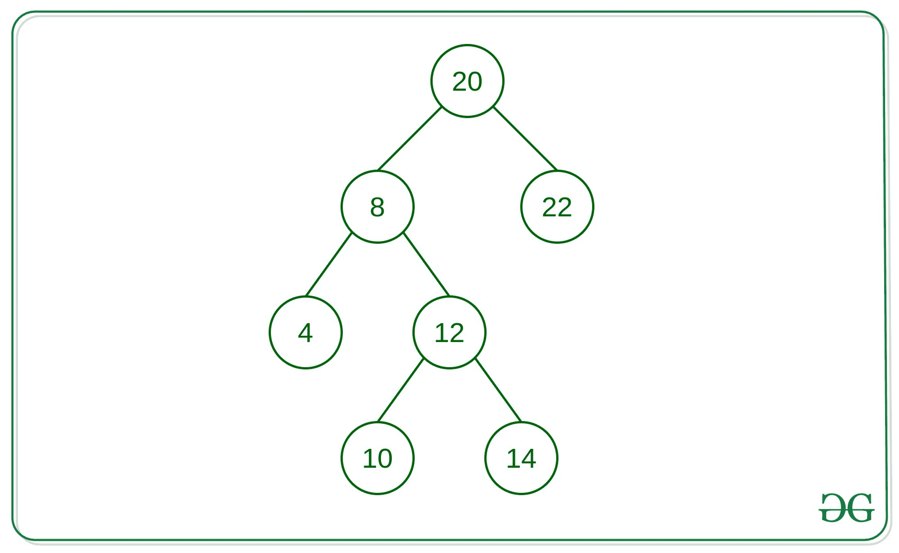

# 打印距给定节点距离为 K 的所有节点:迭代方法

> 原文:[https://www . geeksforgeeks . org/print-距离给定节点 k 的所有节点-迭代方法/](https://www.geeksforgeeks.org/print-all-nodes-at-distance-k-from-given-node-iterative-approach/)

给定一个[二叉树](https://www.geeksforgeeks.org/binary-tree-data-structure/)，一个目标节点和一个整数 **K** ，任务是找到所有距离给定目标节点 **K** 的节点。



> 考虑上面给出的树，对于目标节点 12。
> **输入:** K = 1
> **输出:** 8 10 14
> 
> **输入:**K = 2
> T3】输出: 4 20
> 
> **输入:**K = 3
> T3】输出: 22

**进场:**
距离为 K 的节点一般有两种情况:

1.  距离为 K 的节点是目标节点的子节点。
2.  距离为 K 的节点是目标节点的祖先。

其思想是借助于树上的[级序遍历](https://www.geeksforgeeks.org/level-order-tree-traversal/)，将每个节点的父节点存储在[哈希映射](https://www.geeksforgeeks.org/java-util-hashmap-in-java-with-examples/)中。然后，只需在左子节点、右子节点和父节点上使用[广度优先搜索](https://www.geeksforgeeks.org/breadth-first-search-or-bfs-for-a-graph/)从目标节点遍历节点。在任何时刻，当一个节点到目标节点的距离等于 **K** 时，打印队列的所有节点。

下面是上述方法的实现:

## C++

```
// C++ implementation to print all
// the nodes from the given target
// node iterative approach

#include <bits/stdc++.h>

using namespace std;

// Structure of the Node
struct Node {
    int val;
    Node *left, *right;
};

// Map to store the parent
// node of every node of
// the given Binary Tree
unordered_map<Node*, Node*> um;

// Function to store all nodes
// parent in unordered_map
void storeParent(Node* root)
{

    // Make a queue to do level-order
    // Traversal and store parent
    // of each node in unordered map
    queue<Node*> q;
    q.push(root);

    // Loop to iterate until the
    // queue is not empty
    while (!q.empty()) {
        Node* p = q.front();
        q.pop();

        // Condition if the node is a
        /// root node that storing its
        // parent as NULL
        if (p == root) {
            um[p] = NULL;
        }

        // if left child exist of
        // popped out node then store
        // parent as value and node as key
        if (p->left) {
            um[p->left] = p;
            q.push(p->left);
        }
        if (p->right) {
            um[p->right] = p;
            q.push(p->right);
        }
    }
}

// Function to find the nodes
// at distance K from give node
void nodeAtDistK(Node* root,
           Node* target, int k)
{
    // Keep track of each node
    // which are visited so that
    // while doing BFS we will
    // not traverse it again
    unordered_set<Node*> s;
    int dist = 0;
    queue<Node*> q;
    q.push(target);
    s.insert(target);

    // Loop to iterate over the nodes
    // until the queue is not empty
    while (!q.empty()) {

        // if distance is equal to K
        // then we found a node in tree
        // which is distance K
        if (dist == k) {
            while (!q.empty()) {
                cout << q.front()->val << " ";
                q.pop();
            }
        }

        // BFS on node's left,
        // right and parent node
        int size = q.size();
        for (int i = 0; i < size; i++) {
            Node* p = q.front();
            q.pop();

            // if the left of node is not
            // visited yet then push it in
            // queue and insert it in set as well
            if (p->left &&
                s.find(p->left) == s.end()) {
                q.push(p->left);
                s.insert(p->left);
            }

            // if the right of node is not visited
            // yet then push it in queue
            // and insert it in set as well
            if (p->right &&
                s.find(p->right) == s.end()) {
                q.push(p->right);
                s.insert(p->right);
            }

            // if the parent of node is not visited
            // yet then push it in queue and
            // insert it in set as well
            if (um[p] && s.find(um[p]) == s.end()) {
                q.push(um[p]);
                s.insert(um[p]);
            }
        }
        dist++;
    }
}

// Function to create a newnode
Node* newnode(int val)
{
    Node* temp = new Node;
    temp->val = val;
    temp->left = temp->right = NULL;
    return temp;
}

// Driver Code
int main()
{
    Node* root = newnode(20);
    root->left = newnode(8);
    root->right = newnode(22);
    root->right->left = newnode(5);
    root->right->right = newnode(8);
    root->left->left = newnode(4);
    root->left->left->left = newnode(25);
    root->left->right = newnode(12);
    root->left->right->left =
                   newnode(10);
    root->left->right->left->left =
                   newnode(15);
    root->left->right->left->right =
                   newnode(18);
    root->left->right->left->right->right =
                   newnode(23);
    root->left->right->right =
                   newnode(14);
    Node* target = root->left->right;
    storeParent(root);
    nodeAtDistK(root, target, 3);
    return 0;
}
```

## Java 语言(一种计算机语言，尤用于创建网站)

```
// Java implementation to print all
// the nodes from the given target
// node iterative approach
import java.util.HashMap;
import java.util.HashSet;
import java.util.LinkedList;
import java.util.Queue;

class GFG{

// Structure of the Node
static class Node
{
    int val;
    Node left, right;

    public Node(int val)
    {
        this.val = val;
        this.left = this.right = null;
    }
};

// Map to store the parent
// node of every node of
// the given Binary Tree
static HashMap<Node, Node> um = new HashMap<>();

// Function to store all nodes
// parent in unordered_map
static void storeParent(Node root)
{

    // Make a queue to do level-order
    // Traversal and store parent
    // of each node in unordered map
    Queue<Node> q = new LinkedList<>();
    q.add(root);

    // Loop to iterate until the
    // queue is not empty
    while (!q.isEmpty())
    {
        Node p = q.poll();

        // Condition if the node is a
        /// root node that storing its
        // parent as NULL
        if (p == root)
        {
            um.put(p, null);
        }

        // if left child exist of
        // popped out node then store
        // parent as value and node as key
        if (p.left != null)
        {
            um.put(p.left, p);
            q.add(p.left);
        }
        if (p.right != null)
        {
            um.put(p.right, p);
            q.add(p.right);
        }
    }
}

// Function to find the nodes
// at distance K from give node
static void nodeAtDistK(Node root,
                        Node target, int k)
{

    // Keep track of each node
    // which are visited so that
    // while doing BFS we will
    // not traverse it again
    HashSet<Node> s = new HashSet<>();
    int dist = 0;

    Queue<Node> q = new LinkedList<>();
    q.add(target);
    s.add(target);

    // Loop to iterate over the nodes
    // until the queue is not empty
    while (!q.isEmpty())
    {

        // If distance is equal to K
        // then we found a node in tree
        // which is distance K
        if (dist == k)
        {
            while (!q.isEmpty())
            {
                System.out.print(q.peek().val + " ");
                q.poll();
            }
        }

        // BFS on node's left,
        // right and parent node
        int size = q.size();
        for(int i = 0; i < size; i++)
        {
            Node p = q.poll();

            // If the left of node is not
            // visited yet then add it in
            // queue and insert it in set as well
            if (p.left != null && !s.contains(p.left))
            {
                q.add(p.left);
                s.add(p.left);
            }

            // If the right of node is not visited
            // yet then add it in queue
            // and insert it in set as well
            if (p.right != null && !s.contains(p.right))
            {
                q.add(p.right);
                s.add(p.right);
            }

            // If the parent of node is not visited
            // yet then add it in queue and
            // insert it in set as well
            if (um.get(p) != null &&
                !s.contains(um.get(p)))
            {
                q.add(um.get(p));
                s.add(um.get(p));
            }
        }
        dist++;
    }
}

// Driver Code
public static void main(String[] args)
{
    Node root = new Node(20);
    root.left = new Node(8);
    root.right = new Node(22);
    root.right.left = new Node(5);
    root.right.right = new Node(8);
    root.left.left = new Node(4);
    root.left.left.left = new Node(25);
    root.left.right = new Node(12);
    root.left.right.left = new Node(10);
    root.left.right.left.left = new Node(15);
    root.left.right.left.right = new Node(18);
    root.left.right.left.right.right = new Node(23);
    root.left.right.right = new Node(14);

    Node target = root.left.right;

    storeParent(root);

    nodeAtDistK(root, target, 3);
}
}

// This code is contributed by sanjeev2552
```

## C#

```
// C# implementation to print all
// the nodes from the given target
// node iterative approach
using System;
using System.Collections.Generic;

class GFG{

// Structure of the Node
public class Node
{
    public int val;
    public Node left, right;

    public Node(int val)
    {
        this.val = val;
        this.left = this.right = null;
    }
};

// Map to store the parent
// node of every node of
// the given Binary Tree
static Dictionary<Node,
                  Node> um = new Dictionary<Node,
                                            Node>();

// Function to store all nodes
// parent in unordered_map
static void storeParent(Node root)
{

    // Make a queue to do level-order
    // Traversal and store parent
    // of each node in unordered map
    List<Node> q = new List<Node>();
    q.Add(root);

    // Loop to iterate until the
    // queue is not empty
    while (q.Count != 0)
    {
        Node p = q[0];
        q.RemoveAt(0);

        // Condition if the node is a
        /// root node that storing its
        // parent as NULL
        if (p == root)
        {
            um.Add(p, null);
        }

        // If left child exist of
        // popped out node then store
        // parent as value and node as key
        if (p.left != null)
        {
            um.Add(p.left, p);
            q.Add(p.left);
        }
        if (p.right != null)
        {
            um.Add(p.right, p);
            q.Add(p.right);
        }
    }
}

// Function to find the nodes
// at distance K from give node
static void nodeAtDistK(Node root,
                        Node target, int k)
{

    // Keep track of each node
    // which are visited so that
    // while doing BFS we will
    // not traverse it again
    HashSet<Node> s = new HashSet<Node>();
    int dist = 0;

    List<Node> q = new List<Node>();
    q.Add(target);
    s.Add(target);

    // Loop to iterate over the nodes
    // until the queue is not empty
    while (q.Count != 0)
    {

        // If distance is equal to K
        // then we found a node in tree
        // which is distance K
        if (dist == k)
        {
            while (q.Count != 0)
            {
                Console.Write(q[0].val + " ");
                q.RemoveAt(0);
            }
        }

        // BFS on node's left,
        // right and parent node
        int size = q.Count;
        for(int i = 0; i < size; i++)
        {
            Node p = q[0];
            q.RemoveAt(0);

            // If the left of node is not
            // visited yet then add it in
            // queue and insert it in set as well
            if (p.left != null && !s.Contains(p.left))
            {
                q.Add(p.left);
                s.Add(p.left);
            }

            // If the right of node is not visited
            // yet then add it in queue and insert
            // it in set as well
            if (p.right != null && !s.Contains(p.right))
            {
                q.Add(p.right);
                s.Add(p.right);
            }

            // If the parent of node is not visited
            // yet then add it in queue and
            // insert it in set as well
            if (um[p] != null &&
                !s.Contains(um[p]))
            {
                q.Add(um[p]);
                s.Add(um[p]);
            }
        }
        dist++;
    }
}

// Driver Code
public static void Main(String[] args)
{
    Node root = new Node(20);
    root.left = new Node(8);
    root.right = new Node(22);
    root.right.left = new Node(5);
    root.right.right = new Node(8);
    root.left.left = new Node(4);
    root.left.left.left = new Node(25);
    root.left.right = new Node(12);
    root.left.right.left = new Node(10);
    root.left.right.left.left = new Node(15);
    root.left.right.left.right = new Node(18);
    root.left.right.left.right.right = new Node(23);
    root.left.right.right = new Node(14);

    Node target = root.left.right;

    storeParent(root);

    nodeAtDistK(root, target, 3);
}
}

// This code is contributed by Princi Singh
```