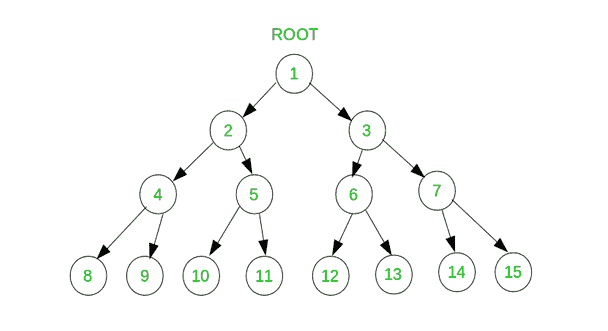

# 打印二叉树中两个给定级别之间的所有节点

> 原文:[https://www . geesforgeks . org/print-二叉树中两个给定级别之间的所有节点/](https://www.geeksforgeeks.org/print-all-nodes-between-two-given-levels-in-binary-tree/)

给定一个二叉树，打印二叉树中两个给定级别之间的所有节点。逐级打印节点，即任何级别的节点都应该从左到右打印。



在上面的树中，如果开始级别为 2，结束级别为 3，则应打印解决方案:

```
2 3 
4 5 6 7 
```

**注**:级别号以 1 开头。也就是说，根节点处于级别 1。

**先决条件** : [等级顺序遍历](https://www.geeksforgeeks.org/level-order-tree-traversal/)。
想法是使用队列对树进行级别顺序遍历，并跟踪当前级别。如果当前级别位于开始和结束级别之间，则打印该级别的节点。

**算法:**

```
levelordertraverse (root, startLevel, endLevel)
q -> empty queue
q.enqueue (root)
level -> 0
while (not q.isEmpty())
     size -> q.size()
     level = level + 1
     while (size)
          node -> q.dequeue()
          if (level between startLevel and endevel)
               print (node)
           if(node.leftnull)
                q.enqueue (node. left)
           if(node.leftnull)
                q.enqueue(node.right)
           size =size -1
```

下面是上述算法的实现:

## C++

```
// C++ program for Print all nodes
// between two given levels in
// a binary tree
#include<bits/stdc++.h>
using namespace std;

// Class containing left and right
// child of current node and key value
struct tree
{

    int data;
    tree *left, *right;
};
struct tree* newNode(int x)
{
    tree* temp = new tree;
    temp->data = x;
    temp->left = temp->right = NULL;
}

// Iterative function to print all
// nodes between two given
// levels in a binary tree
void printNodes(tree* root, int start, int end)
{
    if (root == NULL)
    {
        return;
    }

    // create an empty queue and
    // enqueue root node
    queue<tree*> queue ;
    queue.push(root);

    // pointer to store current node
    tree *curr = NULL;

    // maintains level of current node
    int level = 0;

    // run till queue is not empty
    while (!queue.empty())
    {
        // increment level by 1
        level++;

        // calculate number of nodes in
        // current level
        int size = queue.size();

        // process every node of current level
        // and enqueue their non-empty left
        // and right child to queue
        while (size != 0)
        {
            curr = queue.front();
            queue.pop();

            // print the node if its level is
            // between given levels
            if (level >= start && level <= end)
            {
                cout << curr->data << " ";
            }
            if (curr->left != NULL)
            {
                queue.push(curr->left);
            }

            if (curr->right != NULL)
            {
                queue.push(curr->right);
            }
            size--;
        }

        if (level >= start && level <= end)
        {
            cout << ("\n");
        };
    }
}

// Driver Code
int main()
{

    tree *root = newNode(1);
    root->left = newNode(2);
    root->right = newNode(3);
    root->left->left = newNode(4);
    root->left->right = newNode(5);
    root->right->left = newNode(6);
    root->right->right = newNode(7);

    /* Constructed binary tree is
        1
    / \
    2 3
    / \ / \
    4 5 6 7 */

    int start = 2, end = 3;

    printNodes(root, start, end);
}

// This code is contributed by Rajput-Ji
```

## Java 语言(一种计算机语言，尤用于创建网站)

```
// Java program for Print all nodes
// between two given levels in
// a binary tree

import java.util.LinkedList;
import java.util.Queue;

public class BinaryTree {

    // Class containing left and right
    // child of current node and key value
    static class Node {

        int data;
        Node left, right;

        public Node(int item)
        {
            data = item;
            left = right = null;
        }
    }

    // Root of the Binary Tree
    Node root;
    public BinaryTree()
    {
        root = null;
    }

    // Iterative function to print all
    // nodes between two given
    // levels in a binary tree
    void printNodes(Node root, int start, int end)
    {
        if (root == null) {
            return;
        }

        // create an empty queue and
        // enqueue root node
        Queue<Node> queue = new LinkedList<Node>();
        queue.add(root);

        // pointer to store current node
        Node curr = null;

        // maintains level of current node
        int level = 0;

        // run till queue is not empty
        while (!queue.isEmpty()) {
            // increment level by 1
            level++;

            // calculate number of nodes in
            // current level
            int size = queue.size();

            // process every node of current level
            // and enqueue their non-empty left
            // and right child to queue
            while (size != 0) {
                curr = queue.poll();

                // print the node if its level is
                // between given levels
                if (level >= start && level <= end) {
                    System.out.print(curr.data + " ");
                }
                if (curr.left != null) {
                    queue.add(curr.left);
                }

                if (curr.right != null) {
                    queue.add(curr.right);
                }
                size--;
            }

            if (level >= start && level <= end) {
                System.out.println("");
            };
        }
    }

    // Driver Code
    public static void main(String args[])
    {
        BinaryTree tree = new BinaryTree();
        tree.root = new Node(1);
        tree.root.left = new Node(2);
        tree.root.right = new Node(3);
        tree.root.left.left = new Node(4);
        tree.root.left.right = new Node(5);
        tree.root.right.left = new Node(6);
        tree.root.right.right = new Node(7);

        /* Constructed binary tree is
             1
           /  \
          2    3
         / \  / \
        4   5 6  7 */

        int start = 2, end = 3;

        tree.printNodes(tree.root, start, end);
    }
}
```

## 蟒蛇 3

```
# Python3 program for Print all nodes
# between two given levels in
# a binary tree

# Helper function that allocates a new
# node with the given data and None
# left and right pointers.                                
class newNode:

    # Construct to create a new node
    def __init__(self, key):
        self.data = key
        self.left = None
        self.right = None

# Iterative function to print all
# nodes between two given
# levels in a binary tree
def prNodes(root, start, end):

    if (root == None):
        return

    # create an empty queue and
    # enqueue root node
    q = []
    q.append(root)

    # pointer to ste current node
    curr = None

    # maains level of current node
    level = 0

    # run till queue is not empty
    while (len(q)):

        # increment level by 1
        level += 1

        # calculate number of nodes in
        # current level
        size = len(q)

        # process every node of current level
        # and enqueue their non-empty left
        # and right child to queue
        while (size != 0) :
            curr = q[0]
            q.pop(0)

            # print the node if its level is
            # between given levels
            if (level >= start and level <= end) :
                print(curr.data, end = " ")

            if (curr.left != None) :
                q.append(curr.left)

            if (curr.right != None) :
                q.append(curr.right)

            size -= 1

        if (level >= start and level <= end) :
            print("")

# Driver Code
if __name__ == '__main__':

    """
    Let us create Binary Tree shown
    in above example """
    root = newNode(1)
    root.left = newNode(2)

    root.left.left = newNode(4)
    root.left.right = newNode(5)
    root.right = newNode(3)
    root.right.right = newNode(7)
    root.right.left = newNode(6)
    start = 2
    end = 3
    prNodes(root, start, end)

# This code is contributed by
# Shubham Singh(SHUBHAMSINGH10)
```

## C#

```
// C# program for Print all nodes
// between two given levels in
// a binary tree
using System;
using System.Collections.Generic;

public class BinaryTree
{

    // Class containing left and right
    // child of current node and key value
    public class Node
    {

        public int data;
        public Node left, right;

        public Node(int item)
        {
            data = item;
            left = right = null;
        }
    }

    // Root of the Binary Tree
    Node root;

    public BinaryTree()
    {
        root = null;
    }

    // Iterative function to print all
    // nodes between two given
    // levels in a binary tree
    void printNodes(Node root, int start, int end)
    {
        if (root == null)
        {
            return;
        }

        // create an empty queue and
        // enqueue root node
        Queue<Node> queue = new Queue<Node>();
        queue.Enqueue(root);

        // pointer to store current node
        Node curr = null;

        // maintains level of current node
        int level = 0;

        // run till queue is not empty
        while (queue.Count >0)
        {
            // increment level by 1
            level++;

            // calculate number of nodes in
            // current level
            int size = queue.Count;

            // process every node of current level
            // and enqueue their non-empty left
            // and right child to queue
            while (size != 0)
            {
                curr = queue.Peek();
                queue.Dequeue();

                // print the node if its level is
                // between given levels
                if (level >= start && level <= end)
                {
                    Console.Write(curr.data + " ");
                }
                if (curr.left != null)
                {
                    queue.Enqueue(curr.left);
                }

                if (curr.right != null)
                {
                    queue.Enqueue(curr.right);
                }
                size--;
            }

            if (level >= start && level <= end)
            {
                Console.WriteLine("");
            };
        }
    }

    // Driver Code
    public static void Main(String []args)
    {
        BinaryTree tree = new BinaryTree();
        tree.root = new Node(1);
        tree.root.left = new Node(2);
        tree.root.right = new Node(3);
        tree.root.left.left = new Node(4);
        tree.root.left.right = new Node(5);
        tree.root.right.left = new Node(6);
        tree.root.right.right = new Node(7);

        /* Constructed binary tree is
            1
        / \
        2 3
        / \ / \
        4 5 6 7 */
        int start = 2, end = 3;

        tree.printNodes(tree.root, start, end);
    }
}

// This code is contributed by 29AjayKumar
```

## java 描述语言

```
<script>
    // Javascript program for Print all nodes
    // between two given levels in
    // a binary tree

    class Node
    {
        constructor(data) {
           this.left = null;
           this.right = null;
           this.data = data;
        }
    }

    // Root of the Binary Tree
    let root = null;

    // Iterative function to print all
    // nodes between two given
    // levels in a binary tree
    function printNodes(root, start, end)
    {
        if (root == null) {
            return;
        }

        // create an empty queue and
        // enqueue root node
        let queue = [];
        queue.push(root);

        // pointer to store current node
        let curr = null;

        // maintains level of current node
        let level = 0;

        // run till queue is not empty
        while (queue.length > 0) {
            // increment level by 1
            level++;

            // calculate number of nodes in
            // current level
            let size = queue.length;

            // process every node of current level
            // and enqueue their non-empty left
            // and right child to queue
            while (size != 0) {
                curr = queue[0];
                queue.shift();

                // print the node if its level is
                // between given levels
                if (level >= start && level <= end) {
                    document.write(curr.data + " ");
                }
                if (curr.left != null) {
                    queue.push(curr.left);
                }

                if (curr.right != null) {
                    queue.push(curr.right);
                }
                size--;
            }

            if (level >= start && level <= end) {
                document.write("</br>");
            }
        }
    }

    let tree = new Node(0);
    tree.root = new Node(1);
    tree.root.left = new Node(2);
    tree.root.right = new Node(3);
    tree.root.left.left = new Node(4);
    tree.root.left.right = new Node(5);
    tree.root.right.left = new Node(6);
    tree.root.right.right = new Node(7);

    /* Constructed binary tree is
               1
             /  \
            2    3
           / \  / \
          4   5 6  7 */

    let start = 2, end = 3;

    printNodes(tree.root, start, end);

 // This code is contributed by decode2207.
</script>
```

**Output**

```
2 3 
4 5 6 7 
```