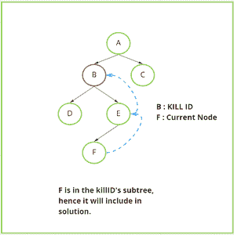

# 打印二叉树给定节点的子树中的所有节点

> 原文:[https://www . geesforgeks . org/print-所有节点都存在于给定二叉树节点的子树中/](https://www.geeksforgeeks.org/print-all-nodes-present-in-the-subtree-of-a-given-node-of-a-binary-tree/)

给定两个[数组](https://www.geeksforgeeks.org/introduction-to-arrays/) **节点 _ID[]** 和**父节点 _ID[]。**，构造一个[二叉树](https://www.geeksforgeeks.org/binary-tree-data-structure/)，其中第 i <sup>个</sup>节点的值等于**Node _ ID【I】**，第 i <sup>个</sup>节点的父节点为**Parent _ ID【I】**。给定一个节点 **X** ，任务是打印以 **X** 为根的树的节点值。

**示例**:

> **输入:** Node_ID[]= [11，48，100，5]，Parent_ID[] = [48，0，5，48]，X = 5
> **输出:**【5，100】
> **解释:**
> 构建的树如下:
> 48
> /\
> 11 5
> /
> 100
> 因此，节点 5 的子树包含
> 
> **输入** : Node_ID[] = [1，2，3]，Parent_ID[] = [0，1，1]，X = 2
> **输出** : [2]

**天真方法**:按照以下步骤解决问题

1.  从**节点 _ID[]** 和**父节点 _ID[]** 构建树形结构
2.  在向量**树**中存储有父 X 的节点
3.  对于每个节点，检查 [**X** 是否是该节点的祖先](https://www.geeksforgeeks.org/query-ancestor-descendant-relationship-tree/)
4.  如果发现为真，将节点存储在向量**树**中。否则，继续。
5.  打印矢量**树**中的节点

[](https://media.geeksforgeeks.org/wp-content/uploads/20210131205734/naivekillprocess-298x300.PNG)

下面是上述方法的实现:

## C++

```
#include <bits/stdc++.h>
using namespace std;

// Function to print nodes
// in the tree rooted at x
void subtreeX(vector<int>& nid,
              vector<int>& pid, int x)
{
    unordered_map<int, int> parent;

    vector<int> tree;

    // Map every node to its parent
    for (int i = 0; i < nid.size(); i++) {
        parent[nid[i]] = pid[i];
    }

    // Subtree with x as root
    tree.push_back(x);

    for (int i = 0; i < nid.size(); i++) {
        int k = nid[i];
        int p = k;

        // Iterate until k becomes
        // equal to the root
        while (k != 0) {

            if (parent[k] == x) {

                // x is an ancestor of nid[i]
                tree.push_back(nid[i]);
                break;
            }

            k = parent[k];
        }
    }

    // Print elements in the subtree
    for (int node : tree)
        cout << node << " ";
}

// Driver Code
int main()
{
    vector<int> nid = { 11, 48, 100, 5 };
    vector<int> pid = { 48, 0, 5, 48 };
    int x = 5;

    // Function call to print nodes
    // in the tree rooted at x
    subtreeX(nid, pid, x);

    return 0;
}
```

## Java 语言(一种计算机语言，尤用于创建网站)

```
import java.util.*;
class GFG
{

    // Function to print nodes
    // in the tree rooted at x
    static void subtreeX(int[] nid, int[] pid, int x)
    {
        HashMap<Integer, Integer> parent
        = new HashMap<Integer, Integer>();

        List<Integer> tree = new LinkedList<>();

        // Map every node to its parent
        for (int i = 0; i < nid.length; i++)
        {
            parent.put(nid[i], pid[i]);
        }

        // Subtree with x as root
        tree.add(x);
        for (int i = 0; i < nid.length; i++)
        {
            int k = nid[i];
            int p = k;

            // Iterate until k becomes
            // equal to the root
            while (k != 0)
            {

                if (parent.containsKey(k) && parent.get(k) == x)
                {

                    // x is an ancestor of nid[i]
                    tree.add(nid[i]);
                    break;
                }
                k = parent.containsKey(k) ? parent.get(k) : -1;
            }
        }

        // Print elements in the subtree
        for (int node : tree)
            System.out.print(node + " ");
    }

    // Driver Code
    public static void main(String[] args)
    {
        int[] nid = { 11, 48, 100, 5 };
        int[] pid = { 48, 0, 5, 48 };
        int x = 5;

        // Function call to print nodes
        // in the tree rooted at x
        subtreeX(nid, pid, x);
    }
}

// This code is contributed by 29AjayKumar
```

## 蟒蛇 3

```
# Function to prnodes
# in the tree rooted at x
def subtreeX(nid, pid, x):
    parent = {}
    tree = []

    # Map every node to its parent
    for i in range(len(nid)):
        parent[nid[i]] = pid[i]

    # Subtree with x as root
    tree.append(x)
    for i in range(len(nid)):
        k = nid[i]
        p = k

        # Iterate until k becomes
        # equal to the root
        while (k != 0):
            if (parent[k] == x):

                # x is an ancestor of nid[i]
                tree.append(nid[i])
                break
            k = parent[k]

    # Prelements in the subtree
    for node in tree:
        print(node, end = " ")

# Driver Code
if __name__ == '__main__':
    nid = [11, 48, 100, 5]
    pid = [48, 0, 5, 48 ]
    x = 5

    # Function call to prnodes
    # in the tree rooted at x
    subtreeX(nid, pid, x)

    # This code is contributed by mohit kumar 29.
```

## C#

```
using System;
using System.Collections.Generic;
public class GFG
{

  // Function to print nodes
  // in the tree rooted at x
  static void subtreeX(int[] nid, int[] pid, int x)
  {
    Dictionary<int, int> parent
      = new Dictionary<int, int>();
    List<int> tree = new List<int>();

    // Map every node to its parent
    for (int i = 0; i < nid.Length; i++)
    {
      parent.Add(nid[i], pid[i]);
    }

    // Subtree with x as root
    tree.Add(x);
    for (int i = 0; i < nid.Length; i++)
    {
      int k = nid[i];
      int p = k;

      // Iterate until k becomes
      // equal to the root
      while (k != 0)
      {      
        if (parent.ContainsKey(k) && parent[k] == x)
        {

          // x is an ancestor of nid[i]
          tree.Add(nid[i]);
          break;
        }
        k = parent.ContainsKey(k) ? parent[k] : -1;
      }
    }

    // Print elements in the subtree
    foreach (int node in tree)
      Console.Write(node + " ");
  }

  // Driver Code
  public static void Main(String[] args)
  {
    int[] nid = { 11, 48, 100, 5 };
    int[] pid = { 48, 0, 5, 48 };
    int x = 5;

    // Function call to print nodes
    // in the tree rooted at x
    subtreeX(nid, pid, x);
  }
}

// This code is contributed by shikhasingrajput
```

## java 描述语言

```
<script>

// Function to print nodes
// in the tree rooted at x
function subtreeX(nid, pid, x)
{
  var parent = new Map();

  var tree = [];
  // Map every node to its parent
  for (var i = 0; i < nid.length; i++)
  {
    parent.set(nid[i], pid[i]);
  }
  // Subtree with x as root
  tree.push(x);
  for (var i = 0; i < nid.length; i++)
  {
    var k = nid[i];
    var p = k;
    // Iterate until k becomes
    // equal to the root
    while (k != 0)
    {      
      if (parent.has(k) && parent.get(k) == x)
      {
        // x is an ancestor of nid[i]
        tree.push(nid[i]);
        break;
      }
      k = parent.has(k) ? parent.get(k) : -1;
    }
  }
  // Print elements in the subtree
  for(var node of tree)
    document.write(node + " ");
}
// Driver Code
var nid = [11, 48, 100, 5];
var pid = [48, 0, 5, 48];
var x = 5;
// Function call to print nodes
// in the tree rooted at x
subtreeX(nid, pid, x);

</script>
```

**Output:** 

```
5 100
```

***时间复杂度**:O(N<sup>2</sup>)*
***辅助空间** : O(N)*

**高效方法:**按照以下步骤优化上述方法:

1.  从**节点 _ID[]** 和**父节点 _ID[]** 构建树形结构
2.  从节点 **X** 执行 [DFS](https://www.geeksforgeeks.org/depth-first-traversal-for-a-graph/) 。
3.  将节点存储在向量**树**中
4.  打印矢量**树**中的节点

下面是上述方法的实现:

## C++

```
#include <bits/stdc++.h>
using namespace std;

// DFS to traverse subtree rooted  at x
void dfs(int x, vector<int>& tree,
         map<int, vector<int> >& child)
{
    // Push x into the vector
    tree.push_back(x);

    // Check if x is a leaf node
    if (child.find(x) != child.end()) {

        // Recursively call dfs
        // for children of x
        for (int next : child[x]) {
            dfs(next, tree, child);
        }
    }
}

// Function to print nodes
// in the tree rooted at x
void SubtreeX(vector<int>& nid,
              vector<int>& pid, int x)
{
    int n = nid.size();
    map<int, vector<int> > child;

    // adding edges in a tree
    for (int i = 0; i < n; i++) {

        if (child.find(pid[i])
            == child.end()) {

            // Initialize adjacency list
            child[pid[i]] = vector<int>();
        }

        child[pid[i]].push_back(nid[i]);
    }

    // Stores nodes in the subtree
    vector<int> tree;

    // Perform DFS from node x
    dfs(x, tree, child);

    for (int node : tree) {
        cout << node << " ";
    }
}

// Driver Code
int main()
{
    vector<int> nid = { 11, 48, 100, 5 };
    vector<int> pid = { 48, 0, 5, 48 };
    int x = 5;

    // Function call to print nodes
    // in the tree rooted at x
    SubtreeX(nid, pid, x);

    return 0;
}
```

## Java 语言(一种计算机语言，尤用于创建网站)

```
import java.io.*;
import java.util.*;

class GFG{

// DFS to traverse subtree rooted  at x
static void dfs(int x, Vector<Integer> tree,
          Map<Integer, Vector<Integer>> child)
{

    // Push x into the vector
    tree.add(x);

    // Check if x is a leaf node
    if (child.containsKey(x))
    {

        // Recursively call dfs
        // for children of x
        for(int next : child.get(x))
        {
            dfs(next, tree, child);
        }
    }
}

// Function to print nodes
// in the tree rooted at x
static void SubtreeX(Vector<Integer> nid,
                     Vector<Integer> pid, int x)
{
    int n = nid.size();
    Map<Integer, Vector<Integer>> child = new HashMap<>();

    // Adding edges in a tree
    for(int i = 0; i < n; i++)
    {
        if (!child.containsKey(pid.get(i)))
        {

            // Initialize adjacency list
            child.put(pid.get(i), new Vector<Integer>());
        }
        child.get(pid.get(i)).add(nid.get(i));
    }

    // Stores nodes in the subtree
    Vector<Integer> tree = new Vector<Integer>();

    // Perform DFS from node x
    dfs(x, tree, child);

    for(int node : tree)
    {
        System.out.print(node + " ");
    }
}

// Driver Code
public static void main (String[] args)
{
    Vector<Integer> nid = new Vector<Integer>(
        Arrays.asList(11, 48, 100, 5));
    Vector<Integer> pid = new Vector<Integer>(
        Arrays.asList(48, 0, 5, 48));

    int x = 5;

    // Function call to print nodes
    // in the tree rooted at x
    SubtreeX(nid, pid, x);
}
}

// This code is contributed by rag2127
```

## 蟒蛇 3

```
# DFS to traverse subtree rooted  at x
def dfs(x, tree, child):

    # Push x into the vector
    tree.append(x)

    # Check if x is a leaf node
    if x in child:

        # Recursively call dfs
        # for children of x
        for nextt in child[x]:
            dfs(nextt, tree, child)

# Function to print nodes
# in the tree rooted at x
def SubtreeX(nid,pid,x):
    n = len(nid)
    child = {}

    #  Adding edges in a tree  
    for i in range(n):
        if pid[i] not in child:

            # Initialize adjacency list
            child[pid[i]] = []
        child[pid[i]].append(nid[i])

    # Stores nodes in the subtree
    tree = []

    # Perform DFS from node x
    dfs(x, tree, child)
    print(*tree)

# Driver Code
nid = [11, 48, 100, 5]
pid = [48, 0, 5, 48]
x = 5

# Function call to print nodes
# in the tree rooted at x
SubtreeX(nid, pid, x)

# This code is contributed by avanitrachhadiya2155
```

## C#

```
using System;
using System.Collections.Generic;
class GFG {

    // DFS to traverse subtree rooted  at x
    static void dfs(int x, List<int> tree,
              Dictionary<int, List<int>> child)
    {

        // Push x into the vector
        tree.Add(x);

        // Check if x is a leaf node
        if (child.ContainsKey(x))
        {

            // Recursively call dfs
            // for children of x
            foreach(int next in child[x])
            {
                dfs(next, tree, child);
            }
        }
    }

    // Function to print nodes
    // in the tree rooted at x
    static void SubtreeX(List<int> nid, List<int> pid, int x)
    {
        int n = nid.Count;
        Dictionary<int, List<int>> child = new Dictionary<int, List<int>>();

        // Adding edges in a tree
        for(int i = 0; i < n; i++)
        {
            if (!child.ContainsKey(pid[i]))
            {

                // Initialize adjacency list
                child[pid[i]] = new List<int>();
            }
            child[pid[i]].Add(nid[i]);
        }

        // Stores nodes in the subtree
        List<int> tree = new List<int>();

        // Perform DFS from node x
        dfs(x, tree, child);

        foreach(int node in tree)
        {
            Console.Write(node + " ");
        }
    }

  // Driver code
  static void Main() {
    List<int> nid = new List<int>{11, 48, 100, 5};
    List<int> pid = new List<int>{48, 0, 5, 48};

    int x = 5;

    // Function call to print nodes
    // in the tree rooted at x
    SubtreeX(nid, pid, x);
  }
}

// This code is contributed by decode2207.
```

## java 描述语言

```
<script>

// DFS to traverse subtree rooted  at x
function dfs(x,tree,child)
{
    // Push x into the vector
    tree.push(x);

    // Check if x is a leaf node
    if (child.has(x))
    {

        // Recursively call dfs
        // for children of x
        for(let next=0;next< child.get(x).length;next++)
        {
            dfs(child.get(x)[next], tree, child);
        }
    }
}

// Function to print nodes
// in the tree rooted at x
function SubtreeX(nid,pid,x)
{
    let n = nid.length;
    let child = new Map();

    // Adding edges in a tree
    for(let i = 0; i < n; i++)
    {
        if (!child.has(pid[i]))
        {

            // Initialize adjacency list
            child.set(pid[i], []);
        }
        child.get(pid[i]).push(nid[i]);
    }

    // Stores nodes in the subtree
    let tree = [];

    // Perform DFS from node x
    dfs(x, tree, child);

    for(let node=0;node< tree.length;node++)
    {
        document.write(tree[node] + " ");
    }
}

// Driver Code
let nid = [11, 48, 100, 5];
let pid = [48, 0, 5, 48];

let x = 5;

// Function call to print nodes
// in the tree rooted at x
SubtreeX(nid, pid, x);

// This code is contributed by unknown2108
</script>
```

**Output:** 

```
5 100
```

***时间复杂度** : O(N)*
***辅助空间** : O(N)*