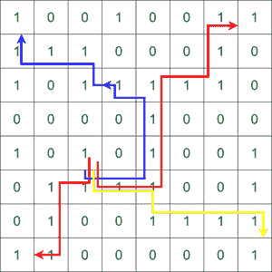

# 打印从源点到矩阵所有 4 个角的所有路径

> 原文:[https://www . geeksforgeeks . org/print-所有路径-从一个源点到矩阵的所有四个角/](https://www.geeksforgeeks.org/print-all-paths-from-a-source-point-to-all-the-4-corners-of-a-matrix/)

给定包含 **1s** 和 **0s** 的大小为 **M*N** 的 [2D 数组](https://www.geeksforgeeks.org/multidimensional-arrays-c-cpp/) **arr[][]** ，其中 **1** 表示该单元可以被访问， **0s** 表示该单元被阻塞。有一个源点 **(x，y)** ，任务是打印从给定源到阵列的任意四个角的所有路径 **(0，0)，(0，N–1)，(M–1，0)** 和**(M–1，N–1)**。

**示例:**

> **输入:** arr[][] = {{1，0，0，1，0，0，1，1}，{1，1，1，0，0，1，0}，{1，0，1，1，1，1，1，1，1，0}，{0，0，0，0，1，0，0，0，0，0}，{1，0，1，0，1，0，0，0，1}，{0，1，1，1，1，1，0，0，0，1}source = {4，2 }
> T5】Output:{“DRRUUURRUUR”、“DRRUUULLULLU”、“DRRDRRRD”、“DLDDL”}
> **解释:**从源到 4 个角的所有可能路径是
> 
> 
> 
> **输入:** arr[][] = {{0，1，0}，{0，0，0}，{0，0，0}}，来源= {0，1}
> **输出:**无可能路径

**方法:**想法是使用[递归](https://www.geeksforgeeks.org/recursion/)和[回溯](https://www.geeksforgeeks.org/backtracking-algorithms/)通过考虑从源到目的地的每个可能路径来找到所有可能的路径，如果是有效路径，则存储它。按照以下步骤解决问题:

*   [初始化一个字符串向量](https://www.geeksforgeeks.org/array-strings-c-3-different-ways-create/)**ans【】**来存储答案。
*   递归调用[函数](https://www.geeksforgeeks.org/functions-in-c/#:~:text=C%20also%20allows%20to%20declare, Below%20is%20an%20example%20declaration.&text=The%20parameters%20passed%20to%20function%20are%20called%20actual%20parameters.)检查 4 个方向中的每一个，同时按下当前方向并访问单元格。
*   如果指针越过边界或者要访问的单元格不是有效单元格，即其值为 **0** ，则返回。
*   否则，存储当前单元格，并在到达任何一端时，将其作为结果之一。
*   执行上述步骤后，[打印阵列](https://www.geeksforgeeks.org/c-program-to-print-an-array-using-recursion/)**ans【】**。

下面是上述方法的实现。

## C++

```
// C++ program for the above approach
#include <bits/stdc++.h>
using namespace std;

struct direction {
    int x, y;
    char c;
};

// Function to check if we reached on
// of the entry/exit (corner) point.
bool isCorner(int i, int j, int M, int N)
{
    if ((i == 0 && j == 0)
        || (i == 0 && j == N - 1)
        || (i == M - 1 && j == N - 1)
        || (i == M - 1 && j == 0))
        return true;

    return false;
}

// Function to check if the index is
// within the matrix boundary.
bool isValid(int i, int j, int M, int N)
{
    if (i < 0 || i >= M || j < 0 || j >= N)
        return false;
    return true;
}

// Recursive helper function
void solve(int i, int j, int M, int N,
           direction dir[],
           vector<vector<int> >& maze,
           string& t, vector<string>& ans)
{

    // If any corner is reached push the
    // string t into ans and return
    if (isCorner(i, j, M, N)) {
        ans.push_back(t);
        return;
    }

    // For all the four directions
    for (int k = 0; k < 4; k++) {

        // The new ith index
        int x = i + dir[k].x;

        // The new jth index
        int y = j + dir[k].y;

        // The direction R/L/U/D
        char c = dir[k].c;

        // If the new cell is within the
        // matrix boundary and it is not
        // previously visited in same path
        if (isValid(x, y, M, N)
            && maze[x][y] == 1) {

            // Mark the new cell as visited
            maze[x][y] = 0;

            // Store the direction
            t.push_back(c);

            // Recur
            solve(x, y, M, N, dir,
                  maze, t, ans);

            // Backtrack to explore
            // other paths
            t.pop_back();
            maze[x][y] = 1;
        }
    }
    return;
}

// Function to find all possible paths
vector<string> possiblePaths(
    vector<int> src, vector<vector<int> >& maze)
{
    // Create a direction  array for all
    // the four directions
    direction dir[4] = { { -1, 0, 'U' },
                         { 0, 1, 'R' },
                         { 1, 0, 'D' },
                         { 0, -1, 'L' } };

    // Stores the result
    string temp;
    vector<string> ans;

    solve(src[0], src[1], maze.size(),
          maze[0].size(), dir,
          maze, temp, ans);

    return ans;
}

// Driver Code
int main()
{

    // Initializing the variables
    vector<vector<int> > maze = {
        { 1, 0, 0, 1, 0, 0, 1, 1 },
        { 1, 1, 1, 0, 0, 0, 1, 0 },
        { 1, 0, 1, 1, 1, 1, 1, 0 },
        { 0, 0, 0, 0, 1, 0, 0, 0 },
        { 1, 0, 1, 0, 1, 0, 0, 1 },
        { 0, 1, 1, 1, 1, 0, 0, 1 },
        { 0, 1, 0, 0, 1, 1, 1, 1 },
        { 1, 1, 0, 0, 0, 0, 0, 1 },
    };
    vector<int> src = { 4, 2 };

    // Function Call
    vector<string> paths
        = possiblePaths(src, maze);

    // Print the result
    if (paths.size() == 0) {
        cout << "No Possible Paths";
        return 0;
    }

    for (int i = 0; i < paths.size(); i++)
        cout << paths[i] << endl;

    return 0;
}
```

## 蟒蛇 3

```
# Python program for the above approach

# Function to check if we reached on
# of the entry/exit (corner) point.
def isCorner(i, j, M, N):
    if((i == 0 and j == 0) or (i == 0 and j == N-1) or (i == M-1 and j == N-1) or (i == M-1 and j == 0)):
        return True
    return False

# Function to check if the index is
# within the matrix boundary.
def isValid(i, j, M, N):
    if(i < 0 or i >= M or j < 0 or j >= N):
        return False
    return True

# Recursive helper function
def solve(i, j, M, N, Dir, maze, t, ans):

    # If any corner is reached push the
    # string t into ans and return
    if(isCorner(i, j, M, N)):
        ans.append(t)
        return

    # For all the four directions
    for k in range(4):

      # The new ith index
        x = i + Dir[k][0]

        # The new jth index
        y = j + Dir[k][1]

        # The direction R/L/U/D
        c = Dir[k][2]

         # If the new cell is within the
        # matrix boundary and it is not
        # previously visited in same path
        if(isValid(x, y, M, N) and maze[x][y] == 1):

          # mark the new cell visited
            maze[x][y] = 0

            # Store the direction
            t += c
            solve(x, y, M, N, Dir, maze, t, ans)

             # Backtrack to explore
            # other paths
            t = t[: len(t)-1]
            maze[x][y] = 1
    return

# Function to find all possible paths
def possiblePaths(src, maze):

     # Create a direction  array for all
    # the four directions
    Dir = [[-1, 0, 'U'], [0, 1, 'R'], [1, 0, 'D'], [0, -1, 'L']]

    # stores the result 
    temp = ""
    ans = []
    solve(src[0], src[1], len(maze), len(maze[0]), Dir, maze, temp, ans)
    return ans

# Driver code

# Initialise variable
maze = [[1, 0, 0, 1, 0, 0, 1, 1],
        [1, 1, 1, 0, 0, 0, 1, 0],
        [1, 0, 1, 1, 1, 1, 1, 0],
        [0, 0, 0, 0, 1, 0, 0, 0],
        [1, 0, 1, 0, 1, 0, 0, 1],
        [0, 1, 1, 1, 1, 0, 0, 1],
        [0, 1, 0, 0, 1, 1, 1, 1],
        [1, 1, 0, 0, 0, 0, 0, 1]]
src = [4, 2]

# function call
paths = possiblePaths(src, maze)

# Print the result
if(len(paths) == 0):
    print("No Possible Paths")
else:
    for i in paths:
        print(i)

# This code is contributed by parthmanchanda81
```

## java 描述语言

```
<script>
// Javascript program for the above approach

// Function to check if we reached on
// of the entry/exit (corner) point.
function isCorner(i, j, M, N) {
  if (
    (i == 0 && j == 0) ||
    (i == 0 && j == N - 1) ||
    (i == M - 1 && j == N - 1) ||
    (i == M - 1 && j == 0)
  )
    return true;
  return false;
}

// Function to check if the index is
// within the matrix boundary.
function isValid(i, j, M, N) {
  if (i < 0 || i >= M || j < 0 || j >= N) return false;
  return true;
}

// Recursive helper function
function solve(i, j, M, N, Dir, maze, t, ans) {
  // If any corner is reached push the
  // string t into ans and return
  if (isCorner(i, j, M, N)) {
    ans.push(t);
    return;
  }

  // For all the four directions
  for (let k = 0; k < 4; k++) {
    // The new ith index
    let x = i + Dir[k][0];

    // The new jth index
    let y = j + Dir[k][1];

    // The direction R/L/U/D
    let c = Dir[k][2];

    // If the new cell is within the
    // matrix boundary and it is not
    // previously visited in same path
    if (isValid(x, y, M, N) && maze[x][y] == 1) {
      // mark the new cell visited
      maze[x][y] = 0;

      // Store the direction
      t += c;
      solve(x, y, M, N, Dir, maze, t, ans);

      // Backtrack to explore
      // other paths

      t = t.substr(0, t.length - 1);
      maze[x][y] = 1;
    }
  }
  return;
}

// Function to find all possible paths
function possiblePaths(src, maze) {
  // Create a direction  array for all
  // the four directions
  let Dir = [
    [-1, 0, "U"],
    [0, 1, "R"],
    [1, 0, "D"],
    [0, -1, "L"],
  ];

  // stores the result
  let temp = "";
  let ans = [];
  solve(src[0], src[1], maze.length, maze[0].length, Dir, maze, temp, ans);
  return ans;
}

// Driver code

// Initialise variable
let maze = [
  [1, 0, 0, 1, 0, 0, 1, 1],
  [1, 1, 1, 0, 0, 0, 1, 0],
  [1, 0, 1, 1, 1, 1, 1, 0],
  [0, 0, 0, 0, 1, 0, 0, 0],
  [1, 0, 1, 0, 1, 0, 0, 1],
  [0, 1, 1, 1, 1, 0, 0, 1],
  [0, 1, 0, 0, 1, 1, 1, 1],
  [1, 1, 0, 0, 0, 0, 0, 1],
];
let src = [4, 2];

// function call
let paths = possiblePaths(src, maze);

// Print the result
if (paths.length == 0) {
  document.write("No Possible Paths");
} else {
  for (let i = 0; i < paths.length; i++) {
    if (paths[i]) document.write(paths[i] + "<Br>");
  }
}

// This code is contributed by _saurabh_jaiswal

</script>
```

**Output:** 

```
DRRUUURRUUR
DRRUUULLULLU
DRRDRRRD
DLDDL
```

***时间复杂度:**O(3<sup>(M * N)</sup>)*
***辅助空间:** O(3 <sup>(M*N)</sup> )*