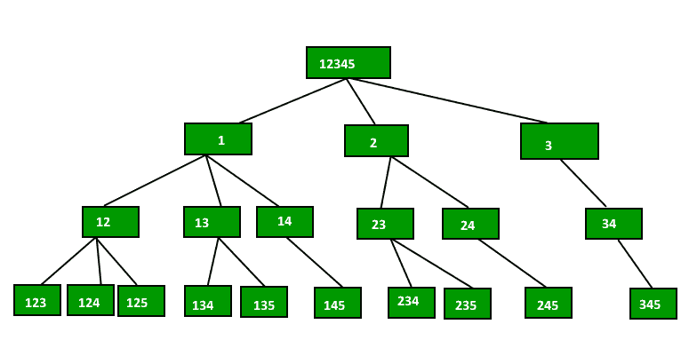

# 打印给定大小 n 的数组中 r 个元素的所有可能组合

> 原文:[https://www . geeksforgeeks . org/print-给定大小数组中 r 元素的所有可能组合-n/](https://www.geeksforgeeks.org/print-all-possible-combinations-of-r-elements-in-a-given-array-of-size-n/)

给定大小为 n 的数组，生成并打印数组中 r 个元素的所有可能组合。例如，如果输入数组为{1，2，3，4}，r 为 2，则输出应为{1，2}、{1，3}、{1，4}、{2，3}、{2，4}和{3，4}。
下面是两种方法来做到这一点。
**方法 1(固定元素和重复)**
我们创建一个临时数组‘data[]’，逐个存储所有输出。想法是从 data[]中的第一个索引(索引= 0)开始，一个接一个地固定该索引处的元素，并对剩余的索引重复。让输入数组为{1，2，3，4，5}，r 为 3。我们首先在数据[]的索引 0 处修复 1，然后对剩余的索引进行递归，然后在索引 0 处修复 2 并进行递归。最后，我们修复 3，并对剩余的索引进行递归。当数据[]中的元素数等于 r(组合的大小)时，我们打印数据[]。
下图显示了相同输入的递归树。



下面是上述方法的实现。

## C++

```
// C++ program to print all combination
// of size r in an array of size n
#include<bits/stdc++.h>
using namespace std;

void combinationUtil(int arr[], int data[],
                    int start, int end,
                    int index, int r);

// The main function that prints
// all combinations of size r
// in arr[] of size n. This function
// mainly uses combinationUtil()
void printCombination(int arr[], int n, int r)
{
    // A temporary array to store
    // all combination one by one
    int data[r];

    // Print all combination using
    // temporary array 'data[]'
    combinationUtil(arr, data, 0, n-1, 0, r);
}

/* arr[] ---> Input Array
data[] ---> Temporary array to
store current combination
start & end ---> Starting and
Ending indexes in arr[]
index ---> Current index in data[]
r ---> Size of a combination to be printed */
void combinationUtil(int arr[], int data[],
                    int start, int end,
                    int index, int r)
{
    // Current combination is ready
    // to be printed, print it
    if (index == r)
    {
        for (int j = 0; j < r; j++)
            cout << data[j] << " ";
        cout << endl;
        return;
    }

    // replace index with all possible
    // elements. The condition "end-i+1 >= r-index"
    // makes sure that including one element
    // at index will make a combination with
    // remaining elements at remaining positions
    for (int i = start; i <= end &&
        end - i + 1 >= r - index; i++)
    {
        data[index] = arr[i];
        combinationUtil(arr, data, i+1,
                        end, index+1, r);
    }
}

// Driver code
int main()
{
    int arr[] = {1, 2, 3, 4, 5};
    int r = 3;
    int n = sizeof(arr)/sizeof(arr[0]);
    printCombination(arr, n, r);
}

// This code is contributed by rathbhupendra
```

## C

```
// Program to print all combination of size r in an array of size n
#include <stdio.h>
void combinationUtil(int arr[], int data[], int start, int end,
                     int index, int r);

// The main function that prints all combinations of size r
// in arr[] of size n. This function mainly uses combinationUtil()
void printCombination(int arr[], int n, int r)
{
    // A temporary array to store all combination one by one
    int data[r];

    // Print all combination using temporary array 'data[]'
    combinationUtil(arr, data, 0, n-1, 0, r);
}

/* arr[]  ---> Input Array
   data[] ---> Temporary array to store current combination
   start & end ---> Starting and Ending indexes in arr[]
   index  ---> Current index in data[]
   r ---> Size of a combination to be printed */
void combinationUtil(int arr[], int data[], int start, int end,
                     int index, int r)
{
    // Current combination is ready to be printed, print it
    if (index == r)
    {
        for (int j=0; j<r; j++)
            printf("%d ", data[j]);
        printf("\n");
        return;
    }

    // replace index with all possible elements. The condition
    // "end-i+1 >= r-index" makes sure that including one element
    // at index will make a combination with remaining elements
    // at remaining positions
    for (int i=start; i<=end && end-i+1 >= r-index; i++)
    {
        data[index] = arr[i];
        combinationUtil(arr, data, i+1, end, index+1, r);
    }
}

// Driver program to test above functions
int main()
{
    int arr[] = {1, 2, 3, 4, 5};
    int r = 3;
    int n = sizeof(arr)/sizeof(arr[0]);
    printCombination(arr, n, r);
}
```

## Java 语言(一种计算机语言，尤用于创建网站)

```
// Java program to print all combination of size r in an array of size n
import java.io.*;

class Combination {

    /* arr[]  ---> Input Array
    data[] ---> Temporary array to store current combination
    start & end ---> Starting and Ending indexes in arr[]
    index  ---> Current index in data[]
    r ---> Size of a combination to be printed */
    static void combinationUtil(int arr[], int data[], int start,
                                int end, int index, int r)
    {
        // Current combination is ready to be printed, print it
        if (index == r)
        {
            for (int j=0; j<r; j++)
                System.out.print(data[j]+" ");
            System.out.println("");
            return;
        }

        // replace index with all possible elements. The condition
        // "end-i+1 >= r-index" makes sure that including one element
        // at index will make a combination with remaining elements
        // at remaining positions
        for (int i=start; i<=end && end-i+1 >= r-index; i++)
        {
            data[index] = arr[i];
            combinationUtil(arr, data, i+1, end, index+1, r);
        }
    }

    // The main function that prints all combinations of size r
    // in arr[] of size n. This function mainly uses combinationUtil()
    static void printCombination(int arr[], int n, int r)
    {
        // A temporary array to store all combination one by one
        int data[]=new int[r];

        // Print all combination using temporary array 'data[]'
        combinationUtil(arr, data, 0, n-1, 0, r);
    }

    /*Driver function to check for above function*/
    public static void main (String[] args) {
        int arr[] = {1, 2, 3, 4, 5};
        int r = 3;
        int n = arr.length;
        printCombination(arr, n, r);
    }
}

/* This code is contributed by Devesh Agrawal */
```

## 蟒蛇 3

```
# Program to print all combination
# of size r in an array of size n

# The main function that prints
# all combinations of size r in
# arr[] of size n. This function
# mainly uses combinationUtil()
def printCombination(arr, n, r):

    # A temporary array to
    # store all combination
    # one by one
    data = [0]*r;

    # Print all combination
    # using temporary array 'data[]'
    combinationUtil(arr, data, 0,
                    n - 1, 0, r);

# arr[] ---> Input Array
# data[] ---> Temporary array to
#         store current combination
# start & end ---> Starting and Ending
#             indexes in arr[]
# index ---> Current index in data[]
# r ---> Size of a combination
# to be printed
def combinationUtil(arr, data, start,
                    end, index, r):

    # Current combination is ready
    # to be printed, print it
    if (index == r):
        for j in range(r):
            print(data[j], end = " ");
        print();
        return;

    # replace index with all
    # possible elements. The
    # condition "end-i+1 >=
    # r-index" makes sure that
    # including one element at
    # index will make a combination
    # with remaining elements at
    # remaining positions
    i = start;
    while(i <= end and end - i + 1 >= r - index):
        data[index] = arr[i];
        combinationUtil(arr, data, i + 1,
                        end, index + 1, r);
        i += 1;

# Driver Code
arr = [1, 2, 3, 4, 5];
r = 3;
n = len(arr);
printCombination(arr, n, r);

# This code is contributed by mits
```

## C#

```
// C# program to print all
// combination of size r
// in an array of size n
using System;

class GFG
{
    /* arr[] ---> Input Array
    data[] ---> Temporary array to
                store current combination
    start & end ---> Starting and Ending
                     indexes in arr[]
    index ---> Current index in data[]
    r ---> Size of a combination
            to be printed */
    static void combinationUtil(int []arr, int []data,
                                int start, int end,
                                int index, int r)
    {
        // Current combination is
        // ready to be printed,
        // print it
        if (index == r)
        {
            for (int j = 0; j < r; j++)
                Console.Write(data[j] + " ");
            Console.WriteLine("");
            return;
        }

        // replace index with all
        // possible elements. The
        // condition "end-i+1 >=
        // r-index" makes sure that
        // including one element
        // at index will make a
        // combination with remaining
        // elements at remaining positions
        for (int i = start; i <= end &&
                  end - i + 1 >= r - index; i++)
        {
            data[index] = arr[i];
            combinationUtil(arr, data, i + 1,
                            end, index + 1, r);
        }
    }

    // The main function that prints
    // all combinations of size r
    // in arr[] of size n. This
    // function mainly uses combinationUtil()
    static void printCombination(int []arr,
                                 int n, int r)
    {
        // A temporary array to store
        // all combination one by one
        int []data = new int[r];

        // Print all combination
        // using temporary array 'data[]'
        combinationUtil(arr, data, 0,
                        n - 1, 0, r);
    }

    // Driver Code
    static public void Main ()
    {
        int []arr = {1, 2, 3, 4, 5};
        int r = 3;
        int n = arr.Length;
        printCombination(arr, n, r);
    }
}

// This code is contributed by m_kit
```

## 服务器端编程语言（Professional Hypertext Preprocessor 的缩写）

```
<?php
// Program to print all
// combination of size r
// in an array of size n

// The main function that
// prints all combinations
// of size r in arr[] of
// size n. This function
// mainly uses combinationUtil()
function printCombination($arr,
                          $n, $r)
{
    // A temporary array to
    // store all combination
    // one by one
    $data = array();

    // Print all combination
    // using temporary array 'data[]'
    combinationUtil($arr, $data, 0,
                    $n - 1, 0, $r);
}

/* arr[] ---> Input Array
data[] ---> Temporary array to
            store current combination
start & end ---> Starting and Ending
                 indexes in arr[]
index ---> Current index in data[]
r ---> Size of a combination
       to be printed */
function combinationUtil($arr, $data, $start,
                         $end, $index, $r)

{
    // Current combination is ready
    // to be printed, print it
    if ($index == $r)
    {
        for ($j = 0; $j < $r; $j++)
            echo $data[$j];
        echo "\n";
        return;
    }

    // replace index with all
    // possible elements. The
    // condition "end-i+1 >=
    // r-index" makes sure that
    // including one element at
    // index will make a combination
    // with remaining elements at
    // remaining positions
    for ($i = $start;
         $i <= $end &&
         $end - $i + 1 >= $r - $index; $i++)
    {
        $data[$index] = $arr[$i];
        combinationUtil($arr, $data, $i + 1,
                        $end, $index + 1, $r);
    }
}

// Driver Code
$arr = array(1, 2, 3, 4, 5);
$r = 3;
$n = sizeof($arr);
printCombination($arr, $n, $r);

// This code is contributed by ajit
?>
```

## java 描述语言

```
<script>

// Javascript program to print all
// combination of size r in an array of size n  

    /* arr[]  ---> Input Array
    data[] ---> Temporary array to store current combination
    start & end ---> Starting and Ending indexes in arr[]
    index  ---> Current index in data[]
    r ---> Size of a combination to be printed */
    function combinationUtil(arr,data,start,end,index,r)
    {
        // Current combination is ready to be printed, print it
        if (index == r)
        {
            for (let j=0; j<r; j++)
            {
                document.write(data[j]+" ");
            }
            document.write("<br>")
        }

        // replace index with all possible elements. The condition
        // "end-i+1 >= r-index" makes sure that including one element
        // at index will make a combination with remaining elements
        // at remaining positions
        for (let i=start; i<=end && end-i+1 >= r-index; i++)
        {
            data[index] = arr[i];
            combinationUtil(arr, data, i+1, end, index+1, r);
        }
    }

    // The main function that prints all combinations of size r
    // in arr[] of size n. This function mainly uses combinationUtil()
    function printCombination(arr,n,r)
    {
        // A temporary array to store all combination one by one
        let data = new Array(r);

        // Print all combination using temporary array 'data[]'
        combinationUtil(arr, data, 0, n-1, 0, r);
    }

    /*Driver function to check for above function*/
    let arr=[1, 2, 3, 4, 5];
    let r = 3;
    let n = arr.length;
    printCombination(arr, n, r);

    // This code is contributed by rag2127

</script>
```

**输出:**

```
1 2 3
1 2 4
1 2 5
1 3 4
1 3 5
1 4 5
2 3 4
2 3 5
2 4 5
3 4 5
```

***时间复杂度:** O(n^2)*

*如何处理重复？*
注意，上面的方法不处理重复。例如，如果输入数组为{1，2，1}，r 为 2，则程序会将{1，2}和{2，1}打印为两种不同的组合。我们可以通过在上面的代码中添加以下两项来避免重复。
1)在 printCombination()
中调用 combinationUtil()之前，添加对数组进行排序的代码 2)在 combinationUtil()中的 for 循环末尾添加以下行:

```
        // Since the elements are sorted, all occurrences of an element
        // must be together
        while (arr[i] == arr[i+1])
             i++; 
```

参见 [**本**](http://ideone.com/ywsqBz) 中处理重复的实现。
**方法 2(包含和排除每个元素)**
和上面的方法一样，我们创建一个临时数组数据[]。这里的思路类似于[子集和问题](https://www.geeksforgeeks.org/dynamic-programming-subset-sum-problem/)。我们逐一考虑输入数组的每一个元素，并针对两种情况进行递归:
1)元素包含在当前组合中(我们将元素放在 data[]中，并在 data[]中递增下一个可用索引)
2)元素排除在当前组合中(我们不放元素，也不改变索引)
当 data[]中的元素数量变得等于 r(组合的大小)时，我们将其打印出来。
本方法主要基于[帕斯卡恒等式](http://en.wikipedia.org/wiki/Pascal's_rule)，即**n<sub>Cr</sub>= n-1<sub>Cr</sub>+n-1<sub>Cr-1</sub>**
以下为方法 2 的实施。

## C++

```
// C++ Program to print all combination of
// size r in an array of size n
#include <bits/stdc++.h>
using namespace std;
void combinationUtil(int arr[], int n, int r,
                    int index, int data[], int i);

// The main function that prints all
// combinations of size r in arr[]
// of size n. This function mainly
// uses combinationUtil()
void printCombination(int arr[], int n, int r)
{
    // A temporary array to store
    // all combination one by one
    int data[r];

    // Print all combination using
    // temporary array 'data[]'
    combinationUtil(arr, n, r, 0, data, 0);
}

/* arr[] ---> Input Array
n ---> Size of input array
r ---> Size of a combination to be printed
index ---> Current index in data[]
data[] ---> Temporary array to store current combination
i ---> index of current element in arr[] */
void combinationUtil(int arr[], int n, int r,
                    int index, int data[], int i)
{
    // Current combination is ready, print it
    if (index == r)
    {
        for (int j = 0; j < r; j++)
            cout << data[j] << " ";
        cout << endl;
        return;
    }

    // When no more elements are there to put in data[]
    if (i >= n)
        return;

    // current is included, put next at next location
    data[index] = arr[i];
    combinationUtil(arr, n, r, index + 1, data, i + 1);

    // current is excluded, replace it with next (Note that
    // i+1 is passed, but index is not changed)
    combinationUtil(arr, n, r, index, data, i+1);
}

// Driver code
int main()
{
    int arr[] = {1, 2, 3, 4, 5};
    int r = 3;
    int n = sizeof(arr)/sizeof(arr[0]);
    printCombination(arr, n, r);
    return 0;
}

// This is code is contributed by rathbhupendra
```

## C

```
// Program to print all combination of size r in an array of size n
#include<stdio.h>
void combinationUtil(int arr[],int n,int r,int index,int data[],int i);

// The main function that prints all combinations of size r
// in arr[] of size n. This function mainly uses combinationUtil()
void printCombination(int arr[], int n, int r)
{
    // A temporary array to store all combination one by one
    int data[r];

    // Print all combination using temporary array 'data[]'
    combinationUtil(arr, n, r, 0, data, 0);
}

/* arr[]  ---> Input Array
   n      ---> Size of input array
   r      ---> Size of a combination to be printed
   index  ---> Current index in data[]
   data[] ---> Temporary array to store current combination
   i      ---> index of current element in arr[]     */
void combinationUtil(int arr[], int n, int r, int index, int data[], int i)
{
    // Current combination is ready, print it
    if (index == r)
    {
        for (int j=0; j<r; j++)
            printf("%d ",data[j]);
        printf("\n");
        return;
    }

    // When no more elements are there to put in data[]
    if (i >= n)
        return;

    // current is included, put next at next location
    data[index] = arr[i];
    combinationUtil(arr, n, r, index+1, data, i+1);

    // current is excluded, replace it with next (Note that
    // i+1 is passed, but index is not changed)
    combinationUtil(arr, n, r, index, data, i+1);
}

// Driver program to test above functions
int main()
{
    int arr[] = {1, 2, 3, 4, 5};
    int r = 3;
    int n = sizeof(arr)/sizeof(arr[0]);
    printCombination(arr, n, r);
    return 0;
}
```

## Java 语言(一种计算机语言，尤用于创建网站)

```
// Java program to print all combination of size r in an array of size n
import java.io.*;

class Combination {

    /* arr[]  ---> Input Array
    data[] ---> Temporary array to store current combination
    start & end ---> Staring and Ending indexes in arr[]
    index  ---> Current index in data[]
    r ---> Size of a combination to be printed */
    static void combinationUtil(int arr[], int n, int r, int index,
                                int data[], int i)
    {
        // Current combination is ready to be printed, print it
        if (index == r)
        {
            for (int j=0; j<r; j++)
                System.out.print(data[j]+" ");
            System.out.println("");
        return;
        }

        // When no more elements are there to put in data[]
        if (i >= n)
        return;

        // current is included, put next at next location
        data[index] = arr[i];
        combinationUtil(arr, n, r, index+1, data, i+1);

        // current is excluded, replace it with next (Note that
        // i+1 is passed, but index is not changed)
        combinationUtil(arr, n, r, index, data, i+1);
    }

    // The main function that prints all combinations of size r
    // in arr[] of size n. This function mainly uses combinationUtil()
    static void printCombination(int arr[], int n, int r)
    {
        // A temporary array to store all combination one by one
        int data[]=new int[r];

        // Print all combination using temporary array 'data[]'
        combinationUtil(arr, n, r, 0, data, 0);
    }

    /*Driver function to check for above function*/
    public static void main (String[] args) {
        int arr[] = {1, 2, 3, 4, 5};
        int r = 3;
        int n = arr.length;
        printCombination(arr, n, r);
    }
}
/* This code is contributed by Devesh Agrawal */
```

## 蟒蛇 3

```
# Program to print all combination
# of size r in an array of size n

# The main function that prints all
# combinations of size r in arr[] of
# size n. This function mainly uses
# combinationUtil()
def printCombination(arr, n, r):

    # A temporary array to store
    # all combination one by one
    data = [0] * r

    # Print all combination using
    # temporary array 'data[]'
    combinationUtil(arr, n, r, 0, data, 0)

''' arr[] ---> Input Array
n     ---> Size of input array
r     ---> Size of a combination to be printed
index ---> Current index in data[]
data[] ---> Temporary array to store
            current combination
i     ---> index of current element in arr[]     '''
def combinationUtil(arr, n, r, index, data, i):

    # Current combination is ready,
    # print it
    if (index == r):
        for j in range(r):
            print(data[j], end = " ")
        print()
        return

    # When no more elements are
    # there to put in data[]
    if (i >= n):
        return

    # current is included, put
    # next at next location
    data[index] = arr[i]
    combinationUtil(arr, n, r, index + 1,
                    data, i + 1)

    # current is excluded, replace it
    # with next (Note that i+1 is passed,
    # but index is not changed)
    combinationUtil(arr, n, r, index,
                    data, i + 1)

# Driver Code
if __name__ == "__main__":
    arr = [1, 2, 3, 4, 5]
    r = 3
    n = len(arr)
    printCombination(arr, n, r)

# This code is contributed
# by ChitraNayal
```

## C#

```
// C# program to print all
// combination of size r
// in an array of size n
using System;

class GFG
{

    /* arr[] ---> Input Array
    data[] ---> Temporary array to
                store current combination
    start & end ---> Staring and Ending
                     indexes in arr[]
    index ---> Current index in data[]
    r ---> Size of a combination
           to be printed */
    static void combinationUtil(int []arr, int n,
                                int r, int index,
                                int []data, int i)
    {
        // Current combination is ready
        // to be printed, print it
        if (index == r)
        {
            for (int j = 0; j < r; j++)
                Console.Write(data[j] + " ");
                Console.WriteLine("");
            return;
        }

        // When no more elements are
        // there to put in data[]
        if (i >= n)
        return;

        // current is included, put
        // next at next location
        data[index] = arr[i];
        combinationUtil(arr, n, r,
                        index + 1, data, i + 1);

        // current is excluded, replace
        // it with next (Note that
        // i+1 is passed, but index
        // is not changed)
        combinationUtil(arr, n, r, index,
                        data, i + 1);
    }

    // The main function that prints
    // all combinations of size r
    // in arr[] of size n. This
    // function mainly uses combinationUtil()
    static void printCombination(int []arr,
                                 int n, int r)
    {
        // A temporary array to store
        // all combination one by one
        int []data = new int[r];

        // Print all combination
        // using temporary array 'data[]'
        combinationUtil(arr, n, r, 0, data, 0);
    }

    // Driver Code
    static public void Main ()
    {
        int []arr = {1, 2, 3, 4, 5};
        int r = 3;
        int n = arr.Length;
        printCombination(arr, n, r);
    }
}

// This code is contributed by ajit
```

## 服务器端编程语言（Professional Hypertext Preprocessor 的缩写）

```
<?php
// Program to print all
// combination of size r
// in an array of size n

// The main function that prints
// all combinations of size r in
// arr[] of size n. This function
// mainly uses combinationUtil()
function printCombination($arr, $n, $r)
{
    // A temporary array to store
    // all combination one by one
    $data = Array();

    // Print all combination using
    // temporary array 'data[]'
    combinationUtil($arr, $n, $r,
                    0, $data, 0);
}

/* arr[] ---> Input Array
n ---> Size of input array
r ---> Size of a combination
       to be printed
index ---> Current index in data[]
data[] ---> Temporary array to store
            current combination
i ---> index of current element in arr[] */
function combinationUtil($arr, $n, $r,
                         $index, $data, $i)
{
    // Current combination
    // is ready, print it
    if ($index == $r)
    {
        for ($j = 0; $j < $r; $j++)
            echo $data[$j], " ";
        echo "\n";
        return;
    }

    // When no more elements are
    // there to put in data[]
    if ($i >= $n)
        return;

    // current is included, put
    // next at next location
    $data[$index] = $arr[$i];
    combinationUtil($arr, $n, $r,
                    $index + 1,
                    $data, $i + 1);

    // current is excluded, replace
    // it with next (Note that i+1
    // is passed, but index is not changed)
    combinationUtil($arr, $n, $r,
                    $index, $data, $i + 1);
}

// Driver Code
$arr = array(1, 2, 3, 4, 5);
$r = 3;
$n = sizeof($arr);
printCombination($arr, $n, $r);

// This code is contributed by ajit
?>
```

## java 描述语言

```
<script>

// Javascript program to print all
// combination of size r in an array of size n   

    /* arr[]  ---> Input Array
    data[] ---> Temporary array to
    store current combination
    start & end ---> Staring and
    Ending indexes in arr[]
    index  ---> Current index in data[]
    r ---> Size of a combination to be printed */
    function combinationUtil(arr,n,r,index,data,i)
    {
        // Current combination is ready
        // to be printed, print it
        if (index == r)
        {
            for (let j=0; j<r; j++)
            {
                document.write(data[j]+" ");
            }
            document.write("<br>");

            return;
        }

        // When no more elements are there
        // to put in data[]
        if (i >= n)
        {
            return;
        }

        // current is included, put
        // next at next location
        data[index] = arr[i];
        combinationUtil(arr, n, r, index+1, data, i+1);

        // current is excluded, replace
        // it with next (Note that
        // i+1 is passed, but index is not changed)
        combinationUtil(arr, n, r, index, data, i+1);

    }

    // The main function that prints
    // all combinations of size r
    // in arr[] of size n. This function
    // mainly uses combinationUtil()
    function printCombination(arr,n,r)
    {
        // A temporary array to store
        // all combination one by one
        let data=new Array(r);

        // Print all combination using
        // temporary array 'data[]'
        combinationUtil(arr, n, r, 0, data, 0);
    }

    /*Driver function to check for above function*/
    let arr=[1, 2, 3, 4, 5];
    let r = 3;
    let n = arr.length;
    printCombination(arr, n, r);

    // This code is contributed by avanitrachhadiya2155

</script>
```

**输出:**

```
1 2 3
1 2 4
1 2 5
1 3 4
1 3 5
1 4 5
2 3 4
2 3 5
2 4 5
3 4 5
```

*如何处理方法 2 中的重复？*
和方法 1 一样，我们可以通过以下两件事来处理重复。
1)在 printCombination()
中调用 combinationUtil()之前，添加代码对数组进行排序 2)在 combinationUtil()
中 combinationUtil()的两次递归调用之间添加以下行

```
        // Since the elements are sorted, all occurrences of an element
        // must be together
        while (arr[i] == arr[i+1])
             i++; 
```

参见 [**本**](http://ideone.com/91MYjB) 中处理重复的实现。
下面是另一个基于 DFS 的方法来解决这个问题。
[制作大小 k](https://www.geeksforgeeks.org/make-combinations-size-k/)
的所有组合本文由 **Bateesh** 供稿。如果您发现任何不正确的地方，请写评论，或者您想分享更多关于上面讨论的主题的信息