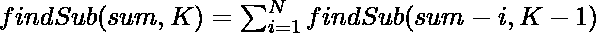

# 打印前 N 个自然数的所有可能的 K 长度子序列，总和为 N

> 原文:[https://www . geeksforgeeks . org/print-all-可能性-k-length-第 n 个自然数的子序列-带和-n/](https://www.geeksforgeeks.org/print-all-possible-k-length-subsequences-of-first-n-natural-numbers-with-sum-n/)

给定两个正整数 **N** 和 **K** ，任务是打印所有可能的 **K** 长度的子序列，从元素之和等于 **N** 的第一个 **N** 自然数开始。

**示例:**

> **输入:** N = 5，K = 3
> **输出:** { {1，1，3}，{1，2，2}，{1，3，1}，{2，1，2}，{2，2，1}，{ 2，1 }，{3，1， 1} }
> **说明:**
> 1 + 1 + 3 = N(= 5)长度为 K(= 3)
> 1 + 2 + 2 = N(= 5)长度为 K(= 3)
> 1 + 3 + 1 = N(= 5)长度为 K(= 3)
> 2 + 1 + 2 = N(= 5)长度为 K(= 3)
> 2 + 2 + 1 = N(= 5)长度为 K(= 3)
> 3 + 1 + 1
> 
> **输入:** N = 3，K = 3
> T3】输出: { {1，1，1} }

**方法:**使用[回溯技术](https://www.geeksforgeeks.org/backtracking-algorithms/)可以解决问题。下面是循环关系:

> 

按照以下步骤解决问题:

*   初始化一个 [2D 数组](https://www.geeksforgeeks.org/vector-of-vectors-in-c-stl-with-examples/)比如说， **res[][]** 来存储所有可能的长度子序列 **K** ，其和等于 **N** 。
*   利用上述递推关系，找出所有长度为 **K** 且和等于 **N** 的可能子序列。
*   最后，打印 **res[][]** 数组。

下面是上述方法的实现:

## C++

```
// C++ program to implement
// the above approach

#include <bits/stdc++.h>
using namespace std;

// Function to print all subsequences of length
// K from N natural numbers whose sum equal to N
void findSub(vector<vector<int> >& res, int sum,
             int K, int N, vector<int>& temp)
{

    // Base case
    if (K == 0 && sum == 0) {
        res.push_back(temp);
        return;
    }
    if (sum <= 0 || K <= 0) {
        return;
    }

    // Iterate over the range [1, N]
    for (int i = 1; i <= N; i++) {

        // Insert i into temp
        temp.push_back(i);
        findSub(res, sum - i, K - 1, N, temp);

        // Pop i from temp
        temp.pop_back();
    }
}

// Utility function to print all subsequences
// of length K with sum equal to N
void UtilPrintSubsequncesOfKSumN(int N, int K)
{

    // Store all subsequences of length K
    // from N natural numbers
    vector<vector<int> > res;

    // Store current subsequence of
    // length K from N natural numbers
    vector<int> temp;

    findSub(res, N, K, N, temp);

    // Stores total count
    // of subsequences
    int sz = res.size();

    // Print all subsequences
    cout << "{ ";

    // Traverse all subsequences
    for (int i = 0; i < sz; i++) {

        cout << "{ ";

        // Print current subsequence
        for (int j = 0; j < K; j++) {

            // If current element is last
            // element of subsequence
            if (j == K - 1)
                cout << res[i][j] << " ";
            else
                cout << res[i][j] << ", ";
        }

        // If current subsequence is last
        // subsequence from n natural numbers
        if (i == sz - 1)
            cout << "}";
        else
            cout << "}, ";
    }
    cout << " }";
}

// Driver Code
int main()
{

    int N = 4;
    int K = 2;
    UtilPrintSubsequncesOfKSumN(N, K);
}
```

## Java 语言(一种计算机语言，尤用于创建网站)

```
// Java program to implement
// the above approach
import java.io.*;
import java.util.*;
import java.util.stream.Collectors;

class GFG {

  // Function to print all subsequences of length
  // K from N natural numbers whose sum equal to N
  static void findSub(List<List<Integer> > res, int sum,
                      int K, int N, List<Integer> temp)
  {

    // Base case
    if (K == 0 && sum == 0) {
      List<Integer> newList = temp.stream().collect(
        Collectors.toList());
      res.add(newList);
      return;
    }
    if (sum <= 0 || K <= 0) {
      return;
    }

    // Iterate over the range [1, N]
    for (int i = 1; i <= N; i++) {

      // Insert i into temp
      temp.add(i);
      findSub(res, sum - i, K - 1, N, temp);

      // Pop i from temp
      temp.remove(temp.size() - 1);
    }
  }

  // Utility function to print all subsequences
  // of length K with sum equal to N
  static void UtilPrintSubsequncesOfKSumN(int N, int K)
  {

    // Store all subsequences of length K
    // from N natural numbers
    @SuppressWarnings("unchecked")
    List<List<Integer> > res = new ArrayList();

    // Store current subsequence of
    // length K from N natural numbers
    @SuppressWarnings("unchecked")
    List<Integer> temp = new ArrayList();

    findSub(res, N, K, N, temp);

    // Stores total count
    // of subsequences
    int sz = res.size();

    // Print all subsequences
    System.out.print("{ ");

    // Traverse all subsequences
    for (int i = 0; i < sz; i++) {

      System.out.print("{ ");

      // Print current subsequence
      for (int j = 0; j < K; j++) {

        // If current element is last
        // element of subsequence
        if (j == K - 1)
          System.out.print(res.get(i).get(j)
                           + " ");
        else
          System.out.print(res.get(i).get(j)
                           + ", ");
      }

      // If current subsequence is last
      // subsequence from n natural numbers
      if (i == sz - 1)
        System.out.print("}");
      else
        System.out.print("}, ");
    }
    System.out.print(" }");
  }

  // Driver code
  public static void main(String[] args)
  {
    int N = 4;
    int K = 2;
    UtilPrintSubsequncesOfKSumN(N, K);
  }
}

// This code is contributed by jithin.
```

**Output:** 

```
{ { 1, 3 }, { 2, 2 }, { 3, 1 } }
```

***时间复杂度:**O(2<sup>N</sup>)*
***辅助空间:** O(X)，其中 X 表示长度为 K 的子序列的计数，其和为 N*