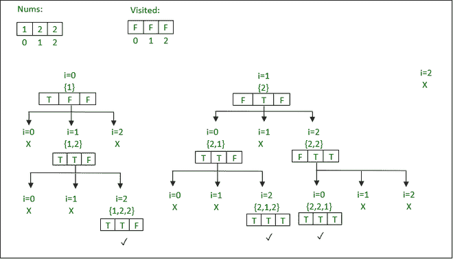

# 使用回溯打印一个有重复的数组的所有可能排列

> 原文:[https://www . geeksforgeeks . org/print-所有可能的重复数组排列-使用回溯/](https://www.geeksforgeeks.org/print-all-possible-permutations-of-an-array-with-duplicates-using-backtracking/)

给定一个大小为 **N** 的[数组](https://www.geeksforgeeks.org/array-data-structure/) **nums[]** ，任务是打印数组 **nums[]** (包括重复的*)的所有可能的不同排列。*

> ***输入:** nums[] = { 1，2，2 }
> **输出:**
> 1 2 1
> 2 1 2
> 2 2 1*
> 
> ***输入:** nums[] = { 1，1 }
> T3】输出: 1 1*

***方法:**按照以下步骤解决问题*

1.  *[遍历数组](https://www.geeksforgeeks.org/c-program-to-traverse-an-array/)。*
2.  *生成数组的[排列。](https://www.geeksforgeeks.org/iterative-approach-to-print-all-permutations-of-an-array/)*
3.  *在重复元素中设置选择顺序。*
4.  ***如果 I>0&&nums[I]= = nums[I–1]:**在当前排列中添加 **nums[i]** 只有在排列中添加了**nums[I–1]**的情况下，即**访问了【I–1】**才为**真**。*
5.  *否则，[继续](https://www.geeksforgeeks.org/continue-statement-cpp/)。*
6.  *使用这种方法，打印生成的不同排列。*

*查看此**递归树**了解**实现**的代码细节。*

**

*下面是上述方法的实现:*

## *C++14*

```
*// C++ Program to implement
// the above approach

#include <bits/stdc++.h>
using namespace std;

// Function to fill the vector curr
// while maintaining the indices visited
// in the array num
void backtrack(vector<int>& nums,
               vector<int>& curr,
               vector<vector<int> >& ans,
               vector<bool>& visited)
{

    // If current permutation is complete
    if ((int)curr.size() == (int)nums.size()) {
        ans.push_back(curr);
    }

    // Traverse the input vector
    for (int i = 0; i < (int)nums.size();
         i++) {

        // If index is already visited
        if (visited[i])
            continue;

        // If the number is duplicate
        if (i > 0 and nums[i] == nums[i - 1]
            and !visited[i - 1])
            continue;

        // Set visited[i] flag as true
        visited[i] = true;

        // Push nums[i] to current vector
        curr.push_back(nums[i]);

        // Recursive function call
        backtrack(nums, curr,
                  ans, visited);

        // Backtrack to the previous
        // state by unsetting visited[i]
        visited[i] = false;

        // Pop nums[i] and place at
        // the back of the vector
        curr.pop_back();
    }
}

// Function to pre-process the vector num
vector<vector<int> > permuteDuplicates(
    vector<int>& nums)
{
    // Sort the array
    sort(nums.begin(), nums.end());

    // Stores distinct permutations
    vector<vector<int> > ans;

    vector<bool> visited(
        (int)nums.size(), false);

    // Store the current permutation
    vector<int> curr;

    // Find the distinct permutations of num
    backtrack(nums, curr, ans, visited);

    return ans;
}

// Function call to print all distinct
// permutations of the vector nums
void getDistinctPermutations(vector<int> nums)
{
    // Find the distinct permutations
    vector<vector<int> > ans
        = permuteDuplicates(nums);

    // Traverse every row
    for (int i = 0; i < (int)ans.size();
         i++) {

        // Traverse every column
        for (int j = 0; j < (int)ans[i].size();
             j++) {

            cout << ans[i][j] << " ";
        }

        cout << '\n';
    }
}

// Driver Code
int main()
{
    // Input
    vector<int> nums = { 1, 2, 2 };

    // Function call to print
    // all distinct permutations
    getDistinctPermutations(nums);

    return 0;
}*
```

## *Java 语言(一种计算机语言，尤用于创建网站)*

```
*// Java Program to implement
// the above approach
import java.io.*;
import java.util.*;
class GFG {

  static ArrayList<Integer> nums = new ArrayList<Integer>();
  static ArrayList<Integer> curr = new ArrayList<Integer>();
  static ArrayList<ArrayList<Integer>> ans = new ArrayList<ArrayList<Integer>>();
  static ArrayList<Boolean> visited = new ArrayList<Boolean>();

  // Function to fill the vector curr
  // while maintaining the indices visited
  // in the array num
  static void backtrack()
  {

    // If current permutation is complete
    if (curr.size() == nums.size())
    {
      ans.add(curr);
      for(int i = 0; i < curr.size(); i++)
      {
        System.out.print(curr.get(i) +" ");
      }
      System.out.println();
    }

    // Traverse the input vector
    for (int i = 0; i < (int)nums.size();
         i++)
    {

      // If index is already visited
      if (visited.get(i))
        continue;

      // If the number is duplicate
      if (i > 0 && (nums.get(i) == nums.get(i - 1)) && !visited.get(i - 1))
        continue;

      // Set visited[i] flag as true
      visited.set(i, true);

      // Push nums[i] to current vector
      curr.add(nums.get(i));

      // Recursive function call
      backtrack();

      // Backtrack to the previous
      // state by unsetting visited[i]
      visited.set(i, false);

      // Pop nums[i] and place at
      // the back of the vector
      curr.remove(curr.size() - 1);
    }
  }
  // Function to pre-process the vector num
  static ArrayList<ArrayList<Integer>> permuteDuplicates()
  {
    // Sort the array
    Collections.sort(nums);

    for(int i = 0; i < nums.size(); i++)
    {
      visited.add(false);
    }

    // Find the distinct permutations of num
    backtrack();

    return ans;

  }

  // Function call to print all distinct
  // permutations of the vector nums

  static void getDistinctPermutations()
  {
    ans = permuteDuplicates();

  }

  // Driver code
  public static void main (String[] args)
  {

    // Input
    nums.add(1);
    nums.add(2);
    nums.add(2);

    // Function call to print
    // all distinct permutations
    getDistinctPermutations();
  }
}

// This code is contributed by avanitrachhadiya2155*
```

## *蟒蛇 3*

```
*# Python3 Program to implement
# the above approach

# Function to fill the vector curr
# while maintaining the indices visited
# in the array num
def backtrack():
    global ans, curr, visited, nums

    # If current permutation is complete
    # print(ans)
    if (len(curr) == len(nums)):
        print(*curr)

    # Traverse the input vector
    for i in range(len(nums)):

        # If index is already visited
        if (visited[i]):
            continue

        # If the number is duplicate
        if (i > 0 and nums[i] == nums[i - 1] and visited[i - 1]==False):
            continue

        # Set visited[i] flag as true
        visited[i] = True

        # Push nums[i] to current vector
        curr.append(nums[i])

        # Recursive function call
        backtrack()

        # Backtrack to the previous
        # state by unsetting visited[i]
        visited[i] = False

        # Pop nums[i] and place at
        # the back of the vector
        del curr[-1]

# Function to pre-process the vector num
def permuteDuplicates(nums):
    global ans, visited, curr
    nums = sorted(nums)

    # Find the distinct permutations of num
    backtrack()
    return ans

# Function call to print all distinct
# permutations of the vector nums
def getDistinctPermutations(nums):
    global ans, curr, visited

    # Find the distinct permutations
    ans = permuteDuplicates(nums)

# Driver Code
if __name__ == '__main__':
    visited = [False]*(5)
    ans,curr = [], []
    nums = [1, 2, 2]

    # Function call to print
    # all distinct permutations
    getDistinctPermutations(nums)

    # This code is contributed by mohit kumar 29.*
```

## *C#*

```
*// C# Program to implement
// the above approach
using System;
using System.Collections.Generic;

public class GFG{

  static List<int> nums = new List<int>();
  static List<int> curr = new List<int>();
  static List<List<int>> ans = new List<List<int>>();
  static List<bool> visited = new List<bool>();

  // Function to fill the vector curr
  // while maintaining the indices visited
  // in the array num
  static void backtrack()
  {

    // If current permutation is complete
    if (curr.Count == nums.Count)
    {
      ans.Add(curr);
      for(int i = 0; i < curr.Count; i++)
      {
        Console.Write(curr[i] +" ");
      }
      Console.WriteLine();
    }

    // Traverse the input vector
    for (int i = 0; i < (int)nums.Count;
         i++)
    {

      // If index is already visited
      if (visited[i])
        continue;

      // If the number is duplicate
      if (i > 0 && (nums[i] == nums[i-1]) && !visited[i-1])
        continue;

      // Set visited[i] flag as true
      visited[i] = true;

      // Push nums[i] to current vector
      curr.Add(nums[i]);

      // Recursive function call
      backtrack();

      // Backtrack to the previous
      // state by unsetting visited[i]
      visited[i] = false;

      // Pop nums[i] and place at
      // the back of the vector
      curr.RemoveAt(curr.Count - 1);
    }
  }

  // Function to pre-process the vector num
  static List<List<int>> permuteDuplicates()
  {
    // Sort the array
    nums.Sort();

    for(int i = 0; i < nums.Count; i++)
    {
      visited.Add(false);
    }

    // Find the distinct permutations of num
    backtrack();

    return ans;

  }

  // Function call to print all distinct
  // permutations of the vector nums

  static void getDistinctPermutations()
  {
    ans = permuteDuplicates();

  }

  // Driver code
  static public void Main (){

    // Input
    nums.Add(1);
    nums.Add(2);
    nums.Add(2);

    // Function call to print
    // all distinct permutations
    getDistinctPermutations();

  }
}

// This code is contributed by rag2127*
```

## *java 描述语言*

```
*<script>

// JavaScript Program to implement
// the above approach

let nums = [];
let curr = [];
let ans = [];
let visited = [];

// Function to fill the vector curr
  // while maintaining the indices visited
  // in the array num
function backtrack()
{
    // If current permutation is complete
    if (curr.length == nums.length)
    {
      ans.push(curr);
      for(let i = 0; i < curr.length; i++)
      {
        document.write(curr[i] +" ");
      }
      document.write("<br>");
    }

    // Traverse the input vector
    for (let i = 0; i < nums.length;
         i++)
    {

      // If index is already visited
      if (visited[i])
        continue;

      // If the number is duplicate
      if (i > 0 && (nums[i] == nums[i - 1]) && !visited[i - 1])
        continue;

      // Set visited[i] flag as true
      visited[i] = true;

      // Push nums[i] to current vector
      curr.push(nums[i]);

      // Recursive function call
      backtrack();

      // Backtrack to the previous
      // state by unsetting visited[i]
      visited[i] = false;

      // Pop nums[i] and place at
      // the back of the vector
      curr.pop();
    }
}

 // Function to pre-process the vector num
function permuteDuplicates()
{
    // Sort the array
    (nums).sort(function(a,b){return a-b});

    for(let i = 0; i < nums.length; i++)
    {
      visited.push(false);
    }

    // Find the distinct permutations of num
    backtrack();

    return ans;
}

// Function call to print all distinct
  // permutations of the vector nums
function getDistinctPermutations()
{
    ans = permuteDuplicates();
}

 // Driver code
// Input
nums.push(1);
nums.push(2);
nums.push(2);

// Function call to print
// all distinct permutations
getDistinctPermutations();

// This code is contributed by unknown2108

</script>*
```

***Output:** 

```
1 2 2 
2 1 2 
2 2 1
```* 

****时间复杂度:** O(N！* N)*
***辅助空间** : O(N！* N)**