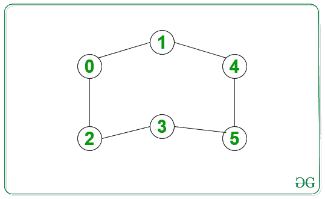

# 在无向图中打印给定源和目的地之间的所有最短路径

> 原文:[https://www . geesforgeks . org/print-给定无向图中源和目标之间的所有最短路径/](https://www.geeksforgeeks.org/print-all-shortest-paths-between-given-source-and-destination-in-an-undirected-graph/)

给定一个无向未加权的图和两个节点作为**源**和**目的地**，任务是打印给定源和目的地之间最短长度的所有路径。
**例:**

> **输入:**源= 0，目的地= 5
> 
> 
> 
> **输出:**T2【0->1->3->5
> 0->2->3->5
> 0->1->4->5
> T6】说明:
> 以上路径长度均为 3，为 0 到 5 之间最短距离。
> **输入:**来源= 0，目的地= 4
> 
> 
> 
> **输出:**T2 0->1->4

**方法:**是对一个图进行[广度优先遍历(BFS)](https://www.geeksforgeeks.org/breadth-first-search-or-bfs-for-a-graph/) 。以下是步骤:

1.  从源顶点开始 BFS 遍历。
2.  进行 BFS 时，存储到每个其他节点的最短距离，并为每个节点维护一个父向量。
3.  将源节点的父节点设为**-【1】**。对于每个节点，它将存储它与源节点距离最短的所有父节点。
4.  使用父阵列恢复所有路径。在任何时刻，我们都会在路径数组中推一个顶点，然后调用它的所有父节点。
5.  如果我们在上面的步骤中遇到“-1”，那么这意味着已经找到了一个路径，并且可以存储在 path 数组中。

以下是上述方法的实现:

## cpp14

```
// Cpp program for the above approach
#include <bits/stdc++.h>
using namespace std;

// Function to form edge between
// two vertices src and dest
void add_edge(vector<int> adj[],
              int src, int dest)
{
    adj[src].push_back(dest);
    adj[dest].push_back(src);
}

// Function which finds all the paths
// and stores it in paths array
void find_paths(vector<vector<int> >& paths,
                vector<int>& path,
                vector<int> parent[],
                int n, int u)
{
    // Base Case
    if (u == -1) {
        paths.push_back(path);
        return;
    }

    // Loop for all the parents
    // of the given vertex
    for (int par : parent[u]) {

        // Insert the current
        // vertex in path
        path.push_back(u);

        // Recursive call for its parent
        find_paths(paths, path, parent,
                   n, par);

        // Remove the current vertex
        path.pop_back();
    }
}

// Function which performs bfs
// from the given source vertex
void bfs(vector<int> adj[],
         vector<int> parent[],
         int n, int start)
{
    // dist will contain shortest distance
    // from start to every other vertex
    vector<int> dist(n, INT_MAX);

    queue<int> q;

    // Insert source vertex in queue and make
    // its parent -1 and distance 0
    q.push(start);
    parent[start] = { -1 };
    dist[start] = 0;

    // Until Queue is empty
    while (!q.empty()) {
        int u = q.front();
        q.pop();
        for (int v : adj[u]) {
            if (dist[v] > dist[u] + 1) {

                // A shorter distance is found
                // So erase all the previous parents
                // and insert new parent u in parent[v]
                dist[v] = dist[u] + 1;
                q.push(v);
                parent[v].clear();
                parent[v].push_back(u);
            }
            else if (dist[v] == dist[u] + 1) {

                // Another candidate parent for
                // shortes path found
                parent[v].push_back(u);
            }
        }
    }
}

// Function which prints all the paths
// from start to end
void print_paths(vector<int> adj[],
                 int n, int start, int end)
{
    vector<vector<int> > paths;
    vector<int> path;
    vector<int> parent[n];

    // Function call to bfs
    bfs(adj, parent, n, start);

    // Function call to find_paths
    find_paths(paths, path, parent, n, end);

    for (auto v : paths) {

        // Since paths contain each
        // path in reverse order,
        // so reverse it
        reverse(v.begin(), v.end());

        // Print node for the current path
        for (int u : v)
            cout << u << " ";
        cout << endl;
    }
}

// Driver Code
int main()
{
    // Number of vertices
    int n = 6;

    // array of vectors is used
    // to store the graph
    // in the form of an adjacency list
    vector<int> adj[n];

    // Given Graph
    add_edge(adj, 0, 1);
    add_edge(adj, 0, 2);
    add_edge(adj, 1, 3);
    add_edge(adj, 1, 4);
    add_edge(adj, 2, 3);
    add_edge(adj, 3, 5);
    add_edge(adj, 4, 5);

    // Given source and destination
    int src = 0;
    int dest = n - 1;

    // Function Call
    print_paths(adj, n, src, dest);

    return 0;
}
```

## Java 语言(一种计算机语言，尤用于创建网站)

```
/*package whatever //do not write package name here */

import java.io.*;
import java.util.*;

class GFG {
    // Function to form edge between
    // two vertices src and dest
    static void add_edge(ArrayList<ArrayList<Integer>> adj, int src, int dest){
        adj.get(src).add(dest);
        adj.get(dest).add(src);
    }

    // Function which finds all the paths
    // and stores it in paths array
    static void find_paths(ArrayList<ArrayList<Integer>> paths, ArrayList<Integer> path,
                    ArrayList<ArrayList<Integer>> parent, int n, int u) {
        // Base Case
        if (u == -1) {
            paths.add(new ArrayList<>(path));
            return;
        }

        // Loop for all the parents
        // of the given vertex
        for (int par : parent.get(u)) {

            // Insert the current
            // vertex in path
            path.add(u);

            // Recursive call for its parent
            find_paths(paths, path, parent, n, par);

            // Remove the current vertex
            path.remove(path.size()-1);
        }
    }

    // Function which performs bfs
    // from the given source vertex
    static void bfs(ArrayList<ArrayList<Integer>> adj, ArrayList<ArrayList<Integer>> parent,
             int n, int start) {

        // dist will contain shortest distance
        // from start to every other vertex
          int[] dist = new int[n];
          Arrays.fill(dist, Integer.MAX_VALUE);

        Queue<Integer> q = new LinkedList<>();

        // Insert source vertex in queue and make
        // its parent -1 and distance 0
        q.offer(start);

        parent.get(start).clear();
          parent.get(start).add(-1);

        dist[start] = 0;

        // Until Queue is empty
        while (!q.isEmpty()) {
            int u = q.poll();

            for (int v : adj.get(u)) {
                if (dist[v] > dist[u] + 1) {

                    // A shorter distance is found
                    // So erase all the previous parents
                    // and insert new parent u in parent[v]
                    dist[v] = dist[u] + 1;
                    q.offer(v);
                    parent.get(v).clear();
                    parent.get(v).add(u);
                }
                else if (dist[v] == dist[u] + 1) {

                    // Another candidate parent for
                    // shortes path found
                    parent.get(v).add(u);
                }
            }
        }
    }

    // Function which prints all the paths
    // from start to end
    static void print_paths(ArrayList<ArrayList<Integer>> adj, int n, int start, int end){
        ArrayList<ArrayList<Integer>> paths = new ArrayList<>();
        ArrayList<Integer> path = new ArrayList<>();
        ArrayList<ArrayList<Integer>> parent = new ArrayList<>();

        for(int i = 0; i < n; i++){
            parent.add(new ArrayList<>());
        }

        // Function call to bfs
        bfs(adj, parent, n, start);

        // Function call to find_paths
        find_paths(paths, path, parent, n, end);

        for (ArrayList<Integer> v : paths) {

            // Since paths contain each
            // path in reverse order,
            // so reverse it
            Collections.reverse(v);

            // Print node for the current path
            for (int u : v)
                System.out.print(u + " ");

              System.out.println();
        }
    }

    public static void main (String[] args)
    {

      // Number of vertices
      int n = 6;

      // array of vectors is used
      // to store the graph
      // in the form of an adjacency list
      ArrayList<ArrayList<Integer>> adj = new ArrayList<>();
      for(int i = 0; i < n; i++){
          adj.add(new ArrayList<>());
      }

      // Given Graph
      add_edge(adj, 0, 1);
      add_edge(adj, 0, 2);
      add_edge(adj, 1, 3);
      add_edge(adj, 1, 4);
      add_edge(adj, 2, 3);
      add_edge(adj, 3, 5);
      add_edge(adj, 4, 5);

      // Given source and destination
      int src = 0;
      int dest = n - 1;

      // Function Call
      print_paths(adj, n, src, dest);

    }
}

// This code is contributed by ayush123ngp.
```

## 蟒蛇 3

```
# Python program for the above approach

# Function to form edge between
# two vertices src and dest
from typing import List
from sys import maxsize
from collections import deque

def add_edge(adj: List[List[int]],
             src: int, dest: int) -> None:
    adj[src].append(dest)
    adj[dest].append(src)

# Function which finds all the paths
# and stores it in paths array
def find_paths(paths: List[List[int]], path: List[int],
               parent: List[List[int]], n: int, u: int) -> None:
    # Base Case
    if (u == -1):
        paths.append(path.copy())
        return

    # Loop for all the parents
    # of the given vertex
    for par in parent[u]:

        # Insert the current
        # vertex in path
        path.append(u)

        # Recursive call for its parent
        find_paths(paths, path, parent, n, par)

        # Remove the current vertex
        path.pop()

# Function which performs bfs
# from the given source vertex
def bfs(adj: List[List[int]],
        parent: List[List[int]], n: int,
        start: int) -> None:

    # dist will contain shortest distance
    # from start to every other vertex
    dist = [maxsize for _ in range(n)]
    q = deque()

    # Insert source vertex in queue and make
    # its parent -1 and distance 0
    q.append(start)
    parent[start] = [-1]
    dist[start] = 0

    # Until Queue is empty
    while q:
        u = q[0]
        q.popleft()
        for v in adj[u]:
            if (dist[v] > dist[u] + 1):

                # A shorter distance is found
                # So erase all the previous parents
                # and insert new parent u in parent[v]
                dist[v] = dist[u] + 1
                q.append(v)
                parent[v].clear()
                parent[v].append(u)

            elif (dist[v] == dist[u] + 1):

                # Another candidate parent for
                # shortes path found
                parent[v].append(u)

# Function which prints all the paths
# from start to end
def print_paths(adj: List[List[int]], n: int,
                start: int, end: int) -> None:
    paths = []
    path = []
    parent = [[] for _ in range(n)]

    # Function call to bfs
    bfs(adj, parent, n, start)

    # Function call to find_paths
    find_paths(paths, path, parent, n, end)
    for v in paths:

        # Since paths contain each
        # path in reverse order,
        # so reverse it
        v = reversed(v)

        # Print node for the current path
        for u in v:
            print(u, end = " ")
        print()

# Driver Code
if __name__ == "__main__":

    # Number of vertices
    n = 6

    # array of vectors is used
    # to store the graph
    # in the form of an adjacency list
    adj = [[] for _ in range(n)]

    # Given Graph
    add_edge(adj, 0, 1)
    add_edge(adj, 0, 2)
    add_edge(adj, 1, 3)
    add_edge(adj, 1, 4)
    add_edge(adj, 2, 3)
    add_edge(adj, 3, 5)
    add_edge(adj, 4, 5)

    # Given source and destination
    src = 0
    dest = n - 1

    # Function Call
    print_paths(adj, n, src, dest)

# This code is contributed by sanjeev2552
```

**Output:** 

```
0 1 3 5 
0 2 3 5 
0 1 4 5
```

**时间复杂度:** *O(V + E)* 其中 V 为顶点数，E 为边数。
**辅助空间:** *O(V)* 其中 V 为顶点数。