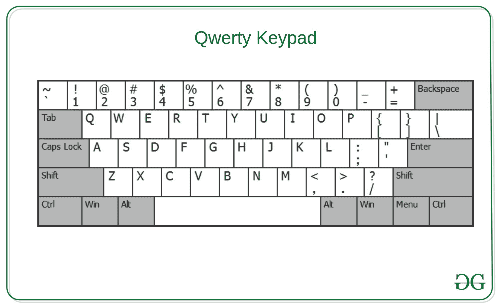

# 打印给定数组中的所有字符串，这些字符串可以使用 QWERTY 键盘的单行键来键入

> 原文:[https://www . geeksforgeeks . org/print-从给定数组中打印所有字符串-可以使用单排 qwerty 键盘中的键进行键入/](https://www.geeksforgeeks.org/print-all-strings-from-given-array-that-can-be-typed-using-keys-from-a-single-row-of-a-qwerty-keyboard/)

给定一个由小写和大写字母组成的字符串组成的字符串数组 **arr[]** ，任务是打印给定数组中的所有字符串，这些字符串可以使用 [QWERTY 键盘](https://en.wikipedia.org/wiki/QWERTY)的单行键键入。

[](https://media.geeksforgeeks.org/wp-content/cdn-uploads/20201123134530/qwety.jpg)

**示例:**

> **输入:**arr[]= {“Yeti”、“Had”、“GFG”、“comment”}
> **输出:** Yeti Had GFG
> **解释:**
> “Yeti”可从 1 <sup>st</sup> 行输入。
> “Had”可以从第 2 <sup>行和第</sup>行输入。
> “GFG”可以从 2 <sup>和</sup>行输入。
> 因此，需要的输出是**雪人有 GFG** 。
> 
> **输入:** arr[] = {“极客”，“为”，“极客”，“亲”}
> **输出:**亲

**方法:**使用[哈希](https://www.geeksforgeeks.org/hashing-data-structure/)可以解决问题。这个想法是[遍历数组](https://www.geeksforgeeks.org/c-program-to-traverse-an-array/)，对于每个字符串，检查该字符串的所有字符是否可以使用同一行的键键入。打印发现为真的字符串。按照以下步骤解决问题:

*   初始化一个[映射](https://www.geeksforgeeks.org/map-associative-containers-the-c-standard-template-library-stl/)，比如 **mp** ，为每个字符存储键盘中该字符的键所在的行号。
*   [遍历数组](https://www.geeksforgeeks.org/c-program-to-traverse-an-array/)，对于每个字符串，检查该字符串的所有字符在地图中是否具有相同的行号。如果发现为真，则打印字符串。

下面是上述方法的实现:

## C++

```
// C++ program to implement
// the above approach

#include <bits/stdc++.h>
using namespace std;

// Function to print all strings that
// can be typed using keys of a single
// row in a QWERTY Keyboard
void findWordsSameRow(vector<string>& arr)
{

    // Stores row number of all possible
    // character of the strings
    unordered_map<char, int> mp{
        { 'q', 1 }, { 'w', 1 }, { 'e', 1 }, { 'r', 1 },
        { 't', 1 }, { 'y', 1 }, { 'u', 1 }, { 'o', 1 },
        { 'p', 1 }, { 'i', 1 }, { 'a', 2 }, { 's', 2 },
        { 'd', 2 }, { 'f', 2 }, { 'g', 2 }, { 'h', 2 },
        { 'j', 2 }, { 'k', 2 }, { 'l', 2 }, { 'z', 3 },
        { 'x', 3 }, { 'c', 3 }, { 'v', 3 }, { 'b', 3 },
        { 'n', 3 }, { 'm', 3 }
    };

    // Traverse the array
    for (auto word : arr) {

        // If current string is
        // not an empty string
        if (!word.empty()) {

            // Sets true / false if a string
            // can be typed using keys of a
            // single row or not
            bool flag = true;

            // Stores row number of the first
            // character of current string
            int rowNum
                = mp[tolower(word[0])];

            // Stores length of word
            int M = word.length();

            // Traverse current string
            for (int i = 1; i < M; i++) {

                // If current character can't be
                // typed using keys of rowNum only
                if (mp[tolower(word[i])]
                    != rowNum) {

                    // Update flag
                    flag = false;
                    break;
                }
            }

            // If current string can be typed
            // using keys from rowNum only
            if (flag) {

                // Print the string
                cout << word << " ";
            }
        }
    }
}

// Driver Code
int main()
{
    vector<string> words
        = { "Yeti", "Had",
            "GFG", "comment" };
    findWordsSameRow(words);
}
```

## Java 语言(一种计算机语言，尤用于创建网站)

```
// Java program to implement
// the above approach
import java.io.*;
import java.util.*;

class GFG{

// Function to print all strings that
// can be typed using keys of a single
// row in a QWERTY Keyboard
static void findWordsSameRow(List<String> arr)
{

    // Stores row number of all possible
    // character of the strings
    Map<Character,
        Integer> mp = new HashMap<Character,
                                  Integer>();
    mp.put('q', 1);
    mp.put('w', 1);
    mp.put('e', 1);
    mp.put('r', 1);
    mp.put('t', 1);
    mp.put('y', 1);
    mp.put('u', 1);
    mp.put('i', 1);
    mp.put('o', 1);
    mp.put('p', 1);
    mp.put('a', 2);
    mp.put('s', 2);
    mp.put('d', 2);
    mp.put('f', 2);
    mp.put('g', 2);
    mp.put('h', 2);
    mp.put('j', 2);
    mp.put('k', 2);
    mp.put('l', 2);
    mp.put('z', 3);
    mp.put('x', 3);
    mp.put('c', 3);
    mp.put('v', 3);
    mp.put('b', 3);
    mp.put('n', 3);
    mp.put('m', 3);

    // Traverse the array
    for(String word : arr)
    {

        // If current string is
        // not an empty string
        if (word.length() != 0)
        {

            // Sets true / false if a string
            // can be typed using keys of a
            // single row or not
            boolean flag = true;

            // Stores row number of the first
            // character of current string
            int rowNum = mp.get(
                Character.toLowerCase(word.charAt(0)));

            // Stores length of word
            int M = word.length();

            // Traverse current string
            for(int i = 1; i < M; i++)
            {

                // If current character can't be
                // typed using keys of rowNum only
                if (mp.get(Character.toLowerCase(
                        word.charAt(i))) != rowNum)
                {

                    // Update flag
                    flag = false;
                    break;
                }
            }

            // If current string can be typed
            // using keys from rowNum only
            if (flag)
            {

                // Print the string
                System.out.print(word + " ");
            }
        }
    }
}

// Driver Code
public static void main(String[] args)
{
    List<String> words = Arrays.asList(
        "Yeti", "Had", "GFG", "comment" );

    findWordsSameRow(words);
}
}

// This code is contributed by jithin
```

## 蟒蛇 3

```
# Python3 program to implement
# the above approach

# Function to print all strings that
# can be typed using keys of a single
# row in a QWERTY Keyboard
def findWordsSameRow(arr):

    # Stores row number of all possible
    # character of the strings
    mp = { 'q' : 1, 'w' : 1, 'e' : 1, 'r' : 1,
           't' : 1, 'y' : 1, 'u' : 1, 'o' : 1,
           'p' : 1, 'i' : 1, 'a' : 2, 's' : 2,
           'd' : 2, 'f' : 2, 'g' : 2, 'h' : 2,
           'j' : 2, 'k' : 2, 'l' : 2, 'z' : 3,
           'x' : 3, 'c' : 3, 'v' : 3, 'b' : 3,
           'n' : 3, 'm' : 3 }

    #  Traverse the array
    for word in arr:

        # If current string is
        # not an empty string
        if (len(word) != 0):

            # Sets true / false if a string
            # can be typed using keys of a
            # single row or not
            flag = True

            rowNum = mp[word[0].lower()]

            # Stores length of word
            M = len(word)

            # Traverse current string
            for i in range(1, M):

                # If current character can't be
                # typed using keys of rowNum only
                if (mp[word[i].lower()] != rowNum):

                    # Update flag
                    flag = False
                    break

            # If current string can be typed
            # using keys from rowNum only
            if (flag):

                # Print the string
                print(word, end = ' ')

# Driver Code
words = [ "Yeti", "Had", "GFG", "comment" ]

findWordsSameRow(words)

# This code is contributed by avanitrachhadiya2155
```

## C#

```
// C# program to implement
// the above approach
using System;
using System.Collections.Generic;
class GFG
{

// Function to print all strings that
// can be typed using keys of a single
// row in a QWERTY Keyboard
static void findWordsSameRow(List<string> arr)
{

    // Stores row number of all possible
    // character of the strings
    Dictionary<char,
        int> mp = new Dictionary<char,
                                  int>();
    mp.Add('q', 1);
    mp.Add('w', 1);
    mp.Add('e', 1);
    mp.Add('r', 1);
    mp.Add('t', 1);
    mp.Add('y', 1);
    mp.Add('u', 1);
    mp.Add('i', 1);
    mp.Add('o', 1);
    mp.Add('p', 1);
    mp.Add('a', 2);
    mp.Add('s', 2);
    mp.Add('d', 2);
    mp.Add('f', 2);
    mp.Add('g', 2);
    mp.Add('h', 2);
    mp.Add('j', 2);
    mp.Add('k', 2);
    mp.Add('l', 2);
    mp.Add('z', 3);
    mp.Add('x', 3);
    mp.Add('c', 3);
    mp.Add('v', 3);
    mp.Add('b', 3);
    mp.Add('n', 3);
    mp.Add('m', 3);

    // Traverse the array
    foreach(string word in arr)
    {

        // If current string is
        // not an empty string
        if (word.Length != 0)
        {

            // Sets true / false if a string
            // can be typed using keys of a
            // single row or not
            bool flag = true;

            // Stores row number of the first
            // character of current string
            int rowNum = mp[ char.ToLower(word[0])];

            // Stores length of word
            int M = word.Length;

            // Traverse current string
            for(int i = 1; i < M; i++)
            {

                // If current character can't be
                // typed using keys of rowNum only
                if (mp[Char.ToLower(word[i])] != rowNum)
                {

                    // Update flag
                    flag = false;
                    break;
                }
            }

            // If current string can be typed
            // using keys from rowNum only
            if (flag)
            {

                // Print the string
                Console.Write(word + " ");
            }
        }
    }
}

// Driver Code
public static void Main(String[] args)
{
    List<string> words = new List<string>( new string[] {
        "Yeti", "Had", "GFG", "comment" });

    findWordsSameRow(words);
}
}

// This code is contributed by chitranayal
```

## java 描述语言

```
<script>

      // JavaScript program to implement
      // the above approach

      // Function to print all strings that
      // can be typed using keys of a single
      // row in a QWERTY Keyboard
      function findWordsSameRow(arr) {
        // Stores row number of all possible
        // character of the strings
        var mp = {};
        mp["q"] = 1;
        mp["w"] = 1;
        mp["e"] = 1;
        mp["r"] = 1;
        mp["t"] = 1;
        mp["y"] = 1;
        mp["u"] = 1;
        mp["i"] = 1;
        mp["o"] = 1;
        mp["p"] = 1;
        mp["a"] = 2;
        mp["s"] = 2;
        mp["d"] = 2;
        mp["f"] = 2;
        mp["g"] = 2;
        mp["h"] = 2;
        mp["j"] = 2;
        mp["k"] = 2;
        mp["l"] = 2;
        mp["z"] = 3;
        mp["x"] = 3;
        mp["c"] = 3;
        mp["v"] = 3;
        mp["b"] = 3;
        mp["n"] = 3;
        mp["m"] = 3;

        // Traverse the array
        for (const word of arr) {
          // If current string is
          // not an empty string
          if (word.length !== 0) {
            // Sets true / false if a string
            // can be typed using keys of a
            // single row or not
            var flag = true;

            // Stores row number of the first
            // character of current string
            var rowNum = mp[word[0].toLowerCase()];

            // Stores length of word
            var M = word.length;

            // Traverse current string
            for (var i = 1; i < M; i++) {
              // If current character can't be
              // typed using keys of rowNum only
              if (mp[word[i].toLowerCase()] !== rowNum) {
                // Update flag
                flag = false;
                break;
              }
            }

            // If current string can be typed
            // using keys from rowNum only
            if (flag) {
              // Print the string
              document.write(word + " ");
            }
          }
        }
      }

      // Driver Code
      var words = ["Yeti", "Had", "GFG", "comment"];

      findWordsSameRow(words);

</script>
```

**Output:**

```
Yeti Had GFG
```

***时间复杂度:** O(N * M)，其中 N 和 M 分别表示字符串的个数和最长字符串的长度。*
***辅助空间:** O(26)*