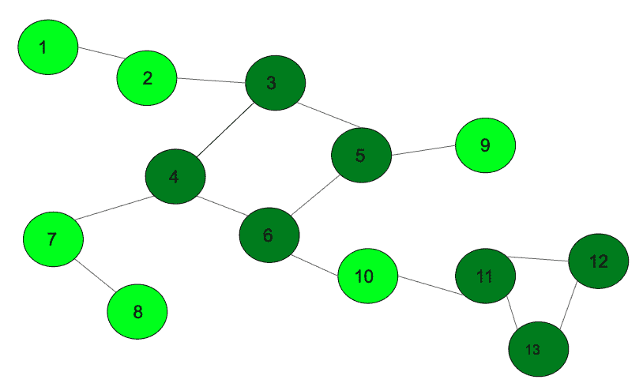

# 打印无向图中的所有循环

> 原文:[https://www . geeksforgeeks . org/print-全周期无向图/](https://www.geeksforgeeks.org/print-all-the-cycles-in-an-undirected-graph/)

给定一个无向图，打印其中形成圈的所有顶点。
**先决条件:** [使用颜色检测有向图中的周期](https://www.geeksforgeeks.org/detect-cycle-direct-graph-using-colors/)



在上图中，循环用深绿色标记。以上输出将为

> **第一周期:**3 5 4 6
> T3】第二周期: 11 12 13

**方法:**使用[图着色方法](https://www.geeksforgeeks.org/detect-cycle-direct-graph-using-colors/)，用唯一的数字标记不同循环的所有顶点。一旦图遍历完成，将所有相似的标记数字推送到邻接表，并相应地打印邻接表。下面给出了算法:

*   将边插入邻接表。
*   调用使用着色方法标记顶点的 DFS 函数。
*   每当有一个部分访问的顶点时，**回溯**直到到达当前顶点，并用循环号标记所有顶点。标记所有顶点后，增加循环数。
*   一旦完成 Dfs，迭代边，并将相同标记数的边推到另一个邻接表。
*   在另一个邻接表中迭代，并按循环数打印顶点。

以下是上述方法的实现:

## C++

```
// C++ program to print all the cycles
// in an undirected graph
#include <bits/stdc++.h>
using namespace std;
const int N = 100000;

// variables to be used
// in both functions
vector<int> graph[N];
vector<int> cycles[N];

// Function to mark the vertex with
// different colors for different cycles
void dfs_cycle(int u, int p, int color[],
               int mark[], int par[], int& cyclenumber)
{

    // already (completely) visited vertex.
    if (color[u] == 2) {
        return;
    }

    // seen vertex, but was not completely visited -> cycle detected.
    // backtrack based on parents to find the complete cycle.
    if (color[u] == 1) {

        cyclenumber++;
        int cur = p;
        mark[cur] = cyclenumber;

        // backtrack the vertex which are
        // in the current cycle thats found
        while (cur != u) {
            cur = par[cur];
            mark[cur] = cyclenumber;
        }
        return;
    }
    par[u] = p;

    // partially visited.
    color[u] = 1;

    // simple dfs on graph
    for (int v : graph[u]) {

        // if it has not been visited previously
        if (v == par[u]) {
            continue;
        }
        dfs_cycle(v, u, color, mark, par, cyclenumber);
    }

    // completely visited.
    color[u] = 2;
}

// add the edges to the graph
void addEdge(int u, int v)
{
    graph[u].push_back(v);
    graph[v].push_back(u);
}

// Function to print the cycles
void printCycles(int edges, int mark[], int& cyclenumber)
{

    // push the edges that into the
    // cycle adjacency list
    for (int i = 1; i <= edges; i++) {
        if (mark[i] != 0)
            cycles[mark[i]].push_back(i);
    }

    // print all the vertex with same cycle
    for (int i = 1; i <= cyclenumber; i++) {
        // Print the i-th cycle
        cout << "Cycle Number " << i << ": ";
        for (int x : cycles[i])
            cout << x << " ";
        cout << endl;
    }
}

// Driver Code
int main()
{

    // add edges
    addEdge(1, 2);
    addEdge(2, 3);
    addEdge(3, 4);
    addEdge(4, 6);
    addEdge(4, 7);
    addEdge(5, 6);
    addEdge(3, 5);
    addEdge(7, 8);
    addEdge(6, 10);
    addEdge(5, 9);
    addEdge(10, 11);
    addEdge(11, 12);
    addEdge(11, 13);
    addEdge(12, 13);

    // arrays required to color the
    // graph, store the parent of node
    int color[N];
    int par[N];

    // mark with unique numbers
    int mark[N];

    // store the numbers of cycle
    int cyclenumber = 0;
    int edges = 13;

    // call DFS to mark the cycles
    dfs_cycle(1, 0, color, mark, par, cyclenumber);

    // function to print the cycles
    printCycles(edges, mark, cyclenumber);
}
```

## Java 语言(一种计算机语言，尤用于创建网站)

```
// Java program to print all the cycles
// in an undirected graph
import java.util.*;

class GFG
{

    static final int N = 100000;

    // variables to be used
    // in both functions
    @SuppressWarnings("unchecked")
    static Vector<Integer>[] graph = new Vector[N];
    @SuppressWarnings("unchecked")
    static Vector<Integer>[] cycles = new Vector[N];
    static int cyclenumber;

    // Function to mark the vertex with
    // different colors for different cycles
    static void dfs_cycle(int u, int p, int[] color,
                       int[] mark, int[] par)
    {

        // already (completely) visited vertex.
        if (color[u] == 2)
        {
            return;
        }

        // seen vertex, but was not completely visited -> cycle detected.
        // backtrack based on parents to find the complete cycle.
        if (color[u] == 1)
        {

            cyclenumber++;
            int cur = p;
            mark[cur] = cyclenumber;

            // backtrack the vertex which are
            // in the current cycle thats found
            while (cur != u)
            {
                cur = par[cur];
                mark[cur] = cyclenumber;
            }
            return;
        }
        par[u] = p;

        // partially visited.
        color[u] = 1;

        // simple dfs on graph
        for (int v : graph[u])
        {

            // if it has not been visited previously
            if (v == par[u])
            {
                continue;
            }
            dfs_cycle(v, u, color, mark, par);
        }

        // completely visited.
        color[u] = 2;
    }

    // add the edges to the graph
    static void addEdge(int u, int v)
    {
        graph[u].add(v);
        graph[v].add(u);
    }

    // Function to print the cycles
    static void printCycles(int edges, int mark[])
    {

        // push the edges that into the
        // cycle adjacency list
        for (int i = 1; i <= edges; i++)
        {
            if (mark[i] != 0)
                cycles[mark[i]].add(i);
        }

        // print all the vertex with same cycle
        for (int i = 1; i <= cyclenumber; i++)
        {
            // Print the i-th cycle
            System.out.printf("Cycle Number %d: ", i);
            for (int x : cycles[i])
                System.out.printf("%d ", x);
            System.out.println();
        }
    }

    // Driver Code
    public static void main(String[] args)
    {

        for (int i = 0; i < N; i++)
        {
            graph[i] = new Vector<>();
            cycles[i] = new Vector<>();
        }

        // add edges
        addEdge(1, 2);
        addEdge(2, 3);
        addEdge(3, 4);
        addEdge(4, 6);
        addEdge(4, 7);
        addEdge(5, 6);
        addEdge(3, 5);
        addEdge(7, 8);
        addEdge(6, 10);
        addEdge(5, 9);
        addEdge(10, 11);
        addEdge(11, 12);
        addEdge(11, 13);
        addEdge(12, 13);

        // arrays required to color the
        // graph, store the parent of node
        int[] color = new int[N];
        int[] par = new int[N];

        // mark with unique numbers
        int[] mark = new int[N];

        // store the numbers of cycle
        cyclenumber = 0;
        int edges = 13;

        // call DFS to mark the cycles
        dfs_cycle(1, 0, color, mark, par);

        // function to print the cycles
        printCycles(edges, mark);
    }
}

// This code is contributed by
// sanjeev2552
```

## 蟒蛇 3

```
# Python3 program to print all the cycles
# in an undirected graph
N = 100000

# variables to be used
# in both functions
graph = [[] for i in range(N)]
cycles = [[] for i in range(N)]

# Function to mark the vertex with
# different colors for different cycles
def dfs_cycle(u, p, color: list,
              mark: list, par: list):
    global cyclenumber

    # already (completely) visited vertex.
    if color[u] == 2:
        return

    # seen vertex, but was not
    # completely visited -> cycle detected.
    # backtrack based on parents to
    # find the complete cycle.
    if color[u] == 1:
        cyclenumber += 1
        cur = p
        mark[cur] = cyclenumber

        # backtrack the vertex which are
        # in the current cycle thats found
        while cur != u:
            cur = par[cur]
            mark[cur] = cyclenumber

        return

    par[u] = p

    # partially visited.
    color[u] = 1

    # simple dfs on graph
    for v in graph[u]:

        # if it has not been visited previously
        if v == par[u]:
            continue
        dfs_cycle(v, u, color, mark, par)

    # completely visited.
    color[u] = 2

# add the edges to the graph
def addEdge(u, v):
    graph[u].append(v)
    graph[v].append(u)

# Function to print the cycles
def printCycles(edges, mark: list):

    # push the edges that into the
    # cycle adjacency list
    for i in range(1, edges + 1):
        if mark[i] != 0:
            cycles[mark[i]].append(i)

    # print all the vertex with same cycle
    for i in range(1, cyclenumber + 1):

        # Print the i-th cycle
        print("Cycle Number %d:" % i, end = " ")
        for x in cycles[i]:
            print(x, end = " ")
        print()

# Driver Code
if __name__ == "__main__":

    # add edges
    addEdge(1, 2)
    addEdge(2, 3)
    addEdge(3, 4)
    addEdge(4, 6)
    addEdge(4, 7)
    addEdge(5, 6)
    addEdge(3, 5)
    addEdge(7, 8)
    addEdge(6, 10)
    addEdge(5, 9)
    addEdge(10, 11)
    addEdge(11, 12)
    addEdge(11, 13)
    addEdge(12, 13)

    # arrays required to color the
    # graph, store the parent of node
    color = [0] * N
    par = [0] * N

    # mark with unique numbers
    mark = [0] * N

    # store the numbers of cycle
    cyclenumber = 0
    edges = 13

    # call DFS to mark the cycles
    dfs_cycle(1, 0, color, mark, par)

    # function to print the cycles
    printCycles(edges, mark)

# This code is contributed by
# sanjeev2552
```

## C#

```
// C# program to print all
// the cycles in an undirected
// graph
using System;
using System.Collections.Generic;
class GFG{

static readonly int N = 100000;

// variables to be used
// in both functions
static List<int>[] graph =
       new List<int>[N];
static List<int>[] cycles =
       new List<int>[N];
static int cyclenumber;

// Function to mark the vertex with
// different colors for different cycles
static void dfs_cycle(int u, int p,
                      int[] color,
                      int[] mark,
                      int[] par)
{
  // already (completely)
  // visited vertex.
  if (color[u] == 2)
  {
    return;
  }

  // seen vertex, but was not
  // completely visited -> cycle
  // detected. backtrack based on
  // parents to find the complete
  // cycle.
  if (color[u] == 1)
  {
    cyclenumber++;
    int cur = p;
    mark[cur] = cyclenumber;

    // backtrack the vertex which
    // are in the current cycle
    // thats found
    while (cur != u)
    {
      cur = par[cur];
      mark[cur] = cyclenumber;
    }
    return;
  }
  par[u] = p;

  // partially visited.
  color[u] = 1;

  // simple dfs on graph
  foreach (int v in graph[u])
  {
    // if it has not been
    // visited previously
    if (v == par[u])
    {
      continue;
    }
    dfs_cycle(v, u, color,
              mark, par);
  }

  // completely visited.
  color[u] = 2;
}

// add the edges to the
// graph
static void addEdge(int u,
                    int v)
{
  graph[u].Add(v);
  graph[v].Add(u);
}

// Function to print the cycles
static void printCycles(int edges,
                        int []mark)
{
  // push the edges that into the
  // cycle adjacency list
  for (int i = 1; i <= edges; i++)
  {
    if (mark[i] != 0)
      cycles[mark[i]].Add(i);
  }

  // print all the vertex with
  // same cycle
  for (int i = 1;
           i <= cyclenumber; i++)
  {
    // Print the i-th cycle
    Console.Write("Cycle Number " + i + ":");
    foreach (int x in cycles[i])
      Console.Write(" " + x);
    Console.WriteLine();
  }
}

// Driver Code
public static void Main(String[] args)
{
  for (int i = 0; i < N; i++)
  {
    graph[i] = new List<int>();
    cycles[i] = new List<int>();
  }

  // add edges
  addEdge(1, 2);
  addEdge(2, 3);
  addEdge(3, 4);
  addEdge(4, 6);
  addEdge(4, 7);
  addEdge(5, 6);
  addEdge(3, 5);
  addEdge(7, 8);
  addEdge(6, 10);
  addEdge(5, 9);
  addEdge(10, 11);
  addEdge(11, 12);
  addEdge(11, 13);
  addEdge(12, 13);

  // arrays required to color
  // the graph, store the parent
  // of node
  int[] color = new int[N];
  int[] par = new int[N];

  // mark with unique numbers
  int[] mark = new int[N];

  // store the numbers of cycle
  cyclenumber = 0;
  int edges = 13;

  // call DFS to mark
  // the cycles
  dfs_cycle(1, 0, color,
            mark, par);

  // function to print the cycles
  printCycles(edges, mark);
}
}

// This code is contributed by Amit Katiyar
```

## java 描述语言

```
<script>

// JavaScript program to print all
// the cycles in an undirected
// graph

var N = 100000;

// variables to be used
// in both functions
var graph = Array.from(Array(N), ()=>Array());

var cycles = Array.from(Array(N), ()=>Array());

var cyclenumber = 0;

// Function to mark the vertex with
// different colors for different cycles
function dfs_cycle(u, p, color, mark, par)
{
  // already (completely)
  // visited vertex.
  if (color[u] == 2)
  {
    return;
  }

  // seen vertex, but was not
  // completely visited -> cycle
  // detected. backtrack based on
  // parents to find the complete
  // cycle.
  if (color[u] == 1)
  {
    cyclenumber++;
    var cur = p;
    mark[cur] = cyclenumber;

    // backtrack the vertex which
    // are in the current cycle
    // thats found
    while (cur != u)
    {
      cur = par[cur];
      mark[cur] = cyclenumber;
    }
    return;
  }
  par[u] = p;

  // partially visited.
  color[u] = 1;

  // simple dfs on graph
  for(var v of graph[u])
  {
    // if it has not been
    // visited previously
    if (v == par[u])
    {
      continue;
    }
    dfs_cycle(v, u, color,
              mark, par);
  }

  // completely visited.
  color[u] = 2;
}

// add the edges to the
// graph
function addEdge(u, v)
{
  graph[u].push(v);
  graph[v].push(u);
}

// Function to print the cycles
function printCycles(edges, mark)
{
  // push the edges that into the
  // cycle adjacency list
  for (var i = 1; i <= edges; i++)
  {
    if (mark[i] != 0)
      cycles[mark[i]].push(i);
  }

  // print all the vertex with
  // same cycle
  for (var i = 1;
           i <= cyclenumber; i++)
  {
    // Print the i-th cycle
    document.write("Cycle Number " + i + ":");
    for(var x of cycles[i])
      document.write(" " + x);
    document.write("<br>");
  }
}

// Driver Code
// add edges
addEdge(1, 2);
addEdge(2, 3);
addEdge(3, 4);
addEdge(4, 6);
addEdge(4, 7);
addEdge(5, 6);
addEdge(3, 5);
addEdge(7, 8);
addEdge(6, 10);
addEdge(5, 9);
addEdge(10, 11);
addEdge(11, 12);
addEdge(11, 13);
addEdge(12, 13);
// arrays required to color
// the graph, store the parent
// of node
var color = Array(N).fill(0);
var par = Array(N).fill(0);
// mark with unique numbers
var mark = Array(N).fill(0);
// store the numbers of cycle
cyclenumber = 0;
var edges = 13;
// call DFS to mark
// the cycles
dfs_cycle(1, 0, color,
          mark, par);
// function to print the cycles
printCycles(edges, mark);

</script>
```

**输出:**

```
Cycle Number 1: 3 4 5 6 
Cycle Number 2: 11 12 13 
```

**时间复杂度:** O(N + M)，其中 N 为顶点数，M 为边数。
**辅助空间:** O(N + M)