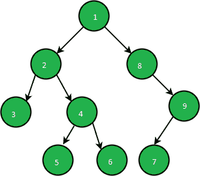
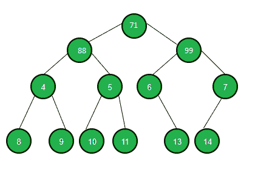

# 打印二叉树各级的备用节点

> 原文:[https://www . geesforgeks . org/print-alternate-nodes-from-all-level-of-a-二叉树/](https://www.geeksforgeeks.org/print-alternate-nodes-from-all-levels-of-a-binary-tree/)

给定一个[二叉树](https://www.geeksforgeeks.org/binary-tree-data-structure/)，任务是从左到右遍历给定二叉树的每一级，并打印在某一级遇到的每个备选项。

**示例:**

> **输入:**
> 
> 
> 
> **输出:**T2 1
> 2
> 3 9
> 5 7
> 
> **输入:**
> 
> 
> 
> **输出:**T2】71
> 88
> 4 6
> 8 10 13

**方法:**对给定的二叉树进行[级序遍历](https://www.geeksforgeeks.org/level-order-tree-traversal/)遍历即可解决问题。按照以下步骤解决问题:

1.  初始化一个[队列](https://www.geeksforgeeks.org/queue-data-structure/)，存储给定[二叉树](https://www.geeksforgeeks.org/binary-tree-data-structure/)每一级的节点。
2.  执行[级顺序遍历](https://www.geeksforgeeks.org/level-order-tree-traversal/)并打印[二叉树](https://www.geeksforgeeks.org/binary-tree-data-structure/)每一级的交替节点

下面是上述方法的实现:

## C++

```
// C++ program to implement
// the above approach

#include <bits/stdc++.h>
using namespace std;

// Structure of a Node
struct Node {
    int data;
    Node* left;
    Node* right;
    Node(int val)
    {
        data = val;
        left = right = NULL;
    }
};

// Print alternate nodes of
// a binary tree
void PrintAlternate(Node* root)
{
    // Store nodes of each level
    queue<Node*> Q;
    Q.push(root);

    while (!Q.empty()) {
        // Store count of nodes
        // of current level
        int N = Q.size();

        // Print alternate nodes of
        // the current level
        for (int i = 0; i < N; i++) {
            Node* temp = Q.front();
            Q.pop();

            if (i % 2 == 0) {
                cout << temp->data << " ";
            }

            // If left child exists
            if (temp->left) {
                // Store left child
                Q.push(temp->left);
            }

            // If right child exists
            if (temp->right) {
                // Store right child
                Q.push(temp->right);
            }
        }
        cout << endl;
    }
}

// Driver Code
int main()
{
    Node* root;

    // Create a tree
    root = new Node(71);
    root->left = new Node(88);
    root->right = new Node(99);
    root->left->left = new Node(4);
    root->left->right = new Node(5);
    root->right->left = new Node(6);
    root->right->right = new Node(7);
    root->left->left->left = new Node(8);
    root->left->left->right = new Node(9);
    root->left->right->left = new Node(10);
    root->left->right->right = new Node(11);
    root->right->left->right = new Node(13);
    root->right->right->left = new Node(14);
    PrintAlternate(root);
}
```

## Java 语言(一种计算机语言，尤用于创建网站)

```
// Java program to implement
// the above approach
import java.util.*;
class GFG{

// Structure of a Node
static class Node
{
  int data;
  Node left;
  Node right;
  Node(int val)
  {
    data = val;
    left = right = null;
  }
};

// Print alternate nodes of
// a binary tree
static void PrintAlternate(Node root)
{
  // Store nodes of each level
  Queue<Node> Q = new LinkedList<>();
  Q.add(root);

  while (!Q.isEmpty())
  {
    // Store count of nodes
    // of current level
    int N = Q.size();

    // Print alternate nodes of
    // the current level
    for (int i = 0; i < N; i++)
    {
      Node temp = Q.peek();
      Q.remove();

      if (i % 2 == 0)
      {
        System.out.print(temp.data + " ");
      }

      // If left child exists
      if (temp.left!=null)
      {
        // Store left child
        Q.add(temp.left);
      }

      // If right child exists
      if (temp.right!=null)
      {
        // Store right child
        Q.add(temp.right);
      }
    }
    System.out.println();
  }
}

// Driver Code
public static void main(String[] args)
{
  Node root;

  // Create a tree
  root = new Node(71);
  root.left = new Node(88);
  root.right = new Node(99);
  root.left.left = new Node(4);
  root.left.right = new Node(5);
  root.right.left = new Node(6);
  root.right.right = new Node(7);
  root.left.left.left = new Node(8);
  root.left.left.right = new Node(9);
  root.left.right.left = new Node(10);
  root.left.right.right = new Node(11);
  root.right.left.right = new Node(13);
  root.right.right.left = new Node(14);
  PrintAlternate(root);
}
}

// This code is contributed by 29AjayKumar
```

## 蟒蛇 3

```
# Python3 program to implement
# the above approach

# Structure of a Node
class newNode:

    def __init__(self, val):

        self.data = val
        self.left = None
        self.right = None

# Print alternate nodes of
# a binary tree
def PrintAlternate(root):

    # Store nodes of each level
    Q = []
    Q.append(root)

    while (len(Q)):

        # Store count of nodes
        # of current level
        N = len(Q)

        # Print alternate nodes of
        # the current level
        for i in range(N):
            temp = Q[0]
            Q.remove(Q[0])

            if (i % 2 == 0):
                print(temp.data, end = " ")

            # If left child exists
            if (temp.left):

                # Store left child
                Q.append(temp.left)

            # If right child exists
            if (temp.right):

                # Store right child
                Q.append(temp.right)

        print("\n", end = "")

# Driver Code
if __name__ == '__main__':

    # Create a tree
    root = newNode(71)
    root.left = newNode(88)
    root.right = newNode(99)
    root.left.left = newNode(4)
    root.left.right = newNode(5)
    root.right.left = newNode(6)
    root.right.right = newNode(7)
    root.left.left.left = newNode(8)
    root.left.left.right = newNode(9)
    root.left.right.left = newNode(10)
    root.left.right.right = newNode(11)
    root.right.left.right = newNode(13)
    root.right.right.left = newNode(14)

    PrintAlternate(root)

# This code is contributed by ipg2016107
```

## C#

```
// C# program to implement
// the above approach
using System;
using System.Collections.Generic;
class GFG{

// Structure of a Node
class Node
{
  public int data;
  public Node left;
  public Node right;
  public Node(int val)
  {
    data = val;
    left = right = null;
  }
};

// Print alternate nodes of
// a binary tree
static void PrintAlternate(Node root)
{
  // Store nodes of each level
  Queue<Node> Q = new Queue<Node>();
  Q.Enqueue(root);

  while (Q.Count != 0)
  {
    // Store count of nodes
    // of current level
    int N = Q.Count;

    // Print alternate nodes of
    // the current level
    for (int i = 0; i < N; i++)
    {
      Node temp = Q.Peek();
      Q.Dequeue();

      if (i % 2 == 0)
      {
        Console.Write(temp.data + " ");
      }

      // If left child exists
      if (temp.left!=null)
      {
        // Store left child
        Q.Enqueue(temp.left);
      }

      // If right child exists
      if (temp.right!=null)
      {
        // Store right child
        Q.Enqueue(temp.right);
      }
    }
    Console.WriteLine();
  }
}

// Driver Code
public static void Main(String[] args)
{
  Node root;

  // Create a tree
  root = new Node(71);
  root.left = new Node(88);
  root.right = new Node(99);
  root.left.left = new Node(4);
  root.left.right = new Node(5);
  root.right.left = new Node(6);
  root.right.right = new Node(7);
  root.left.left.left = new Node(8);
  root.left.left.right = new Node(9);
  root.left.right.left = new Node(10);
  root.left.right.right = new Node(11);
  root.right.left.right = new Node(13);
  root.right.right.left = new Node(14);
  PrintAlternate(root);
}
}

// This code is contributed by 29AjayKumar
```

## java 描述语言

```
<script>
    // Javascript program for the above approach

    // Structure of a Node
    class Node
    {
        constructor(val) {
           this.left = null;
           this.right = null;
           this.data = val;
        }
    }

    // Print alternate nodes of
    // a binary tree
    function PrintAlternate(root)
    {
      // Store nodes of each level
      let Q = [];
      Q.push(root);

      while (Q.length > 0)
      {
        // Store count of nodes
        // of current level
        let N = Q.length;

        // Print alternate nodes of
        // the current level
        for (let i = 0; i < N; i++)
        {
          let temp = Q[0];
          Q.shift();

          if (i % 2 == 0)
          {
            document.write(temp.data + " ");
          }

          // If left child exists
          if (temp.left!=null)
          {
            // Store left child
            Q.push(temp.left);
          }

          // If right child exists
          if (temp.right!=null)
          {
            // Store right child
            Q.push(temp.right);
          }
        }
        document.write("</br>");
      }
    }

    let root;

    // Create a tree
    root = new Node(71);
    root.left = new Node(88);
    root.right = new Node(99);
    root.left.left = new Node(4);
    root.left.right = new Node(5);
    root.right.left = new Node(6);
    root.right.right = new Node(7);
    root.left.left.left = new Node(8);
    root.left.left.right = new Node(9);
    root.left.right.left = new Node(10);
    root.left.right.right = new Node(11);
    root.right.left.right = new Node(13);
    root.right.right.left = new Node(14);
    PrintAlternate(root);

</script>
```

**Output:** 

```
71 
88 
4 6 
8 10 13
```

***时间复杂度:**O(N)*
T5**辅助空间:** O(N)