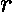
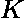

# 按照交替递增和递减的顺序打印数组元素

> 原文:[https://www . geesforgeks . org/print-array-elements-in-alternative-递增和递减顺序/](https://www.geeksforgeeks.org/print-array-elements-in-alternatively-increasing-and-decreasing-order/)

给定一个由 N 个元素组成的数组。任务是以这样的方式打印数组元素:前两个元素按升序排列，后三个按降序排列，后四个按升序排列，依此类推。

**示例**:

> **输入** : arr = {2，6，2，4，0，1，4，8，2，0，0，5，2，2}
> 输出:0 0 8 6 5 0 1 2 4 2 2 2 2
> 
> **输入** : arr = {1，2，3，4，5，6}
> **输出** : 1 2 6 5 4 3

**来源** : [甲骨文面试经验集 52](https://www.geeksforgeeks.org/oracle-interview-experience-set-52-campus-application-engineer/)
思路是使用 [2 指针手法](https://www.geeksforgeeks.org/two-pointers-technique/)。首先按递增顺序对数组进行排序，并保持两个指针和，其中是按递增顺序打印数组，是按递减顺序打印数组。保留一个变量以指定迭代中要打印的元素数量，并保留一个变量*标志*以交替地在升序和降序打印之间切换。

下面是上述方法的实现:

## C++

```
// C++ program to print array elements in
// alternative increasing and decreasing
// order

#include <bits/stdc++.h>
using namespace std;

// Function to print array elements in
// alternative increasing and decreasing
// order
void printArray(int arr[], int n)
{
    // First sort the array in increasing order
    sort(arr, arr + n);

    int l = 0, r = n - 1, flag = 0, i;

    // start with 2 elements in
    // increasing order
    int k = 2;

    // till all the elements are not printed
    while (l <= r) {
        // printing the elements in
        // increasing order
        if (flag == 0) {
            for (i = l; i < l + k && i <= r; i++)
                cout << arr[i] << " ";

            flag = 1;
            l = i;
        }
        else // printing the elements in
        // decreasing order
        {
            for (i = r; i > r - k && i >= l; i--)
                cout << arr[i] << " ";

            flag = 0;
            r = i;
        }

        // increasing the number of elements
        // to printed in next iteration
        k++;
    }
}

// Driver Code
int main()
{
    int n = 6;

    int arr[] = { 1, 2, 3, 4, 5, 6 };

    printArray(arr, n);

    return 0;
}
```

## Java 语言(一种计算机语言，尤用于创建网站)

```
// Java program to print array elements in
// alternative increasing and decreasing
// order
import java.util.*;
class Solution
{

// Function to print array elements in
// alternative increasing and decreasing
// order
static void printArray(int arr[], int n)
{
    // First sort the array in increasing order
    Arrays.sort(arr);

    int l = 0, r = n - 1, flag = 0, i;

    // start with 2 elements in
    // increasing order
    int k = 2;

    // till all the elements are not printed
    while (l <= r) {
        // printing the elements in
        // increasing order
        if (flag == 0) {
            for (i = l; i < l + k && i <= r; i++)
                System.out.print(arr[i] + " ");

            flag = 1;
            l = i;
        }
        else // printing the elements in
        // decreasing order
        {
            for (i = r; i > r - k && i >= l; i--)
                System.out.print(arr[i] + " ");

            flag = 0;
            r = i;
        }

        // increasing the number of elements
        // to printed in next iteration
        k++;
    }
}

// Driver Code
public static void main(String args[])
{
    int n = 6;

    int arr[] = { 1, 2, 3, 4, 5, 6 };

    printArray(arr, n);

}

}
//contributed by Arnab Kundu
```

## 蟒蛇 3

```
# Python 3 program to print array elements
# in alternative increasing and decreasing
# order

# Function to print array elements in
# alternative increasing and decreasing
# order
def printArray(arr, n):

    # First sort the array in
    # increasing order
    arr.sort()

    l = 0
    r = n - 1
    flag = 0

    # start with 2 elements in
    # increasing order
    k = 2

    # till all the elements are not printed
    while (l <= r) :

        # printing the elements in
        # increasing order
        if (flag == 0):
            i = l
            while i < l + k and i <= r:
                print(arr[i], end = " ")
                i += 1

            flag = 1
            l = i

        else:     # printing the elements in
                 # decreasing order
            i = r
            while i > r - k and i >= l:
                print(arr[i], end = " ")
                i -= 1

            flag = 0
            r = i

        # increasing the number of elements
        # to printed in next iteration
        k += 1

# Driver Code
if __name__ == "__main__":

    n = 6
    arr = [ 1, 2, 3, 4, 5, 6 ]
    printArray(arr, n)

# This code is contributed by ita_c
```

## C#

```
// C# program to print array elements in
// alternative increasing and decreasing
// order
using System;

class GFG{

// Function to print array elements in
// alternative increasing and decreasing
// order
static void printArray(int []arr, int n)
{

    // First sort the array
    // in increasing order
    Array.Sort(arr);

    int l = 0, r = n - 1, flag = 0, i;

    // start with 2 elements in
    // increasing order
    int k = 2;

    // till all the elements
    // are not printed
    while (l <= r) {

        // printing the elements in
        // increasing order
        if (flag == 0) {

            for (i = l; i < l + k && i <= r; i++)
                    Console.Write(arr[i] + " ");

            flag = 1;
            l = i;
        }
        else

        // printing the elements in
        // decreasing order
        {
            for (i = r; i > r - k && i >= l; i--)
                Console.Write(arr[i] + " ");

            flag = 0;
            r = i;
        }

        // increasing the number of elements
        // to printed in next iteration
        k++;
    }
}

// Driver Code
static public void Main ()
{

    int n = 6;
    int []arr = { 1, 2, 3, 4, 5, 6 };
    printArray(arr, n);

}
}

// This code is contributed by Sach_Code
```

## 服务器端编程语言（Professional Hypertext Preprocessor 的缩写）

```
<?php
// PHP program to print array elements in
// alternative increasing and decreasing
// order

// Function to print array elements in
// alternative increasing and decreasing
// order
function printArray($arr, $n)
{
    // First sort the array in
    // increasing order
    sort($arr);

    $l = 0;
    $r = $n - 1;
    $flag = 0;

    // start with 2 elements in
    // increasing order
    $k = 2;

    // till all the elements are
    // not printed
    while ($l <= $r)
    {
        // printing the elements in
        // increasing order
        if ($flag == 0)
        {
            for ($i = $l;
                 $i < $l + $k &&
                 $i <= $r; $i++)
                echo $arr[$i] , " ";

            $flag = 1;
            $l = $i;
        }
        else // printing the elements in
             // decreasing order
        {
            for ($i = $r;
                 $i > $r - $k &&
                 $i >= $l; $i--)
                echo $arr[$i] , " ";

            $flag = 0;
            $r = $i;
        }

        // increasing the number of elements
        // to printed in next iteration
        $k++;
    }
}

// Driver Code
$n = 6;
$arr = array( 1, 2, 3, 4, 5, 6 );

printArray($arr, $n);

// This code is contributed by jit_t
?>
```

## java 描述语言

```
<script>

// Javascript program to print array elements in
// alternative increasing and decreasing
// order

// Function to print array elements in
// alternative increasing and decreasing
// order
function printArray(arr, n)
{

    // First sort the array
    // in increasing order
    arr.sort();

    let l = 0, r = n - 1, flag = 0, i;

    // start with 2 elements in
    // increasing order
    let k = 2;

    // till all the elements
    // are not printed
    while (l <= r)
    {

        // printing the elements in
        // increasing order
        if (flag == 0)
        {
            for(i = l; i < l + k && i <= r; i++)
                document.write(arr[i] + " ");

            flag = 1;
            l = i;
        }
        else

        // Printing the elements in
        // decreasing order
        {
            for(i = r; i > r - k && i >= l; i--)
                document.write(arr[i] + " ");

            flag = 0;
            r = i;
        }

        // Increasing the number of elements
        // to printed in next iteration
        k++;
    }
}

// Driver code
let n = 6;
let arr = [ 1, 2, 3, 4, 5, 6 ];
printArray(arr, n);

// This code is contributed by suresh07

</script>
```

**Output:** 

```
1 2 6 5 4 3
```

**时间复杂度:**O(nlogn)
T3】辅助空间: O(1)