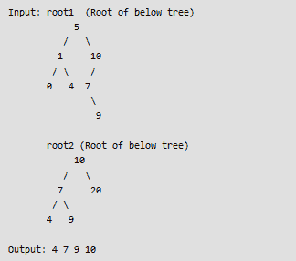

# 打印两个二分搜索法树的公共节点

> 原文:[https://www . geesforgeks . org/print-common-二进制搜索树中的节点/](https://www.geeksforgeeks.org/print-common-nodes-in-two-binary-search-trees/)

给定两个二分搜索法树，在其中找到公共节点。换句话说，找到两个 BST 的交集。

**例:**
[](https://media.geeksforgeeks.org/wp-content/cdn-uploads/tree5.png)

**方法 1(简单解法)**一种简单的方法是在第二棵树中逐个搜索第一棵树的每个节点。该方案的时间复杂度为 O(m * h)，其中 m 是第一棵树的节点数，h 是第二棵树的高度。

**<u>方法二</u> :**

*   **Approach–**如果我们想到另一个问题，其中给我们两个排序数组，我们必须找到它们之间的交集，我们可以使用两个指针技术轻松地做到这一点。现在我们可以很容易地把这个问题转化为上面的问题。我们知道，如果我们将 BST 的有序遍历存储在一个数组中，该数组将按升序排序。所以我们能做的就是简单地对这两棵树进行有序遍历，并将它们存储在两个独立的数组中，然后找到两个数组之间的交集。
*   **算法–**
    1)对第一棵树进行有序遍历，并将遍历结果存储在辅助数组 ar1[]中。参见此处的[。
    2)对第二棵树进行有序遍历，并将遍历存储在辅助数组 ar2[]
    中 3)找到 ar1[]和 ar2[]的交集。详见](https://www.geeksforgeeks.org/merge-two-balanced-binary-search-trees/)[本](https://www.geeksforgeeks.org/union-and-intersection-of-two-sorted-arrays-2/)。
*   **Complexity Analysis:**
    *   **时间复杂度:** O(m+n)。
        这里的‘m’和‘n’分别是第一棵树和第二棵树的节点数，因为我们需要遍历这两棵树。
    *   **辅助空间:**不使用任何数据结构来存储值-: O(m+n)
        原因是我们需要两个单独的数组来存储两棵树的有序遍历。

    **方法 3(线性时间和有限的额外空间)**
    想法是使用[迭代以便遍历](https://www.geeksforgeeks.org/inorder-tree-traversal-without-recursion/)

*   **做法:**
    这里的思路是优化空间。在上面的方法中，我们存储树的所有元素，然后进行比较，但问题是真的有必要存储所有元素吗？我们可以做的是存储树的特定分支(最坏的情况是“树的高度”)，然后开始比较。我们可以取两个栈，在各自的栈中存储树的有序遍历，但是元素的最大数量应该等于树的特定分支。一旦分支结束，我们就开始弹出并比较堆栈的元素。现在如果**top(stack-1)<top(stack-2)**在 top(stack-1)的右分支中可以有更多的元素大于它并且可以等于 top(stack-2)。所以我们插入顶部(堆栈-1)的右分支，直到它等于空。在每个这样的插入结束时，我们有三个条件要检查，然后我们相应地在堆栈中进行插入。

    ```
    if top(stack-1)<top(stack-2)
    root1=root1->right (then do insertions)

    if top(stack-1)>top(stack-2)
    root2=root2->right (then do insertions)

    else
    It's a match

    ```

    ## c++

    ```
    // C++ program of iterative traversal based method to
    // find common elements in two BSTs.
    #include<iostream>
    #include<stack>
    using namespace std;

    // A BST node
    struct Node
    {
        int key;
        struct Node *left, *right;
    };

    // A utility function to create a new node
    Node *newNode(int ele)
    {
        Node *temp = new Node;
        temp->key = ele;
        temp->left = temp->right = NULL;
        return temp;
    }

    // Function two print common elements in given two trees
    void printCommon(Node *root1, Node *root2)
    {
        // Create two stacks for two inorder traversals
        stack<Node *> stack1, s1, s2;

        while (1)
        {
            // push the Nodes of first tree in stack s1
            if (root1)
            {
                s1.push(root1);
                root1 = root1->left;
            }

            // push the Nodes of second tree in stack s2
            else if (root2)
            {
                s2.push(root2);
                root2 = root2->left;
            }

            // Both root1 and root2 are NULL here
            else if (!s1.empty() && !s2.empty())
            {
                root1 = s1.top();
                root2 = s2.top();

                // If current keys in two trees are same
                if (root1->key == root2->key)
                {
                    cout << root1->key << " ";
                    s1.pop();
                    s2.pop();

                    // move to the inorder successor
                    root1 = root1->right;
                    root2 = root2->right;
                }

                else if (root1->key < root2->key)
                {
                    // If Node of first tree is smaller, than that of
                    // second tree, then its obvious that the inorder
                    // successors of current Node can have same value
                    // as that of the second tree Node. Thus, we pop
                    // from s2
                    s1.pop();
                    root1 = root1->right;

                    // root2 is set to NULL, because we need
                    // new Nodes of tree 1
                    root2 = NULL;
                }
                else if (root1->key > root2->key)
                {
                    s2.pop();
                    root2 = root2->right;
                    root1 = NULL;
                }
            }

            // Both roots and both stacks are empty
            else  break;
        }
    }

    // A utility function to do inorder traversal
    void inorder(struct Node *root)
    {
        if (root)
        {
            inorder(root->left);
            cout<<root->key<<" ";
            inorder(root->right);
        }
    }

    /* A utility function to insert a new Node with given key in BST */
    struct Node* insert(struct Node* node, int key)
    {
        /* If the tree is empty, return a new Node */
        if (node == NULL) return newNode(key);

        /* Otherwise, recur down the tree */
        if (key < node->key)
            node->left  = insert(node->left, key);
        else if (key > node->key)
            node->right = insert(node->right, key);

        /* return the (unchanged) Node pointer */
        return node;
    }

    // Driver program
    int main()
    {
        // Create first tree as shown in example
        Node *root1 = NULL;
        root1 = insert(root1, 5);
        root1 = insert(root1, 1);
        root1 = insert(root1, 10);
        root1 = insert(root1,  0);
        root1 = insert(root1,  4);
        root1 = insert(root1,  7);
        root1 = insert(root1,  9);

        // Create second tree as shown in example
        Node *root2 = NULL;
        root2 = insert(root2, 10);
        root2 = insert(root2, 7);
        root2 = insert(root2, 20);
        root2 = insert(root2, 4);
        root2 = insert(root2, 9);

        cout << "Tree 1 : ";
        inorder(root1);
        cout << endl;

        cout << "Tree 2 : ";
        inorder(root2);

        cout << "\nCommon Nodes: ";
        printCommon(root1, root2);

        return 0;
    }
    ```

    ## Java 语言（一种计算机语言,尤用于创建网站)

    ```
    // Java program of iterative traversal based method to 
    // find common elements in two BSTs.
    import java.util.*;
    class GfG { 

    // A BST node 
    static class Node 
    { 
        int key; 
        Node left, right; 
    }

    // A utility function to create a new node 
    static Node newNode(int ele) 
    { 
        Node temp = new Node(); 
        temp.key = ele; 
        temp.left = null;
        temp.right = null; 
        return temp; 
    } 

    // Function two print common elements in given two trees 
    static void printCommon(Node root1, Node root2) 
    { 

        Stack<Node> s1 = new Stack<Node> (); 
        Stack<Node> s2 = new Stack<Node> ();

        while (true) 
        { 
            // push the Nodes of first tree in stack s1 
            if (root1 != null) 
            { 
                s1.push(root1); 
                root1 = root1.left; 
            } 

            // push the Nodes of second tree in stack s2 
            else if (root2 != null) 
            { 
                s2.push(root2); 
                root2 = root2.left; 
            } 

            // Both root1 and root2 are NULL here 
            else if (!s1.isEmpty() && !s2.isEmpty()) 
            { 
                root1 = s1.peek(); 
                root2 = s2.peek(); 

                // If current keys in two trees are same 
                if (root1.key == root2.key) 
                { 
                    System.out.print(root1.key + " "); 
                    s1.pop(); 
                    s2.pop(); 

                    // move to the inorder successor 
                    root1 = root1.right; 
                    root2 = root2.right; 
                } 

                else if (root1.key < root2.key) 
                { 
                    // If Node of first tree is smaller, than that of 
                    // second tree, then its obvious that the inorder 
                    // successors of current Node can have same value 
                    // as that of the second tree Node. Thus, we pop 
                    // from s2 
                    s1.pop(); 
                    root1 = root1.right; 

                    // root2 is set to NULL, because we need 
                    // new Nodes of tree 1 
                    root2 = null; 
                } 
                else if (root1.key > root2.key) 
                { 
                    s2.pop(); 
                    root2 = root2.right; 
                    root1 = null; 
                } 
            } 

            // Both roots and both stacks are empty 
            else break; 
        } 
    } 

    // A utility function to do inorder traversal 
    static void inorder(Node root) 
    { 
        if (root != null) 
        { 
            inorder(root.left); 
            System.out.print(root.key + " "); 
            inorder(root.right); 
        } 
    } 

    /* A utility function to insert a new Node with given key in BST */
    static Node insert(Node node, int key) 
    { 
        /* If the tree is empty, return a new Node */
        if (node == null) return newNode(key); 

        /* Otherwise, recur down the tree */
        if (key < node.key) 
            node.left = insert(node.left, key); 
        else if (key > node.key) 
            node.right = insert(node.right, key); 

        /* return the (unchanged) Node pointer */
        return node; 
    } 

    // Driver program 
    public static void main(String[] args) 
    { 
        // Create first tree as shown in example 
        Node root1 = null; 
        root1 = insert(root1, 5); 
        root1 = insert(root1, 1); 
        root1 = insert(root1, 10); 
        root1 = insert(root1, 0); 
        root1 = insert(root1, 4); 
        root1 = insert(root1, 7); 
        root1 = insert(root1, 9); 

        // Create second tree as shown in example 
        Node root2 = null; 
        root2 = insert(root2, 10); 
        root2 = insert(root2, 7); 
        root2 = insert(root2, 20); 
        root2 = insert(root2, 4); 
        root2 = insert(root2, 9); 

        System.out.print("Tree 1 : " + "\n"); 
        inorder(root1); 
        System.out.println();
        System.out.print("Tree 2 : " + "\n"); 
        inorder(root2); 
        System.out.println();
        System.out.println("Common Nodes: ");

        printCommon(root1, root2); 

    }
    } 
    ```

    ## 蟒蛇 3

    ```
    # Python3 program of iterative traversal based 
    # method to find common elements in two BSTs. 

    # A utility function to create a new node 
    class newNode:
        def __init__(self, key):
            self.key = key
            self.left = self.right = None

    # Function two print common elements 
    # in given two trees 
    def printCommon(root1, root2):

        # Create two stacks for two inorder
        # traversals 
        s1 = []
        s2 = []

        while 1:

            # append the Nodes of first 
            # tree in stack s1 
            if root1:
                s1.append(root1)
                root1 = root1.left

            # append the Nodes of second tree
            # in stack s2 
            elif root2:
                s2.append(root2)
                root2 = root2.left

            # Both root1 and root2 are NULL here 
            elif len(s1) != 0 and len(s2) != 0:
                root1 = s1[-1] 
                root2 = s2[-1] 

                # If current keys in two trees are same 
                if root1.key == root2.key:
                    print(root1.key, end = " ")
                    s1.pop(-1) 
                    s2.pop(-1)

                    # move to the inorder successor 
                    root1 = root1.right 
                    root2 = root2.right

                elif root1.key < root2.key:

                    # If Node of first tree is smaller, than 
                    # that of second tree, then its obvious 
                    # that the inorder successors of current 
                    # Node can have same value as that of the 
                    # second tree Node. Thus, we pop from s2 
                    s1.pop(-1)
                    root1 = root1.right 

                    # root2 is set to NULL, because we need 
                    # new Nodes of tree 1 
                    root2 = None
                elif root1.key > root2.key:
                    s2.pop(-1)
                    root2 = root2.right 
                    root1 = None

            # Both roots and both stacks are empty 
            else:
                break

    # A utility function to do inorder traversal 
    def inorder(root):
        if root:
            inorder(root.left) 
            print(root.key, end = " ")
            inorder(root.right)

    # A utility function to insert a new Node
    # with given key in BST 
    def insert(node, key):

        # If the tree is empty, return a new Node 
        if node == None:
            return newNode(key) 

        # Otherwise, recur down the tree 
        if key < node.key: 
            node.left = insert(node.left, key) 
        elif key > node.key: 
            node.right = insert(node.right, key)

        # return the (unchanged) Node pointer 
        return node

    # Driver Code 
    if __name__ == '__main__':

        # Create first tree as shown in example 
        root1 = None
        root1 = insert(root1, 5) 
        root1 = insert(root1, 1) 
        root1 = insert(root1, 10) 
        root1 = insert(root1, 0) 
        root1 = insert(root1, 4) 
        root1 = insert(root1, 7) 
        root1 = insert(root1, 9) 

        # Create second tree as shown in example 
        root2 = None
        root2 = insert(root2, 10) 
        root2 = insert(root2, 7) 
        root2 = insert(root2, 20) 
        root2 = insert(root2, 4) 
        root2 = insert(root2, 9)

        print("Tree 1 : ") 
        inorder(root1) 
        print()

        print("Tree 2 : ")
        inorder(root2)
        print()

        print("Common Nodes: ") 
        printCommon(root1, root2)

    # This code is contributed by PranchalK
    ```

    ## c#

    ```
    using System;
    using System.Collections.Generic;

    // C# program of iterative traversal based method to 
    // find common elements in two BSTs. 
    public class GfG
    {

    // A BST node 
    public class Node
    {
        public int key;
        public Node left, right;
    }

    // A utility function to create a new node 
    public static Node newNode(int ele)
    {
        Node temp = new Node();
        temp.key = ele;
        temp.left = null;
        temp.right = null;
        return temp;
    }

    // Function two print common elements in given two trees 
    public static void printCommon(Node root1, Node root2)
    {
        Stack<Node> s1 = new Stack<Node> ();
        Stack<Node> s2 = new Stack<Node> ();

        while (true)
        {
            // push the Nodes of first tree in stack s1 
            if (root1 != null)
            {
                s1.Push(root1);
                root1 = root1.left;
            }

            // push the Nodes of second tree in stack s2 
            else if (root2 != null)
            {
                s2.Push(root2);
                root2 = root2.left;
            }

            // Both root1 and root2 are NULL here 
            else if (s1.Count > 0 && s2.Count > 0)
            {
                root1 = s1.Peek();
                root2 = s2.Peek();

                // If current keys in two trees are same 
                if (root1.key == root2.key)
                {
                    Console.Write(root1.key + " ");
                    s1.Pop();
                    s2.Pop();

                    // move to the inorder successor 
                    root1 = root1.right;
                    root2 = root2.right;
                }

                else if (root1.key < root2.key)
                {
                    // If Node of first tree is smaller, than that of 
                    // second tree, then its obvious that the inorder 
                    // successors of current Node can have same value 
                    // as that of the second tree Node. Thus, we pop 
                    // from s2 
                    s1.Pop();
                    root1 = root1.right;

                    // root2 is set to NULL, because we need 
                    // new Nodes of tree 1 
                    root2 = null;
                }
                else if (root1.key > root2.key)
                {
                    s2.Pop();
                    root2 = root2.right;
                    root1 = null;
                }
            }

            // Both roots and both stacks are empty 
            else
            {
                break;
            }
        }
    }

    // A utility function to do inorder traversal 
    public static void inorder(Node root)
    {
        if (root != null)
        {
            inorder(root.left);
            Console.Write(root.key + " ");
            inorder(root.right);
        }
    }

    /* A utility function to insert a new Node with given key in BST */
    public static Node insert(Node node, int key)
    {
        /* If the tree is empty, return a new Node */
        if (node == null)
        {
            return newNode(key);
        }

        /* Otherwise, recur down the tree */
        if (key < node.key)
        {
            node.left = insert(node.left, key);
        }
        else if (key > node.key)
        {
            node.right = insert(node.right, key);
        }

        /* return the (unchanged) Node pointer */
        return node;
    }

    // Driver program 
    public static void Main(string[] args)
    {
        // Create first tree as shown in example 
        Node root1 = null;
        root1 = insert(root1, 5);
        root1 = insert(root1, 1);
        root1 = insert(root1, 10);
        root1 = insert(root1, 0);
        root1 = insert(root1, 4);
        root1 = insert(root1, 7);
        root1 = insert(root1, 9);

        // Create second tree as shown in example 
        Node root2 = null;
        root2 = insert(root2, 10);
        root2 = insert(root2, 7);
        root2 = insert(root2, 20);
        root2 = insert(root2, 4);
        root2 = insert(root2, 9);

        Console.Write("Tree 1 : " + "\n"); 
        inorder(root1); 
        Console.WriteLine(); 
        Console.Write("Tree 2 : " + "\n"); 
        inorder(root2); 
        Console.WriteLine(); 
        Console.Write("Common Nodes: " + "\n"); 

        printCommon(root1, root2);

    }
    }

    // This code is contributed by Shrikant13
    ```

    **输出:**

    ```
    4 7 9 10
    ```

*   **Complexity Analysis:**
    *   **时间复杂度:** O(n+m)。
        这里的‘m’和‘n’分别是第一棵树和第二棵树的节点数，因为我们需要遍历这两棵树。
    *   **辅助空间:**使用堆栈存储值，最多元素=“树的高度”:O(h1+h2)

    本文由 [**Ekta Goel**](https://www.linkedin.com/pub/ekta-goel/75/12a/3a6) 供稿。如果你发现任何不正确的地方，或者你想分享更多关于上面讨论的话题的信息，请写评论。