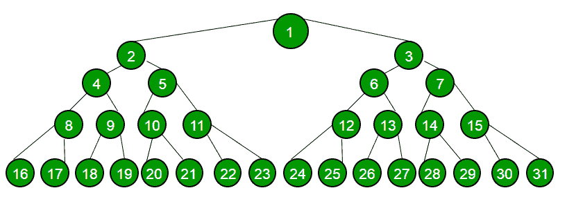

# 交替顺序打印二叉树各层的极端节点

> 原文:[https://www . geesforgeks . org/print-extreme-二进制树的每一级节点的交替顺序/](https://www.geeksforgeeks.org/print-extreme-nodes-of-each-level-of-binary-tree-in-alternate-order/)

给定一棵二叉树，以交替的顺序打印每一级的极端角落的节点。
示例:



对于上面的树， 输出可以是
**1 2 7 8 31**
–打印一级最右节点
–打印二级最左节点
–打印三级最右节点
–打印四级最左节点
–打印五级最右节点
或
**1 3 4 15 16**
–打印一级最左节点
–打印二级最右节点
–打印 第三级
最左边节点–打印第四级
最右边节点–打印第五级
最左边节点

这个想法是逐层遍历树。对于每个级别，我们计算其中的节点数，并根据布尔标志的值打印其最左边或最右边的节点。我们将当前级别的所有节点出队，将下一级别的所有节点入队，并在切换级别时反转布尔标志的值。
以下是上述思路的实现–

## C++

```
/* C++ program to print nodes of extreme corners
of each level in alternate order */
#include <bits/stdc++.h>
using namespace std;

/* A binary tree node has data, pointer to left child
and a pointer to right child */
struct Node
{
    int data;
    Node *left, *right;
};

/* Helper function that allocates a new node with the
given data and NULL left and right pointers. */
Node* newNode(int data)
{
    Node* node = new Node;
    node->data = data;
    node->right = node->left = NULL;
    return node;
}

/* Function to print nodes of extreme corners
of each level in alternate order */
void printExtremeNodes(Node* root)
{
    if (root == NULL)
        return;

    // Create a queue and enqueue left and right
    // children of root
    queue<Node*> q;
    q.push(root);

    // flag to indicate whether leftmost node or
    // the rightmost node has to be printed
    bool flag = false;
    while (!q.empty())
    {
        // nodeCount indicates number of nodes
        // at current level.
        int nodeCount = q.size();
        int n = nodeCount;

        // Dequeue all nodes of current level
        // and Enqueue all nodes of next level
        while (n--)
        {
            Node* curr = q.front();

            // Enqueue left child
            if (curr->left)
                q.push(curr->left);

            // Enqueue right child
            if (curr->right)
                q.push(curr->right);

            // Dequeue node
            q.pop();

            // if flag is true, print leftmost node
            if (flag && n == nodeCount - 1)
                cout << curr->data << " ";

            // if flag is false, print rightmost node
            if (!flag && n == 0)
                cout << curr->data << " ";
        }
        // invert flag for next level
        flag = !flag;
    }
}

/* Driver program to test above functions */
int main()
{
    // Binary Tree of Height 4
    Node* root = newNode(1);

    root->left = newNode(2);
    root->right = newNode(3);

    root->left->left  = newNode(4);
    root->left->right = newNode(5);
    root->right->right = newNode(7);

    root->left->left->left  = newNode(8);
    root->left->left->right  = newNode(9);
    root->left->right->left  = newNode(10);
    root->left->right->right  = newNode(11);
    root->right->right->left  = newNode(14);
    root->right->right->right  = newNode(15);

    root->left->left->left->left  = newNode(16);
    root->left->left->left->right  = newNode(17);
    root->right->right->right->right  = newNode(31);

    printExtremeNodes(root);

    return 0;
}
```

## Java 语言(一种计算机语言，尤用于创建网站)

```
// Java program to print nodes of extreme corners
//of each level in alternate order
import java.util.*;

class GFG
{

// A binary tree node has data, pointer to left child
//and a pointer to right child /
static class Node
{
    int data;
    Node left, right;
};

// Helper function that allocates a new node with the
//given data and null left and right pointers. /
static Node newNode(int data)
{
    Node node = new Node();
    node.data = data;
    node.right = node.left = null;
    return node;
}

// Function to print nodes of extreme corners
//of each level in alternate order
static void printExtremeNodes(Node root)
{
    if (root == null)
        return;

    // Create a queue and enqueue left and right
    // children of root
    Queue<Node> q = new LinkedList<Node>();
    q.add(root);

    // flag to indicate whether leftmost node or
    // the rightmost node has to be printed
    boolean flag = false;
    while (q.size()>0)
    {
        // nodeCount indicates number of nodes
        // at current level.
        int nodeCount = q.size();
        int n = nodeCount;

        // Dequeue all nodes of current level
        // and Enqueue all nodes of next level
        while (n-->0)
        {
            Node curr = q.peek();

            // Enqueue left child
            if (curr.left!=null)
                q.add(curr.left);

            // Enqueue right child
            if (curr.right!=null)
                q.add(curr.right);

            // Dequeue node
            q.remove();

            // if flag is true, print leftmost node
            if (flag && n == nodeCount - 1)
                System.out.print( curr.data + " ");

            // if flag is false, print rightmost node
            if (!flag && n == 0)
                System.out.print( curr.data + " ");
        }

        // invert flag for next level
        flag = !flag;
    }
}

// Driver code
public static void main(String args[])
{
    // Binary Tree of Height 4
    Node root = newNode(1);

    root.left = newNode(2);
    root.right = newNode(3);

    root.left.left = newNode(4);
    root.left.right = newNode(5);
    root.right.right = newNode(7);

    root.left.left.left = newNode(8);
    root.left.left.right = newNode(9);
    root.left.right.left = newNode(10);
    root.left.right.right = newNode(11);
    root.right.right.left = newNode(14);
    root.right.right.right = newNode(15);

    root.left.left.left.left = newNode(16);
    root.left.left.left.right = newNode(17);
    root.right.right.right.right = newNode(31);

    printExtremeNodes(root);
}
}

// This code is contributed by Arnab Kundu
```

## 计算机编程语言

```
# Python program to print nodes of extreme corners
# of each level in alternate order

# Utility class to create a node
class Node:
    def __init__(self, key):
        self.data = key
        self.left = self.right = None

# Utility function to create a tree node
def newNode( data):

    temp = Node(0)
    temp.data = data
    temp.left = temp.right = None
    return temp

# Function to print nodes of extreme corners
# of each level in alternate order
def printExtremeNodes( root):

    if (root == None):
        return

    # Create a queue and enqueue left and right
    # children of root
    q = []
    q.append(root)

    # flag to indicate whether leftmost node or
    # the rightmost node has to be printed
    flag = False
    while (len(q) > 0):

        # nodeCount indicates number of nodes
        # at current level.
        nodeCount = len(q)
        n = nodeCount

        # Dequeue all nodes of current level
        # and Enqueue all nodes of next level
        while (n > 0):
            n = n - 1
            curr = q[0]

            # Enqueue left child
            if (curr.left != None):
                q.append(curr.left)

            # Enqueue right child
            if (curr.right != None):
                q.append(curr.right)

            # Dequeue node
            q.pop(0)

            # if flag is true, print leftmost node
            if (flag and n == nodeCount - 1):
                print( curr.data , end=" ")

            # if flag is false, print rightmost node
            if (not flag and n == 0):
                print( curr.data ,end= " ")

        # invert flag for next level
        flag = not flag

# Driver program to test above functions

# Binary Tree of Height 4
root = newNode(1)

root.left = newNode(2)
root.right = newNode(3)

root.left.left = newNode(4)
root.left.right = newNode(5)
root.right.right = newNode(7)

root.left.left.left = newNode(8)
root.left.left.right = newNode(9)
root.left.right.left = newNode(10)
root.left.right.right = newNode(11)
root.right.right.left = newNode(14)
root.right.right.right = newNode(15)

root.left.left.left.left = newNode(16)
root.left.left.left.right = newNode(17)
root.right.right.right.right = newNode(31)

printExtremeNodes(root)

# This code is contributed by Arnab Kundu
```

## C#

```
// C# program to print nodes of extreme corners
//of each level in alternate order
using System;
using System.Collections.Generic;

class GFG
{

// A binary tree node has data, pointer to left child
//and a pointer to right child /
public class Node
{
    public int data;
    public Node left, right;
};

// Helper function that allocates a new node with the
//given data and null left and right pointers. /
static Node newNode(int data)
{
    Node node = new Node();
    node.data = data;
    node.right = node.left = null;
    return node;
}

// Function to print nodes of extreme corners
//of each level in alternate order
static void printExtremeNodes(Node root)
{
    if (root == null)
        return;

    // Create a queue and enqueue left and right
    // children of root
    Queue<Node> q = new Queue<Node>();
    q.Enqueue(root);

    // flag to indicate whether leftmost node or
    // the rightmost node has to be printed
    Boolean flag = false;
    while (q.Count > 0)
    {
        // nodeCount indicates number of nodes
        // at current level.
        int nodeCount = q.Count;
        int n = nodeCount;

        // Dequeue all nodes of current level
        // and Enqueue all nodes of next level
        while (n-->0)
        {
            Node curr = q.Peek();

            // Enqueue left child
            if (curr.left != null)
                q.Enqueue(curr.left);

            // Enqueue right child
            if (curr.right != null)
                q.Enqueue(curr.right);

            // Dequeue node
            q.Dequeue();

            // if flag is true, print leftmost node
            if (flag && n == nodeCount - 1)
                Console.Write( curr.data + " ");

            // if flag is false, print rightmost node
            if (!flag && n == 0)
                Console.Write( curr.data + " ");
        }

        // invert flag for next level
        flag = !flag;
    }
}

// Driver code
public static void Main(String []args)
{
    // Binary Tree of Height 4
    Node root = newNode(1);

    root.left = newNode(2);
    root.right = newNode(3);

    root.left.left = newNode(4);
    root.left.right = newNode(5);
    root.right.right = newNode(7);

    root.left.left.left = newNode(8);
    root.left.left.right = newNode(9);
    root.left.right.left = newNode(10);
    root.left.right.right = newNode(11);
    root.right.right.left = newNode(14);
    root.right.right.right = newNode(15);

    root.left.left.left.left = newNode(16);
    root.left.left.left.right = newNode(17);
    root.right.right.right.right = newNode(31);

    printExtremeNodes(root);
}
}

// This code is contributed by Rajput-Ji
```

## java 描述语言

```
<script>

// JavaScript program to print nodes of extreme corners
//of each level in alternate order

// A binary tree node has data, pointer to left child
//and a pointer to right child /
class Node
{
  constructor()
  {
    this.data = 0;
    this.left = null;
    this.right = null;
  }
};

// Helper function that allocates a new node with the
//given data and null left and right pointers. /
function newNode(data)
{
    var node = new Node();
    node.data = data;
    node.right = node.left = null;
    return node;
}

// Function to print nodes of extreme corners
//of each level in alternate order
function printExtremeNodes(root)
{
    if (root == null)
        return;

    // Create a queue and enqueue left and right
    // children of root
    var q = [];
    q.push(root);

    // flag to indicate whether leftmost node or
    // the rightmost node has to be printed
    var flag = false;
    while (q.length > 0)
    {
        // nodeCount indicates number of nodes
        // at current level.
        var nodeCount = q.length;
        var n = nodeCount;

        // Dequeue all nodes of current level
        // and push all nodes of next level
        while (n-->0)
        {
            var curr = q[0];

            // push left child
            if (curr.left != null)
                q.push(curr.left);

            // push right child
            if (curr.right != null)
                q.push(curr.right);

            // Dequeue node
            q.shift();

            // if flag is true, print leftmost node
            if (flag && n == nodeCount - 1)
                document.write( curr.data + " ");

            // if flag is false, print rightmost node
            if (!flag && n == 0)
                document.write( curr.data + " ");
        }

        // invert flag for next level
        flag = !flag;
    }
}

// Driver code
// Binary Tree of Height 4
var root = newNode(1);
root.left = newNode(2);
root.right = newNode(3);
root.left.left = newNode(4);
root.left.right = newNode(5);
root.right.right = newNode(7);
root.left.left.left = newNode(8);
root.left.left.right = newNode(9);
root.left.right.left = newNode(10);
root.left.right.right = newNode(11);
root.right.right.left = newNode(14);
root.right.right.right = newNode(15);
root.left.left.left.left = newNode(16);
root.left.left.left.right = newNode(17);
root.right.right.right.right = newNode(31);
printExtremeNodes(root);

</script>
```

**输出:**

```
1 2 7 8 31
```

**上述解的时间复杂度**为 O(n)，其中 n 为给定二叉树中的节点总数。

**练习–**从下到上交替打印每一级的最角节点。
本文由**阿迪蒂亚·戈尔**供稿。如果你喜欢 GeeksforGeeks 并想投稿，你也可以使用[write.geeksforgeeks.org](https://write.geeksforgeeks.org)写一篇文章或者把你的文章邮寄到 review-team@geeksforgeeks.org。看到你的文章出现在极客博客主页上，帮助其他极客。
如果发现有不正确的地方，或者想分享更多关于上述话题的信息，请写评论。