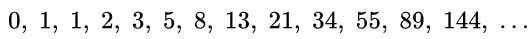

# 使用 2 个变量打印斐波那契数列

> 原文:[https://www . geesforgeks . org/print-Fibonacci-sequence-using-2-variables/](https://www.geeksforgeeks.org/print-fibonacci-sequence-using-2-variables/)

打印[斐波那契数列](https://www.geeksforgeeks.org/program-for-nth-fibonacci-number/)。第一个斐波那契数列是:



## C++

```
// Simple CPP Program to print Fibonacci
// sequence
#include <iostream>
using std::cout;
void fib(int n)
{
    int a = 0, b = 1, c;
    if (n >= 0)
        cout << a << " ";
    if (n >= 1)
        cout << b << " ";
    for (int i = 2; i <= n; i++) {
        c = a + b;
        cout << c << " ";
        a = b;
        b = c;
    }
}

// Driver code
int main()
{
    fib(9);
    return 0;
}
```

## Java 语言(一种计算机语言，尤用于创建网站)

```
// Simple Java Program to print
// Fibonacci  sequence
import java.io.*;
class GFG {

static void fib(int n)
{
    int a = 0, b = 1, c;
    if (n >= 0)
        System.out.print( a + " ");
    if (n >= 1)
        System.out.print( b + " ");
    for (int i = 2; i <= n; i++)
    {
        c = a + b;
        System.out.print( c + " ");
        a = b;
        b = c;
    }
}

    // Driver code
    public static void main (String[] args)
    {
            fib(9);
    }
}

// This code is contributed by anuj_67.
```

## 蟒蛇 3

```
# Simple Python3 Program to
# print Fibonacci sequence

def fib(n):
    a = 0
    b = 1
    if (n >= 0):
        print(a, end=' ')
    if (n >= 1):
        print(b, end=' ')
    for i in range(2, n+1):
        c = a + b
        print(c, end=' ')
        a = b
        b = c

# Driver code
fib(9)

# This code is contributed
# by Prasad Kshirsagar
```

## C#

```
// Simple C# Program to print
// Fibonacci sequence
using System;
class GFG
{
static void fib(int n)
{
    int a = 0, b = 1, c;
    if (n >= 0)
        Console.Write( a + " ");
    if (n >= 1)
        Console.Write( b + " ");
    for (int i = 2; i <= n; i++)
    {
        c = a + b;
        Console.Write( c + " ");
        a = b;
        b = c;
    }
}

// Driver code
public static void Main ()
{
        fib(9);
}
}

// This code is contributed by anuj_67.
```

## 服务器端编程语言（Professional Hypertext Preprocessor 的缩写）

```
<?php
// Simple php Program to print
// Fibonacci sequence

function fib( $n)
{
    $a = 0; $b = 1; $c;
    if ($n >= 0)
        echo $a , " ";
    if ($n >= 1)
        echo $b , " ";
    for ( $i = 2; $i <= $n; $i++)
    {
        $c = $a + $b;
        echo $c , " ";
        $a = $b;
        $b = $c;
    }
}

// Driver code
fib(9);

// This code is contributed by anuj_67.
?>
```

## java 描述语言

```
<script>
    // Simple Javascript Program to print Fibonacci sequence

    function fib(n)
    {
        let a = 0, b = 1, c;
        if (n >= 0)
            document.write( a + " ");
        if (n >= 1)
            document.write( b + " ");
        for (let i = 2; i <= n; i++)
        {
            c = a + b;
            document.write( c + " ");
            a = b;
            b = c;
        }
    }

    fib(9);

// This code is contributed by divyeshrabadiya07.
</script>
```

**Output:** 

```
0 1 1 2 3 5 8 13 21 34
```