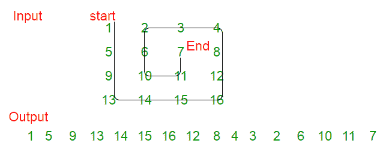

# 以逆时针螺旋形式打印给定矩阵

> 原文： [https://www.geeksforgeeks.org/print-given-matrix-counter-clock-wise-spiral-form/](https://www.geeksforgeeks.org/print-given-matrix-counter-clock-wise-spiral-form/)

给定 2D 数组，以逆时针螺旋形式打印。 请参阅以下示例。

**示例**：

```
Input:
        1    2   3   4
        5    6   7   8
        9   10  11  12
        13  14  15  16
Output: 
1 5 9 13 14 15 16 12 8 4 3 2 6 10 11 7 

Input:
        1   2   3   4  5   6
        7   8   9  10  11  12
        13  14  15 16  17  18
Output: 
1 7 13 14 15 16 17 18 12 6 5 4 3 2 8 9 10 11 

```

**说明**：



下面是实现：

## C++

```
// C++ implementation to print 
// the counter clock wise 
// spiral traversal of matrix 
#include <bits/stdc++.h> 
using namespace std; 
  
#define R 4 
#define C 4 
  
// function to print the 
// required traversal 
void counterClockspiralPrint(int m,  
                             int n,  
                             int arr[R][C]) 
{ 
    int i, k = 0, l = 0; 
  
    //  k - starting row index 
    //    m - ending row index 
    //    l - starting column index 
    //    n - ending column index 
    //    i - iterator  
  
    // initialize the count 
    int cnt = 0; 
  
    // total number of  
    // elements in matrix 
    int total = m * n; 
  
    while (k < m && l < n)  
    { 
        if (cnt == total) 
            break; 
  
        // Print the first column  
        // from the remaining columns 
        for (i = k; i < m; ++i) 
        { 
            cout << arr[i][l] << " "; 
            cnt++; 
        } 
        l++; 
  
        if (cnt == total) 
            break; 
  
        // Print the last row from 
        // the remaining rows  
        for (i = l; i < n; ++i)  
        { 
            cout << arr[m - 1][i] << " "; 
            cnt++; 
        } 
        m--; 
  
        if (cnt == total) 
            break; 
  
        // Print the last column  
        // from the remaining columns  
        if (k < m)  
        { 
            for (i = m - 1; i >= k; --i)  
            { 
                cout << arr[i][n - 1] << " "; 
                cnt++; 
            } 
            n--; 
        } 
  
        if (cnt == total) 
            break; 
  
        // Print the first row  
        // from the remaining rows  
        if (l < n)  
        { 
            for (i = n - 1; i >= l; --i)  
            { 
                cout << arr[k][i] << " "; 
                cnt++; 
            } 
            k++; 
        } 
    } 
} 
  
// Driver Code 
int main() 
{ 
    int arr[R][C] = {{ 1, 2, 3, 4 }, 
                     { 5, 6, 7, 8 }, 
                     { 9, 10, 11, 12 }, 
                     { 13, 14, 15, 16 }}; 
    counterClockspiralPrint(R, C, arr); 
    return 0; 
}
```

## Java

```
// Java implementation to print 
// the counter clock wise 
// spiral traversal of matrix 
import java.io.*; 
  
class GFG  
{ 
    static int R = 4; 
    static int C = 4; 
  
    // function to print the 
    // required traversal 
    static void counterClockspiralPrint(int m,  
                                        int n,  
                                        int arr[][]) 
    { 
        int i, k = 0, l = 0; 
  
    /* k - starting row index 
        m - ending row index 
        l - starting column index 
        n - ending column index 
        i - iterator */
  
        // initialize the count 
        int cnt = 0; 
  
        // total number of 
        // elements in matrix 
        int total = m * n; 
  
        while (k < m && l < n)  
        { 
            if (cnt == total) 
                break; 
  
            // Print the first column  
            // from the remaining columns 
            for (i = k; i < m; ++i) 
            { 
                System.out.print(arr[i][l] + " "); 
                cnt++; 
            } 
            l++; 
  
            if (cnt == total) 
                break; 
  
            // Print the last row from 
            // the remaining rows  
            for (i = l; i < n; ++i)  
            { 
                System.out.print(arr[m - 1][i] + " "); 
                cnt++; 
            } 
            m--; 
  
            if (cnt == total) 
                break; 
  
            // Print the last column  
            // from the remaining columns  
            if (k < m)  
            { 
                for (i = m - 1; i >= k; --i)  
                { 
                    System.out.print(arr[i][n - 1] + " "); 
                    cnt++; 
                } 
                n--; 
            } 
  
            if (cnt == total) 
                break; 
  
            // Print the first row  
            // from the remaining rows 
            if (l < n)  
            { 
                for (i = n - 1; i >= l; --i)  
                { 
                    System.out.print(arr[k][i] + " "); 
                    cnt++; 
                } 
                k++; 
            } 
        } 
    } 
  
// Driver Code 
public static void main(String[] args) 
{ 
    int arr[][] = { { 1, 2, 3, 4 }, 
                    { 5, 6, 7, 8 }, 
                    { 9, 10, 11, 12 }, 
                    { 13, 14, 15, 16 } }; 
      
    // Function calling              
    counterClockspiralPrint(R, C, arr); 
} 
} 
  
// This code is contributed by vt_m
```

## Python3

```
# Python3 implementation to print 
# the counter clock wise 
# spiral traversal of matrix 
R = 4
C = 4
  
# Function to print  
# the required traversal 
def counterClockspiralPrint(m, n, arr) : 
    k = 0; l = 0
      
    # k - starting row index 
    # m - ending row index 
    # l - starting column index 
    # n - ending column index 
    # i - iterator  
  
    # initialize the count 
    cnt = 0
  
    # total number of  
    # elements in matrix 
    total = m * n 
  
    while (k < m and l < n) : 
        if (cnt == total) : 
            break
  
        # Print the first column  
        # from the remaining columns  
        for i in range(k, m) : 
            print(arr[i][l], end = " ") 
            cnt += 1
          
        l += 1
  
        if (cnt == total) : 
            break
  
        # Print the last row from 
        # the remaining rows  
        for i in range (l, n) : 
            print( arr[m - 1][i], end = " ") 
            cnt += 1
          
        m -= 1
          
        if (cnt == total) : 
            break
  
        # Print the last column   
        # from the remaining columns  
        if (k < m) : 
            for i in range(m - 1, k - 1, -1) : 
                print(arr[i][n - 1], end = " ") 
                cnt += 1
            n -= 1
  
        if (cnt == total) : 
            break
  
        # Print the first row  
        # from the remaining rows  
        if (l < n) : 
            for i in range(n - 1, l - 1, -1) : 
                print( arr[k][i], end = " ") 
                cnt += 1
                  
            k += 1
              
  
# Driver Code 
arr = [ [ 1, 2, 3, 4 ], 
        [ 5, 6, 7, 8 ], 
        [ 9, 10, 11, 12 ], 
        [ 13, 14, 15, 16 ] ] 
          
counterClockspiralPrint(R, C, arr) 
  
# This code is contributed by Nikita Tiwari
```

## C#

```
// C# implementation to print 
// the counter clock wise 
// spiral traversal of matrix; 
using System; 
  
class GFG  
{ 
    static int R = 4; 
    static int C = 4; 
  
    // function to print the required traversal 
    static void counterClockspiralPrint(int m,  
                                        int n,  
                                        int[,] arr) 
    { 
        int i, k = 0, l = 0; 
  
        // k - starting row index 
        // m - ending row index 
        // l - starting column index 
        // n - ending column index 
        // i - iterator 
  
        // initialize the count 
        int cnt = 0; 
  
        // total number of elements in matrix 
        int total = m * n; 
  
        while (k < m && l < n)  
        { 
            if (cnt == total) 
                break; 
  
            // Print the first column from  
            // the remaining columns 
            for (i = k; i < m; ++i)  
            { 
                Console.Write(arr[i,l] + " "); 
                cnt++; 
            } 
            l++; 
  
            if (cnt == total) 
                break; 
  
            // Print the last row from 
            // the remaining rows  
            for (i = l; i < n; ++i) 
            { 
                Console.Write(arr[m - 1, i] + " "); 
                cnt++; 
            } 
            m--; 
  
            if (cnt == total) 
                break; 
  
            // Print the last column from  
            // the remaining columns 
            if (k < m) { 
                for (i = m - 1; i >= k; --i) 
                { 
                    Console.Write(arr[i, n - 1] + " "); 
                    cnt++; 
                } 
                n--; 
            } 
  
            if (cnt == total) 
                break; 
  
            // Print the first row from 
            // the remaining rows  
            if (l < n)  
            { 
                for (i = n - 1; i >= l; --i) 
                { 
                    Console.Write(arr[k, i] + " "); 
                    cnt++; 
                } 
                k++; 
            } 
        } 
    } 
  
// Driver code 
public static void Main() 
{ 
    int[,] arr =new int[,] {{1, 2, 3, 4}, 
                            {5, 6, 7, 8}, 
                            {9, 10, 11, 12}, 
                            {13, 14, 15, 16}}; 
      
    // Function calling      
    counterClockspiralPrint(R, C, arr); 
} 
} 
  
// This code is contributed by KRV.
```

## PHP

```
<?php 
// PHP implementation to print 
// the counter clock wise 
// spiral traversal of matrix 
  
$R = 4; 
$C = 4; 
  
// function to print  
// the required traversal 
function counterClockspiralPrint($m, $n,  
                                 $arr) 
{ 
    $i; $k = 0; $l = 0; 
  
    /* k - starting row index 
        m - ending row index 
        l - starting column index 
        n - ending column index 
        i - iterator */
  
    // initialize the count 
    $cnt = 0; 
  
    // total number of  
    // elements in matrix 
    $total = $m * $n; 
  
    while ($k < $m and $l < $n)  
    { 
        if ($cnt == $total) 
            break; 
  
        // Print the first column  
        // from the remaining columns  
        for ($i = $k; $i < $m; ++$i) 
        { 
            echo $arr[$i][$l] ," "; 
            $cnt++; 
        } 
        $l++; 
  
        if ($cnt == $total) 
            break; 
  
        // Print the last row from  
        // the remaining rows  
        for ($i = $l; $i < $n; ++$i)  
        { 
            echo $arr[$m - 1][$i] , " "; 
            $cnt++; 
        } 
        $m--; 
  
        if ($cnt == $total) 
            break; 
  
        // Print the last column  
        // from the remaining columns 
        if ($k < $m)  
        { 
            for ($i = $m - 1; $i >= $k; --$i)  
            { 
                echo $arr[$i][$n - 1] , " "; 
                $cnt++; 
            } 
            $n--; 
        } 
  
        if ($cnt == $total) 
            break; 
  
        // Print the first row  
        // from the remaining rows  
        if ($l < $n) { 
            for ($i = $n - 1; $i >= $l; --$i)  
            { 
                echo $arr[$k][$i] , " "; 
                $cnt++; 
            } 
            $k++; 
        } 
    } 
} 
  
// Driver Code 
global $R,$C; 
    $arr = array(array( 1, 2, 3, 4 ), 
                 array( 5, 6, 7, 8 ), 
                 array( 9, 10, 11, 12 ), 
                 array( 13, 14, 15, 16 )); 
echo counterClockspiralPrint($R, $C, $arr); 
  
// This code is contributed by anuj_67. 
?>
```

输出：

```
1 5 9 13 14 15 16 12 8 4 3 2 6 10 11 7  
```

时间复杂度：`O(mn)`。

替代实现：

## Python

```
# Python3 implementation to print 
# the counter clock wise 
# spiral traversal of matrix 
   
#function to print Matrix in CounterClockwise 
def counterClockspiralPrint(Matrix):  
    size = len(Matrix) 
    flag = 0
    k, i = 0, size 
  
    # Print all layers one by one 
    while(i > 0): 
  
        # Print First Column of Current Layer 
        for j in range(flag,i): 
            print(Matrix[j][k], end = ' ') 
        i = i - 1 
        k = j 
  
        # Print bottom row and last column 
        # of current layer 
        if (i > 0): 
            for j in range(size - i,i + 1): 
                print(Matrix[k][j], end = ' ') 
            for j in range(k-1,size-i-2,-1): 
                print(Matrix[j][k], end = ' ') 
        else: break
        k = j 
        i = i-1
  
        # Print top row of current layer    
        if (i > 0):  
            for j in range(i,size - i-2,-1): 
                print(Matrix[k][j], end = ' ') 
            k,i = k+1,i+1
            flag = flag + 1
        else: break
       
# Driver code 
arr = [ [ 1, 2, 3, 4 ], 
        [ 5, 6, 7, 8 ], 
        [ 9, 10, 11, 12 ], 
        [ 13, 14, 15, 16 ] ] 
   
counterClockspiralPrint(arr) 
   
# This code is contributed by Srihari R
```

