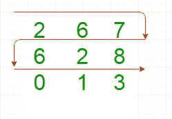

# 以之字形打印给定矩阵

> 原文:[https://www . geesforgeks . org/print-given-matrix-zigzag-form/](https://www.geeksforgeeks.org/print-given-matrix-zigzag-form/)

给定一个 2D 数组，以之字形打印它。
**例:**

```
Input : 
        1    2   3   4   5
        6    7   8   9   10
        11   12  13  14  15
        16  17  18  19   20
Output :
1 2 3 4 5 10 9 8 7 6 11 12 13 14 15 20 19 18 17 16 

Input :
        10    24   32   
        50    6    17   
        99    10   11  

Output :
10 24 32 17 6 50 99 10 11

```



## C++

```
// C++ program to print
// matrix in zig-zag form
#include <iostream>
using namespace std;

    // Method to print matrix in zig-zag form
    void printZigZag(int row, int col, int a[][5])
    {
        int evenRow = 0; //starts from the first row
        int oddRow = 1; //starts from the next row

        while (evenRow<row) 
        {
            for (int i=0;i<col;i++)
            {
                // evenRow will be printed
                        // in the same direction
                cout<<a[evenRow][i] << " "; 
            }

            // Skipping next row so as
                // to get the next evenRow
            evenRow = evenRow + 2; 

            if(oddRow < row)
            {
                for (int i=col-1; i>=0; i--)
                {
                // oddRow will be printed in
                    // the opposite direction
                cout<<a[oddRow][i] << " "; 
                }
            }

            // Skipping next row so as 
                // to get the next oddRow
            oddRow = oddRow + 2; 
        } 
    }

// Driver function
int main() {

    int r = 3, c = 5;

// Java program to print matrix in zig-zag form
public class GFG
{
    // Method to print matrix in zig-zag form
    static void printZigZag(int row, int col, int a[][])
    {
        int evenRow = 0; // starts from the first row
        int oddRow = 1; // starts from the next row

        while (evenRow < row) 
        {
            for (int i = 0; i < col; i++)
            {
                // evenRow will be printed in the same direction
                System.out.print(a[evenRow][i] + " "); 
            }

            // Skipping next row so as to get the next evenRow
            evenRow = evenRow + 2; 

            if(oddRow < row)
            {
            for (int i = col - 1; i >= 0; i--)
            {
                // oddRow will be printed in the opposite direction
                System.out.print(a[oddRow][i] + " "); 
            }
            }

            // Skipping next row so as to get the next oddRow
            oddRow = oddRow + 2; 
        } 
    }

    public static void main(String[] args)
    {

        int r = 3, c = 5;

        int mat[][] = { {1, 2, 3, 4, 5},
                         {6, 7, 8, 9, 10},
                         {11, 12, 13, 14, 15}};

        printZigZag(r , c , mat);
    }
}
# Python 3 program to print
# matrix in zig-zag form

# Method to print matrix 
# in zig-zag form
def printZigZag(row, col, a):
    evenRow = 0 # starts from the first row
    oddRow = 1 # starts from the next row

    while evenRow < row: 
        for i in range(col):

            # evenRow will be printed
            # in the same direction
            print(str(a[evenRow][i] ), 
                           end = " ")

        # Skipping next row so as
        # to get the next evenRow
        evenRow = evenRow + 2

        if oddRow < row:
            for i in range(col - 1, -1, -1):

                # oddRow will be printed in
                # the opposite direction
                print(str(a[oddRow][i]), 
                             end = " ")

        # Skipping next row so as 
        # to get the next oddRow
        oddRow = oddRow + 2

# Driver Code 
r = 3
c = 5

mat = [[1, 2, 3, 4, 5],
       [6, 7, 8, 9, 10],
       [11, 12, 13, 14, 15]];

printZigZag(r , c , mat)

# This code is contributed 
# by ChitraNayal
// C# program to print matrix in zig-zag form
using System;

public class GFG {

    // Method to print matrix in zig-zag form
    static void printZigZag(int row, int col, int[, ] a)
    {

        // starts from the first row
        int evenRow = 0; 

        // starts from the next row
        int oddRow = 1; 

        while (evenRow < row) {
            for (int i = 0; i < col; i++) {

                // evenRow will be printed in 
                // the same direction
                Console.Write(a[evenRow, i] + " ");
            }

            // Skipping next row so as to get the 
            // next evenRow
            evenRow = evenRow + 2;

            if(oddRow < row)
            {
                for (int i = col - 1; i >= 0; i--) 
                {

                    // oddRow will be printed in the 
                    // opposite direction
                    Console.Write(a[oddRow, i] + " ");
                }
            }

            // Skipping next row so as to get 
            // the next oddRow
            oddRow = oddRow + 2;
        }
    }

    public static void Main()
    {

        int r = 3, c = 5;

        int[, ] mat = { { 1, 2, 3, 4, 5 },
                        { 6, 7, 8, 9, 10 },
                        { 11, 12, 13, 14, 15 }
                      };

        printZigZag(r, c, mat);
    }
}

// This code is contributed by vt_m.
<?php
// PHP program to print
// matrix in zig-zag form

// Method to print matrix
// in zig-zag form
function printZigZag($row, $col, $a)
    {
        //starts from the first row
        $evenRow = 0; 

        //starts from the next row
        $oddRow = 1; 

        while ($evenRow < $row) 
        {
            for ( $i = 0; $i < $col; $i++)
            {
                // evenRow will be printed
                // in the same direction
                echo $a[$evenRow][$i], " "; 
            }

            // Skipping next row so as
            // to get the next evenRow
            $evenRow = $evenRow + 2; 

            if($oddRow < $row)
            {
                for ($i = $col - 1; $i >= 0; $i--)
                {
                // oddRow will be printed in
                // the opposite direction
                echo $a[$oddRow][$i], " "; 
                }
            }

            // Skipping next row so as 
            // to get the next oddRow
            $oddRow = $oddRow + 2; 
        } 
    }

// Driver Code
$r = 3; $c = 5;
$mat = array(array(1, 2, 3, 4, 5),
             array(6, 7, 8, 9, 10),
             array(11, 12, 13, 14, 15));

printZigZag($r , $c , $mat);

// This code is contributed by m_kit.
?>
```