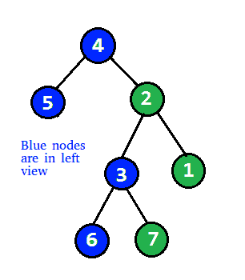

# 打印二叉树的左视图

> 原文:[https://www.geeksforgeeks.org/print-left-view-binary-tree/](https://www.geeksforgeeks.org/print-left-view-binary-tree/)

给定一个二叉树，打印它的左视图。二叉树的左视图是从左侧访问树时可见的一组节点。



**示例:**

```
Input : 
                 1
               /   \
              2     3
             / \     \
            4   5     6             
Output : 1 2 4

Input :
        1
      /   \
    2       3
      \   
        4  
          \
            5
             \
               6
Output :1 2 4 5 6
```

方法 1(使用递归)
左视图包含所有节点，这些节点是其级别中的第一个节点。简单的解决方法就是**做** [**级序遍历**](https://www.geeksforgeeks.org/level-order-tree-traversal/) 并打印每一级中的第一个节点。

问题也可以通过简单的递归遍历来解决**。我们可以通过向所有递归调用传递一个参数来跟踪节点的级别。这个想法也是为了跟踪最大水平。每当我们看到一个节点的级别超过目前为止的最大级别，我们就打印该节点，因为这是其级别中的第一个节点(注意，我们在右子树之前遍历左子树)。**

以下是上述想法的实现-

## C++

```
// C++ program to print left view of Binary Tree
#include <bits/stdc++.h>
using namespace std;

struct Node
{
    int data;
    struct Node *left, *right;
};

// A utility function to
// create a new Binary Tree Node
struct Node *newNode(int item)
{
    struct Node *temp = (struct Node *)malloc(
                        sizeof(struct Node));
    temp->data = item;
    temp->left = temp->right = NULL;
    return temp;
}

// Recursive function to print
// left view of a binary tree.
void leftViewUtil(struct Node *root,
                int level, int *max_level)
{
    // Base Case
    if (root == NULL) return;

    // If this is the first Node of its level
    if (*max_level < level)
    {
        cout << root->data << " ";
        *max_level = level;
    }

    // Recur for left subtree first,
    // then right subtree
      leftViewUtil(root->left, level + 1, max_level);
    leftViewUtil(root->right, level + 1, max_level);

}

// A wrapper over leftViewUtil()
void leftView(struct Node *root)
{
    int max_level = 0;
    leftViewUtil(root, 1, &max_level);
}

// Driver Code
int main()
{
    Node* root = newNode(10);
    root->left = newNode(2);
    root->right = newNode(3);
    root->left->left = newNode(7);
    root->left->right = newNode(8);
    root->right->right = newNode(15);
    root->right->left = newNode(12);
    root->right->right->left = newNode(14);

    leftView(root);

    return 0;
}
```

## C

```
// C program to print left view of Binary Tree
#include <stdio.h>
#include <stdlib.h>

struct node {
    int data;
    struct node *left, *right;
};

// A utility function to create a new Binary Tree node
struct node* newNode(int item)
{
    struct node* temp
        = (struct node*)malloc(sizeof(struct node));
    temp->data = item;
    temp->left = temp->right = NULL;
    return temp;
}

// Recursive function to print left view of a binary tree.
void leftViewUtil(struct node* root, int level,
                  int* max_level)
{
    // Base Case
    if (root == NULL)
        return;

    // If this is the first node of its level
    if (*max_level < level) {
        printf("%d\t", root->data);
        *max_level = level;
    }

    // Recur for left and right subtrees
    leftViewUtil(root->left, level + 1, max_level);
    leftViewUtil(root->right, level + 1, max_level);
}

// A wrapper over leftViewUtil()
void leftView(struct node* root)
{
    int max_level = 0;
    leftViewUtil(root, 1, &max_level);
}

// Driver code
int main()
{
    struct node* root = newNode(12);
    root->left = newNode(10);
    root->right = newNode(30);
    root->right->left = newNode(25);
    root->right->right = newNode(40);

    leftView(root);

    return 0;
}
```

## Java 语言(一种计算机语言，尤用于创建网站)

```
// Java program to print left view of binary tree

/* Class containing left and right child of current
node and key value*/
class Node {
    int data;
    Node left, right;

    public Node(int item)
    {
        data = item;
        left = right = null;
    }
}

/* Class to print the left view */
class BinaryTree {
    Node root;
    static int max_level = 0;

    // recursive function to print left view
    void leftViewUtil(Node node, int level)
    {
        // Base Case
        if (node == null)
            return;

        // If this is the first node of its level
        if (max_level < level) {
            System.out.print(" " + node.data);
            max_level = level;
        }

        // Recur for left and right subtrees
        leftViewUtil(node.left, level + 1);
        leftViewUtil(node.right, level + 1);
    }

    // A wrapper over leftViewUtil()
    void leftView()
    {
        leftViewUtil(root, 1);
    }

    /* testing for example nodes */
    public static void main(String args[])
    {
        /* creating a binary tree and entering the nodes */
        BinaryTree tree = new BinaryTree();
        tree.root = new Node(12);
        tree.root.left = new Node(10);
        tree.root.right = new Node(30);
        tree.root.right.left = new Node(25);
        tree.root.right.right = new Node(40);

        tree.leftView();
    }
}
```

## 计算机编程语言

```
# Python program to print left view of Binary Tree

# A binary tree node
class Node:

    # Constructor to create a new node
    def __init__(self, data):
        self.data = data
        self.left = None
        self.right = None

# Recursive function print left view of a binary tree
def leftViewUtil(root, level, max_level):

    # Base Case
    if root is None:
        return

    # If this is the first node of its level
    if (max_level[0] < level):
        print "% d\t" %(root.data),
        max_level[0] = level

    # Recur for left and right subtree
    leftViewUtil(root.left, level + 1, max_level)
    leftViewUtil(root.right, level + 1, max_level)

# A wrapper over leftViewUtil()
def leftView(root):
    max_level = [0]
    leftViewUtil(root, 1, max_level)

# Driver program to test above function
root = Node(12)
root.left = Node(10)
root.right = Node(20)
root.right.left = Node(25)
root.right.right = Node(40)

leftView(root)

# This code is contributed by Nikhil Kumar Singh(nickzuck_007)
```

## C#

```
using System;

// C# program to print left view of binary tree

/* Class containing left and right child of current
node and key value*/
public class Node {
    public int data;
    public Node left, right;

    public Node(int item)
    {
        data = item;
        left = right = null;
    }
}

/* Class to print the left view */
public class BinaryTree {
    public Node root;
    public static int max_level = 0;

    // recursive function to print left view
    public virtual void leftViewUtil(Node node, int level)
    {
        // Base Case
        if (node == null) {
            return;
        }

        // If this is the first node of its level
        if (max_level < level) {
            Console.Write(" " + node.data);
            max_level = level;
        }

        // Recur for left and right subtrees
        leftViewUtil(node.left, level + 1);
        leftViewUtil(node.right, level + 1);
    }

    // A wrapper over leftViewUtil()
    public virtual void leftView()
    {
        leftViewUtil(root, 1);
    }

    /* testing for example nodes */
    public static void Main(string[] args)
    {
        /* creating a binary tree and entering the nodes */
        BinaryTree tree = new BinaryTree();
        tree.root = new Node(12);
        tree.root.left = new Node(10);
        tree.root.right = new Node(30);
        tree.root.right.left = new Node(25);
        tree.root.right.right = new Node(40);

        tree.leftView();
    }
}

// This code is contributed by Shrikant13
```

## java 描述语言

```
<script>

// Javascript program to print left view
// of binary tree

// Class containing left and right
// child of current node and key value
class Node
{
    constructor(item)
    {
        this.data = item;
        this.left = null;
        this.right = null;
    }
}

// Class to print the left view
var root ;
var max_level = 0;

// Recursive function to print left view
function leftViewUtil(node, level)
{

    // Base Case
    if (node == null)
    {
        return;
    }

    // If this is the first node of its level
    if (max_level < level)
    {
        document.write(" " + node.data);
        max_level = level;
    }

    // Recur for left and right subtrees
    leftViewUtil(node.left, level + 1);
    leftViewUtil(node.right, level + 1);
}

// A wrapper over leftViewUtil()
function leftView()
{
    leftViewUtil(root, 1);
}

// Driver code

// Testing for example nodes
// Creating a binary tree and
// entering the nodes
root = new Node(12);
root.left = new Node(10);
root.right = new Node(30);
root.right.left = new Node(25);
root.right.right = new Node(40);

leftView();

// This code is contributed by rrrtnx

</script>
```

**Output**

```
10 2 7 14 
```

**时间复杂度:**函数对树做简单遍历，所以复杂度为 O(n)。
**辅助空间:** O(n)，由于递归调用时的栈空间。

**方法-2** (使用队列):

在该方法中，讨论了基于水平顺序遍历的解决方案。如果我们仔细观察，会发现我们的主要任务是打印每一级最左边的节点。因此，我们将在树上进行级别顺序遍历，并在每个级别打印最左边的节点。下面是上述方法的实现:

## C++

```
// C++ program to print left view of
// Binary Tree

#include<bits/stdc++.h>
using namespace std;

// A Binary Tree Node
struct Node
{
    int data;
    struct Node *left, *right;
};

// Utility function to create a new tree node
Node* newNode(int data)
{
    Node *temp = new Node;
    temp->data = data;
    temp->left = temp->right = NULL;
    return temp;
}

// function to print left view of
// binary tree
void printLeftView(Node* root)
{
    if (!root)
        return;

    queue<Node*> q;
    q.push(root);

    while (!q.empty())
    {    
        // number of nodes at current level
        int n = q.size();

        // Traverse all nodes of current level
        for(int i = 1; i <= n; i++)
        {
            Node* temp = q.front();
            q.pop();

            // Print the left most element
            // at the level
            if (i == 1)
                cout<<temp->data<<" ";

            // Add left node to queue
            if (temp->left != NULL)
                q.push(temp->left);

            // Add right node to queue
            if (temp->right != NULL)
                q.push(temp->right);
        }
    }
}    

// Driver code
int main()
{
    // Let's construct the tree as
    // shown in example

    Node* root = newNode(10);
    root->left = newNode(2);
    root->right = newNode(3);
    root->left->left = newNode(7);
    root->left->right = newNode(8);
    root->right->right = newNode(15);
    root->right->left = newNode(12);
    root->right->right->left = newNode(14);

    printLeftView(root);
}

// This code is contributed by
// Manne SreeCharan
```

## Java 语言(一种计算机语言，尤用于创建网站)

```
// Java program to print left view of Binary
// Tree
import java.util.*;

public class PrintRightView {
    // Binary tree node
    private static class Node {
        int data;
        Node left, right;

        public Node(int data)
        {
            this.data = data;
            this.left = null;
            this.right = null;
        }
    }

    // function to print left view of binary tree
    private static void printLeftView(Node root)
    {
        if (root == null)
            return;

        Queue<Node> queue = new LinkedList<>();
        queue.add(root);

        while (!queue.isEmpty()) {
            // number of nodes at current level
            int n = queue.size();

            // Traverse all nodes of current level
            for (int i = 1; i <= n; i++) {
                Node temp = queue.poll();

                // Print the left most element at
                // the level
                if (i == 1)
                    System.out.print(temp.data + " ");

                // Add left node to queue
                if (temp.left != null)
                    queue.add(temp.left);

                // Add right node to queue
                if (temp.right != null)
                    queue.add(temp.right);
            }
        }
    }

    // Driver code
    public static void main(String[] args)
    {
        // construct binary tree as shown in
        // above diagram
        Node root = new Node(10);
        root.left = new Node(2);
        root.right = new Node(3);
        root.left.left = new Node(7);
        root.left.right = new Node(8);
        root.right.right = new Node(15);
        root.right.left = new Node(12);
        root.right.right.left = new Node(14);

        printLeftView(root);
    }
}

// This code is contributed by
// Manne SreeCharan
```

## 计算机编程语言

```
# Python3 program to print left view of
# Binary Tree

# Binary Tree Node
""" utility that allocates a newNode
with the given key """

class newNode:

    # Construct to create a newNode
    def __init__(self, key):
        self.data = key
        self.left = None
        self.right = None
        self.hd = 0

# function to print left view of
# binary tree

def printLeftView(root):

    if (not root):
        return

    q = []
    q.append(root)

    while (len(q)):

        # number of nodes at current level
        n = len(q)

        # Traverse all nodes of current level
        for i in range(1, n + 1):
            temp = q[0]
            q.pop(0)

            # Print the left most element
            # at the level
            if (i == 1):
                print(temp.data, end=" ")

            # Add left node to queue
            if (temp.left != None):
                q.append(temp.left)

            # Add right node to queue
            if (temp.right != None):
                q.append(temp.right)

# Driver Code
if __name__ == '__main__':

    root = newNode(10)
    root.left = newNode(2)
    root.right = newNode(3)
    root.left.left = newNode(7)
    root.left.right = newNode(8)
    root.right.right = newNode(15)
    root.right.left = newNode(12)
    root.right.right.left = newNode(14)
    printLeftView(root)

# This code is contributed by
# Manne SreeCharan
```

## C#

```
// C# program to print left view
// of Binary Tree
using System;
using System.Collections.Generic;

public class PrintRightView {
    // Binary tree node
    private class Node {
        public int data;
        public Node left, right;

        public Node(int data)
        {
            this.data = data;
            this.left = null;
            this.right = null;
        }
    }

    // function to print left view of binary tree
    private static void printRightView(Node root)
    {
        if (root == null)
            return;

        Queue<Node> queue = new Queue<Node>();
        queue.Enqueue(root);

        while (queue.Count != 0) {
            // number of nodes at current level
            int n = queue.Count;

            // Traverse all nodes of current level
            for (int i = 1; i <= n; i++) {
                Node temp = queue.Dequeue();

                // Print the left most element at
                // the level
                if (i == n)
                    Console.Write(temp.data + " ");

                // Add left node to queue
                if (temp.left != null)
                    queue.Enqueue(temp.left);

                // Add right node to queue
                if (temp.right != null)
                    queue.Enqueue(temp.right);
            }
        }
    }

    // Driver code
    public static void Main(String[] args)
    {
        // construct binary tree as shown in
        // above diagram
        Node root = new Node(10);
        root.left = new Node(2);
        root.right = new Node(3);
        root.left.left = new Node(7);
        root.left.right = new Node(8);
        root.right.right = new Node(15);
        root.right.left = new Node(12);
        root.right.right.left = new Node(14);
        printRightView(root);
    }
}

// This code is contributed Manne SreeCharan
```

**Output**

```
10 2 7 14 
```

**时间复杂度:** O(n)，其中 n 为二叉树中的节点数。

方法 3:

使用队列和空指针来标记每个级别的第一个元素

我们在第一个元素中插入一个空指针，当到达该空指针时，我们将 bool 标记为 true，并将下一个元素作为左视图元素

## C++

```
#include <bits/stdc++.h>
using namespace std;
 struct Node
{
    int data;
    struct Node *left, *right;
};

// A utility function to
// create a new Binary Tree Node
struct Node *newNode(int item)
{
    struct Node *temp = (struct Node *)malloc(
                        sizeof(struct Node));
    temp->data = item;
    temp->left = temp->right = NULL;
    return temp;
}

vector<int> leftView(Node *root)
{
   // Your code here
   vector<int>ans;

   if(!root)
   {
       return ans;

   }

   queue<Node*>q;
   q.push(root);
   q.push(NULL);
   bool ok=true;

   while(!q.empty())
   {
       auto it=q.front();
       q.pop();
       if(it==NULL)
       {
           if(ok==false)
           {
               ok=true;
           }

           if(q.size()==0)
           {
               break;
           }
           else
           {
               q.push(NULL);
           }

       }
       else
       {
           if(ok)
           {
               ans.push_back(it->data);

               ok=false;

           }

           if(it->left)
           {
               q.push(it->left);
           }
           if(it->right)
           {
               q.push(it->right);
           }
       }
   }

   return ans;
}
int main()
{
    Node* root = newNode(10);
    root->left = newNode(2);
    root->right = newNode(3);
    root->left->left = newNode(7);
    root->left->right = newNode(8);
    root->right->right = newNode(15);
    root->right->left = newNode(12);
    root->right->right->left = newNode(14);

    vector<int> vec = leftView(root);
        for(int x : vec)
        cout<<x<<" ";
        cout << endl;

    return 0;
}
```

时间复杂度:O(N)，其中 N 是节点总数

本文由 Ramsai Chinthamani，Manne SreeCharan 供稿，如发现任何不正确的地方，或想分享更多关于上述话题的信息，请写评论。