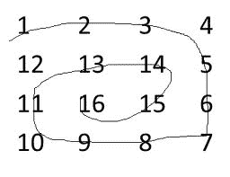

# 以防螺旋形式打印矩阵

> 原文： [https://www.geeksforgeeks.org/print-matrix-antispiral-form/](https://www.geeksforgeeks.org/print-matrix-antispiral-form/)

给定 2D 数组，任务是以反螺旋形式打印矩阵：

**示例**：



输出：`16 15 14 13 12 11 10 9 8 7 6 5 4 3 2 1`。

```
Input : arr[][4] = {1, 2, 3, 4
                    5, 6, 7, 8
                    9, 10, 11, 12
                    13, 14, 15, 16};
Output : 10 11 7 6 5 9 13 14 15 16 12 8 4 3 2 1

Input :arr[][6] = {1, 2, 3, 4, 5, 6
                  7, 8, 9, 10, 11, 12
                  13, 14, 15, 16, 17, 18};
Output : 11 10 9 8 7 13 14 15 16 17 18 12 6 5 4 3 2 1

```


想法很简单，我们[以螺旋形式](https://www.geeksforgeeks.org/print-a-given-matrix-in-spiral-form/) 遍历矩阵，并将所有遍历的元素放入栈中。 最后从栈中逐一列出并打印它们。

## C++ 

```cpp

// C++ program to print matrix in anti-spiral form 
#include <bits/stdc++.h> 
using namespace std; 
#define R 4 
#define C 5 

void antiSpiralTraversal(int m, int n, int a[R][C]) 
{ 
    int i, k = 0, l = 0; 

    /*  k - starting row index 
        m - ending row index 
        l - starting column index 
        n - ending column index 
        i - iterator  */
    stack<int> stk; 

    while (k <= m && l <= n) 
    { 
        /* Print the first row from the remaining rows */
        for (i = l; i <= n; ++i) 
            stk.push(a[k][i]); 
        k++; 

        /* Print the last column from the remaining columns */
        for (i = k; i <= m; ++i) 
            stk.push(a[i][n]); 
        n--; 

        /* Print the last row from the remaining rows */
        if ( k <= m) 
        { 
            for (i = n; i >= l; --i) 
                stk.push(a[m][i]); 
            m--; 
        } 

        /* Print the first column from the remaining columns */
        if (l <= n) 
        { 
            for (i = m; i >= k; --i) 
                stk.push(a[i][l]); 
            l++; 
        } 
    } 

    while (!stk.empty()) 
    { 
        cout << stk.top() << " "; 
        stk.pop(); 
    } 
} 

/* Driver program to test above functions */
int main() 
{ 
    int mat[R][C] = 
    { 
        {1,  2,  3,  4,  5}, 
        {6,  7,  8,  9,  10}, 
        {11, 12, 13, 14, 15}, 
        {16, 17, 18, 19, 20} 
    }; 

    antiSpiralTraversal(R-1, C-1, mat); 

    return 0; 
} 

```

## Java

```java
// Java Code for Print matrix in antispiral form 
import java.util.*; 
  
class GFG { 
      
    public static void antiSpiralTraversal(int m, int n,  
                                             int a[][]) 
    { 
        int i, k = 0, l = 0; 
       
        /*  k - starting row index 
            m - ending row index 
            l - starting column index 
            n - ending column index 
            i - iterator  */
        Stack<Integer> stk=new Stack<Integer>(); 
       
        while (k <= m && l <= n) 
        { 
            /* Print the first row from the remaining  
             rows */
            for (i = l; i <= n; ++i) 
                stk.push(a[k][i]); 
            k++; 
       
            /* Print the last column from the remaining 
            columns */
            for (i = k; i <= m; ++i) 
                stk.push(a[i][n]); 
            n--; 
       
            /* Print the last row from the remaining  
            rows */
            if ( k <= m) 
            { 
                for (i = n; i >= l; --i) 
                    stk.push(a[m][i]); 
                m--; 
            } 
       
            /* Print the first column from the remaining  
            columns */
            if (l <= n) 
            { 
                for (i = m; i >= k; --i) 
                    stk.push(a[i][l]); 
                l++; 
            } 
        } 
       
        while (!stk.empty()) 
        { 
            System.out.print(stk.peek() + " "); 
            stk.pop(); 
        } 
    } 
      
    /* Driver program to test above function */
    public static void main(String[] args)  
    { 
         int mat[][] = 
                { 
                    {1,  2,  3,  4,  5}, 
                    {6,  7,  8,  9,  10}, 
                    {11, 12, 13, 14, 15}, 
                    {16, 17, 18, 19, 20} 
                }; 
               
        antiSpiralTraversal(mat.length - 1, mat[0].length - 1,  
                                                       mat); 
    } 
  } 
// This code is contributed by Arnav Kr. Mandal.
```

## Python 3

```
# Python 3 program to print 
# matrix in anti-spiral form 
R = 4
C = 5
  
def antiSpiralTraversal(m, n, a): 
    k = 0
    l = 0
  
    # k - starting row index 
    # m - ending row index 
    # l - starting column index 
    # n - ending column index 
    # i - iterator  
    stk = [] 
  
    while (k <= m and l <= n): 
          
        # Print the first row  
        # from the remaining rows  
        for i in range(l, n + 1): 
            stk.append(a[k][i]) 
        k += 1
  
        # Print the last column  
        # from the remaining columns  
        for i in range(k, m + 1): 
            stk.append(a[i][n]) 
        n -= 1
  
        # Print the last row 
        # from the remaining rows  
        if ( k <= m): 
            for i in range(n, l - 1, -1): 
                stk.append(a[m][i]) 
            m -= 1
  
        # Print the first column  
        # from the remaining columns  
        if (l <= n): 
            for i in range(m, k - 1, -1): 
                stk.append(a[i][l]) 
            l += 1
          
    while len(stk) != 0: 
        print(str(stk[-1]), end = " ") 
        stk.pop() 
  
# Driver Code 
mat = [[1, 2, 3, 4, 5], 
       [6, 7, 8, 9, 10], 
       [11, 12, 13, 14, 15], 
       [16, 17, 18, 19, 20]]; 
  
antiSpiralTraversal(R - 1, C - 1, mat) 
  
# This code is contributed 
# by ChitraNayal
```

## C#

```cs
using System; 
using System.Collections.Generic; 
  
// C# Code for Print matrix in antispiral form  
  
public class GFG 
{ 
  
    public static void antiSpiralTraversal(int m, int n, int[][] a) 
    { 
        int i, k = 0, l = 0; 
  
        /*  k - starting row index  
            m - ending row index  
            l - starting column index  
            n - ending column index  
            i - iterator  */
        Stack<int> stk = new Stack<int>(); 
  
        while (k <= m && l <= n) 
        { 
            /* Print the first row from the remaining   
             rows */
            for (i = l; i <= n; ++i) 
            { 
                stk.Push(a[k][i]); 
            } 
            k++; 
  
            /* Print the last column from the remaining  
            columns */
            for (i = k; i <= m; ++i) 
            { 
                stk.Push(a[i][n]); 
            } 
            n--; 
  
            /* Print the last row from the remaining   
            rows */
            if (k <= m) 
            { 
                for (i = n; i >= l; --i) 
                { 
                    stk.Push(a[m][i]); 
                } 
                m--; 
            } 
  
            /* Print the first column from the remaining   
            columns */
            if (l <= n) 
            { 
                for (i = m; i >= k; --i) 
                { 
                    stk.Push(a[i][l]); 
                } 
                l++; 
            } 
        } 
  
        while (stk.Count > 0) 
        { 
            Console.Write(stk.Peek() + " "); 
            stk.Pop(); 
        } 
    } 
  
    /* Driver program to test above function */
    public static void Main(string[] args) 
    { 
         int[][] mat = new int[][] 
         { 
             new int[] {1, 2, 3, 4, 5}, 
             new int[] {6, 7, 8, 9, 10}, 
             new int[] {11, 12, 13, 14, 15}, 
             new int[] {16, 17, 18, 19, 20} 
         }; 
  
        antiSpiralTraversal(mat.Length - 1, mat[0].Length - 1, mat); 
    } 
} 
  
// This code is contributed by Shrikant13
```

输出：

```
12 13 14 9 8 7 6 11 16 17 18 19 20 15 10 5 4 3 2 1 
```

