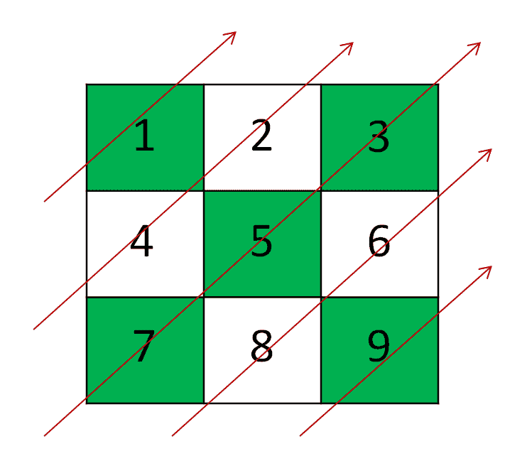
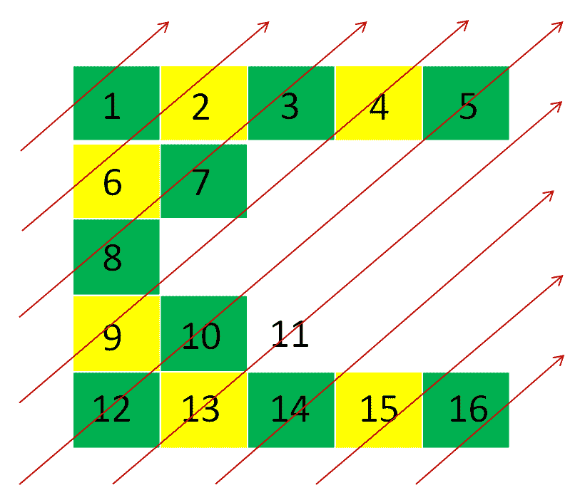

# 以对角向上的方式从左上角到右下角打印矩阵元素

> 原文:[https://www . geesforgeks . org/print-matrix-elements-从左上方到右下方-以对角向上的方式/](https://www.geeksforgeeks.org/print-matrix-elements-from-top-left-to-bottom-right-in-diagonally-upward-manner/)

给定向量 **arr[]** 的[向量，任务是按照对角向上的顺序打印 **arr[]** 的元素，如下图所示。](https://www.geeksforgeeks.org/vector-of-vectors-in-c-stl-with-examples/)

**示例:**

> **输入:** arr[][] = {{1，2，3}，{4，5，6}，{7，8，9}}
> **输出:** 1 4 2 7 5 3 8 6 9
> **解释:**
> 以下是如何按对角线向上的顺序打印的图示:
> 
> [](https://media.geeksforgeeks.org/wp-content/uploads/20201109122940/Screenshot948.png)
> 
> **输入:** arr[][] = {{1，2，3，4，5}，{6，7}，{8}，{9，10，11}，{12，13，14，15，16}}
> **输出:**1 6 28 7 3 9 4 12 10 5 13 11 14 15 16
> **解释:**
> 下图是如何按对角线向上的顺序打印:
> 
> [](https://media.geeksforgeeks.org/wp-content/uploads/20201109123501/Screenshot951.png)

**方法:**这个想法是基于这样的观察:特定向上对角线中的所有元素的总和等于**(行索引+列索引)**。按照以下步骤解决问题:

*   初始化向量的向量 **v** ，以所需的格式存储元素。
*   [使用变量 **i** 和 **j** 迭代矩阵](https://www.geeksforgeeks.org/row-wise-vs-column-wise-traversal-matrix/)**arr【】【】【】T3】，对于每个 **i** 和 **j** 将**arr【I】【j】**推至**v【I+j】**。**
*   完成上述步骤后，在 **v** 中[反转每一行](https://www.geeksforgeeks.org/program-to-reverse-the-rows-in-a-2d-array/)。
*   现在，逐行打印存储在 **v** 中的所有元素，以获得所需的结果。

下面是上述方法的实现:

## C++

```
// C++ program for the above approach
#include <bits/stdc++.h>
using namespace std;

// Function to traverse the matrix
// diagonally upwards
void printDiagonalTraversal(
    vector<vector<int> >& nums)
{
    // Stores the maximum size of vector
    // from all row of matrix nums[][]
    int max_size = nums.size();

    for (int i = 0; i < nums.size(); i++) {
        if (max_size < nums[i].size()) {
            max_size = nums[i].size();
        }
    }

    // Store elements in desired order
    vector<vector<int> > v(2 * max_size - 1);

    // Store every element on the basis
    // of sum of index (i + j)
    for (int i = 0; i < nums.size(); i++) {

        for (int j = 0;
             j < nums[i].size(); j++) {
            v[i + j].push_back(nums[i][j]);
        }
    }

    // Print the stored result
    for (int i = 0; i < v.size(); i++) {

        // Reverse all sublist
        reverse(v[i].begin(), v[i].end());

        for (int j = 0; j < v[i].size(); j++)
            cout << v[i][j] << " ";
    }
}

// Driver code
int main()
{
    // Given vector of vectors arr
    vector<vector<int> > arr
        = { { 1, 2, 3 }, { 4, 5, 6 }, { 7, 8, 9 } };

    // Function Call
    printDiagonalTraversal(arr);

    return 0;
}
```

## Java 语言(一种计算机语言，尤用于创建网站)

```
// Java program for the above approach
import java.util.*;

class GFG{

// Function to traverse the matrix
// diagonally upwards
static void printDiagonalTraversal(int[][] nums)
{

    // Stores the maximum size of vector
    // from all row of matrix nums[][]
    int max_size = nums[0].length;

    // Store elements in desired order
    ArrayList<
    ArrayList<Integer>> v = new ArrayList<
                                ArrayList<Integer>>();

    for(int i = 0; i < 2 * max_size - 1; i++)
    {
        v.add(new ArrayList<Integer>());
    }

    // Store every element on the basis
    // of sum of index (i + j)
    for(int i = 0; i < nums[0].length; i++)
    {
        for(int j = 0; j < nums[0].length; j++)
        {
            v.get(i + j).add(nums[i][j]);
        }
    }

    // Print the stored result
    for(int i = 0; i < v.size(); i++)
    {

        // Print in reverse order
        for(int j = v.get(i).size() - 1;
                j >= 0; j--)
        {
            System.out.print(v.get(i).get(j) + " ");
        }
    }
}

// Driver Code
public static void main(String[] args)
{

    // Given vector of vectors arr
    int[][] arr = { { 1, 2, 3 },
                    { 4, 5, 6 },
                    { 7, 8, 9 } };

    // Function Call
    printDiagonalTraversal(arr);
}
}

// This code is contributed by divyeshrabadiya07
```

## 蟒蛇 3

```
# Python3 program for the above approach

# Function to traverse the matrix
# diagonally upwards
def printDiagonalTraversal(nums):

    # Stores the maximum size of vector
    # from all row of matrix nums[][]
    max_size = len(nums)

    for i in range(len(nums)):
        if (max_size < len(nums[i])):
            max_size = len(nums[i])

    # Store elements in desired order
    v = [[] for i in range(2 * max_size - 1)]

    # Store every element on the basis
    # of sum of index (i + j)
    for i in range(len(nums)):
        for j in range(len(nums[i])):
            v[i + j].append(nums[i][j])

    # Print the stored result
    for i in range(len(v)):

        # Reverse all sublist
        v[i] = v[i][::-1]

        for j in range(len(v[i])):
            print(v[i][j], end = " ")

# Driver code
if __name__ == '__main__':

    # Given vector of vectors arr
    arr = [ [ 1, 2, 3 ],
            [ 4, 5, 6 ],
            [ 7, 8, 9 ] ]

    # Function Call
    printDiagonalTraversal(arr)

# This code is contributed by mohit kumar 29
```

## C#

```
// C# program for the above approach
using System;
using System.Collections.Generic; 

class GFG{

// Function to traverse the matrix
// diagonally upwards
static void printDiagonalTraversal(int[,] nums)
{

    // Stores the maximum size of vector
    // from all row of matrix nums[][]
    int max_size = nums.GetLength(0);

    // Store elements in desired order
    List<List<int>> v = new List<List<int>>();
    for(int i = 0; i < 2 * max_size - 1; i++)
    {
        v.Add(new List<int>());
    }

    // Store every element on the basis
    // of sum of index (i + j)
    for(int i = 0; i < nums.GetLength(0); i++)
    {
        for(int j = 0; j < nums.GetLength(0); j++)
        {
            v[i + j].Add(nums[i, j]);
        }
    }

    // Print the stored result
    for(int i = 0; i < v.Count; i++)
    {

        // print in reverse order
        for(int j = v[i].Count - 1; j >= 0; j--)
        {
            Console.Write(v[i][j] + " ");
        }
    }
}

// Driver Code
static void Main()
{

    // Given vector of vectors arr
    int[,] arr = { { 1, 2, 3 },
                   { 4, 5, 6 },
                   { 7, 8, 9 } };

    // Function Call
    printDiagonalTraversal(arr);
}
}

// This code is contributed by divyesh072019
```

## java 描述语言

```
<script>

// Javascript program for the above approach

// Function to traverse the matrix
// diagonally upwards
function printDiagonalTraversal(nums)
{

    // Stores the maximum size of vector
    // from all row of matrix nums[][]
    let max_size = nums[0].length;

    // Store elements in desired order
    let v = [];

    for(let i = 0; i < 2 * max_size - 1; i++)
    {
        v.push([]);
    }

    // Store every element on the basis
    // of sum of index (i + j)
    for(let i = 0; i < nums[0].length; i++)
    {
        for(let j = 0; j < nums[0].length; j++)
        {
            v[i + j].push(nums[i][j]);
        }
    }

    // Print the stored result
    for(let i = 0; i < v.length; i++)
    {

        // Print in reverse order
        for(let j = v[i].length - 1;
                j >= 0; j--)
        {
            document.write(v[i][j] + " ");
        }
    }
}

// Driver Code

// Given vector of vectors arr
let arr = [ [ 1, 2, 3 ],
            [ 4, 5, 6 ],
            [ 7, 8, 9 ] ];

// Function Call
printDiagonalTraversal(arr);

// This code is contributed by avanitrachhadiya2155

</script>
```

**Output:** 

```
1 4 2 7 5 3 8 6 9
```

***时间复杂度:** O(N*M)，其中 N 是给定矩阵的大小，M 是矩阵中任意一行的最大大小。*
***辅助空间:** O(N*M)*

**交替进场:**使用[队列](https://www.geeksforgeeks.org/queue-data-structure/)也可以解决上述问题。按照以下步骤解决问题:

*   初始化一个队列 **Q** ，插入 **arr[][]** 第一个单元格的索引，即 **(0，0)** 。
*   初始化一个[向量](https://www.geeksforgeeks.org/vector-in-cpp-stl/) **v** ，以所需的格式存储元素。
*   当 q 不为空时，请执行以下操作:
    *   [弹出队列](https://www.geeksforgeeks.org/queuepush-and-queuepop-in-cpp-stl/)前面的元素，推入 **v** 。
    *   仅当当前单元格是其所在行的第一个单元格时，将当前单元格的索引推到其正下方。
    *   如果其右邻小区存在，则推送其索引。
*   完成上述步骤后，打印存储在 **v** 中的所有元素。

下面是上述方法的实现:

## C++

```
// C++ program for the above approach
#include <bits/stdc++.h>
using namespace std;

// Function to traverse the matrix
// diagonally upwards
void printDiagonalTraversal(
    vector<vector<int> >& nums)
{
    // Store the number of rows
    int m = nums.size();

    // Initialize queue
    queue<pair<int, int> > q;

    // Push the index of first element
    // i.e., (0, 0)
    q.push({ 0, 0 });

    while (!q.empty()) {

        // Get the front element
        pair<int, int> p = q.front();

        // Pop the element at the front
        q.pop();
        cout << nums[p.first][p.second]
             << " ";

        // Insert the element below
        // if the current element is
        // in first column
        if (p.second == 0
            && p.first + 1 < m) {
            q.push({ p.first + 1,
                     p.second });
        }

        // Insert the right neighbour
        // if it exists
        if (p.second + 1 < nums[p.first].size())
            q.push({ p.first,
                     p.second + 1 });
    }
}

// Driver Code
int main()
{
    // Given vector of vectors arr
    vector<vector<int> > arr
        = { { 1, 2, 3 }, { 4, 5, 6 }, { 7, 8, 9 } };

    // Function call
    printDiagonalTraversal(arr);

    return 0;
}
```

## Java 语言(一种计算机语言，尤用于创建网站)

```
// Java program for the above approach
import java.util.*;

class GFG{

    static class pair
    {
        int first, second;
        public pair(int first, int second) 
        {
            this.first = first;
            this.second = second;
        }   
    }

// Function to traverse the matrix
// diagonally upwards
static void printDiagonalTraversal(
    int [][]nums)
{

    // Store the number of rows
    int m = nums.length;

    // Initialize queue
    Queue<pair> q = new LinkedList<>();

    // Push the index of first element
    // i.e., (0, 0)
    q.add(new pair( 0, 0 ));

    while (!q.isEmpty()) {

        // Get the front element
        pair p = q.peek();

        // Pop the element at the front
        q.remove();
        System.out.print(nums[p.first][p.second]
            + " ");

        // Insert the element below
        // if the current element is
        // in first column
        if (p.second == 0
            && p.first + 1 < m) {
            q.add(new pair( p.first + 1,
                     p.second ));
        }

        // Insert the right neighbour
        // if it exists
        if (p.second + 1 < nums[p.first].length)
            q.add(new pair(  p.first,
                     p.second + 1 ));
    }
}

// Driver Code
public static void main(String[] args)
{
    // Given vector of vectors arr
    int[][] arr
        = { { 1, 2, 3 }, { 4, 5, 6 }, { 7, 8, 9 } };

    // Function call
    printDiagonalTraversal(arr);

}
}

// This code is contributed by Amit Katiyar
```

## 蟒蛇 3

```
# Python3 program for the above approach

# Function to traverse the matrix
# diagonally upwards
def printDiagonalTraversal(nums):

    # Store the number of rows
    m = len(nums)

    # Initialize queue
    q = []

    # Push the index of first element
    # i.e., (0, 0)
    q.append([ 0, 0 ])

    while (len(q) != 0):

        # Get the front element
        p = q[0]

        # Pop the element at the front
        q.pop(0);
        print(nums[p[0]][p[1]], end = " ")

        # Insert the element below
        # if the current element is
        # in first column
        if (p[1] == 0
            and p[0] + 1 < m):
            q.append([ p[0]+ 1,
                     p[1] ]);

        # Insert the right neighbour
        # if it exists
        if (p[1] + 1 < len(nums[p[0]])):
            q.append([ p[0],
                     p[1] + 1 ]);

# Driver Code
if __name__ == "__main__":

    # Given vector of vectors arr
    arr = [[ 1, 2, 3 ], [ 4, 5, 6 ] ,[ 7, 8, 9 ]]

    # Function call
    printDiagonalTraversal(arr);

    # This code is contributed by chitranayal
```

## C#

```
// C# program for the above approach
using System;
using System.Collections.Generic;
public class GFG
{
    class pair
    {
        public int first, second;
        public pair(int first, int second) 
        {
            this.first = first;
            this.second = second;
        }   
    }

// Function to traverse the matrix
// diagonally upwards
static void printDiagonalTraversal(
    int [,]nums)
{

    // Store the number of rows
    int m = nums.GetLength(0);

    // Initialize queue
    Queue<pair> q = new Queue<pair>();

    // Push the index of first element
    // i.e., (0, 0)
    q.Enqueue(new pair(0, 0));
    while (q.Count != 0)
    {

        // Get the front element
        pair p = q.Peek();

        // Pop the element at the front
        q.Dequeue();
        Console.Write(nums[p.first,p.second]
            + " ");

        // Insert the element below
        // if the current element is
        // in first column
        if (p.second == 0
            && p.first + 1 < m)
        {
            q.Enqueue(new pair( p.first + 1,
                     p.second ));
        }

        // Insert the right neighbour
        // if it exists
        if (p.second + 1 < nums.GetLength(1))
            q.Enqueue(new pair(  p.first,
                     p.second + 1 ));
    }
}

// Driver Code
public static void Main(String[] args)
{

    // Given vector of vectors arr
    int[,] arr
        = { { 1, 2, 3 }, { 4, 5, 6 }, { 7, 8, 9 } };

    // Function call
    printDiagonalTraversal(arr);
}
}

// This code is contributed by shikhasingrajput
```

## java 描述语言

```
<script>
// Javascript program for the above approach

class pair
{
    constructor(first,second)
    {
        this.first = first;
            this.second = second;
    }
}

// Function to traverse the matrix
// diagonally upwards
function printDiagonalTraversal(nums)
{

    // Store the number of rows
    let m = nums.length;

    // Initialize queue
    let q = [];

    // Push the index of first element
    // i.e., (0, 0)
    q.push(new pair( 0, 0 ));

    while (q.length!=0) {

        // Get the front element
        let p = q[0];

        // Pop the element at the front
        q.shift();
        document.write(nums[p.first][p.second]
            + " ");

        // Insert the element below
        // if the current element is
        // in first column
        if (p.second == 0
            && p.first + 1 < m) {
            q.push(new pair( p.first + 1,
                     p.second ));
        }

        // Insert the right neighbour
        // if it exists
        if (p.second + 1 < nums[p.first].length)
            q.push(new pair(  p.first,
                     p.second + 1 ));
    }
}

// Driver Code
// Given vector of vectors arr
let arr=[[ 1, 2, 3 ], [ 4, 5, 6 ], [ 7, 8, 9] ];

// Function call
printDiagonalTraversal(arr);

// This code is contributed by rag2127
</script>
```

**Output:** 

```
1 4 2 7 5 3 8 6 9
```

***时间复杂度:** O(N*M)，其中 N 是给定矩阵的大小，M 是矩阵中任意一行的最大大小。*
***辅助空间:** O(N)*