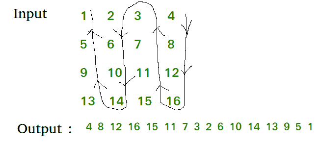

# 以反向波形打印矩阵

> 原文:[https://www . geesforgeks . org/print-matrix-reverse-wave-form/](https://www.geeksforgeeks.org/print-matrix-reverse-wave-form/)

给定一个矩阵，以反向波形打印它。

**示例:**

```
Input :  1  2  3  4
         5  6  7  8
         9  10 11 12
         13 14 15 16
Output : 4 8 12 16 15 11 7 3 2 6 10 14 13 9 5 1

Input :  1  9  4  10
         3  6  90 11
         2  30 85 72
         6  31 99 15 
Output : 10 11 72 15 99 85 90 4 9 6 30 31 6 2 3 1
```

**方法:**为了得到给定矩阵的逆波形，我们首先向下打印矩阵最后一列的元素，然后向上打印第二最后一列的元素，然后向下打印第三最后一列的元素，以此类推。例如 1，流程如下:



下面是打印矩阵逆波形的实现:

## C++

```
// C++ implementation to print
// reverse wave form of matrix
#include<bits/stdc++.h>
using namespace std;

#define R 4
#define C 4

// function to print reverse wave
// form for a given matrix
void WavePrint(int m, int n, int arr[R][C])
{
    int i, j = n - 1, wave = 1;

    /* m     - Ending row index
        n     - Ending column index
        i, j     - Iterator
        wave     - for Direction
        wave = 1 - Wave direction down
        wave = 0 - Wave direction up   */
    while (j >= 0) {

        // Check whether to go in
        // upward or downward
        if (wave == 1) {

            // Print the element of the matrix
            // downward since the value of wave = 1
            for (i = 0; i < m; i++)
                cout << arr[i][j] << " "; 

            wave = 0;
            j--;
        }
        else {

            // Print the elements of the
            // matrix upward since the value
            // of wave = 0
            for (i = m - 1; i >= 0; i--)
                cout << arr[i][j] << " ";

            wave = 1;
            j--;
        }
    }
}

// driver function
int main()
{
    int arr[R][C] = { { 1, 2, 3, 4 },
                      { 5, 6, 7, 8 },
                      { 9, 10, 11, 12 },
                      { 13, 14, 15, 16 } };                   
    WavePrint(R, C, arr);

    return 0;
}
```

## Java 语言(一种计算机语言，尤用于创建网站)

```
// Java implementation to print
// reverse wave form of matrix
import java.io.*;

class GFG
{
    static int R = 4;
    static int C = 4;

    // function to print reverse wave
    // form for a given matrix
    static void WavePrint(int m, int n, int arr[][])
    {
        int i, j = n - 1, wave = 1;

        // m- Ending row index
        //n - Ending column index
        //i, j     - Iterator
        //wave     - for Direction
        //wave = 1 - Wave direction down
        //wave = 0 - Wave direction up */
        while (j >= 0)
        {

            // Check whether to go in
            // upward or downward
            if (wave == 1)
            {
                // Print the element of the matrix
                // downward since the value of wave = 1
                for (i = 0; i < m; i++)
                    System.out.print(arr[i][j] +" ");

                wave = 0;
                j--;
            }
            else {

                // Print the elements of the
                // matrix upward since the value
                // of wave = 0
                for (i = m - 1; i >= 0; i--)
                    System.out.print( arr[i][j] + " ");

                wave = 1;
                j--;
            }
        }
    }

    // Driver function
    public static void main (String[] args)
    {
        int arr[][] = { { 1, 2, 3, 4 },
                    { 5, 6, 7, 8 },
                    { 9, 10, 11, 12 },
                    { 13, 14, 15, 16 } };            
        WavePrint(R, C, arr);  

    }
}

// This code is contributed by vt_m
```

## 蟒蛇 3

```
# Python3 implementation to print
# reverse wave form of matrix

R = 4
C = 4

# function to print reverse wave
# form for a given matrix
def wavePrint(m, n, arr):
    j = n - 1
    wave = 1

    # m     - Ending row index
    # n     - Ending column index
    # i, j     - Iterator
    # wave     - for Direction
    # wave = 1 - Wave direction down
    # wave = 0 - Wave direction up
    while j >= 0:

        # Check whether to go in
        # upward or downward
        if wave == 1:

            # Print the element of the
            # matrix downward since the
                        # value of wave = 1
            for i in range(m):
                print(arr[i][j], end = " "),
            wave = 0
            j -= 1

        else:
            # Print the elements of the
            # matrix upward since the
            # value of wave = 0
            for i in range(m - 1, -1, -1):
                print(arr[i][j], end = " "),

            wave = 1
            j -= 1

# Driver code
arr = [ [ 1, 2, 3, 4 ],
        [ 5, 6, 7, 8 ],
        [ 9, 10, 11, 12 ],
        [ 13, 14, 15, 16 ] ]

wavePrint(R, C, arr)

# This code is contributed by
# Upendra Singh Bartwal
```

## C#

```
// C# implementation to print
// reverse wave form of matrix
using System;

class GFG {

    static int R = 4;
    static int C = 4;

    // function to print reverse wave
    // form for a given matrix
    static void WavePrint(int m, int n, int [,]arr)
    {

        int i, j = n - 1, wave = 1;

        // m- Ending row index
        // n - Ending column index
        // i, j - Iterator
        // wave - for Direction
        // wave = 1 - Wave direction down
        // wave = 0 - Wave direction up */
        while (j >= 0)
        {

            // Check whether to go in
            // upward or downward
            if (wave == 1) {

                // Print the element of the
                // matrix downward since the
                // value of wave = 1
                for (i = 0; i < m; i++)
                    Console.Write(arr[i,j] + " ");

                wave = 0;
                j--;
            }

            else {

                // Print the elements of the
                // matrix upward since the value
                // of wave = 0
                for (i = m - 1; i >= 0; i--)
                    Console.Write( arr[i,j] + " ");

                wave = 1;
                j--;
            }
        }
    }

    // Driver function
    public static void Main ()
    {
        int [,]arr = { { 1, 2, 3, 4 },
                       { 5, 6, 7, 8 },
                       { 9, 10, 11, 12 },
                       { 13, 14, 15, 16 } };

        WavePrint(R, C, arr);

    }
}

// This code is contributed by vt_m.
```

## 服务器端编程语言（Professional Hypertext Preprocessor 的缩写）

```
<?php
// PHP implementation to print
// reverse wave form of matrix
$R = 4;
$C = 4;

// function to print reverse
// wave form for a given matrix
function WavePrint($m, $n, $arr)
{
    global $R;
    global $C;

    $i; $j = $n - 1; $wave = 1;

    /*  m - Ending row index
        n - Ending column index
        i, j     - Iterator
        wave     - for Direction
        wave = 1 - Wave direction down
        wave = 0 - Wave direction up */
    while ($j >= 0)
    {

        // Check whether to go in
        // upward or downward
        if ($wave == 1)
        {

            // Print the element of the
            // matrix downward since the
            // value of wave = 1
            for ($i = 0; $i < $m; $i++)
                echo $arr[$i][$j] , " ";

            $wave = 0;
            $j--;
        }
        else
        {

            // Print the elements of
            // the matrix upward since
            // the value of wave = 0
            for ($i = $m - 1; $i >= 0; $i--)
                echo $arr[$i][$j] , " ";

            $wave = 1;
            $j--;
        }
    }
}

// Driver Code
$arr = array(array(1, 2, 3, 4),
             array(5, 6, 7, 8),
             array(9, 10, 11, 12),
             array(13, 14, 15, 16));                
WavePrint($R, $C, $arr);

// This code is contributed by ajit
?>
```

## java 描述语言

```
<script>

// Javascript implementation to print
// reverse wave form of matrix
R = 4
C = 4

// Function to print reverse wave
// form for a given matrix
function WavePrint(m, n, arr)
{
    var i, j = n - 1, wave = 1;

    /* m     - Ending row index
       n     - Ending column index
       i, j     - Iterator
       wave     - for Direction
       wave = 1 - Wave direction down
       wave = 0 - Wave direction up */
    while (j >= 0)
    {

        // Check whether to go in
        // upward or downward
        if (wave == 1)
        {

            // Print the element of the matrix
            // downward since the value of wave = 1
            for(i = 0; i < m; i++)
                document.write( arr[i][j] + " ");

            wave = 0;
            j--;
        }
        else
        {

            // Print the elements of the
            // matrix upward since the value
            // of wave = 0
            for(i = m - 1; i >= 0; i--)
                document.write( arr[i][j] + " ");

            wave = 1;
            j--;
        }
    }
}

// Driver code
var arr = [ [ 1, 2, 3, 4 ],
            [ 5, 6, 7, 8 ],
            [ 9, 10, 11, 12 ],
            [ 13, 14, 15, 16 ] ];                   
WavePrint(R, C, arr);

// This code is contributed by itsok

</script>
```

**输出:**

```
4 8 12 16 15 11 7 3 2 6 10 14 13 9 5 1 
```