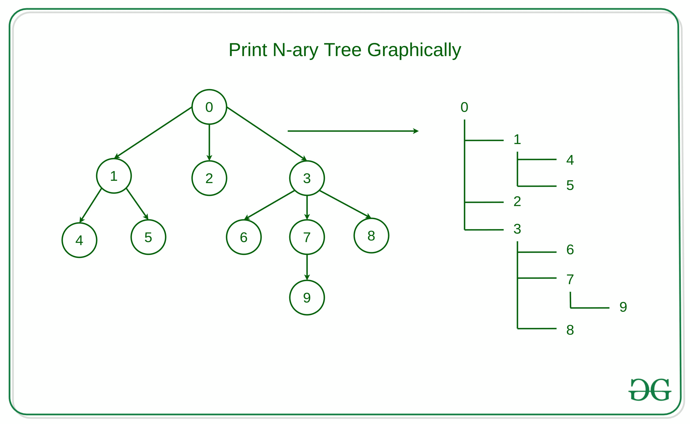

# 以图形方式打印 N 元树

> 原文:[https://www.geeksforgeeks.org/print-n-ary-tree-graphically/](https://www.geeksforgeeks.org/print-n-ary-tree-graphically/)

给定一个 **N 元**树，任务是以图形方式打印 N 元树。
**树的图形表示法:**一种树的表示法，其中根被打印在一行中，子节点被打印在具有一定缩进量的后续行中。
**例:**

```
Input: 
                  0
                / | \
               /  |  \
              1   2   3
             / \    / | \
            4   5  6  7  8
                      |
                      9 
Output:
0
+--- 1
|    +--- 4
|    +--- 5
+--- 2
+--- 3
    +--- 6
    +--- 7
    |    +--- 9
    +--- 8
```



**方法:**思想是使用 [DFS 遍历](https://www.geeksforgeeks.org/depth-first-search-or-dfs-for-a-graph/)遍历 N 元树，遍历节点并探索其子节点，直到所有节点都被访问，然后类似地遍历兄弟节点。
上述方法的分步算法描述如下–

*   初始化一个变量来存储节点的当前深度，对于根节点，深度为 0。
*   声明一个布尔数组来存储当前的探测深度，并在开始时将它们全部标记为 False。
*   如果当前节点是根节点，即节点深度为 0，那么只需打印该节点的数据。
*   否则，迭代从 1 到当前节点深度的循环并打印，' | '和每个探测深度的三个空格，对于非探测深度仅打印三个空格。
*   打印节点的当前值，并将输出指针移动到下一行。
*   如果当前节点是该深度的最后一个节点，则将该深度标记为非探索。
*   同样，使用递归调用探索所有子节点。

以下是上述方法的实现:

## C++

```
// C++ implementation to print
// N-ary Tree graphically

#include <iostream>
#include <list>
#include <vector>

using namespace std;

// Structure of the node
struct tnode {
    int n;
    list<tnode*> root;
    tnode(int data)
        : n(data)
    {
    }
};

// Function to print the
// N-ary tree graphically
void printNTree(tnode* x,
    vector<bool> flag,
    int depth = 0, bool isLast = false)
{
    // Condition when node is None
    if (x == NULL)
        return;

    // Loop to print the depths of the
    // current node
    for (int i = 1; i < depth; ++i) {

        // Condition when the depth
        // is exploring
        if (flag[i] == true) {
            cout << "| "
                << " "
                << " "
                << " ";
        }

        // Otherwise print
        // the blank spaces
        else {
            cout << " "
                << " "
                << " "
                << " ";
        }
    }

    // Condition when the current
    // node is the root node
    if (depth == 0)
        cout << x->n << '\n';

    // Condition when the node is
    // the last node of
    // the exploring depth
    else if (isLast) {
        cout << "+--- " << x->n << '\n';

        // No more childrens turn it
        // to the non-exploring depth
        flag[depth] = false;
    }
    else {
        cout << "+--- " << x->n << '\n';
    }

    int it = 0;
    for (auto i = x->root.begin();
    i != x->root.end(); ++i, ++it)

        // Recursive call for the
        // children nodes
        printNTree(*i, flag, depth + 1,
            it == (x->root.size()) - 1);
    flag[depth] = true;
}

// Function to form the Tree and
// print it graphically
void formAndPrintTree(){
    int nv = 10;
    tnode r(0), n1(1), n2(2),
        n3(3), n4(4), n5(5),
    n6(6), n7(7), n8(8), n9(9);

    // Array to keep track
    // of exploring depths
    vector<bool> flag(nv, true);

    // Tree Formation
    r.root.push_back(&n1);
    n1.root.push_back(&n4);
    n1.root.push_back(&n5);
    r.root.push_back(&n2);
    r.root.push_back(&n3);
    n3.root.push_back(&n6);
    n3.root.push_back(&n7);
    n7.root.push_back(&n9);
    n3.root.push_back(&n8);

    printNTree(&r, flag);
}

// Driver Code
int main(int argc, char const* argv[])
{

    // Function Call
    formAndPrintTree();
    return 0;
}
```

## Java 语言(一种计算机语言，尤用于创建网站)

```
// Java implementation to print
// N-ary Tree graphically

import java.util.*;

class GFG{

// Structure of the node
static class tnode {
    int n;
    Vector<tnode> root = new Vector<>();
    tnode(int data)
    {
        this.n = data;
    }
};

// Function to print the
// N-ary tree graphically
static void printNTree(tnode x,
    boolean[] flag,
    int depth, boolean isLast )
{
    // Condition when node is None
    if (x == null)
        return;

    // Loop to print the depths of the
    // current node
    for (int i = 1; i < depth; ++i) {

        // Condition when the depth
        // is exploring
        if (flag[i] == true) {
            System.out.print("| "
               + " "
               + " "
               + " ");
        }

        // Otherwise print
        // the blank spaces
        else {
            System.out.print(" "
               + " "
               + " "
               + " ");
        }
    }

    // Condition when the current
    // node is the root node
    if (depth == 0)
        System.out.println(x.n);

    // Condition when the node is
    // the last node of
    // the exploring depth
    else if (isLast) {
        System.out.print("+--- " +  x.n + '\n');

        // No more childrens turn it
        // to the non-exploring depth
        flag[depth] = false;
    }
    else {
        System.out.print("+--- " +  x.n + '\n');
    }

    int it = 0;
    for (tnode i : x.root) {
         ++it;

        // Recursive call for the
        // children nodes
        printNTree(i, flag, depth + 1,
            it == (x.root.size()) - 1);
    }
    flag[depth] = true;
}

// Function to form the Tree and
// print it graphically
static void formAndPrintTree(){
    int nv = 10;
    tnode r = new tnode(0);
    tnode n1 = new tnode(1);
    tnode n2 = new tnode(2);
    tnode n3 = new tnode(3);
    tnode n4 = new tnode(4);
    tnode n5 = new tnode(5);
    tnode n6 = new tnode(6);
    tnode n7 = new tnode(7);
    tnode n8 = new tnode(8);
    tnode n9 = new tnode(9);

    // Array to keep track
    // of exploring depths

    boolean[] flag = new boolean[nv];
    Arrays.fill(flag, true);

    // Tree Formation
    r.root.add(n1);
    n1.root.add(n4);
    n1.root.add(n5);
    r.root.add(n2);
    r.root.add(n3);
    n3.root.add(n6);
    n3.root.add(n7);
    n7.root.add(n9);
    n3.root.add(n8);

    printNTree(r, flag, 0, false);
}

// Driver Code
public static void main(String[] args)
{

    // Function Call
    formAndPrintTree();
}
}

// This code is contributed by gauravrajput1
```

## 蟒蛇 3

```
# Python3 implementation to print N-ary Tree graphically

# Structure of the node
class tnode:
    def __init__(self, data):
        self.n = data
        self.root = []

# Function to print the
# N-ary tree graphically
def printNTree(x,flag,depth,isLast):
    # Condition when node is None
    if x == None:
        return

    # Loop to print the depths of the
    # current node
    for i in range(1, depth):
        # Condition when the depth
        # is exploring
        if flag[i]:
            print("| ","", "", "", end = "")

        # Otherwise print
        # the blank spaces
        else:
            print(" ", "", "", "", end = "")

    # Condition when the current
    # node is the root node
    if depth == 0:
        print(x.n)

    # Condition when the node is
    # the last node of
    # the exploring depth
    elif isLast:
        print("+---", x.n)

        # No more childrens turn it
        # to the non-exploring depth
        flag[depth] = False
    else:
        print("+---", x.n)

    it = 0
    for i in x.root:
        it+=1

        # Recursive call for the
        # children nodes
        printNTree(i, flag, depth + 1, it == (len(x.root) - 1))
    flag[depth] = True

# Function to form the Tree and
# print it graphically
def formAndPrintTree():
    nv = 10
    r = tnode(0)
    n1 = tnode(1)
    n2 = tnode(2)
    n3 = tnode(3)
    n4 = tnode(4)
    n5 = tnode(5)
    n6 = tnode(6)
    n7 = tnode(7)
    n8 = tnode(8)
    n9 = tnode(9)

    # Array to keep track
    # of exploring depths

    flag = [True]*(nv)

    # Tree Formation
    r.root.append(n1)
    n1.root.append(n4)
    n1.root.append(n5)
    r.root.append(n2)
    r.root.append(n3)
    n3.root.append(n6)
    n3.root.append(n7)
    n7.root.append(n9)
    n3.root.append(n8)

    printNTree(r, flag, 0, False)

formAndPrintTree();

# This code is contributed by suresh07.
```

## C#

```
// C# implementation to print
// N-ary Tree graphically
using System;
using System.Collections.Generic;

class GFG
{

// Structure of the node
public class tnode
{
   public

  int n;
    public

 List<tnode> root = new List<tnode>();
   public

  tnode(int data)
  {
     this.n = data;
  }
};

// Function to print the
// N-ary tree graphically
static void printNTree(tnode x,
                       bool[] flag,
                       int depth, bool isLast )
{

    // Condition when node is None
    if (x == null)
        return;

    // Loop to print the depths of the
    // current node
    for (int i = 1; i < depth; ++i)
    {

        // Condition when the depth
        // is exploring
        if (flag[i] == true)
        {
            Console.Write("| "
               + " "
               + " "
               + " ");
        }

        // Otherwise print
        // the blank spaces
        else
        {
            Console.Write(" "
               + " "
               + " "
               + " ");
        }
    }

    // Condition when the current
    // node is the root node
    if (depth == 0)
        Console.WriteLine(x.n);

    // Condition when the node is
    // the last node of
    // the exploring depth
    else if (isLast)
    {
        Console.Write("+--- " +  x.n + '\n');

        // No more childrens turn it
        // to the non-exploring depth
        flag[depth] = false;
    }
    else
    {
        Console.Write("+--- " +  x.n + '\n');
    }

    int it = 0;
    foreach (tnode i in x.root)
    {
         ++it;

        // Recursive call for the
        // children nodes
        printNTree(i, flag, depth + 1,
            it == (x.root.Count) - 1);
    }
    flag[depth] = true;
}

// Function to form the Tree and
// print it graphically
static void formAndPrintTree()
{
    int nv = 10;
    tnode r = new tnode(0);
    tnode n1 = new tnode(1);
    tnode n2 = new tnode(2);
    tnode n3 = new tnode(3);
    tnode n4 = new tnode(4);
    tnode n5 = new tnode(5);
    tnode n6 = new tnode(6);
    tnode n7 = new tnode(7);
    tnode n8 = new tnode(8);
    tnode n9 = new tnode(9);

    // Array to keep track
    // of exploring depths  
    bool[] flag = new bool[nv];
    for(int i = 0; i < nv; i++)
        flag[i] = true;

    // Tree Formation
    r.root.Add(n1);
    n1.root.Add(n4);
    n1.root.Add(n5);
    r.root.Add(n2);
    r.root.Add(n3);
    n3.root.Add(n6);
    n3.root.Add(n7);
    n7.root.Add(n9);
    n3.root.Add(n8);

    printNTree(r, flag, 0, false);
}

// Driver Code
public static void Main(String[] args)
{

    // Function Call
    formAndPrintTree();
}
}

// This code is contributed by aashish1995
```

## java 描述语言

```
<script>

// JavaScript implementation to print
// N-ary Tree graphically

// Structure of the node
class tnode
{
    constructor(data)
    {
        this.n = data;
        this.root=[];
    }  
}

// Function to print the
// N-ary tree graphically
function printNTree(x,flag,depth,isLast)
{
    // Condition when node is None
    if (x == null)
        return;

    // Loop to print the depths of the
    // current node
    for (let i = 1; i < depth; ++i) {

        // Condition when the depth
        // is exploring
        if (flag[i] == true) {
            document.write("| "
               + "  "
               + "  "
               + "  ");
        }

        // Otherwise print
        // the blank spaces
        else {
            document.write("  "
               + "  "
               + "  "
               + "  ");
        }
    }

    // Condition when the current
    // node is the root node
    if (depth == 0)
        document.write(x.n+"<br>");

    // Condition when the node is
    // the last node of
    // the exploring depth
    else if (isLast) {
        document.write("+--- " +  x.n + '<br>');

        // No more childrens turn it
        // to the non-exploring depth
        flag[depth] = false;
    }
    else {
        document.write("+--- " +  x.n + '<br>');
    }

    let it = 0;
    for (let i of x.root.values()) {
         ++it;

        // Recursive call for the
        // children nodes
        printNTree(i, flag, depth + 1,
            it == (x.root.length) - 1);
    }
    flag[depth] = true;
}

// Function to form the Tree and
// print it graphically
function formAndPrintTree()
{
    nv = 10;
    let r = new tnode(0);
    let n1 = new tnode(1);
    let n2 = new tnode(2);
    let n3 = new tnode(3);
    let n4 = new tnode(4);
    let n5 = new tnode(5);
    let n6 = new tnode(6);
    let n7 = new tnode(7);
    let n8 = new tnode(8);
    let n9 = new tnode(9);

    // Array to keep track
    // of exploring depths

    let flag = new Array(nv);
    for(let i=0;i<nv;i++)
    {
        flag[i]=true;
    }

    // Tree Formation
    r.root.push(n1);
    n1.root.push(n4);
    n1.root.push(n5);
    r.root.push(n2);
    r.root.push(n3);
    n3.root.push(n6);
    n3.root.push(n7);
    n7.root.push(n9);
    n3.root.push(n8);

    printNTree(r, flag, 0, false);
}

// Driver Code
// Function Call
formAndPrintTree();

// This code is contributed by unknown2108
</script>
```

**Output**

```
0
+--- 1
|    +--- 4
|    +--- 5
+--- 2
+--- 3
    +--- 6
    +--- 7
    |    +--- 9
    +--- 8
```

**业绩分析:**

*   **时间复杂度:**在上面给出的方法中，有一个递归调用来探索所有花费 O(V)时间的顶点。因此，这种方法的时间复杂度将是 **O(V)** 。
*   **辅助空间复杂度:**在上面给出的方法中，有额外的空间用于存储探索深度。因此，上述方法的辅助空间复杂度为 **O(V)**